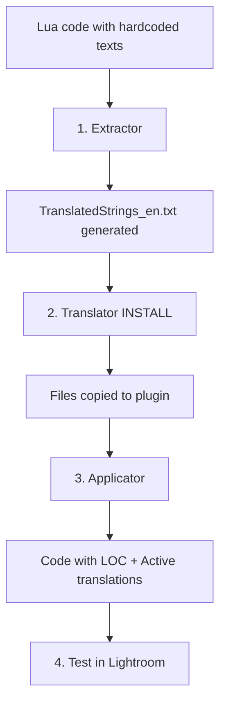

# Developer Guide: Installation on a New Plugin

This guide will help you make your Lightroom plugin **multilingual from its creation**. No existing translation, everything needs to be set up.

---

## 📋 Starting Situation

You have a brand new plugin with Lua code containing hardcoded text:

```
myPlugin.lrplugin/
├── Info.lua
├── MyModule.lua
└── AnotherModule.lua          ← Hardcoded texts in English
```

**Objective**: Transform this plugin into a multilingual version ready to receive translations.

---

## 🎯 Final Goal

```
myPlugin.lrplugin/
├── Info.lua
├── MyModule.lua                  ← Code with LOC() calls
├── AnotherModule.lua             ← Code with LOC() calls
├── TranslatedStrings_en.txt      ← English (reference)
├── TranslatedStrings_fr.txt      ← French
├── TranslatedStrings_de.txt      ← German
└── TranslatedStrings_es.txt      ← Spanish
```

---

## 🚀 The Process in 4 Steps



---

## Step 1: Extract Strings

Launch ***LocalisationToolKit*** and use ***Extractor*** to scan your code:

```bash
python LocalisationToolKit.py
# Choose [1] Extractor
```

**What happens:**
- Analysis of all `.lua` files in the plugin
- Detection of translatable text strings
- Generation of unique LOC keys according to a consistent recipe
- Creation of `TranslatedStrings_en.txt` with all keys

**Result in the temporary folder:**
```
__i18n_tmp__/1_Extractor/20260202_100000/
├── TranslatedStrings_en.txt     ← Main file
├── replacements.json            ← String → key mapping
├── spacing_metadata.json        ← Formatting metadata
└── extraction_report.txt        ← Detailed report
```

> For detailed understanding of how extraction works, see the [Extractor technical documentation](../../../1_Extractor/__doc/en/README.md).

---

## Step 2: Install Translation Files

Use ***Translator*** in INSTALL mode to copy the generated files to your plugin:

```bash
python LocalisationToolKit.py
# Choose [3] Translator
# Choose INSTALL
```

**What happens:**
- Copy `TranslatedStrings_en.txt` to the plugin
- Creation of files for other languages (if requested)

**Result in your plugin:**
```
myPlugin.lrplugin/
├── TranslatedStrings_en.txt      ← Copied from extraction
```

---

## Step 3: Apply LOC Keys in Code

Use ***Applicator*** to automatically replace hardcoded texts with `LOC()` calls:

```bash
python LocalisationToolKit.py
# Choose [2] Applicator
```

**Before:**
```lua
local dialog = LrDialogs.confirm("Delete this photo?", "This cannot be undone")
```

**After:**
```lua
local dialog = LrDialogs.confirm(
    LOC "$$$/MyPlugin/Dialogs/DeleteConfirm=Delete this photo?",
    LOC "$$$/MyPlugin/Dialogs/DeleteWarning=This cannot be undone"
)
```

**Safety:** Backups are created automatically in `__i18n_tmp__/2_Applicator/<timestamp>/BACKUP/`.

> For understanding options and application modes, see the [Applicator technical documentation](../../../2_Applicator/__doc/en/README.md).

---

## Step 4: Create Files for Other Languages

Simply duplicate the English file for each desired language:

```bash
cd myPlugin.lrplugin/

# Duplicate for each target language
cp TranslatedStrings_en.txt TranslatedStrings_fr.txt
cp TranslatedStrings_en.txt TranslatedStrings_de.txt
cp TranslatedStrings_en.txt TranslatedStrings_es.txt
```

**Common Languages:**

| Code | Language | Community |
|------|----------|-----------|
| `fr` | French | French-speaking Europe |
| `de` | German | Central Europe |
| `es` | Spanish | Latin America, Spain |
| `it` | Italian | Italy |
| `pt` | Portuguese | Portugal, Brazil |
| `ja` | Japanese | Japan |
| `zh-CN` | Simplified Chinese | China |

> 💡 You can also use the command included in the toolkit: [ADDLANG](../../../3_Translator/__doc/en/commands/ADDLANG.md)
This command offers much more flexibility than a simple copy/paste.

---

## Step 5: Test in Lightroom

1. **Reload the plugin**: File → Plug-in Manager → Reload
2. **Check the display**: Texts should display normally (in English for now)
3. **Change system language** to test other translation files

---

## 📝 And Now?

Your plugin is ready to receive translations! Two options:

### Option A: Translate Yourself
Edit the `TranslatedStrings_xx.txt` files directly with a text editor.

### Option B: Call in Translators
Send the files to contributors. See the [Simple Contributor Guide](../Translator/01_Simple_Contributor.md) for instructions to give them.

---

## 🔗 Resources

- [Complete Technical Documentation](../README.md)
- [Maintenance Guide](02_Maintenance.md) — For future updates
- [Extractor Documentation](../../../1_Extractor/__doc/en/README.md)
- [Applicator Documentation](../../../2_Applicator/__doc/en/README.md)

---

| 📜 | Traceability |  |  |
|--|--|--|--|
| **Name** | *01_Dev_Installation.md* | **Version** | 1.0 |
| **Type** | Developer Guide - Installation | **Language** | EN - *[FR](../../fr/dev/01_Dev_Installation.md)* |
| **GitHub Project** | [Adobe Lightroom Translation Toolkit](https://github.com/Gotcha26/Adobe_Lightroom_Translation_Plugins_Kit) | **Date** | 2026-02-02 |
| **License** | Open source | | |
