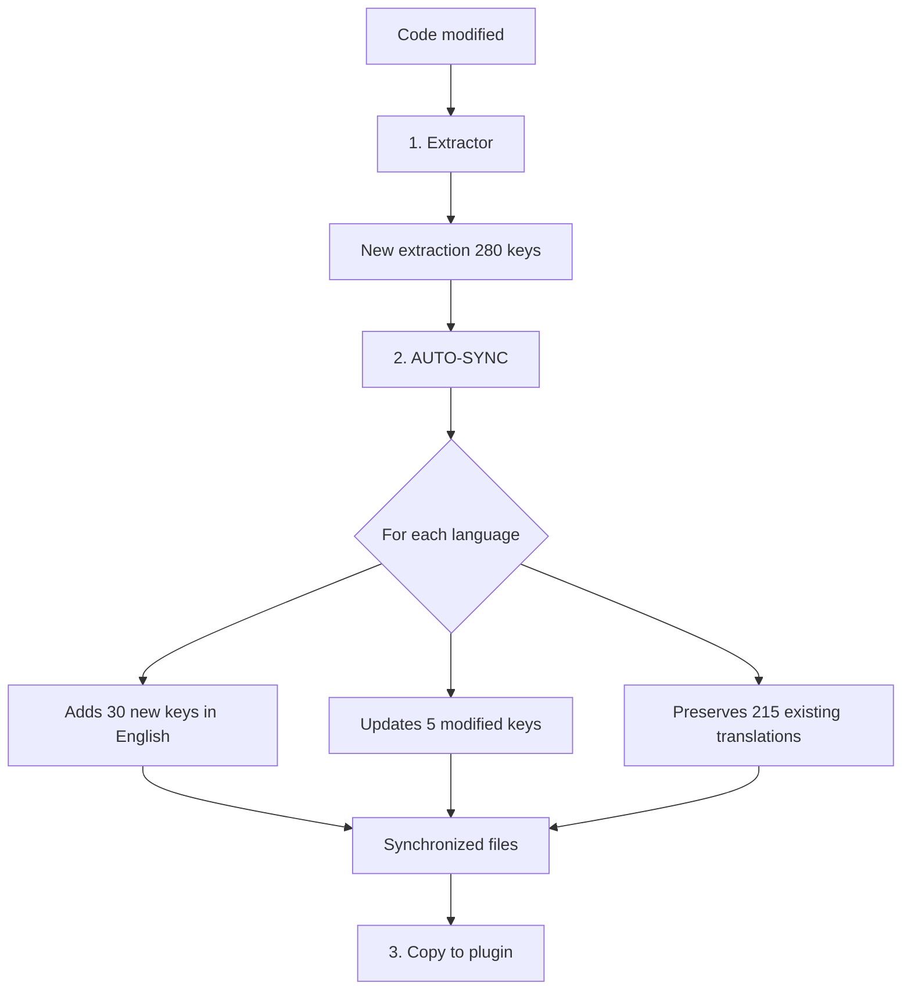

# Developer Guide: Maintenance and Updates

This guide will help you **keep translations up to date** after each change to your code. Your plugin is already multilingual, you add or modify features.

---

## 📋 Typical Situation

Your plugin is already translated into multiple languages:

```
myPlugin.lrplugin/
├── MyModule.lua                  ← You just modified this file
├── NewModule.lua                 ← New file added
├── TranslatedStrings_en.txt      ← 250 keys (old version)
├── TranslatedStrings_fr.txt      ← 250 keys, 100% translated
├── TranslatedStrings_de.txt      ← 250 keys, 100% translated
└── TranslatedStrings_es.txt      ← 250 keys, 100% translated
```

**Problem**: You added 30 new strings and modified 5 existing strings. The translation files are no longer up to date.

---

## 🎯 The AUTO-SYNC Workflow

For daily maintenance, **AUTO-SYNC** is the command to use. It automatically synchronizes all language files.



---

## Step 1: Extract the New Version

After developing your modifications, launch ***Extractor***:

```bash
python LocalisationToolKit.py
# Choose [1] Extractor
```

**Result:**
```
__i18n_tmp__/1_Extractor/20260202_140000/
└── TranslatedStrings_en.txt     ← New extraction (280 keys)
```

---

## Step 2: Synchronize with AUTO-SYNC

Launch ***Translator*** in AUTO-SYNC mode:

```bash
python LocalisationToolKit.py
# Choose [3] Translator
# Choose AUTO-SYNC
```

**What happens automatically:**

| Action | Keys concerned | Result |
|--------|-----------------|----------|
| Addition | 30 new keys | Added **in English** in all files |
| Modification | 5 modified keys | Text replaced with **new English version** |
| Preservation | 215 unchanged keys | Translations **preserved** |
| Deletion | Obsolete keys | Removed from all files |

**Result:**
```
__i18n_tmp__/3_Translator/20260202_141000/
├── TranslatedStrings_en.txt     ← 280 keys
├── TranslatedStrings_fr.txt     ← 280 keys (215 FR + 35 EN)
├── TranslatedStrings_de.txt     ← 280 keys (215 DE + 35 EN)
├── TranslatedStrings_es.txt     ← 280 keys (215 ES + 35 EN)
└── sync_report.txt              ← Detailed report
```

---

## Step 3: Copy to Plugin

Copy the synchronized files to your plugin:

```bash
cp __i18n_tmp__/3_Translator/20260202_141000/TranslatedStrings_*.txt ./myPlugin.lrplugin/
```

---

## Step 4: Have the New Keys Translated

The 35 new/modified keys appear **in English** in the FR, DE, ES files. Two options:

### Option A: Translate Yourself
Open each file and search for English keys to translate them.

### Option B: Send to Translators
Send the updated files to translators asking them to find the English keys.

> **Tip**: Translators can easily spot untranslated keys because they are in English among translated text.

---

## Step 5: Commit Changes

```bash
git add myPlugin.lrplugin/TranslatedStrings_*.txt
git commit -m "i18n: Synchronize translation files"
git push
```

---

## 📋 Summary of Daily Workflow

```
┌─────────────────────────────────────────────────────────────┐
│ DEVELOPMENT                                                 │
│ Code normally with hard text or LOC()                       │
└─────────────────────────────────────────────────────────────┘
                           │
                           ▼
┌─────────────────────────────────────────────────────────────┐
│ SYNCHRONIZATION (a few minutes)                             │
├─────────────────────────────────────────────────────────────┤
│ 1. [Option 1] Extractor                                     │
│ 2. [Option 3] Translator → AUTO-SYNC                        │
│ 3. Copy files to plugin                                     │
│ 4. Commit + Push                                            │
└─────────────────────────────────────────────────────────────┘
                           │
                           ▼
┌─────────────────────────────────────────────────────────────┐
│ TRANSLATION (asynchronous)                                  │
│ Translators complete the English keys                       │
└─────────────────────────────────────────────────────────────┘
```

---

## ⚠️ Points of Attention

### Modified Keys Lose Their Translation

When you modify the English text of an existing key, AUTO-SYNC replaces the translation with the new English text. This is intentional: the existing translation is no longer valid.

**Example:**
```
BEFORE (TranslatedStrings_fr.txt):
"$$$/Plugin/Button/Save=Enregistrer"

Code modified: "Save changes" instead of "Save"

AFTER AUTO-SYNC:
"$$$/Plugin/Button/Save=Save changes"  ← Needs retranslation
```

### Deleted Keys Disappear

If you delete a string from your code, the corresponding key is removed from all translation files during AUTO-SYNC.

---

## 🔗 Resources

- [Installation Guide](01_Installation.md) — For a new plugin
- [Advanced Workflows](03_Advanced.md) — COMPARE, EXTRACT, INJECT
- [Translator Technical Documentation](../../../3_Translator/__doc/en/README.md)
- [Workflow Comparison](../WORKFLOWS_COMPARISON.md)

---

| 📜 | Traceability |  |  |
|--|--|--|--|
| **Name** | *02_Dev_Maintenance.md* | **Version** | 1.0 |
| **Type** | Developer Guide - Maintenance | **Language** | EN - *[FR](../../fr/dev/02_Dev_Maintenance.md)* |
| **GitHub Project** | [Adobe Lightroom Translation Toolkit](https://github.com/Gotcha26/Adobe_Lightroom_Translation_Plugins_Kit) | **Date** | 2026-02-02 |
| **License** | Open source | | |
