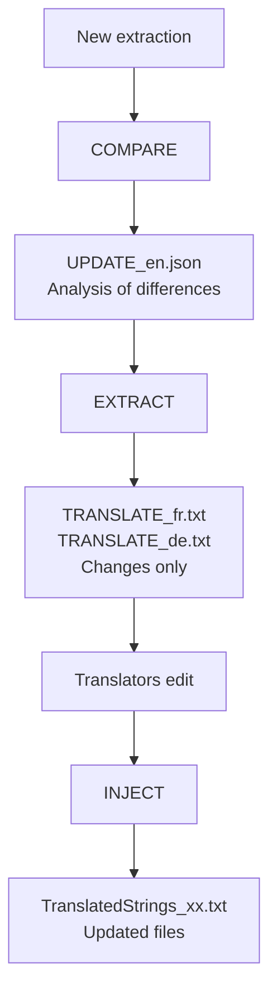

# Developer Guide: Advanced Workflows

This guide presents **advanced workflows** for specific needs: large volumes of changes, professional translators, fine-grained control of updates.

---

## 📋 When to Use the Advanced Workflow?

The **AUTO-SYNC** workflow (see [Maintenance Guide](02_Maintenance.md)) is sufficient for 90% of cases. Prefer the advanced workflow if:

- Large volumes of changes (100+ new/modified keys)
- Professional translators who bill by word
- Need to isolate changes in separate files
- Fine-grained control with validation before integration

---

## 🎯 The COMPARE → EXTRACT → INJECT Workflow



---

## Step 1: Analyze Changes with COMPARE

After a new extraction, compare with the old version:

```bash
python LocalisationToolKit.py
# Choose [3] Translator
# Choose COMPARE
```

**Parameters requested:**
- Old file: `myPlugin.lrplugin/TranslatedStrings_en.txt`
- New file: `__i18n_tmp__/1_Extractor/<timestamp>/TranslatedStrings_en.txt`

**Result:**
```
__i18n_tmp__/3_Translator/20260202_150000/
├── UPDATE_en.json          ← Analysis of differences
└── compare_report.txt      ← Readable report
```

**Contents of `UPDATE_en.json`:**
```json
{
  "added": {
    "$$$/Plugin/NewFeature/Title": "Export to Cloud",
    "$$$/Plugin/NewFeature/Button": "Upload Now"
  },
  "changed": {
    "$$$/Plugin/Dialog/Confirm": {
      "old": "Are you sure?",
      "new": "Do you really want to continue?"
    }
  },
  "removed": [
    "$$$/Plugin/OldFeature/Deprecated"
  ]
}
```

---

## Step 2: Generate TRANSLATE Files with EXTRACT

Create files containing **only the changes**:

```bash
python LocalisationToolKit.py
# Choose [3] Translator
# Choose EXTRACT
```

**Result:**
```
__i18n_tmp__/3_Translator/20260202_150000/
├── UPDATE_en.json
├── TRANSLATE_fr.txt        ← For French translator
├── TRANSLATE_de.txt        ← For German translator
└── TRANSLATE_es.txt        ← For Spanish translator
```

**Contents of `TRANSLATE_fr.txt`:**
```
# ======================================================================
# TRANSLATION FILE - FR
# Total : 52 keys (50 new + 2 modified)
# ======================================================================

# ----------------------------------------------------------------------
# NEW KEYS (50)
# ----------------------------------------------------------------------

[KEY] $$$/Plugin/NewFeature/Title
[EN]  Export to Cloud
[FR] →

[KEY] $$$/Plugin/NewFeature/Button
[EN]  Upload Now
[FR] →

# ----------------------------------------------------------------------
# MODIFIED KEYS (2)
# ----------------------------------------------------------------------

[KEY] $$$/Plugin/Dialog/Confirm
[EN BEFORE]  Are you sure?
[EN AFTER]  Do you really want to continue?
[FR CURRENT] Êtes-vous sûr ?
[FR] →
```

---

## Step 3: Send to Translators

The `TRANSLATE_xx.txt` file is **self-explanatory**. Translators:
1. Write their translation after the `→`
2. Leave empty to keep English by default
3. Return the completed file

**Advantage**: The translator only sees the 52 keys to process, not the 300 keys in the full file.

---

## Step 4: Integrate with INJECT

When you receive the translated files:

```bash
python LocalisationToolKit.py
# Choose [3] Translator
# Choose INJECT
```

**What happens:**
1. Reading of `TRANSLATE_xx.txt` files
2. Merging with existing `TranslatedStrings_xx.txt`
3. Automatic backup (.bak)
4. Writing of updated files

**Result:**
```
myPlugin.lrplugin/
├── TranslatedStrings_fr.txt     ← Updated (300 keys)
├── TranslatedStrings_fr.txt.bak ← Backup
├── TranslatedStrings_de.txt     ← Updated
└── TranslatedStrings_es.txt     ← Updated
```

---

## Step 5 (Optional): Final Synchronization with Markers

To add `[NEW]` and `[NEEDS_REVIEW]` markers in the files:

```bash
python LocalisationToolKit.py
# Choose [3] Translator
# Choose SYNC
# Specify the folder containing UPDATE_en.json
```

**Result with markers:**
```
-- [NEW] To translate
"$$$/Plugin/NewFeature/Title=Export to Cloud"

-- [NEEDS_REVIEW] English text was modified
"$$$/Plugin/Dialog/Confirm=Do you really want to continue?"

"$$$/Plugin/Existing=Existing translation preserved"
```

> **Note**: These markers appear **only** if you use SYNC with the `UPDATE_en.json` file from COMPARE.

---

## 📊 Comparison AUTO-SYNC vs EXTRACT/INJECT

| Criterion | AUTO-SYNC | EXTRACT/INJECT |
|-----------|-----------|----------------|
| **Translator file** | TranslatedStrings_xx.txt (complete) | TRANSLATE_xx.txt (changes only) |
| **File size** | 300 lines | 52 lines |
| **Change identification** | Search for English keys | Everything is in the file |
| **[NEW] markers** | No | Yes (with SYNC) |
| **Complexity** | Simple | More control |
| **Use case** | Regular maintenance | Large volumes, professional translators |

---

## 📋 Summary of Advanced Workflow

```
┌─────────────────────────────────────────────────────────────┐
│ PHASE 1 : ANALYSIS                                          │
├─────────────────────────────────────────────────────────────┤
│ 1. Extractor → New extraction                               │
│ 2. COMPARE → UPDATE_en.json (differences)                   │
└─────────────────────────────────────────────────────────────┘
                           │
                           ▼
┌─────────────────────────────────────────────────────────────┐
│ PHASE 2 : PREPARATION                                       │
├─────────────────────────────────────────────────────────────┤
│ 3. EXTRACT → TRANSLATE_xx.txt (changes only)                │
│ 4. Send to translators                                      │
└─────────────────────────────────────────────────────────────┘
                           │
                           ▼
┌─────────────────────────────────────────────────────────────┐
│ PHASE 3 : INTEGRATION                                       │
├─────────────────────────────────────────────────────────────┤
│ 5. Reception of translated files                            │
│ 6. INJECT → Merge into TranslatedStrings_xx.txt             │
│ 7. (Optional) SYNC → Markers [NEW]/[NEEDS_REVIEW]           │
└─────────────────────────────────────────────────────────────┘
```

---

## 🔗 Resources

- [Installation Guide](01_Installation.md) — For a new plugin
- [Maintenance Guide](02_Maintenance.md) — AUTO-SYNC Workflow
- [Translator Technical Documentation](../../../3_Translator/__doc/en/README.md) — Full details
- [Workflow Comparison](../WORKFLOWS_COMPARISON.md)

---

| 📜 | Traceability |  |  |
|--|--|--|--|
| **Name** | *03_Dev_Advanced.md* | **Version** | 1.0 |
| **Type** | Developer Guide - Advanced | **Language** | EN - *[FR](../../fr/dev/03_Dev_Avance.md)* |
| **GitHub Project** | [Adobe Lightroom Translation Toolkit](https://github.com/Gotcha26/Adobe_Lightroom_Translation_Plugins_Kit) | **Date** | 2026-02-02 |
| **License** | Open source | | |
