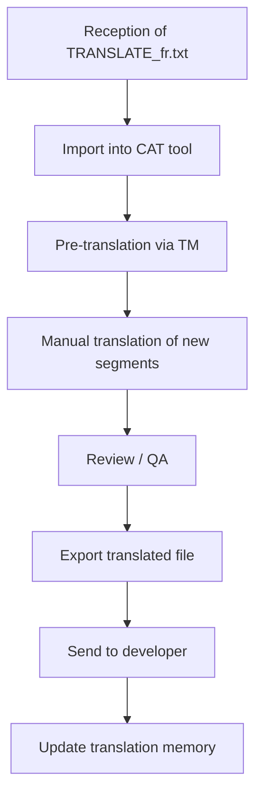

# Translator Guide: Professional Contributor

This guide is intended for **experienced translators** who use professional tools (CAT tools) or work on large translation volumes.

---

## 📋 Target Profile

- Professional translators with specialized tools
- Large volumes (100+ keys to process)
- Need for translation memories
- Billing by word/character
- Batch workflow with validation

---

## 🛠️ The TRANSLATE_xx.txt Format

When the developer uses the advanced workflow (COMPARE → EXTRACT), they generate a `TRANSLATE_xx.txt` file containing **only the changes**:

```
# ======================================================================
# TRANSLATION FILE - FR
# Generated: 2026-02-02 10:00:00
# Total : 62 keys (50 new + 12 modified)
# ======================================================================

# ----------------------------------------------------------------------
# NEW KEYS (50)
# ----------------------------------------------------------------------

[KEY] $$$/Plugin/NewFeature/Title
[EN]  Export to Cloud
[FR] →

[KEY] $$$/Plugin/NewFeature/Button
[EN]  Upload Now
[FR] →

# ----------------------------------------------------------------------
# MODIFIED KEYS (12)
# ----------------------------------------------------------------------

[KEY] $$$/Plugin/Dialog/Confirm
[EN BEFORE]  Are you sure?
[EN AFTER]  Do you really want to continue?
[FR CURRENT] Êtes-vous sûr ?
[FR] →
```

### Advantages of this format

| Aspect | Standard format | TRANSLATE format |
|--------|-----------------|------------------|
| Volume | 300 lines (everything) | 62 lines (changes only) |
| Context | None | Previous value visible |
| Identification | Search for EN keys | Everything to translate |
| Billing | Difficult to isolate | Precise to the word |

---

## 📝 How to Translate the TRANSLATE Format

### Structure of an Entry

```
[KEY] $$$/Plugin/Feature/Title     ← Identifier (do not modify)
[EN]  Export to Cloud              ← English source text
[FR] →                             ← Your translation here
```

### For Modified Keys

```
[KEY] $$$/Plugin/Dialog/Confirm
[EN BEFORE]  Are you sure?          ← Previous version (context)
[EN AFTER]  Do you really want to continue?  ← New version
[FR CURRENT] Êtes-vous sûr ?        ← Your previous translation
[FR] →                             ← New translation
```

### Rules

1. Write your translation **after** the `→`
2. Leave empty to keep English as default
3. Lines starting with `#` are comments (ignored)

---

## 🔧 Integration with CAT Tools

### OmegaT (free)

The TRANSLATE format can be imported into OmegaT:

1. Create a new project
2. Place the `TRANSLATE_fr.txt` file in the source folder
3. OmegaT recognizes the `[EN]` / `[FR] →` pattern
4. Use your existing translation memory
5. Export the translated file

### SDL Trados / memoQ

These tools can process the format with a custom filter:
- Source segment: content after `[EN]`
- Target segment: after `[FR] →`

### Creating a Glossary

Export your recurring terms:

```csv
Source,Target,Note
File,Fichier,Menu item
Edit,Édition,Menu item
Settings,Paramètres,Dialog title
Export,Exporter,Action verb
Upload,Téléverser,Action verb
Download,Télécharger,Action verb
```

---

## 📊 Recommended Professional Workflow



### Detailed Steps

1. **Reception**: Developer sends `TRANSLATE_fr.txt`
2. **Analysis**: Count words/characters for quote
3. **Import**: Load into your CAT tool
4. **Pre-translation**: Apply your translation memory
5. **Translation**: Complete uncovered segments
6. **QA**: Check placeholders, consistency, length
7. **Export**: Generate final file
8. **Delivery**: Return to developer
9. **TM**: Update your translation memory

---

## ✅ Quality Control

### Automated Checks

| Check | Tool | Criticality |
|-------|------|-----------|
| Placeholders intact | Regex `%[sd]` | Critical |
| UTF-8 encoding | Editor | Critical |
| Excessive length | Counter | Important |
| Terminology consistency | Glossary | Important |
| Double spaces | Regex | Minor |

### Useful Regex

```regex
# Find placeholders
%[sd]|\n|\t

# Check line format
^\[FR\] →.*$

# Detect untranslated keys
^\[FR\] →\s*$
```

---

## 💰 Billing

### Word Counting

The TRANSLATE format makes precise counting easier:

```
# New keys: 50 × average 8 words = 400 words
# Modified keys: 12 × average 10 words = 120 words
# Total billable: 520 words
```

### Suggested Pricing

| Type | Suggested Rate |
|------|---------------|
| New keys | Standard rate |
| Modified keys | 50-75% (existing context) |
| Review | 30-50% of standard rate |

---

## 📤 Delivery

### Expected Format

Return the completed `TRANSLATE_fr.txt` file:

```
[KEY] $$$/Plugin/NewFeature/Title
[EN]  Export to Cloud
[FR] → Exporter vers le Cloud

[KEY] $$$/Plugin/NewFeature/Button
[EN]  Upload Now
[FR] → Téléverser maintenant
```

### Professional Email

```
Subject: Delivery French translation MyPlugin v2.5 - FR

Hello,

Please find attached the completed French translation.

STATISTICS:
- Keys translated: 62/62 (100%)
- Source words: 520
- Placeholders verified: ✓
- QA performed: ✓

NOTES:
- "Upload" translated as "Téléverser" (consistency with v2.4)
- String $$$/Plugin/LongText truncated for interface

BILLING:
- 520 words × [rate] = [amount]

Best regards,
[Your name]
[Company]
```

---

## 🔗 Resources

- [Simple Contributor Guide](01_Simple_Contributor.md) — Standard format
- [Resourceful Contributor Guide](02_Resourceful_Contributor.md) — Create a file
- [Advanced Workflows (Developer)](../Developer/03_Advanced.md) — How the file is generated
- [OmegaT](https://omegat.org/) — Free CAT tool
- [Poedit](https://poedit.net/) — Translation editor

---

| 📜 | Traceability |  |  |
|--|--|--|--|
| **Name** | *03_Professional_Contributor.md* | **Version** | 1.0 |
| **Type** | Traductor guide - Advanced | **Language** | EN - *[FR](../../fr/trad/03_Contributeur_pro.md)* |
| **GitHub Project** | [Adobe Lightroom Translation Toolkit](https://github.com/Gotcha26/Adobe_Lightroom_Translation_Plugins_Kit) | **Date** | 2026-02-02 |
| **License** | Open source | | |
