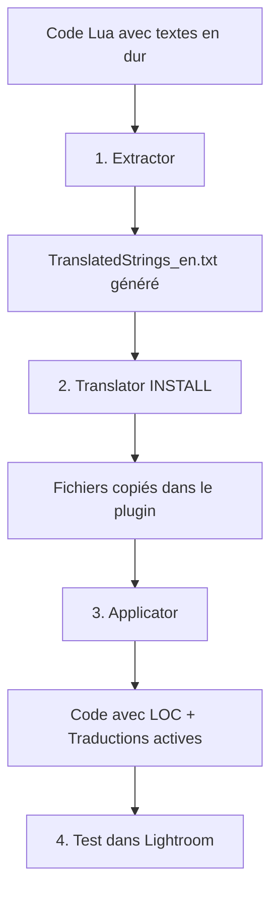

# Guide Développeur : Installation sur un nouveau plugin

Ce guide vous accompagne pour rendre votre plugin Lightroom **multilingue dès sa création**. Aucune traduction existante, tout est à mettre en place.

---

## 📋 Situation de départ

Vous avez un plugin flambant neuf avec du code Lua contenant des textes en dur :

```
monPlugin.lrplugin/
├── Info.lua
├── MonModule.lua
└── AutreModule.lua          ← Textes hardcodés en anglais
```

**Objectif** : Transformer ce plugin en version multilingue prête à recevoir des traductions.

---

## 🎯 Objectif final

```
monPlugin.lrplugin/
├── Info.lua
├── MonModule.lua                 ← Code avec appels LOC()
├── AutreModule.lua               ← Code avec appels LOC()
├── TranslatedStrings_en.txt      ← Anglais (référence)
├── TranslatedStrings_fr.txt      ← Français
├── TranslatedStrings_de.txt      ← Allemand
└── TranslatedStrings_es.txt      ← Espagnol
```

---

## 🚀 Le processus en 4 étapes



---

## Étape 1 : Extraire les chaînes

Lancez ***LocalisationToolKit*** et utilisez ***Extractor*** pour scanner votre code :

```bash
python LocalisationToolKit.py
# Choisir [1] Extractor
```

**Ce qui se passe :**
- Analyse de tous les fichiers `.lua` du plugin
- Détection des chaînes de texte traduisibles
- Génération de clés LOC uniques selon une recette cohérente
- Création de `TranslatedStrings_en.txt` avec toutes les clés

**Résultat dans le dossier temporaire :**
```
__i18n_tmp__/1_Extractor/20260202_100000/
├── TranslatedStrings_en.txt     ← Fichier principal
├── replacements.json            ← Mapping chaîne → clé
├── spacing_metadata.json        ← Métadonnées de formatage
└── extraction_report.txt        ← Rapport détaillé
```

> Pour comprendre en détail le fonctionnement de l'extraction, consultez la [documentation technique d'Extractor](../../../1_Extractor/__doc/fr/Lisez-moi.md).

---

## Étape 2 : Installer les fichiers de traduction

Utilisez ***Translator*** en mode INSTALL pour copier les fichiers générés dans votre plugin :

```bash
python LocalisationToolKit.py
# Choisir [3] Translator
# Choisir INSTALL
```

**Ce qui se passe :**
- Copie de `TranslatedStrings_en.txt` dans le plugin
- Création des fichiers pour les autres langues (si demandé)

**Résultat dans votre plugin :**
```
monPlugin.lrplugin/
├── TranslatedStrings_en.txt      ← Copié depuis l'extraction
```

---

## Étape 3 : Appliquer les clés LOC dans le code

Utilisez ***Applicator*** pour remplacer automatiquement les textes en dur par des appels `LOC()` :

```bash
python LocalisationToolKit.py
# Choisir [2] Applicator
```

**Avant :**
```lua
local dialog = LrDialogs.confirm("Delete this photo?", "This cannot be undone")
```

**Après :**
```lua
local dialog = LrDialogs.confirm(
    LOC "$$$/MonPlugin/Dialogs/DeleteConfirm=Delete this photo?",
    LOC "$$$/MonPlugin/Dialogs/DeleteWarning=This cannot be undone"
)
```

**Sécurité :** Des backups sont créés automatiquement dans `__i18n_tmp__/2_Applicator/<timestamp>/BACKUP/`.

> Pour comprendre les options et modes d'application, consultez la [documentation technique d'Applicator](../../../2_Applicator/__doc/fr/Lisez-moi.md).

---

## Étape 4 : Créer les fichiers pour les autres langues

Dupliquez simplement le fichier anglais pour chaque langue souhaitée :

```bash
cd monPlugin.lrplugin/

# Dupliquer pour chaque langue cible
cp TranslatedStrings_en.txt TranslatedStrings_fr.txt
cp TranslatedStrings_en.txt TranslatedStrings_de.txt
cp TranslatedStrings_en.txt TranslatedStrings_es.txt
```

**Langues courantes :**

| Code | Langue | Communauté |
|------|--------|------------|
| `fr` | Français | Europe francophone |
| `de` | Allemand | Europe centrale |
| `es` | Espagnol | Amérique latine, Espagne |
| `it` | Italien | Italie |
| `pt` | Portugais | Portugal, Brésil |
| `ja` | Japonais | Japon |
| `zh-CN` | Chinois simplifié | Chine |

> 💡 Vous pouvez aussi passer par la commande incluse dans le toolkit : [ADDLANG](../../../3_Translator/__doc/fr/commandes/ADDLANG.md)
Cette commande offre bien plus de souplesse qu'un simple écopier/coller".

---

## Étape 5 : Tester dans Lightroom

1. **Recharger le plugin** : File → Plug-in Manager → Reload
2. **Vérifier l'affichage** : Les textes doivent s'afficher normalement (en anglais pour l'instant)
3. **Changer la langue système** pour tester les autres fichiers de traduction

---

## 📝 Et maintenant ?

Votre plugin est prêt à recevoir des traductions ! Deux options :

### Option A : Traduire vous-même
Éditez directement les fichiers `TranslatedStrings_xx.txt` avec un éditeur de texte.

### Option B : Faire appel à des traducteurs
Envoyez les fichiers à des contributeurs. Consultez le guide [Contributeur simple](../Traducteur/01_Contributeur_simple.md) pour les instructions à leur transmettre.

---

## 🔗 Ressources

- [Documentation technique complète](../Lisez-moi.md)
- [Guide de maintenance](02_Maintenance.md) — Pour les mises à jour futures
- [Documentation Extractor](../../../1_Extractor/__doc/fr/Lisez-moi.md)
- [Documentation Applicator](../../../2_Applicator/__doc/fr/Lisez-moi.md)

---

| 📜 | Traçabilité |  |  |
|--|--|--|--|
| **Nom** | *02_Dev_Installation.md* | **Version** | 1.0 |
| **Type** | Guide développeurs - Installation | **Langue** | FR - *[EN](../../en/trad/01_Dev_Installation.md)* |
| **Projet GitHub** | [Adobe Lightroom Translation Toolkit](https://github.com/Gotcha26/Adobe_Lightroom_Translation_Plugins_Kit) | **Date** | 2026-02-02 |
| **Licence** | Open source | | |
