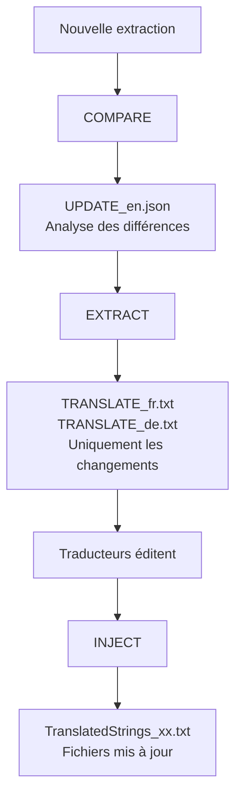

# Guide Développeur : Workflows avancés

Ce guide présente les **workflows avancés** pour des besoins spécifiques : gros volumes de changements, traducteurs professionnels, contrôle fin des mises à jour.

---

## 📋 Quand utiliser le workflow avancé ?

Le workflow **AUTO-SYNC** (voir [Guide Maintenance](02_Maintenance.md)) suffit pour 90% des cas. Préférez le workflow avancé si :

- Gros volumes de changements (100+ clés nouvelles/modifiées)
- Traducteurs professionnels qui facturent au mot
- Besoin d'isoler les changements dans des fichiers séparés
- Contrôle fin avec validation avant intégration

---

## 🎯 Le workflow COMPARE → EXTRACT → INJECT



---

## Étape 1 : Analyser les changements avec COMPARE

Après une nouvelle extraction, comparez avec l'ancienne version :

```bash
python LocalisationToolKit.py
# Choisir [3] Translator
# Choisir COMPARE
```

**Paramètres demandés :**
- Ancien fichier : `monPlugin.lrplugin/TranslatedStrings_en.txt`
- Nouveau fichier : `__i18n_tmp__/1_Extractor/<timestamp>/TranslatedStrings_en.txt`

**Résultat :**
```
__i18n_tmp__/3_Translator/20260202_150000/
├── UPDATE_en.json          ← Analyse des différences
└── compare_report.txt      ← Rapport lisible
```

**Contenu de `UPDATE_en.json` :**
```json
{
  "added": {
    "$$$/Plugin/NewFeature/Title": "Export to Cloud",
    "$$$/Plugin/NewFeature/Button": "Upload Now"
  },
  "changed": {
    "$$$/Plugin/Dialog/Confirm": {
      "old": "Are you sure?",
      "new": "Do you really want to continue?"
    }
  },
  "removed": [
    "$$$/Plugin/OldFeature/Deprecated"
  ]
}
```

---

## Étape 2 : Générer les fichiers TRANSLATE avec EXTRACT

Créez des fichiers contenant **uniquement les changements** :

```bash
python LocalisationToolKit.py
# Choisir [3] Translator
# Choisir EXTRACT
```

**Résultat :**
```
__i18n_tmp__/3_Translator/20260202_150000/
├── UPDATE_en.json
├── TRANSLATE_fr.txt        ← Pour traducteur français
├── TRANSLATE_de.txt        ← Pour traducteur allemand
└── TRANSLATE_es.txt        ← Pour traducteur espagnol
```

**Contenu de `TRANSLATE_fr.txt` :**
```
# ======================================================================
# FICHIER DE TRADUCTION - FR
# Total : 52 clés (50 nouvelles + 2 modifiées)
# ======================================================================

# ----------------------------------------------------------------------
# NOUVELLES CLÉS (50)
# ----------------------------------------------------------------------

[KEY] $$$/Plugin/NewFeature/Title
[EN]  Export to Cloud
[FR] →

[KEY] $$$/Plugin/NewFeature/Button
[EN]  Upload Now
[FR] →

# ----------------------------------------------------------------------
# CLÉS MODIFIÉES (2)
# ----------------------------------------------------------------------

[KEY] $$$/Plugin/Dialog/Confirm
[EN AVANT]  Are you sure?
[EN APRÈS]  Do you really want to continue?
[FR ACTUEL] Êtes-vous sûr ?
[FR] →
```

---

## Étape 3 : Envoyer aux traducteurs

Le fichier `TRANSLATE_xx.txt` est **auto-explicatif**. Les traducteurs :
1. Écrivent leur traduction après le `→`
2. Laissent vide pour garder l'anglais par défaut
3. Renvoient le fichier complété

**Avantage** : Le traducteur ne voit que les 52 clés à traiter, pas les 300 clés du fichier complet.

---

## Étape 4 : Intégrer avec INJECT

Quand vous recevez les fichiers traduits :

```bash
python LocalisationToolKit.py
# Choisir [3] Translator
# Choisir INJECT
```

**Ce qui se passe :**
1. Lecture des fichiers `TRANSLATE_xx.txt`
2. Fusion avec les `TranslatedStrings_xx.txt` existants
3. Backup automatique (.bak)
4. Écriture des fichiers mis à jour

**Résultat :**
```
monPlugin.lrplugin/
├── TranslatedStrings_fr.txt     ← Mis à jour (300 clés)
├── TranslatedStrings_fr.txt.bak ← Backup
├── TranslatedStrings_de.txt     ← Mis à jour
└── TranslatedStrings_es.txt     ← Mis à jour
```

---

## Étape 5 (optionnelle) : Synchronisation finale avec marqueurs

Pour ajouter des marqueurs `[NEW]` et `[NEEDS_REVIEW]` dans les fichiers :

```bash
python LocalisationToolKit.py
# Choisir [3] Translator
# Choisir SYNC
# Spécifier le dossier contenant UPDATE_en.json
```

**Résultat avec marqueurs :**
```
-- [NEW] To translate
"$$$/Plugin/NewFeature/Title=Export to Cloud"

-- [NEEDS_REVIEW] English text was modified
"$$$/Plugin/Dialog/Confirm=Do you really want to continue?"

"$$$/Plugin/Existing=Traduction existante préservée"
```

> **Note** : Ces marqueurs n'apparaissent **que** si vous utilisez SYNC avec le fichier `UPDATE_en.json` provenant de COMPARE.

---

## 📊 Comparaison AUTO-SYNC vs EXTRACT/INJECT

| Critère | AUTO-SYNC | EXTRACT/INJECT |
|---------|-----------|----------------|
| **Fichier traducteur** | TranslatedStrings_xx.txt (complet) | TRANSLATE_xx.txt (changements uniquement) |
| **Taille fichier** | 300 lignes | 52 lignes |
| **Identification changements** | Chercher les clés en anglais | Tout est dans le fichier |
| **Marqueurs [NEW]** | Non | Oui (avec SYNC) |
| **Complexité** | Simple | Plus de contrôle |
| **Cas d'usage** | Maintenance courante | Gros volumes, traducteurs pro |

---

## 📋 Résumé du workflow avancé

```
┌─────────────────────────────────────────────────────────────┐
│ PHASE 1 : ANALYSE                                           │
├─────────────────────────────────────────────────────────────┤
│ 1. Extractor → Nouvelle extraction                          │
│ 2. COMPARE → UPDATE_en.json (différences)                   │
└─────────────────────────────────────────────────────────────┘
                           │
                           ▼
┌─────────────────────────────────────────────────────────────┐
│ PHASE 2 : PRÉPARATION                                       │
├─────────────────────────────────────────────────────────────┤
│ 3. EXTRACT → TRANSLATE_xx.txt (uniquement changements)      │
│ 4. Envoi aux traducteurs                                    │
└─────────────────────────────────────────────────────────────┘
                           │
                           ▼
┌─────────────────────────────────────────────────────────────┐
│ PHASE 3 : INTÉGRATION                                       │
├─────────────────────────────────────────────────────────────┤
│ 5. Réception des fichiers traduits                          │
│ 6. INJECT → Fusion dans TranslatedStrings_xx.txt            │
│ 7. (Optionnel) SYNC → Marqueurs [NEW]/[NEEDS_REVIEW]        │
└─────────────────────────────────────────────────────────────┘
```

---

## 🔗 Ressources

- [Guide d'installation](01_Installation.md) — Pour un nouveau plugin
- [Guide de maintenance](02_Maintenance.md) — Workflow AUTO-SYNC
- [Documentation technique Translator](../../../3_Translator/__doc/fr/Lisez-moi.md) — Détails complets
- [Comparaison des workflows](../WORKFLOWS_COMPARAISON.md)

---

|  |  |
|--|--|
| **Document** | Guide Développeur - Workflows avancés |
| **Version** | 1.0 |
| **Date** | 2026-02-02 |
| **Projet** | https://github.com/Gotcha26/Adobe_Lightroom_Translation_Plugins_Kit |
