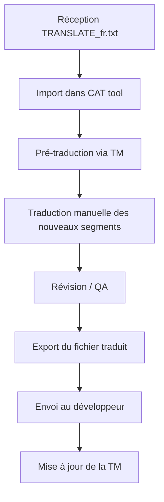

# Guide Traducteur : Contributeur professionnel

Ce guide s'adresse aux **traducteurs expérimentés** qui utilisent des outils professionnels (CAT tools) ou travaillent sur de gros volumes de traduction.

---

## 📋 Profil concerné

- Traducteurs professionnels avec outils spécialisés
- Gros volumes (100+ clés à traiter)
- Besoin de mémoires de traduction
- Facturation au mot/caractère
- Workflow par lots avec validation

---

## 🛠️ Le format TRANSLATE_xx.txt

Quand le développeur utilise le workflow avancé (COMPARE → EXTRACT), il génère un fichier `TRANSLATE_xx.txt` contenant **uniquement les changements** :

```
# ======================================================================
# FICHIER DE TRADUCTION - FR
# Généré: 2026-02-02 10:00:00
# Total : 62 clés (50 nouvelles + 12 modifiées)
# ======================================================================

# ----------------------------------------------------------------------
# NOUVELLES CLÉS (50)
# ----------------------------------------------------------------------

[KEY] $$$/Plugin/NewFeature/Title
[EN]  Export to Cloud
[FR] →

[KEY] $$$/Plugin/NewFeature/Button
[EN]  Upload Now
[FR] →

# ----------------------------------------------------------------------
# CLÉS MODIFIÉES (12)
# ----------------------------------------------------------------------

[KEY] $$$/Plugin/Dialog/Confirm
[EN AVANT]  Are you sure?
[EN APRÈS]  Do you really want to continue?
[FR ACTUEL] Êtes-vous sûr ?
[FR] →
```

### Avantages de ce format

| Aspect | Format standard | Format TRANSLATE |
|--------|-----------------|------------------|
| Volume | 300 lignes (tout) | 62 lignes (changements) |
| Contexte | Aucun | Ancienne valeur visible |
| Identification | Chercher les clés EN | Tout est à traduire |
| Facturation | Difficile à isoler | Précis au mot |

---

## 📝 Comment traduire le format TRANSLATE

### Structure d'une entrée

```
[KEY] $$$/Plugin/Feature/Title     ← Identifiant (ne pas toucher)
[EN]  Export to Cloud              ← Texte source anglais
[FR] →                             ← Votre traduction ici
```

### Pour les clés modifiées

```
[KEY] $$$/Plugin/Dialog/Confirm
[EN AVANT]  Are you sure?          ← Ancienne version (contexte)
[EN APRÈS]  Do you really want to continue?  ← Nouvelle version
[FR ACTUEL] Êtes-vous sûr ?        ← Votre ancienne traduction
[FR] →                             ← Nouvelle traduction
```

### Règles

1. Écrivez votre traduction **après** le `→`
2. Laissez vide pour garder l'anglais par défaut
3. Les lignes commençant par `#` sont des commentaires (ignorés)

---

## 🔧 Intégration avec outils CAT

### OmegaT (gratuit)

Le format TRANSLATE peut être importé dans OmegaT :

1. Créez un nouveau projet
2. Placez le fichier `TRANSLATE_fr.txt` dans le dossier source
3. OmegaT reconnaît le pattern `[EN]` / `[FR] →`
4. Utilisez votre mémoire de traduction existante
5. Exportez le fichier traduit

### SDL Trados / memoQ

Ces outils peuvent traiter le format avec un filtre personnalisé :
- Segment source : contenu après `[EN]`
- Segment cible : après `[FR] →`

### Création d'un glossaire

Exportez vos termes récurrents :

```csv
Source,Target,Note
File,Fichier,Menu item
Edit,Édition,Menu item
Settings,Paramètres,Dialog title
Export,Exporter,Action verb
Upload,Téléverser,Action verb
Download,Télécharger,Action verb
```

---

## 📊 Workflow professionnel recommandé



### Étapes détaillées

1. **Réception** : Le développeur envoie `TRANSLATE_fr.txt`
2. **Analyse** : Comptez les mots/caractères pour le devis
3. **Import** : Chargez dans votre outil CAT
4. **Pré-traduction** : Appliquez votre mémoire de traduction
5. **Traduction** : Complétez les segments non couverts
6. **QA** : Vérifiez placeholders, cohérence, longueur
7. **Export** : Générez le fichier final
8. **Livraison** : Renvoyez au développeur
9. **TM** : Mettez à jour votre mémoire

---

## ✅ Contrôle qualité

### Vérifications automatisables

| Vérification | Outil | Criticité |
|--------------|-------|-----------|
| Placeholders intacts | Regex `%[sd]` | Critique |
| Encodage UTF-8 | Éditeur | Critique |
| Longueur excessive | Compteur | Important |
| Cohérence terminologique | Glossaire | Important |
| Doubles espaces | Regex | Mineur |

### Regex utiles

```regex
# Trouver les placeholders
%[sd]|\n|\t

# Vérifier le format des lignes
^\[FR\] →.*$

# Détecter les clés non traduites
^\[FR\] →\s*$
```

---

## 💰 Facturation

### Comptage des mots

Le format TRANSLATE facilite le comptage précis :

```
# Nouvelles clés : 50 × moyenne 8 mots = 400 mots
# Clés modifiées : 12 × moyenne 10 mots = 120 mots
# Total facturable : 520 mots
```

### Tarification suggérée

| Type | Tarif suggéré |
|------|---------------|
| Nouvelles clés | Tarif standard |
| Clés modifiées | 50-75% (contexte existant) |
| Révision | 30-50% du tarif standard |

---

## 📤 Livraison

### Format attendu

Renvoyez le fichier `TRANSLATE_fr.txt` complété :

```
[KEY] $$$/Plugin/NewFeature/Title
[EN]  Export to Cloud
[FR] → Exporter vers le Cloud

[KEY] $$$/Plugin/NewFeature/Button
[EN]  Upload Now
[FR] → Téléverser maintenant
```

### Email professionnel

```
Objet : Livraison traduction MonPlugin v2.5 - FR

Bonjour,

Vous trouverez ci-joint la traduction française complétée.

STATISTIQUES :
- Clés traduites : 62/62 (100%)
- Mots source : 520
- Placeholders vérifiés : ✓
- QA effectué : ✓

NOTES :
- "Upload" traduit par "Téléverser" (cohérence avec v2.4)
- Chaîne $$$/Plugin/LongText tronquée pour l'interface

FACTURATION :
- 520 mots × [tarif] = [montant]

Cordialement,
[Votre nom]
[Société]
```

---

## 🔗 Ressources

- [Guide contributeur simple](01_Contributeur_simple.md) — Format standard
- [Guide contributeur débrouillard](02_Contributeur_debrouillard.md) — Créer un fichier
- [Workflows avancés (développeur)](../Developpeur/03_Avance.md) — Comment le fichier est généré
- [OmegaT](https://omegat.org/) — CAT tool gratuit
- [Poedit](https://poedit.net/) — Éditeur de traduction

---

| 📜 | Traçabilité |  |  |
|--|--|--|--|
| **Nom** | *03_Contributeur_pro.md* | **Version** | 1.0 |
| **Type** | Guide traducteurs - Avancé | **Langue** | FR - *[EN](../../en/trad/03_Professional_Contributor.md)* |
| **Projet GitHub** | [Adobe Lightroom Translation Toolkit](https://github.com/Gotcha26/Adobe_Lightroom_Translation_Plugins_Kit) | **Date** | 2026-02-02 |
| **Licence** | Open source | | |
