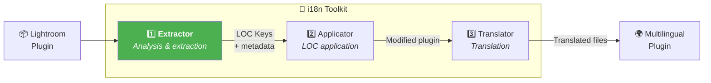
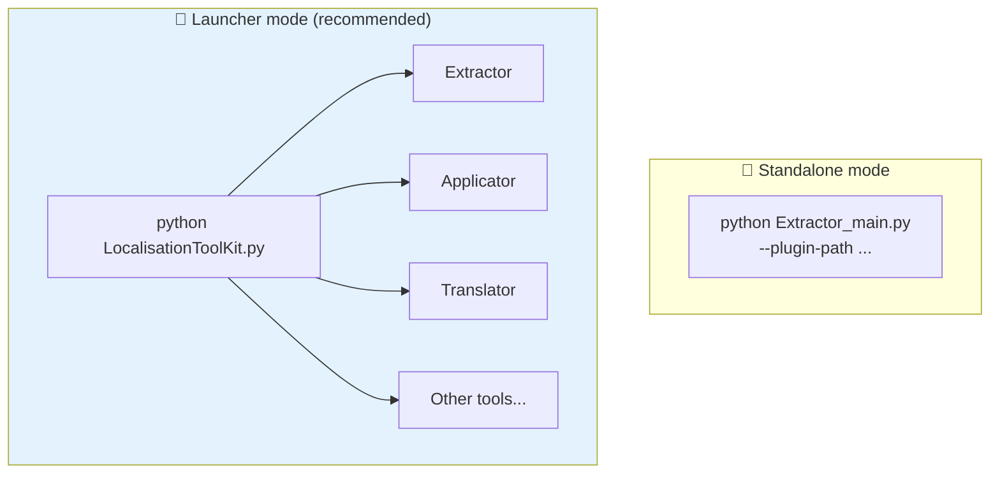
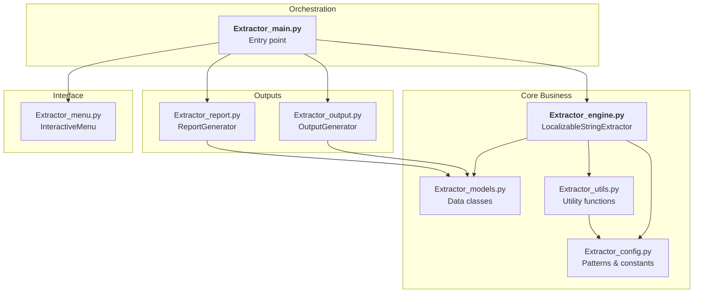
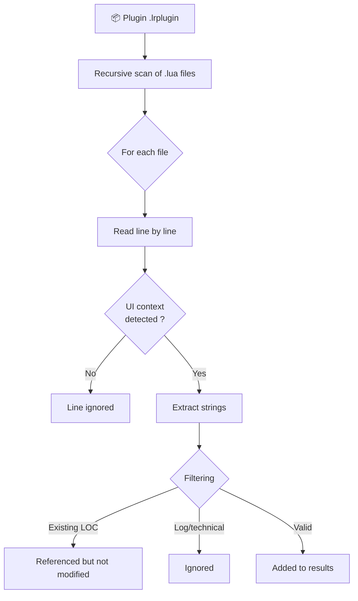
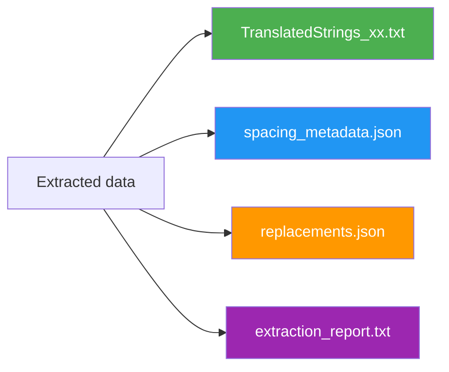
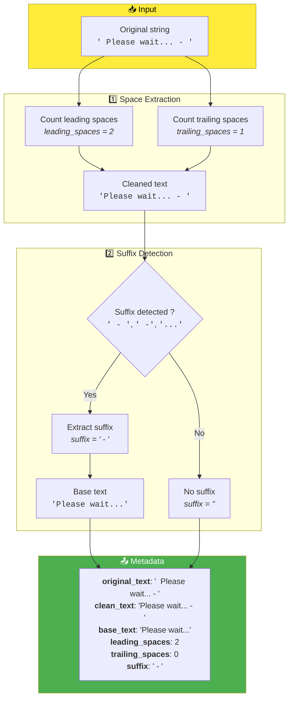
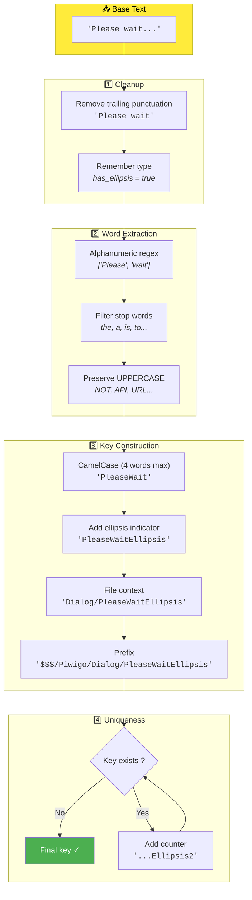

# Extractor - Technical Documentation

This document describes in detail how the ***Extractor*** tool works, the first link in the localization chain of the toolkit. It analyzes the Lua code of a Lightroom plugin and automatically extracts all text strings intended for the user interface, for translation purposes.

**Target Audience**: Lightroom plugin developers and advanced contributors who want to understand the extraction process.

---

## 📑 Document Outline

1. [Overview](#-overview) — Role and positioning in the workflow
2. [Installation and Requirements](#-installation-and-requirements) — What you need to get started
3. [Architecture](#-architecture) — File structure and responsibilities
4. [Usage](#-usage) — Interactive and CLI modes
5. [Generated Files](#-generated-files) — Description of outputs
6. [Detailed Operation](#-detailed-operation) — The 3 extraction phases
7. [Extraction Patterns](#-extraction-patterns) — What is detected (and ignored)
8. [Space and Suffix Management](#-space-and-suffix-management) — Format preservation
9. [LOC Key Generation](#-loc-key-generation) — Algorithm and examples
10. [Advanced Use Cases](#-advanced-use-cases) — Specific scenarios
11. [Troubleshooting](#-troubleshooting) — Common problem resolution
12. [Technical FAQ](#-technical-faq) — Frequently asked questions
13. [Changelog](#-changelog---tracking-modifications) — Evolution history

---

## 🔭 Overview

***Extractor*** is the **first tool** in the localization chain. Its role is to analyze the Lua files of a Lightroom plugin and automatically extract all text strings that should be localized via the `LOC "$$$/.../..."` system of the Adobe SDK.

### Positioning in the Workflow



> ***Extractor*** works in **read-only** mode on the plugin. It does not modify any source files — that task is left to ***Applicator***.

---

## 🛠 Installation and Requirements

### Prerequisites

- **Python 3.8+** installed on your system
- No external dependencies required (standard library only)

### File Structure

```
1_Extractor/
├── Extractor_main.py      ← Entry point, orchestration
├── Extractor_config.py    ← Regex patterns and constants
├── Extractor_models.py    ← Data classes
├── Extractor_utils.py     ← Utility functions
├── Extractor_engine.py    ← Main extraction engine
├── Extractor_output.py    ← Output file generation
├── Extractor_report.py    ← Report generation
├── Extractor_menu.py      ← Interactive interface
└── __doc/
    └── en/
        └── README.md      ← This file
```

### Standalone vs Toolkit Launcher

***Extractor*** is designed to be **independent** and easily deployable from the command line (CLI).

However, using the central launcher ***LocalisationToolKit.py*** is generally preferred because it:
- Centralizes all toolkit tools
- Preserves the context of the plugin being processed in memory
- Automatically transmits global variables to tools (plugin path, etc.)
- Provides smooth navigation between different steps



---

## 🚀 Usage

### Interactive Mode (Recommended)

Simply run the script without arguments:

```bash
python Extractor_main.py
```

A "Ready to go" menu displays with the current configuration:

```
══════════════════════════════════════════════════════════════
        EXTRACTOR - Extraction of Localizable Strings
══════════════════════════════════════════════════════════════

Configuration:

  1. Target plugin      : D:\plugins\myPlugin.lrplugin [OK]
  2. Output             : <plugin>/__i18n_tmp__/Extractor/<timestamp>/ (auto)
  3. LOC prefix         : $$$/MyPlugin
  4. Extracted language : en
  5. Exclusions         : (none)
  6. Minimum string length : 3
  7. Ignore logs        : Yes

──────────────────────────────────────────────────────────────
  ENTER   Start extraction
  1-7     Modify an option
  0       Quit
```

Press **Enter** to start extraction, or type a number to modify an option.

### CLI Mode

For scripted or automated use:

```bash
python Extractor_main.py --plugin-path /path/to/plugin.lrplugin [OPTIONS]
```

#### Available Options

| Option | Description | Default | Example |
|--------|-------------|---------|---------|
| `--plugin-path` | Plugin path **(required)** | — | `./myPlugin.lrplugin` |
| `--output-dir` | Custom output directory | `<plugin>/__i18n_tmp__/Extractor/` | `./output` |
| `--prefix` | LOC key prefix | `$$$/Piwigo` | `$$$/MyApp` |
| `--lang` | Base language code | `en` | `fr`, `de`, `es` |
| `--exclude` | Files to exclude (repeatable) | — | `--exclude test.lua` |
| `--min-length` | Minimum string length | `3` | `5` |
| `--no-ignore-log` | Include log lines | `false` | — |

#### Examples

```bash
# Standard extraction
python Extractor_main.py --plugin-path ./piwigoPublish.lrplugin

# With custom prefix
python Extractor_main.py --plugin-path ./myPlugin.lrplugin --prefix '$$$/MyApp'

# Plugin in French with exclusions
python Extractor_main.py \
  --plugin-path ./monPlugin.lrplugin \
  --lang fr \
  --prefix '$$$/MonApp' \
  --exclude test.lua \
  --exclude debug.lua
```

---

## 📄 Generated Files

Files are created in: `<plugin>/__i18n_tmp__/Extractor/<timestamp>/`

### `TranslatedStrings_xx.txt`

Main file in Lightroom SDK format, directly usable in the plugin:

```lua
-- =============================================================================
-- Plugin Localization - EN
-- Generated: 2026-01-30 15:00:00
-- Total keys: 124
-- =============================================================================

-- -----------------------------------------------------------------------------
-- IMPORTANT NOTES FOR TRANSLATORS:
-- -----------------------------------------------------------------------------
-- 1. DO NOT translate the following patterns (keep them exactly as-is):
--    - %s, %d, %f (format specifiers)
--    - %1, %2, %3... (numbered placeholders)
--    - \n, \t (escape sequences)
--    - Technical terms in UPPERCASE (API, URL, HTTP, JSON, etc.)
--
-- 2. PRESERVE spaces around text exactly as they appear
-- -----------------------------------------------------------------------------

-- Dialog
"$$$/Piwigo/Dialog/Submit=Submit"
"$$$/Piwigo/Dialog/Cancel=Cancel"
"$$$/Piwigo/Dialog/PleaseWaitEllipsis=Please wait..."
```

### `spacing_metadata.json`

Metadata for reconstructing spaces and suffixes:

```json
{
  "generated": "2026-01-30T15:00:00",
  "total_keys_with_spacing": 82,
  "metadata": {
    "$$$/Piwigo/Upload/Processing": {
      "original_text": "  Processing - ",
      "clean_text": "Processing - ",
      "base_text": "Processing",
      "leading_spaces": 2,
      "trailing_spaces": 0,
      "suffix": " - "
    }
  }
}
```

### `replacements.json`

Detailed instructions for ***Applicator***:

```json
{
  "files": {
    "MyDialog.lua": {
      "total_replacements": 15,
      "replacements": [
        {
          "line_num": 42,
          "original_line": "title = \"Submit\",",
          "replaced_line": "title = LOC \"$$$/Piwigo/Dialog/Submit=Submit\",",
          "members": [
            {
              "original_text": "Submit",
              "loc_key": "$$$/Piwigo/Dialog/Submit",
              "leading_spaces": 0,
              "trailing_spaces": 0,
              "suffix": ""
            }
          ]
        }
      ]
    }
  }
}
```

### `extraction_report.txt`

Detailed report with complete statistics and emoji legend:

```
================================================================================
EXTRACTION REPORT OF LOCALIZABLE STRINGS
================================================================================

Date: 2026-01-30 15:00:00
Plugin: ./piwigoPublish.lrplugin
Prefix: $$$/Piwigo

LEGEND:
  ⬅️   = Space(s) at START of string
  ➡️   = Space(s) at END of string
  🔚  = Suffix detected (" - ", " -", "...")
  🔗  = Member of concatenated string

STATISTICS
--------------------------------------------------------------------------------
Files analyzed             : 19
Files with strings         : 14
Total strings found        : 381
Unique keys                : 272
Log lines ignored          : 45
Technical strings ignored  : 23
...
```

---

## 🏗 Architecture

### Dependency Diagram



Each module has a clear responsibility:

| Module | Responsibility |
|--------|----------------|
| `Extractor_main.py` | Orchestration, CLI argument parsing |
| `Extractor_engine.py` | Lua file analysis, string extraction |
| `Extractor_config.py` | Definition of regex patterns, exclusion lists |
| `Extractor_models.py` | Data classes (`ExtractedString`, `ExtractionStats`...) |
| `Extractor_utils.py` | Space extraction, LOC key generation |
| `Extractor_output.py` | Generation of `TranslatedStrings_xx.txt`, JSON |
| `Extractor_report.py` | Generation of detailed report |
| `Extractor_menu.py` | Interactive menu interface |

---

## ⚙ Detailed Operation

Extraction occurs in **3 successive phases**:

### Phase 1: File Analysis



The engine traverses all `.lua` files in the plugin and detects **UI contexts** (properties like `title`, `label`, `LrDialogs` calls, etc.).

### Phase 2: Extraction and Metadata

For each detected string, ***Extractor*** extracts:

```
Original string : "  Hello World - "
                    ↓
┌─────────────────────────────────────────────┐
│  Base text      : "Hello World"             │
│  Leading spaces : 2                         │
│  Trailing spaces: 0 (replaced by suffix)    │
│  Suffix         : " - "                     │
│  LOC key        : $$$/Piwigo/File/HelloWorld│
└─────────────────────────────────────────────┘
```

This metadata is **essential** for ***Applicator*** to reconstruct exactly the original string with its formatting.

### Phase 3: File Generation



---

## 🔍 Extraction Patterns

### Double Quotes Only

> **Important**: ***Extractor*** only processes strings between **double quotes** (`"`).

Single quotes (`'`) are intentionally **not supported**, in accordance with Adobe Lightroom SDK recommendations. If your plugin uses single quotes, convert them before extraction.

```lua
title = "Hello World"   -- ✓ Extracted (double quotes)
title = 'Hello World'   -- ✗ Ignored (single quotes)
```

#### Help Finding Single Quotes

**Regex**: `LrDialogs\.(\w+)\s*\(\s*'([^']*)'`

### Recognized UI Contexts

***Extractor*** automatically detects several contexts in Lua code:

```lua
-- 1. Standard UI properties
f:static_text {
    title = "Hello World",      -- ✓ Extracted
    tooltip = "A tooltip",      -- ✓ Extracted
}

-- 2. LrDialogs
LrDialogs.message("Title", "Message")        -- ✓ Extracts both strings
LrDialogs.confirm("Are you sure?")           -- ✓ Extracted
LrDialogs.showError("Error occurred")        -- ✓ Extracted

-- 3. User errors
LrErrors.throwUserError("Invalid file")      -- ✓ Extracted

-- 4. Popup menu items
f:popup_menu {
    items = {
        { title = "Option 1", value = "opt1" },  -- ✓ Extracts "Option 1"
        { title = "Option 2", value = "opt2" },  -- ✓ Extracts "Option 2"
    }
}

-- 5. String concatenations
local msg = "Processing " .. count .. " files"  -- ✓ Extracts both parts

-- 6. Status messages
callStatus.statusMsg = "Downloading..."   -- ✓ Extracted
```

### Ignored Patterns

```lua
-- Logs (ignored by default)
log:info("Debug info")           -- ✗ Ignored
logError("Technical error")      -- ✗ Ignored

-- Technical values
method = "POST"                  -- ✗ Ignored (HTTP method)
format = "application/json"      -- ✗ Ignored (MIME type)
url = "https://api.example.com"  -- ✗ Ignored (URL)

-- Existing LOC keys
title = LOC "$$$/App/Title=Title"  -- ✗ Already localized

-- Strings too short
x = "OK"                         -- ✗ Ignored if min_length > 2

-- Technical identifiers
color = "red"                    -- ✗ Ignored (snake_case, lowercase)
```

### Complete List of Detected Contexts

| Context | Pattern | Example |
|---------|---------|---------|
| `title` | `title = "..."` | Widget title |
| `label` | `label = "..."` | Field label |
| `tooltip` | `tooltip = "..."` | Tooltip |
| `placeholder` | `placeholder = "..."` | Placeholder text |
| `message` | `message = "..."` | Message |
| `actionVerb` | `actionVerb = "..."` | Action button |
| `cancelVerb` | `cancelVerb = "..."` | Cancel button |
| `LrDialogs.*` | `LrDialogs.message(...)` | System dialogs |
| `LrErrors.*` | `LrErrors.throwUserError(...)` | User errors |
| `statusMsg` | `statusMsg = "..."` | Status messages |

---

## 📐 Space and Suffix Management

***Extractor*** intelligently preserves formatting to ensure identical rendering after application.

### Formatting Spaces

```lua
-- Before extraction
title = "  Hello World  "

-- Extracted metadata
{
  "base_text": "Hello World",
  "leading_spaces": 2,
  "trailing_spaces": 2
}

-- After application by Applicator
title = "  " .. LOC "$$$/App/HelloWorld=Hello World" .. "  "
```

### Common Suffixes

The suffixes ` - `, ` -` and `...` are detected and extracted separately:

```lua
-- Before
label = "Loading..."

-- Metadata
{
  "base_text": "Loading",
  "suffix": "..."
}

-- After application
label = LOC "$$$/App/Loading=Loading" .. "..."
```

> **Why?** This avoids multiplying translation keys for minor variations (`"Loading"` vs `"Loading..."` vs `"Loading - "`).

### Complex Concatenations

```lua
-- Before
message = "  Processing " .. count .. " files in progress..."

-- Extraction: 2 members
-- Member 1: "  Processing " → base="Processing", leading=2, trailing=1
-- Member 2: " files in progress..." → base="files in progress", leading=1, suffix="..."

-- After application
message = "  " .. LOC "$$$/App/ProcessingOf=Processing" .. " " .. count .. " " .. LOC "$$$/App/FilesInProgress=files in progress" .. "..."
```

---

## 🔑 LOC Key Generation

### Complete Algorithm

The process of handling a string has **two main stages**: extracting formatting metadata, then generating the LOC key.

#### Stage 1: Metadata Extraction



> When a suffix is detected, `trailing_spaces` are reset to 0 because the suffix typically includes the separating space.

#### Stage 2: LOC Key Generation



### Generation Examples

| Original Text | File | Generated Key |
|----------------|------|---------------|
| `"Submit"` | `PWDialog.lua` | `$$$/Piwigo/Dialog/Submit` |
| `"Please wait..."` | `PWUpload.lua` | `$$$/Piwigo/Upload/PleaseWaitEllipsis` |
| `"API Key:"` | `PWSettings.lua` | `$$$/Piwigo/Settings/APIKey` |
| `"Connection NOT successful"` | `PWConnect.lua` | `$$$/Piwigo/Connect/ConnectionNOTSuccessful` |

> Uppercase words are preserved (e.g., `NOT`) because they often represent intentional emphasis.

### Handling Collisions

When multiple strings generate the same key, a numeric suffix is added:

```
$$$/Piwigo/Dialog/AreYouSure   → "Are you sure you want to delete?"
$$$/Piwigo/Dialog/AreYouSure2  → "Are you sure you want to continue?"
$$$/Piwigo/Dialog/AreYouSure3  → "Are you sure you want to reset?"
```

---

## 🎓 Advanced Use Cases

### Plugin Initially in French

If your plugin is written in French and you want to localize it:

```bash
python Extractor_main.py \
  --plugin-path ./monPlugin.lrplugin \
  --lang fr \
  --prefix '$$$/MonApp'
```

This generates `TranslatedStrings_fr.txt`. You can then create `TranslatedStrings_en.txt` by duplicating and translating this file.

### Re-running on Partially Localized Project

***Extractor*** automatically detects existing LOC keys and does not re-extract them. You can re-run extraction after adding new code:

```bash
# First extraction
python Extractor_main.py --plugin-path ./plugin.lrplugin

# ... development, new features ...

# New extraction (does not touch existing keys)
python Extractor_main.py --plugin-path ./plugin.lrplugin
```

Already localized keys appear in the report but are not added to replacement files.

### Targeted Extraction with Exclusions

```bash
python Extractor_main.py \
  --plugin-path ./plugin.lrplugin \
  --exclude test.lua \
  --exclude debug.lua \
  --exclude vendor/JSON.lua
```

> `JSON.lua` is excluded by default as it's a technical library.

### CI/CD Integration

Example bash script for automation:

```bash
#!/bin/bash
PLUGIN_PATH="./myPlugin.lrplugin"

python 1_Extractor/Extractor_main.py \
  --plugin-path "$PLUGIN_PATH" \
  --prefix '$$$/MyApp'

if [ $? -eq 0 ]; then
  echo "✓ Extraction successful"
else
  echo "✗ Extraction failed"
  exit 1
fi
```

---

## 🔧 Troubleshooting

### No Strings Extracted

**Possible Causes**:
- `--min-length` too high
- All strings already localized
- Incorrect plugin path
- Patterns not recognized

**Solutions**:
```bash
# Reduce minimum length
python Extractor_main.py --plugin-path ./plugin.lrplugin --min-length 1

# Verify path
ls ./plugin.lrplugin/*.lua

# Check the report to understand exclusions
```

### Too Many Strings Extracted

If log messages are extracted by mistake, verify you're not using `--no-ignore-log`. Logs are ignored by default.

### Incorrectly Encoded Characters

All files are processed in UTF-8. If you see incorrect characters:

```bash
# Check encoding (Linux/Mac)
file --mime-encoding *.lua

# Convert if necessary
iconv -f ISO-8859-1 -t UTF-8 file.lua > file_utf8.lua
```

### LOC Keys Too Long

If generated keys are unreadable:
1. Shorten the original texts in the code
2. **Warning**: If you manually modify `TranslatedStrings_xx.txt`, also update `replacements.json`

---

## ❓ Technical FAQ

### Can I Modify Detection Patterns?

Yes, edit `Extractor_config.py`. Patterns are defined in `UI_CONTEXT_PATTERNS`:

```python
UI_CONTEXT_PATTERNS: List[tuple] = [
    ('title', re.compile(r'\btitle\s*=\s*')),
    ('my_new_pattern', re.compile(r'\bmyPattern\s*=\s*')),  # Addition
    ...
]
```

### Are Metadata Essential?

Yes. Without them, ***Applicator*** couldn't reconstruct exactly the original strings with their spaces and suffixes.

### Can I Version Generated Files?

| File | Version ? | Reason |
|------|-----------|--------|
| `TranslatedStrings_xx.txt` | ✅ Yes | Final translation file |
| `__i18n_tmp__/` | ❌ No | Temporary work folder |

Add `__i18n_tmp__/` to your `.gitignore`.

### Typical Performance

| Plugin Size | Execution Time |
|------------|-----------------|
| Small (5-10 files) | < 1 second |
| Medium (20-30 files) | 2-3 seconds |
| Large (50+ files) | 5-10 seconds |

---

## 📋 Changelog - Tracking Modifications

| Version | Date | Modifications |
|---------|------|---------------|
| 5.2 | 2026-02-02 | Cleanup |
| 5.1 | 2026-01-30 | "Ready to go" interactive menu, output centralization in `__i18n_tmp__/` |
| 5.0 | 2026-01-29 | Complete refactoring into separate modules, multi-line support |
| 4.x | 2025-01-21 | Concatenation handling, suffix detection |
| 3.x | 2025-12-20 | Added space metadata |
| 2.x | 2026-01-10 | Extended UI patterns |
| 1.0 | 2026-01-01 | Initial version |

---

## 📚 Resources and Credits

| Element | Information |
|---------|-------------|
| Lightroom SDK | [Adobe Developer Console](https://developer.adobe.com/console) |
| LOC Format | `LOC "$$$/Key=Default"` (default value required) |
| Python regex | [Documentation re](https://docs.python.org/3/library/re.html) |

---

| 📜 | Traceability |  |  |
|--|--|--|--|
| **Name** | *README.md* | **Version** | 5.2 |
| **Type** | User Guide - EXTRACTOR Advanced | **Language** | EN - *[FR](../fr/Lisez-moi.md)* |
| **GitHub Project** | [Adobe Lightroom Translation Toolkit](https://github.com/Gotcha26/Adobe_Lightroom_Translation_Plugins_Kit) | **Date** | 2026-02-02 |
| **License** | Open source | | |
