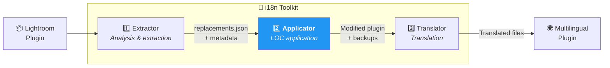
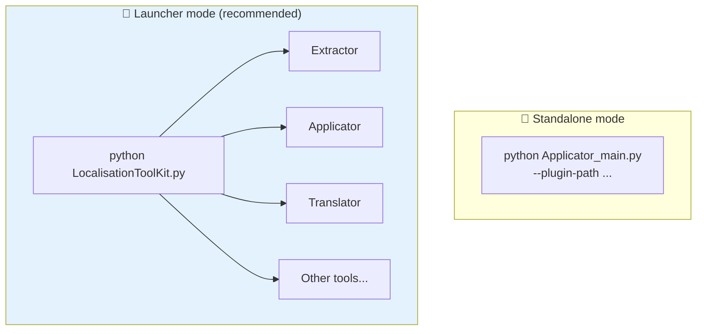
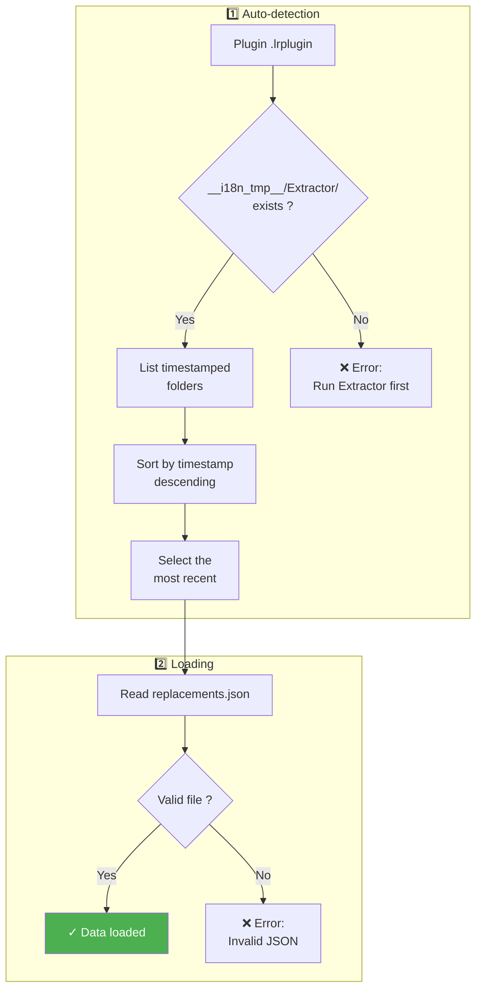
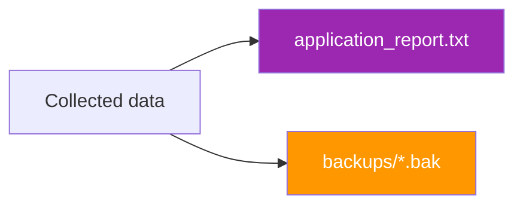

# Applicator - Technical Documentation

This document describes in detail how the ***Applicator*** tool works, the second link in the localization chain of the toolkit. It automatically applies replacements in Lua code by transforming hardcoded strings into calls to the Lightroom SDK `LOC` function.

**Target Audience**: Lightroom plugin developers and advanced contributors who want to understand the application process.

---

## 📑 Document Outline

1. [Overview](#-overview) — Role and positioning in the workflow
2. [Installation and Requirements](#-installation-and-requirements) — What you need to get started
3. [Usage](#-usage) — Interactive and CLI modes
4. [Output Structure](#-output-structure) — Backups and reports
5. [Lightroom SDK Format](#-lightroom-sdk-format) — LOC syntax and transformations
6. [Detailed Operation](#-detailed-operation) — The 3 application phases
7. [Complex Cases Management](#-complex-cases-management) — Mixed lines, quotes, etc.
8. [Translation Management](#-translation-management) — TranslatedStrings files
9. [Troubleshooting](#-troubleshooting) — Common problem resolution
10. [Technical FAQ](#-technical-faq) — Frequently asked questions
11. [Changelog](#-changelog---tracking-modifications) — Evolution history

---

## 🔭 Overview

***Applicator*** is the **second tool** in the localization chain. Its role is to automatically apply the replacements identified by ***Extractor*** in the plugin's Lua code.

### Positioning in the Workflow



> ***Applicator*** **modifies plugin source files**. It automatically creates `.bak` backups before each modification (unless disabled).

---

## 🛠 Installation and Requirements

### Prerequisites

- **Python 3.8+** installed on your system
- ***Extractor*** must have been run beforehand (generates `replacements.json`)
- No external dependencies required (standard library only)

### File Structure

```
2_Applicator/
├── Applicator_main.py     ← Entry point, main logic
├── Applicator_menu.py     ← Interactive interface
└── __doc/
    └── en/
        └── README.md      ← This file
```

The architecture is intentionally simple: a single main file contains all business logic. This makes it easy to understand and modify.

| Module | Responsibility |
|--------|----------------|
| `Applicator_main.py` | JSON loading, replacement application, report generation |
| `Applicator_menu.py` | "Ready to go" interactive menu interface |

### Standalone vs Toolkit Launcher

***Applicator*** is designed to be **independent** and easily deployable from the command line (CLI).

However, using the central launcher ***LocalisationToolKit.py*** is generally preferred because it:
- Centralizes all toolkit tools
- Preserves the context of the plugin being processed in memory
- Automatically transmits global variables to tools (plugin path, etc.)
- Provides smooth navigation between different steps



---

## 🚀 Usage

### Interactive Mode (Recommended)

Simply run the script without arguments:

```bash
python Applicator_main.py
```

A "Ready to go" menu displays with the current configuration:

```
══════════════════════════════════════════════════════════════
        APPLICATOR - Application of Localizations
══════════════════════════════════════════════════════════════

Configuration:

  1. Plugin             : D:\plugins\myPlugin.lrplugin [OK]
  2. Extraction         : <plugin>/__i18n_tmp__/Extractor/20260130_150000 [OK]
  3. Simulation mode    : No (real modifications)
  4. .bak Backups       : Yes (recommended)
     Output             : <plugin>/__i18n_tmp__/Applicator/<timestamp>/

──────────────────────────────────────────────────────────────
  ENTER   Start application
  1-4     Modify an option
  0       Quit
```

### CLI Mode

For scripted or automated use:

```bash
python Applicator_main.py --plugin-path /path/to/plugin.lrplugin [OPTIONS]
```

#### Available Options

| Option | Description | Default | Example |
|--------|-------------|---------|---------|
| `--plugin-path` | Plugin path **(required)** | — | `./myPlugin.lrplugin` |
| `--extraction-dir` | Specific Extractor folder | Auto-detect | `./plugin/__i18n_tmp__/Extractor/20260130_150000/` |
| `--dry-run` | Simulation mode (no modification) | `false` | `--dry-run` |
| `--no-backup` | Do not create `.bak` backups | `false` | `--no-backup` |

#### Examples

```bash
# Standard application with auto-detection
python Applicator_main.py --plugin-path ./piwigoPublish.lrplugin

# Dry-run mode (simulation)
python Applicator_main.py --plugin-path ./plugin.lrplugin --dry-run

# Application with specific extraction
python Applicator_main.py \
  --plugin-path ./plugin.lrplugin \
  --extraction-dir ./plugin/__i18n_tmp__/Extractor/20260128_120000/

# Without backup (not recommended)
python Applicator_main.py --plugin-path ./plugin.lrplugin --no-backup
```

---

## 📂 Output Structure

### File Organization

```
myPlugin.lrplugin/
├── MyDialog.lua                     ← Modified file
├── Settings.lua                     ← Modified file
└── __i18n_tmp__/
    ├── 1_Extractor/
    │   └── 20260130_143022/         ← Source of replacements
    │       ├── replacements.json
    │       └── TranslatedStrings_en.txt
    │
    └── 2_Applicator/
        └── 20260130_150000/         ← Output of this execution
            ├── application_report.txt
            └── backups/
                ├── MyDialog.lua.bak
                └── Settings.lua.bak
```

### Application Report

The `application_report.txt` file documents all modifications:

```
================================================================================
LOCALIZATION REPORT - PiwigoPublish Plugin
================================================================================

GLOBAL STATISTICS
--------------------------------------------------------------------------------
Files processed          : 12
Files modified           : 8
Lines modified           : 156
Strings replaced         : 142
Strings ignored          : 14
Errors                   : 0

================================================================================
MODIFICATIONS MADE
================================================================================

--------------------------------------------------------------------------------
File: MyDialog.lua
--------------------------------------------------------------------------------

  Line 42:
  BEFORE : title = "Submit",
  AFTER  : title = LOC "$$$/Piwigo/Dialog/Submit=Submit",
    - "Submit" -> $$$/Piwigo/Dialog/Submit

...

================================================================================
POST-PROCESSING RECOMMENDATIONS
================================================================================

1. Verify modifications with Git diff
2. RESTART Lightroom Classic (reload is not enough)
3. Verify that TranslatedStrings_fr.txt exists at the root
4. Test the text in the interface
```

### Backup Restoration

If necessary, use the ***Restore_backup*** tool or restore manually:

```bash
# Restore a file manually
cp myPlugin.lrplugin/__i18n_tmp__/2_Applicator/20260130_150000/backups/MyDialog.lua.bak \
   myPlugin.lrplugin/MyDialog.lua

# Or via Git if versioned
git checkout HEAD -- myPlugin.lrplugin/MyDialog.lua
```

> See also: [Restore_backup](../../9_Tools/__doc/en/tools/RESTORE_BACKUP.md)

---

## 📝 Lightroom SDK Format

The Lightroom SDK imposes a strict format for localization:

```lua
LOC "$$$/Key=Default Value"
```

### Why Is the Default Value Required?

Without a default value, Lightroom displays the raw key (`$$$/App/Submit`) instead of the text. This is unsightly and confusing for the user.

### Examples of Transformations

#### Simple Transformation

```lua
-- BEFORE
title = "Submit"

-- AFTER
title = LOC "$$$/Piwigo/Dialog/Submit=Submit"
```

#### With Formatting Spaces

```lua
-- BEFORE
label = "  Username  "

-- AFTER
label = "  " .. LOC "$$$/Piwigo/Settings/Username=Username" .. "  "
```

#### With Suffix

```lua
-- BEFORE
label = "Loading..."

-- AFTER
label = LOC "$$$/Piwigo/Upload/Loading=Loading" .. "..."
```

#### Complex Concatenation

```lua
-- BEFORE
message = "Uploading " .. count .. " photos"

-- AFTER
message = LOC "$$$/Piwigo/Upload/Uploading=Uploading " .. count .. LOC "$$$/Piwigo/Upload/Photos= photos"
```

---

## ⚙ Detailed Operation

The application occurs in **3 successive phases**:

### Phase 1: Loading Extraction Data



The `replacements.json` file contains all precise instructions:

```json
{
  "files": {
    "MyDialog.lua": {
      "replacements": [
        {
          "line_num": 42,
          "original_line": "title = \"Submit\",",
          "members": [
            {
              "original_text": "Submit",
              "base_text": "Submit",
              "loc_key": "$$$/Piwigo/Dialog/Submit",
              "leading_spaces": 0,
              "trailing_spaces": 0,
              "suffix": ""
            }
          ]
        }
      ]
    }
  }
}
```

### Phase 2: Applying Replacements

```mermaid
flowchart TD
    subgraph File["For each .lua file"]
        A["Read line by line"] --> B{"Line referenced<br/>in JSON ?"}
        B -->|No| C["Keep line<br/>unchanged"]
        B -->|Yes| D["Process members"]
    end

    subgraph Member["For each member"]
        D --> E["Search string<br/>(double quotes)"]
        E --> F{"Already in<br/>a LOC ?"}
        F -->|Yes| G["Ignore<br/>(already localized)"]
        F -->|No| H["Build LOC call"]
    end

    subgraph Construction["LOC Construction"]
        H --> I{"Spaces<br/>before ?"}
        I -->|Yes| J["Add: '\" \" .. '"]
        I -->|No| K["—"]
        J --> L["LOC \"key=value\""]
        K --> L
        L --> M{"Suffix ?"}
        M -->|Yes| N["Add: ' .. \"suffix\"'"]
        M -->|No| O{"Spaces<br/>after ?"}
        O -->|Yes| P["Add: ' .. \" \"'"]
        O -->|No| Q["—"]
    end

    subgraph Writing["Finalization"]
        N --> R["Replace in line"]
        P --> R
        Q --> R
        R --> S["Create .bak backup"]
        S --> T["Write modified file"]
    end

    style T fill:#4CAF50,color:#fff
```

#### Detailed LOC Construction Algorithm

```mermaid
flowchart LR
    subgraph Input["📥 Input"]
        A["member = {<br/>original_text: '  Hello - '<br/>base_text: 'Hello'<br/>loc_key: '$$$/App/Hello'<br/>leading_spaces: 2<br/>suffix: ' - '<br/>}"]
    end

    subgraph Building["🔧 Building"]
        B["parts = []"]
        B --> C{"leading > 0 ?"}
        C -->|Yes| D["parts += '\"  \" .. '"]
        C -->|No| E["—"]
        D --> F["parts += 'LOC \"key=value\"'"]
        E --> F
        F --> G{"suffix ?"}
        G -->|Yes| H["parts += ' .. \" - \"'"]
        G -->|No| I{"trailing > 0 ?"}
        I -->|Yes| J["parts += ' .. \" \"'"]
        I -->|No| K["—"]
    end

    subgraph Output["📤 Result"]
        H --> L["'\"  \" .. LOC \"$$$/App/Hello=Hello\" .. \" - \"'"]
        J --> L
        K --> L
    end

    style L fill:#4CAF50,color:#fff
```

### Phase 3: Report Generation



The report contains:
- **Global statistics** (files processed, modified, strings replaced)
- **Modification details** (before/after for each line)
- **Ignored strings** (reason for ignoring)
- **Post-processing recommendations**

---

## 🔀 Complex Cases Management

### Lines Already Partially Localized

***Applicator*** detects existing `LOC` calls and applies only necessary replacements:

```lua
-- Mixed line (before)
title = "Prefix " .. LOC "$$$/App/Existing=Existing" .. " Suffix"

-- Applicator replaces only "Prefix " and " Suffix"
title = LOC "$$$/App/Prefix=Prefix " .. LOC "$$$/App/Existing=Existing" .. LOC "$$$/App/Suffix= Suffix"
```

### Double Quotes Only

> **Important**: Only **double quotes** are supported by the toolkit.

***Extractor*** intentionally extracts only strings between double quotes, in accordance with Adobe Lightroom SDK recommendations.

```lua
title = "Submit"   -- ✓ Supported (double quotes)
title = 'Submit'   -- ✗ Not extracted (single quotes)
```

If your plugin uses single quotes, convert them to double quotes before extraction.

### Multiple Positions of the Same String

If a string appears multiple times on the same line:

```lua
-- Before
text = "OK" .. separator .. "OK"

-- After (each occurrence processed separately)
text = LOC "$$$/App/OK=OK" .. separator .. LOC "$$$/App/OK2=OK"
```

***Applicator*** avoids duplicates by tracking already-used positions.

---

## 🌍 Translation Management

After application, ***Applicator*** offers to manage `TranslatedStrings_xx.txt` files.

### Scenario 1: No Translation Files

```
No TranslatedStrings_xx.txt file found at the plugin root.
This file is required for Lightroom translations.

A template file was found in the extraction:
  __i18n_tmp__/1_Extractor/20260130_143022/TranslatedStrings_en.txt

Would you like to copy it to the plugin root?
  -> ./myPlugin.lrplugin/TranslatedStrings_en.txt

Copy the file? [Y/n]:
```

### Scenario 2: Existing Files

```
Translation file(s) found at the plugin root:
  - TranslatedStrings_en.txt
  - TranslatedStrings_fr.txt

Would you like to open the translation manager (Translator)?
This allows you to synchronize translations with new keys.

Open Translator? [y/N]:
```

---

## 🔧 Troubleshooting

### Error: "No extraction found"

**Cause**: No `__i18n_tmp__/1_Extractor/` folder in the plugin.

**Solution**:
```bash
# Run Extractor first
python 1_Extractor/Extractor_main.py --plugin-path ./plugin.lrplugin
```

### Error: "replacements.json file not found"

**Cause**: The extraction folder is incomplete or corrupted.

**Solution**: Run a complete extraction again.

### Strings Not Replaced

**Possible Causes**:
1. Code has changed since extraction (different line number)
2. String is already in a LOC
3. Quotes are different (escaped, etc.)

**Solutions**:
1. Run ***Extractor*** again to update `replacements.json`
2. Check the report "IGNORED STRINGS" section

### Lightroom Doesn't Display Translations

**Checks**:
1. Is the `TranslatedStrings_xx.txt` file at the plugin root?
2. Does the code contain LOC calls?
3. **Has Lightroom been restarted** (not just "Reload Plugin")?
4. Does the system language match the file? (fr → `TranslatedStrings_fr.txt`)

---

## ❓ Technical FAQ

### Can I apply the same replacements.json twice?

No, the second application would fail because strings are already in LOCs.

### Are backups automatically deleted?

No, they remain in `__i18n_tmp__/2_Applicator/` until manually deleted or via ***Delete_temp_dir***.

### Can I customize the LOC format?

No, the `LOC "$$$/Key=Default"` format is imposed by the Lightroom SDK.

### Typical Performance

| Plugin Size | Execution Time |
|------------|-----------------|
| Small (50 replacements) | < 1 second |
| Medium (200 replacements) | 2-3 seconds |
| Large (500+ replacements) | 5-10 seconds |

---

## ✅ Post-Application Checklist

- [ ] Review the application report (`application_report.txt`)
- [ ] Verify modifications with `git diff`
- [ ] Ensure `TranslatedStrings_en.txt` is at the plugin root
- [ ] Copy and translate for other languages (`TranslatedStrings_fr.txt`, etc.)
- [ ] **Restart** Lightroom Classic (not just "Reload Plugin")
- [ ] Test all user interfaces
- [ ] Commit changes to Git

---

## 📋 Changelog - Tracking Modifications

| Version | Date | Modifications |
|---------|------|---------------|
| 7.0 | 2026-01 | `__i18n_tmp__/` structure with auto-detection Extractor |
| 6.x | 2025-12 | Removed single quotes support (double quotes only) |
| 5.x | 2025-11 | Added dry-run mode |
| 4.x | 2025-10 | Timestamped backup system |
| 3.x | 2025-09 | Support for space and suffix metadata |
| 2.x | 2025-08 | Detailed application report |
| 1.0 | 2025-07 | Initial version |

---

## 📚 Resources and Credits

| Element | Information |
|---------|-------------|
| Lightroom SDK | [Adobe Developer Console](https://developer.adobe.com/console) |
| LOC Format | `LOC "$$$/Key=Default"` (default value required) |
| Python JSON | [Documentation json](https://docs.python.org/3/library/json.html) |

---

| 📜 | Traceability |  |  |
|--|--|--|--|
| **Name** | *README.md* | **Version** | 7.1 |
| **Type** | User Guide - APPLICATOR Advanced | **Language** | EN - *[FR](../fr/Lisez-moi.md)* |
| **GitHub Project** | [Adobe Lightroom Translation Toolkit](https://github.com/Gotcha26/Adobe_Lightroom_Translation_Plugins_Kit) | **Date** | 2026-02-02 |
| **License** | Open source | | |
