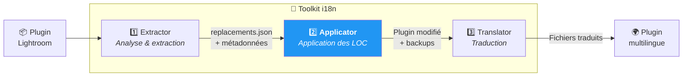
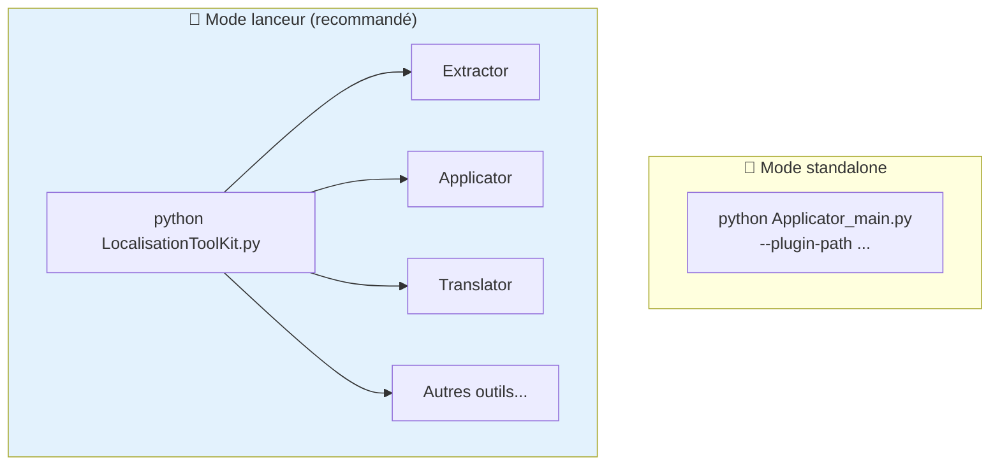
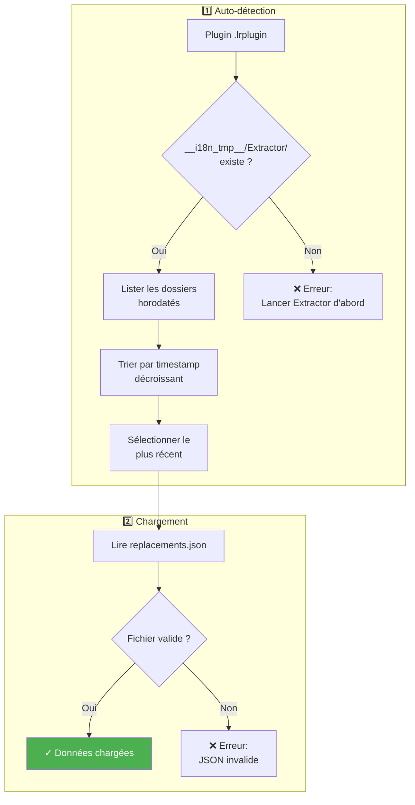
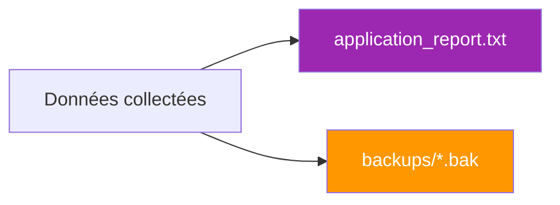

# Applicator - Documentation technique

Ce document décrit en détail le fonctionnement de l'outil ***Applicator***, deuxième maillon de la chaîne de localisation du toolkit. Il applique automatiquement les remplacements dans le code Lua en transformant les chaînes en dur en appels à la fonction `LOC` du SDK Lightroom.

**Public visé** : Développeurs de plugins Lightroom, contributeurs avancés souhaitant comprendre le processus d'application.

---

## 📑 Plan du document

1. [Vue d'ensemble](#-vue-densemble) — Rôle et positionnement dans le workflow
2. [Installation et prérequis](#-installation-et-prérequis) — Ce qu'il faut pour démarrer
3. [Utilisation](#-utilisation) — Modes interactif et CLI
4. [Structure des sorties](#-structure-des-sorties) — Backups et rapports
5. [Format SDK Lightroom](#-format-sdk-lightroom) — Syntaxe LOC et transformations
6. [Fonctionnement détaillé](#-fonctionnement-détaillé) — Les 3 phases d'application
7. [Gestion des cas complexes](#-gestion-des-cas-complexes) — Lignes mixtes, guillemets, etc.
8. [Gestion des traductions](#-gestion-des-traductions) — Fichiers TranslatedStrings
9. [Dépannage](#-dépannage) — Résolution des problèmes courants
10. [FAQ technique](#-faq-technique) — Questions fréquentes
11. [Changelog](#-changelog---suivi-des-modifications) — Historique des évolutions

---

## 🔭 Vue d'ensemble

***Applicator*** est le **deuxième outil** de la chaîne de localisation. Son rôle est d'appliquer automatiquement les remplacements identifiés par ***Extractor*** dans le code Lua du plugin.

### Positionnement dans le workflow



> ***Applicator*** **modifie les fichiers sources** du plugin. Il crée automatiquement des sauvegardes `.bak` avant chaque modification (sauf si désactivé).

---

## 🛠 Installation et prérequis

### Prérequis

- **Python 3.8+** installé sur votre système
- ***Extractor*** doit avoir été exécuté au préalable (génère `replacements.json`)
- Aucune dépendance externe requise (bibliothèque standard uniquement)

### Structure des fichiers

```
2_Applicator/
├── Applicator_main.py     ← Point d'entrée, logique principale
├── Applicator_menu.py     ← Interface interactive
└── __doc/
    └── fr/
        └── Lisez-moi.md   ← Ce fichier
```

L'architecture est volontairement simple : un seul fichier principal contient toute la logique métier. Cela facilite la compréhension et les modifications.

| Module | Responsabilité |
|--------|----------------|
| `Applicator_main.py` | Chargement JSON, application des remplacements, génération rapport |
| `Applicator_menu.py` | Interface menu interactif "Ready to go" |

### Utilisation standalone vs lanceur du toolkit

***Applicator*** est conçu pour être **indépendant** et facilement déployable en ligne de commande (CLI).

Cependant, l'utilisation via le lanceur central ***LocalisationToolKit.py*** est généralement préférée car il :
- Centralise tous les outils du toolkit
- Conserve en mémoire le contexte du plugin en cours de traitement
- Transmet automatiquement les variables globales aux outils (chemin du plugin, etc.)
- Offre une navigation fluide entre les différentes étapes



---

## 🚀 Utilisation

### Mode interactif (recommandé)

Lancez simplement le script sans argument :

```bash
python Applicator_main.py
```

Un menu "Ready to go" s'affiche avec la configuration actuelle :

```
══════════════════════════════════════════════════════════════
        APPLICATOR - Application des localisations
══════════════════════════════════════════════════════════════

Configuration:

  1. Plugin             : D:\plugins\monPlugin.lrplugin [OK]
  2. Extraction         : <plugin>/__i18n_tmp__/Extractor/20260130_150000 [OK]
  3. Mode simulation    : Non (modifications réelles)
  4. Sauvegardes .bak   : Oui (recommandé)
     Sortie             : <plugin>/__i18n_tmp__/Applicator/<timestamp>/

──────────────────────────────────────────────────────────────
  ENTRÉE  Lancer l'application
  1-4     Modifier une option
  0       Quitter
```

### Mode CLI

Pour une utilisation scriptée ou automatisée :

```bash
python Applicator_main.py --plugin-path /chemin/vers/plugin.lrplugin [OPTIONS]
```

#### Options disponibles

| Option | Description | Défaut | Exemple |
|--------|-------------|--------|---------|
| `--plugin-path` | Chemin du plugin **(obligatoire)** | — | `./monPlugin.lrplugin` |
| `--extraction-dir` | Dossier Extractor spécifique | Auto-détection | `./plugin/__i18n_tmp__/Extractor/20260130_150000/` |
| `--dry-run` | Mode simulation (pas de modification) | `false` | `--dry-run` |
| `--no-backup` | Ne pas créer de backups `.bak` | `false` | `--no-backup` |

#### Exemples

```bash
# Application standard avec auto-détection
python Applicator_main.py --plugin-path ./piwigoPublish.lrplugin

# Mode dry-run (simulation)
python Applicator_main.py --plugin-path ./plugin.lrplugin --dry-run

# Application avec extraction spécifique
python Applicator_main.py \
  --plugin-path ./plugin.lrplugin \
  --extraction-dir ./plugin/__i18n_tmp__/Extractor/20260128_120000/

# Sans backup (déconseillé)
python Applicator_main.py --plugin-path ./plugin.lrplugin --no-backup
```

---

## 📂 Structure des sorties

### Organisation des fichiers

```
monPlugin.lrplugin/
├── MyDialog.lua                     ← Fichier modifié
├── Settings.lua                     ← Fichier modifié
└── __i18n_tmp__/
    ├── 1_Extractor/
    │   └── 20260130_143022/         ← Source des remplacements
    │       ├── replacements.json
    │       └── TranslatedStrings_en.txt
    │
    └── 2_Applicator/
        └── 20260130_150000/         ← Sortie de cette exécution
            ├── application_report.txt
            └── backups/
                ├── MyDialog.lua.bak
                └── Settings.lua.bak
```

### Rapport d'application

Le fichier `application_report.txt` documente toutes les modifications :

```
================================================================================
RAPPORT DE LOCALISATION - PiwigoPublish Plugin
================================================================================

STATISTIQUES GLOBALES
--------------------------------------------------------------------------------
Fichiers traités        : 12
Fichiers modifiés       : 8
Lignes modifiées        : 156
Chaînes remplacées      : 142
Chaînes ignorées        : 14
Erreurs                 : 0

================================================================================
MODIFICATIONS EFFECTUÉES
================================================================================

--------------------------------------------------------------------------------
Fichier: MyDialog.lua
--------------------------------------------------------------------------------

  Ligne 42:
  AVANT : title = "Submit",
  APRÈS : title = LOC "$$$/Piwigo/Dialog/Submit=Submit",
    - "Submit" -> $$$/Piwigo/Dialog/Submit

...

================================================================================
RECOMMANDATIONS POST-TRAITEMENT
================================================================================

1. Vérifier les modifications avec Git diff
2. REDÉMARRER Lightroom Classic (reload ne suffit pas)
3. Vérifier que TranslatedStrings_fr.txt existe à la racine
4. Tester les textes dans l'interface
```

### Restauration des backups

Si nécessaire, utilisez l'outil ***Restore_backup*** ou restaurez manuellement :

```bash
# Restaurer un fichier manuellement
cp monPlugin.lrplugin/__i18n_tmp__/2_Applicator/20260130_150000/backups/MyDialog.lua.bak \
   monPlugin.lrplugin/MyDialog.lua

# Ou via Git si versionné
git checkout HEAD -- monPlugin.lrplugin/MyDialog.lua
```

> Voir aussi : [Restore_backup](../../9_Tools/__doc/fr/outils/RESTORE_BACKUP.md)

---

## 📝 Format SDK Lightroom

Le SDK Lightroom impose un format strict pour la localisation :

```lua
LOC "$$$/Key=Default Value"
```

### Pourquoi la valeur par défaut est obligatoire ?

Sans valeur par défaut, Lightroom affiche la clé brute (`$$$/App/Submit`) au lieu du texte. C'est inesthétique et déroutant pour l'utilisateur.

### Exemples de transformations

#### Transformation simple

```lua
-- AVANT
title = "Submit"

-- APRÈS
title = LOC "$$$/Piwigo/Dialog/Submit=Submit"
```

#### Avec espaces de formatage

```lua
-- AVANT
label = "  Username  "

-- APRÈS
label = "  " .. LOC "$$$/Piwigo/Settings/Username=Username" .. "  "
```

#### Avec suffixe

```lua
-- AVANT
label = "Loading..."

-- APRÈS
label = LOC "$$$/Piwigo/Upload/Loading=Loading" .. "..."
```

#### Concaténation complexe

```lua
-- AVANT
message = "Uploading " .. count .. " photos"

-- APRÈS
message = LOC "$$$/Piwigo/Upload/Uploading=Uploading " .. count .. LOC "$$$/Piwigo/Upload/Photos= photos"
```

---

## ⚙ Fonctionnement détaillé

L'application se déroule en **3 phases** successives :

### Phase 1 : Chargement des données d'extraction



Le fichier `replacements.json` contient toutes les instructions précises :

```json
{
  "files": {
    "MyDialog.lua": {
      "replacements": [
        {
          "line_num": 42,
          "original_line": "title = \"Submit\",",
          "members": [
            {
              "original_text": "Submit",
              "base_text": "Submit",
              "loc_key": "$$$/Piwigo/Dialog/Submit",
              "leading_spaces": 0,
              "trailing_spaces": 0,
              "suffix": ""
            }
          ]
        }
      ]
    }
  }
}
```

### Phase 2 : Application des remplacements

```mermaid
flowchart TD
    subgraph Fichier["Pour chaque fichier .lua"]
        A["Lecture ligne par ligne"] --> B{"Ligne référencée<br/>dans JSON ?"}
        B -->|Non| C["Conserver ligne<br/>inchangée"]
        B -->|Oui| D["Traiter les membres"]
    end

    subgraph Membre["Pour chaque membre"]
        D --> E["Rechercher chaîne<br/>(guillemets doubles)"]
        E --> F{"Déjà dans<br/>un LOC ?"}
        F -->|Oui| G["Ignorer<br/>(déjà localisé)"]
        F -->|Non| H["Construire appel LOC"]
    end

    subgraph Construction["Construction LOC"]
        H --> I{"Espaces<br/>avant ?"}
        I -->|Oui| J["Ajouter: '\" \" .. '"]
        I -->|Non| K["—"]
        J --> L["LOC \"key=value\""]
        K --> L
        L --> M{"Suffixe ?"}
        M -->|Oui| N["Ajouter: ' .. \"suffix\"'"]
        M -->|Non| O{"Espaces<br/>après ?"}
        O -->|Oui| P["Ajouter: ' .. \" \"'"]
        O -->|Non| Q["—"]
    end

    subgraph Ecriture["Finalisation"]
        N --> R["Remplacer dans ligne"]
        P --> R
        Q --> R
        R --> S["Créer backup .bak"]
        S --> T["Écrire fichier modifié"]
    end

    style T fill:#4CAF50,color:#fff
```

#### Algorithme détaillé de construction LOC

```mermaid
flowchart LR
    subgraph Entree["📥 Entrée"]
        A["member = {<br/>original_text: '  Hello - '<br/>base_text: 'Hello'<br/>loc_key: '$$$/App/Hello'<br/>leading_spaces: 2<br/>suffix: ' - '<br/>}"]
    end

    subgraph Construction["🔧 Construction"]
        B["parts = []"]
        B --> C{"leading > 0 ?"}
        C -->|Oui| D["parts += '\"  \" .. '"]
        C -->|Non| E["—"]
        D --> F["parts += 'LOC \"key=value\"'"]
        E --> F
        F --> G{"suffix ?"}
        G -->|Oui| H["parts += ' .. \" - \"'"]
        G -->|Non| I{"trailing > 0 ?"}
        I -->|Oui| J["parts += ' .. \" \"'"]
        I -->|Non| K["—"]
    end

    subgraph Sortie["📤 Résultat"]
        H --> L["'\"  \" .. LOC \"$$$/App/Hello=Hello\" .. \" - \"'"]
        J --> L
        K --> L
    end

    style L fill:#4CAF50,color:#fff
```

### Phase 3 : Génération du rapport



Le rapport contient :
- **Statistiques globales** (fichiers traités, modifiés, chaînes remplacées)
- **Détails des modifications** (avant/après pour chaque ligne)
- **Chaînes ignorées** (raison de l'ignorance)
- **Recommandations post-traitement**

---

## 🔀 Gestion des cas complexes

### Lignes déjà partiellement localisées

***Applicator*** détecte les appels `LOC` existants et n'applique que les remplacements nécessaires :

```lua
-- Ligne mixte (avant)
title = "Prefix " .. LOC "$$$/App/Existing=Existing" .. " Suffix"

-- Applicator remplace uniquement "Prefix " et " Suffix"
title = LOC "$$$/App/Prefix=Prefix " .. LOC "$$$/App/Existing=Existing" .. LOC "$$$/App/Suffix= Suffix"
```

### Guillemets doubles uniquement

> **Important** : Seuls les **guillemets doubles** sont supportés par le toolkit.

***Extractor*** n'extrait volontairement que les chaînes entre guillemets doubles, conformément aux recommandations du SDK Adobe Lightroom.

```lua
title = "Submit"   -- ✓ Supporté (guillemets doubles)
title = 'Submit'   -- ✗ Non extrait (guillemets simples)
```

Si votre plugin utilise des guillemets simples, convertissez-les en guillemets doubles avant l'extraction.

### Positions multiples de la même chaîne

Si une chaîne apparaît plusieurs fois sur la même ligne :

```lua
-- Avant
text = "OK" .. separator .. "OK"

-- Après (chaque occurrence traitée séparément)
text = LOC "$$$/App/OK=OK" .. separator .. LOC "$$$/App/OK2=OK"
```

***Applicator*** évite les doublons en trackant les positions déjà utilisées.

---

## 🌍 Gestion des traductions

Après l'application, ***Applicator*** propose de gérer les fichiers `TranslatedStrings_xx.txt`.

### Scénario 1 : Aucun fichier de traduction

```
Aucun fichier TranslatedStrings_xx.txt trouvé à la racine du plugin.
Ce fichier est nécessaire pour les traductions Lightroom.

Un fichier template a été trouvé dans l'extraction:
  __i18n_tmp__/1_Extractor/20260130_143022/TranslatedStrings_en.txt

Voulez-vous le copier à la racine du plugin?
  -> ./monPlugin.lrplugin/TranslatedStrings_en.txt

Copier le fichier? [O/n]:
```

### Scénario 2 : Fichiers existants

```
Fichier(s) de traduction trouvé(s) à la racine du plugin:
  - TranslatedStrings_en.txt
  - TranslatedStrings_fr.txt

Voulez-vous ouvrir le gestionnaire de traductions (Translator)?
Cela permet de synchroniser les traductions avec les nouvelles clés.

Ouvrir Translator? [o/N]:
```

---

## 🔧 Dépannage

### Erreur : "Aucune extraction trouvée"

**Cause :** Aucun dossier `__i18n_tmp__/1_Extractor/` dans le plugin.

**Solution :**
```bash
# Lancer Extractor d'abord
python 1_Extractor/Extractor_main.py --plugin-path ./plugin.lrplugin
```

### Erreur : "Fichier replacements.json introuvable"

**Cause :** Le dossier d'extraction est incomplet ou corrompu.

**Solution :** Relancer une extraction complète.

### Chaînes non remplacées

**Causes possibles :**
1. Le code a changé depuis l'extraction (numéro de ligne différent)
2. La chaîne est déjà dans un LOC
3. Les guillemets sont différents (échappés, etc.)

**Solutions :**
1. Relancer ***Extractor*** pour mettre à jour `replacements.json`
2. Consulter le rapport section "CHAÎNES IGNORÉES"

### Lightroom n'affiche pas les traductions

**Vérifications :**
1. Le fichier `TranslatedStrings_xx.txt` est à la racine du plugin ?
2. Le code contient bien les appels LOC ?
3. **Lightroom a été redémarré** (pas juste "Reload Plugin") ?
4. La langue système correspond au fichier ? (fr → `TranslatedStrings_fr.txt`)

---

## ❓ FAQ technique

### Puis-je appliquer deux fois le même replacements.json ?

Non, la deuxième application échouerait car les chaînes sont déjà dans des LOC.

### Les backups sont-ils automatiquement supprimés ?

Non, ils restent dans `__i18n_tmp__/2_Applicator/` jusqu'à suppression manuelle ou via ***Delete_temp_dir***.

### Puis-je personnaliser le format LOC ?

Non, le format `LOC "$$$/Key=Default"` est imposé par le SDK Lightroom.

### Performances typiques

| Taille du plugin | Temps d'exécution |
|------------------|-------------------|
| Petit (50 remplacements) | < 1 seconde |
| Moyen (200 remplacements) | 2-3 secondes |
| Grand (500+ remplacements) | 5-10 secondes |

---

## ✅ Checklist post-application

- [ ] Consulter le rapport d'application (`application_report.txt`)
- [ ] Vérifier les modifications avec `git diff`
- [ ] S'assurer que `TranslatedStrings_en.txt` est à la racine du plugin
- [ ] Copier et traduire pour les autres langues (`TranslatedStrings_fr.txt`, etc.)
- [ ] **Redémarrer** Lightroom Classic (pas juste "Reload Plugin")
- [ ] Tester toutes les interfaces utilisateur
- [ ] Commit des modifications dans Git

---

## 📋 Changelog - Suivi des modifications

| Version | Date | Modifications |
|---------|------|---------------|
| 7.0 | 2026-01 | Structure `__i18n_tmp__/` avec auto-détection Extractor |
| 6.x | 2025-12 | Suppression support guillemets simples (doubles uniquement) |
| 5.x | 2025-11 | Ajout du mode dry-run |
| 4.x | 2025-10 | Système de backups horodatés |
| 3.x | 2025-09 | Support des métadonnées d'espaces et suffixes |
| 2.x | 2025-08 | Rapport d'application détaillé |
| 1.0 | 2025-07 | Version initiale |

---

## 📚 Ressources et crédits

| Élément | Information |
|---------|-------------|
| SDK Lightroom | [Adobe Developer Console](https://developer.adobe.com/console) |
| Format LOC | `LOC "$$$/Key=Default"` (valeur par défaut obligatoire) |
| Python JSON | [Documentation json](https://docs.python.org/3/library/json.html) |
| Projet GitHub | [Adobe_Lightroom_Translation_Plugins_Kit](https://github.com/Gotcha26/Adobe_Lightroom_Translation_Plugins_Kit) |
| Auteur | Julien MOREAU |
| Assistance IA | Claude (Anthropic) |
| Version doc | 7.1 |
| Date | 2026-02-02 |

---

*Application terminée ? Direction [**Translator**](../../3_Translator/__doc/fr/Lisez-moi.md) pour traduire les fichiers de langue !*
