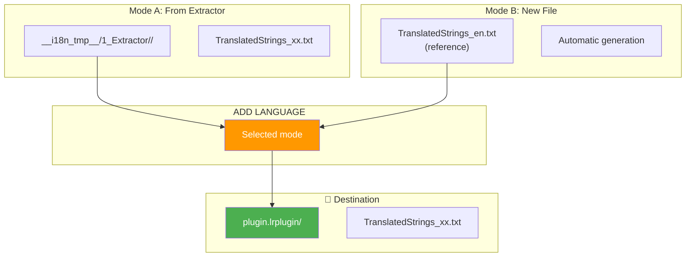
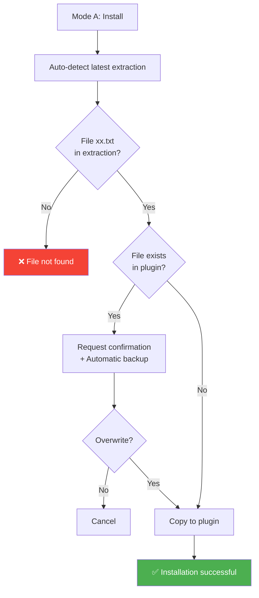
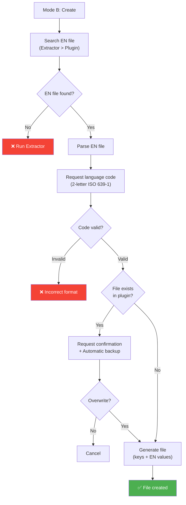
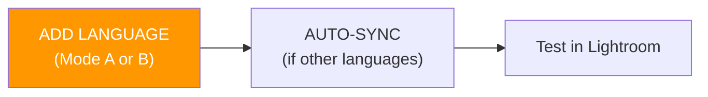
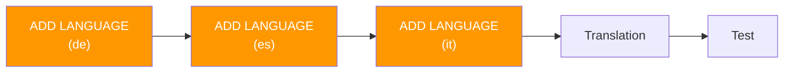

# ADD LANGUAGE Command

📚 **Back to main documentation**: [README.md](../README.md)

---

## 🎯 Objective

**ADD LANGUAGE** allows you to add or reinstall a **specific** language file in the plugin, either from an existing extraction or by creating a new file based on the reference EN file.

> This command solves two common problems:
> 1. **Deferred Installation**: install a language not added during initial installation
> 2. **New Language Preparation**: create files ready to translate to expand multilingual support

---

## 📥 Inputs / 📤 Outputs



| Mode | Input | Output |
|------|--------|--------|
| **Mode A (Install)** | `__i18n_tmp__/1_Extractor/<timestamp>/TranslatedStrings_xx.txt` | `plugin.lrplugin/TranslatedStrings_xx.txt` |
| **Mode B (Create)** | `TranslatedStrings_en.txt` (reference) | `plugin.lrplugin/TranslatedStrings_xx.txt` (new) |

---

## 🔄 How It Works

### Mode A: Install from Extractor



### Mode B: Create New File



### Technical Details

| Aspect | Behavior |
|--------|----------|
| **Language code validation** | Accepts only 2 lowercase letters (ISO 639-1): `fr`, `de`, `es`... |
| **Automatic backup** | Created in `__i18n_tmp__/3_Translator/<timestamp>/backups/` if overwriting |
| **Default values** | Mode B uses EN values (no markers added) |
| **Metadata preservation** | Uses `shutil.copy2()` to preserve modification dates |

---

## 💻 Usage

### Interactive Mode

**Step 1: Main Menu**

```
┌──────────────────────────────────────────────────────────────────┐
│  TRANSLATION MANAGER v6.1                                        │
│  Multilingual Translation Manager                                │
├──────────────────────────────────────────────────────────────────┤
│                                                                  │
│  Essential options:                                              │
│  ──────────────────────────────────────────────────────────────  │
│  1. INSTALL          - First installation                        │
│  2. AUTO-SYNC ⭐     - Automatic maintenance                     │
│  3. ADD LANGUAGE      - Add/reinstall a language                 │  ◄── Select
│                                                                  │
└──────────────────────────────────────────────────────────────────┘
```

**Step 2: ADD LANGUAGE Submenus**

See example sessions below for details on Mode A and Mode B menus.

### CLI Mode

```bash
# Auto mode (tries Extractor then creation)
python Translator_main.py addlang --plugin-path ./plugin.lrplugin --lang de

# Mode A explicit: install from Extractor
python Translator_main.py addlang --plugin-path ./plugin.lrplugin --lang de --mode extraction

# Mode B explicit: create new file
python Translator_main.py addlang --plugin-path ./plugin.lrplugin --lang de --mode create

# Force overwrite without confirmation
python Translator_main.py addlang --plugin-path ./plugin.lrplugin --lang de --force
```

### CLI Options

| Option | Description | Required |
|--------|-------------|----------|
| `--plugin-path` | Path to target plugin | ✅ Yes |
| `--lang` | Language code (2 letters, e.g., `fr`, `de`, `es`) | ✅ Yes |
| `--mode` | Mode: `auto`, `extraction`, `create` | ❌ No (default: `auto`) |
| `--force` | Overwrite without asking | ❌ No |

---

## 📋 Example Sessions

### Example 1: Mode A (Install from Extractor)

```
  ADD LANGUAGE - Add a language to plugin
══════════════════════════════════════════════════════

[INFO] Plugin: piwigoPublish.lrplugin

Currently installed languages:
  ✓ en (TranslatedStrings_en.txt)
  ✓ fr (TranslatedStrings_fr.txt)

──────────────────────────────────────────────────────
Select add mode:
──────────────────────────────────────────────────────

  1. Install from Extractor
     Copy an existing TranslatedStrings_xx.txt file
     → Useful if file already exists in extraction

  2. Create new language file
     Generate new TranslatedStrings_xx.txt based on EN
     → Useful to prepare new language for translation

  0. Back

  Your choice (0-2): 1

══════════════════════════════════════════════════════

  MODE: Install from Extractor
══════════════════════════════════════════════════════

[INFO] Latest extraction detected:
  → 20260202_143000

Languages available in extraction:
  1. en (TranslatedStrings_en.txt) [ALREADY INSTALLED]
  2. fr (TranslatedStrings_fr.txt) [ALREADY INSTALLED]
  3. de (TranslatedStrings_de.txt)
  4. es (TranslatedStrings_es.txt)

Select language to install (number or code): de

✓ File installed: TranslatedStrings_de.txt
  → D:\plugins\piwigoPublish.lrplugin\TranslatedStrings_de.txt

✓ Language de added to plugin
```

### Example 2: Mode B (Create New File)

```
  MODE: Create new language file
══════════════════════════════════════════════════════

[INFO] Reference EN file:
  → Latest extraction: 20260202_143000
  → Total: 145 keys

Code for new language (e.g., de, es, it, pt, ja...): it

──────────────────────────────────────────────────────
File to be created:
  → piwigoPublish.lrplugin/TranslatedStrings_it.txt

Content:
  • 145 keys from reference EN file
  • EN values by default (to translate)

Create this file? (Y/n): Y

✓ File created: TranslatedStrings_it.txt
  → D:\plugins\piwigoPublish.lrplugin\TranslatedStrings_it.txt

[INFO] File contains:
  • 145 keys
  • EN values by default (to translate)

Next steps:
  1. Open TranslatedStrings_it.txt in an editor
  2. Translate values into target language
  3. Test plugin in Lightroom

✓ New language it added to plugin
```

### Example 3: Overwrite with Backup

```
[WARNING] File TranslatedStrings_de.txt already exists in plugin.

Overwrite? (y/N): y

✓ Backup created: __i18n_tmp__/3_Translator/20260202_151000/backups/TranslatedStrings_de.txt.20260202_151000.bak

✓ File installed: TranslatedStrings_de.txt
  → D:\plugins\piwigoPublish.lrplugin\TranslatedStrings_de.txt
```

---

## ⚠️ Special Cases

### Error: Invalid Language Code

```
❌ Invalid language code (must be 2 letters, e.g., fr, de, es)
```

**Cause**: The language code does not follow ISO 639-1 (2 lowercase letters)

**Solution**: Use a valid code from: `fr`, `de`, `es`, `it`, `pt`, `ja`, `ko`, `zh`, `ru`, etc.

### Error: EN File Not Found

```
❌ No reference EN file found

Verify that:
  - Extractor has been run
  - TranslatedStrings_en.txt exists in plugin
```

**Cause**: No EN file available to generate new file

**Solution**: Run **Extractor** then **INSTALL** before using ADD LANGUAGE

### Error: File Not Found in Extraction

```
❌ File TranslatedStrings_de.txt not found in extraction
  → __i18n_tmp__/1_Extractor/20260202_143000/
```

**Cause**: The requested language does not exist in extraction

**Solution**: Use **Mode B** to create new file based on EN

---

## 🆚 Mode Comparison

| Aspect | Mode A (Install) | Mode B (Create) |
|--------|------------------|-----------------|
| **Source** | Extractor extraction | Reference EN file |
| **Condition** | File exists in extraction | EN file available |
| **Result** | Identical copy | Generation with EN values |
| **Use case** | Retrieve existing file | Prepare new language |
| **Translations** | Already present | To be done (EN values) |

---

## 🆚 ADD LANGUAGE vs INSTALL

| Aspect | ADD LANGUAGE | INSTALL |
|--------|--------------|---------|
| **Files processed** | Single (selection) | All automatically |
| **Granularity** | ✅ Precise choice | ❌ Bulk installation |
| **Create new** | ✅ Yes (Mode B) | ❌ No |
| **Use case** | Targeted add/reinstall | Initial global installation |

---

## 🔗 Related Commands

| Command | Link | Relation |
|---------|------|----------|
| **INSTALL** | [INSTALL.md](INSTALL.md) | Initial installation (all files) |
| **AUTO-SYNC** | [AUTOSYNC.md](AUTOSYNC.md) | Update after adding |
| **SYNC** | [SYNC.md](SYNC.md) | Manual synchronization |

---

## 💡 Recommended Workflow

### Scenario 1: Add Missing Language



### Scenario 2: Prepare Multiple New Languages



---

## 📚 Resources

| Element | Information |
|---------|-------------|
| Source module | `TM_addlang.py` |
| Main function (CLI) | `run_addlang_cli()` |
| Interactive menu | `menu_addlang()` |
| Mode A function | `install_language_from_extraction()` |
| Mode B function | `create_language_from_reference()` |
| Validation | `validate_language_code()` (ISO 639-1) |

---

| 📜 | Traceability |  |  |
|--|--|--|--|
| **Name** | *ADDLANG.md* | **Version** | 1.0 |
| **Type** | User Guide - Advanced | **Language** | EN - *[FR](../../fr/commands/ADDLANG.md)* |
| **GitHub Project** | [Adobe Lightroom Translation Toolkit](https://github.com/Gotcha26/Adobe_Lightroom_Translation_Plugins_Kit) | **Date** | 2026-02-02 |
| **License** | Open source | | |
