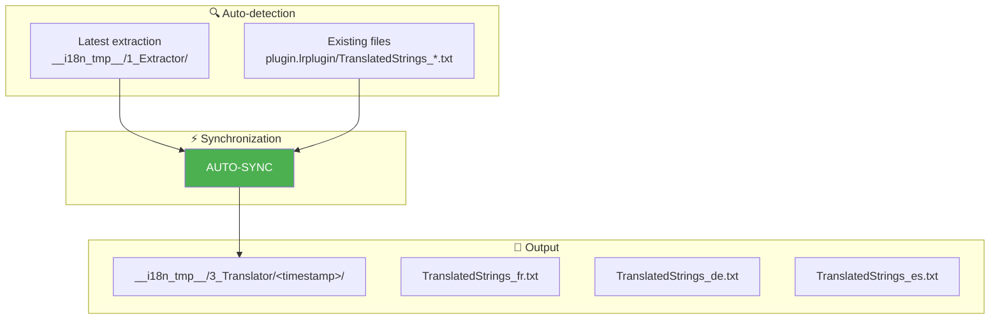
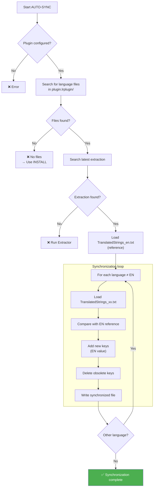

# AUTO-SYNC Command ⭐

📚 **Back to main documentation**: [README.md](../README.md)

---

## 🎯 Objective

**AUTO-SYNC** is the **star** command of the toolkit. It automatically synchronizes **all** existing language files with the latest extraction, in a single command.

> This is THE command to use for daily maintenance — it advantageously replaces the COMPARE → EXTRACT → INJECT → SYNC workflow.

---

## 📥 Inputs / 📤 Outputs



| Type | Description |
|------|-------------|
| **Input (reference)** | `__i18n_tmp__/1_Extractor/<latest>/TranslatedStrings_en.txt` |
| **Input (to sync)** | `plugin.lrplugin/TranslatedStrings_*.txt` (except _en) |
| **Output** | `__i18n_tmp__/3_Translator/<timestamp>/TranslatedStrings_*.txt` |

---

## 🔄 How It Works

### Complete Algorithm



### What AUTO-SYNC Does

For each language file (fr, de, es...):

| Action | Description |
|--------|-------------|
| **Addition** | New keys → EN value by default |
| **Preservation** | Existing translations → preserved |
| **Deletion** | Obsolete keys → removed |

> **Important Note**: AUTO-SYNC does **not** generate `[NEW]` or `[NEEDS_REVIEW]` markers. These markers are reserved for the advanced workflow COMPARE → SYNC.

---

## 💻 Usage

### Interactive Mode

```
┌──────────────────────────────────────────────────────────────────┐
│  TRANSLATION MANAGER v7.0                                        │
├──────────────────────────────────────────────────────────────────┤
│                                                                  │
│  2. AUTO-SYNC ⭐ (maintenance)                                   │  ◄── Select
│     Automatic synchronization of all language files              │
│     → Detects latest extraction and synchronizes everything      │
│                                                                  │
└──────────────────────────────────────────────────────────────────┘
```

### CLI Mode

```bash
python Translator_main.py autosync --plugin-path ./plugin.lrplugin
```

### CLI Options

| Option | Description | Required |
|--------|-------------|----------|
| `--plugin-path` | Path to plugin | ✅ Yes |

---

## 📋 Example Session

```
  AUTO-SYNC - Automatic Synchronization
══════════════════════════════════════════════════════

[INFO] Translation files detected:
  - TranslatedStrings_en.txt
  - TranslatedStrings_fr.txt
  - TranslatedStrings_de.txt

[INFO] Latest extraction:
  20260201_150000
  Reference: TranslatedStrings_en.txt

Automatic synchronization:
  - Adds new keys (in English)
  - Replaces modified keys (in English)
  - Deletes obsolete keys
  - Preserves existing translations

Run synchronization? (Y/n): Y

══════════════════════════════════════════════════════
Synchronization in progress...
══════════════════════════════════════════════════════

► Language: fr
  ✓ 15 added, 3 modified, 2 deleted

► Language: de
  ✓ 15 added, 3 modified, 2 deleted

══════════════════════════════════════════════════════

✓ 2 file(s) synchronized:
  fr: D:\...\__i18n_tmp__\3_Translator\20260201_151000\TranslatedStrings_fr.txt
  de: D:\...\__i18n_tmp__\3_Translator\20260201_151000\TranslatedStrings_de.txt

Next steps:
  1. Copy the synchronized files to the plugin:
     cp __i18n_tmp__/3_Translator/20260201_151000/TranslatedStrings_*.txt plugin.lrplugin/

  2. Search for English keys (new or modified)
  3. Translate the affected keys
  4. Commit changes (if GitHub workflow)
```

---

## 📊 Generated Report

AUTO-SYNC displays a summary report for each language:

| Metric | Description |
|--------|-------------|
| **Added** | Keys present in EN but not in the language |
| **Modified** | Keys whose EN value has changed (not marked) |
| **Deleted** | Keys present in language but no longer in EN |

---

## 🆚 AUTO-SYNC vs SYNC

| Aspect | AUTO-SYNC | SYNC |
|--------|-----------|------|
| **Files processed** | All automatically | Single (manual) |
| **Source detection** | Auto (latest extraction) | Manual |
| **[NEW] markers** | ❌ No | ✅ Yes (if COMPARE) |
| **Use case** | Daily maintenance | Advanced workflow |

---

## 🔗 Related Commands

| Command | Link | Relation |
|---------|------|----------|
| **INSTALL** | [INSTALL.md](INSTALL.md) | First installation |
| **SYNC** | [SYNC.md](SYNC.md) | Manual version |
| **COMPARE** | [COMPARE.md](COMPARE.md) | For detailed markers |

---

## 📚 Resources

| Element | Information |
|---------|-------------|
| Source module | `TM_autosync.py` |
| Main function | `run_autosync()` |
| Interactive menu | `menu_autosync()` |

---

| 📜 | Traceability |  |  |
|--|--|--|--|
| **Name** | *AUTOSYNC.md* | **Version** | 1.0 |
| **Type** | User Guide - Advanced | **Language** | EN - *[FR](../../fr/commands/AUTOSYNC.md)* |
| **GitHub Project** | [Adobe Lightroom Translation Toolkit](https://github.com/Gotcha26/Adobe_Lightroom_Translation_Plugins_Kit) | **Date** | 2026-02-02 |
| **License** | Open source | | |
