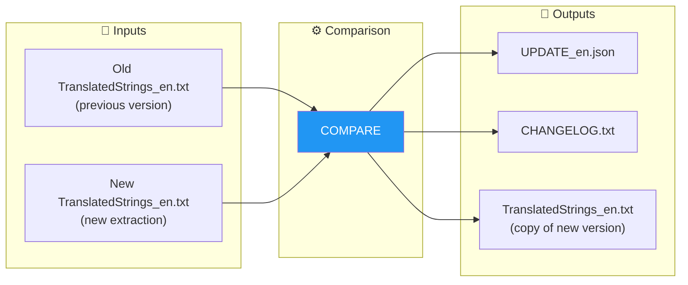
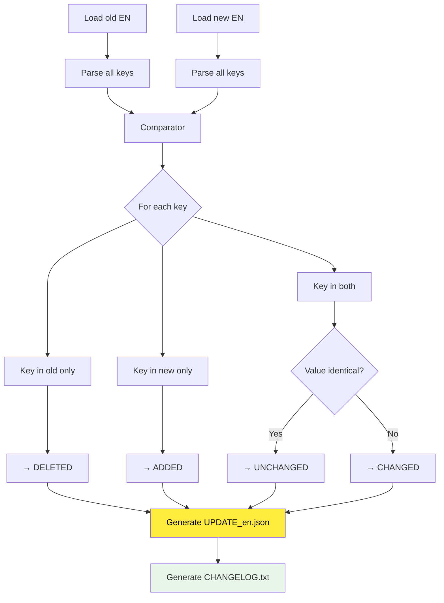

# COMPARE Command

📚 **Back to main documentation**: [README.md](../README.md)

---

## 🎯 Objective

**COMPARE** analyzes the differences between two versions of the English file (`TranslatedStrings_en.txt`) and generates a structured report of changes.

> This command is the first step of the advanced workflow. It is optional if you use **AUTO-SYNC**.

---

## 📥 Inputs / 📤 Outputs



| Type | Files |
|------|-------|
| **Input** | Old `TranslatedStrings_en.txt` |
| **Input** | New `TranslatedStrings_en.txt` |
| **Output** | `UPDATE_en.json` (structured data) |
| **Output** | `CHANGELOG.txt` (readable report) |
| **Output** | `TranslatedStrings_en.txt` (reference copy) |

---

## 🔄 How It Works

### Comparison Algorithm



### Change Categories

| Category | Description | Impact |
|----------|-------------|--------|
| **ADDED** | New keys | To translate in all languages |
| **CHANGED** | EN value modified | Translation review suggested |
| **DELETED** | Deleted keys | To be removed from language files |
| **UNCHANGED** | No changes | Nothing to do |

---

## 💻 Usage

### Interactive Mode

```
┌──────────────────────────────────────────────────────────────────┐
│  TRANSLATION MANAGER v7.0                                        │
├──────────────────────────────────────────────────────────────────┤
│                                                                  │
│  3. COMPARE                                                      │  ◄── Select
│     Compare old EN vs new EN                                     │
│     → Generates UPDATE_en.json + CHANGELOG.txt                   │
│                                                                  │
└──────────────────────────────────────────────────────────────────┘
```

The menu then asks:
1. Path to **old** file (or directory containing it)
2. Path to **new** file (or directory containing it)

### CLI Mode

```bash
# Compare two files
python Translator_main.py compare --old ./v1/TranslatedStrings_en.txt --new ./v2/TranslatedStrings_en.txt

# Compare two directories (auto-detection of EN file)
python Translator_main.py compare --old ./old_extraction/ --new ./new_extraction/

# With output in __i18n_tmp__
python Translator_main.py compare --old ./old.txt --new ./new.txt --plugin-path ./plugin.lrplugin

# Custom output
python Translator_main.py compare --old ./old.txt --new ./new.txt --output ./my_output/
```

### CLI Options

| Option | Description | Required |
|--------|-------------|----------|
| `--old` | Old EN file (or directory) | ✅ Yes |
| `--new` | New EN file (or directory) | ✅ Yes |
| `--plugin-path` | Output in `__i18n_tmp__/3_Translator/` | ❌ No |
| `--output` | Custom output directory | ❌ No |

---

## 📋 Example Session

```
COMPARE: Compare two EN versions
══════════════════════════════════════════════════════

OLD file (TranslatedStrings_en.txt or directory):
  > ./plugin.lrplugin/TranslatedStrings_en.txt

NEW file (TranslatedStrings_en.txt or directory):
  > ./plugin.lrplugin/__i18n_tmp__/1_Extractor/20260201_150000/

[INFO] Comparison in progress...

══════════════════════════════════════════════════════
  SUMMARY
══════════════════════════════════════════════════════
  Keys added      :   15  [NEW]
  Keys modified   :    3  [CHANGED]
  Keys deleted    :    2  [DELETED]
  Keys unchanged  :  130

✓ Files generated in: __i18n_tmp__/3_Translator/20260201_151234/
    • UPDATE_en.json
    • CHANGELOG.txt
    • TranslatedStrings_en.txt

[INFO] NEXT STEP:
  • Run EXTRACT to generate translation files
  • or SYNC directly to use EN by default
```

---

## 📁 Format of Generated Files

### UPDATE_en.json

```json
{
  "generated": "2026-02-01T15:12:34",
  "old_file": "/path/to/old/TranslatedStrings_en.txt",
  "new_file": "/path/to/new/TranslatedStrings_en.txt",
  "summary": {
    "added": 15,
    "changed": 3,
    "deleted": 2,
    "unchanged": 130,
    "total_old": 135,
    "total_new": 148
  },
  "added": {
    "$$$/Plugin/NewFeature/Title": "New Feature",
    "$$$/Plugin/NewFeature/Description": "This is a new feature"
  },
  "changed": {
    "$$$/Plugin/Settings/Help": {
      "old": "Click here for help",
      "new": "Click here to get help"
    }
  },
  "deleted": [
    "$$$/Plugin/OldFeature/Title",
    "$$$/Plugin/OldFeature/Button"
  ],
  "unchanged_keys": ["$$$/Plugin/Dialog/OK", "..."],
  "all_new_strings": {
    "$$$/Plugin/Dialog/OK": "OK",
    "...": "..."
  }
}
```

### CHANGELOG.txt

```
================================================================================
CHANGELOG - EN Translation Modifications
================================================================================

Date: 2026-02-01 15:12:34
Old: ./old/TranslatedStrings_en.txt
New: ./new/TranslatedStrings_en.txt

--------------------------------------------------------------------------------
SUMMARY
--------------------------------------------------------------------------------
  Keys added      :   15  [NEW]
  Keys modified   :    3  [CHANGED]
  Keys deleted    :    2  [DELETED]
  Keys unchanged  :  130

================================================================================
ADDED KEYS (15)
These keys must be translated in all languages.
================================================================================

  [NEW] $$$/Plugin/NewFeature/Title
        EN: New Feature

  [NEW] $$$/Plugin/NewFeature/Description
        EN: This is a new feature

================================================================================
MODIFIED KEYS (3)
The English text has changed. Translations should be reviewed.
================================================================================

  [CHANGED] $$$/Plugin/Settings/Help
        BEFORE: Click here for help
        AFTER: Click here to get help

================================================================================
DELETED KEYS (2)
These keys no longer exist and will be removed from translations.
================================================================================

  [DELETED] $$$/Plugin/OldFeature/Title
  [DELETED] $$$/Plugin/OldFeature/Button

================================================================================
NEXT STEP
================================================================================
Run EXTRACT then INJECT, or directly SYNC:
  python Translator_main.py extract --update ./20260201_151234
  python Translator_main.py sync --update ./20260201_151234
```

---

## 🔗 Related Commands

| Command | Link | Relation |
|---------|------|----------|
| **EXTRACT** | [EXTRACT.md](EXTRACT.md) | Next step (partial files) |
| **SYNC** | [SYNC.md](SYNC.md) | Direct alternative |
| **AUTO-SYNC** | [AUTOSYNC.md](AUTOSYNC.md) | Replaces this workflow |

---

## 📚 Resources

| Element | Information |
|---------|-------------|
| Source module | `TM_compare.py` |
| Main class | `VersionComparator` |
| Main function | `run_compare()` |
| Interactive menu | `menu_compare()` |

---

| 📜 | Traceability |  |  |
|--|--|--|--|
| **Name** | *COMPARE.md* | **Version** | 1.0 |
| **Type** | User Guide - Advanced | **Language** | EN - *[FR](../../fr/commands/COMPARE.md)* |
| **GitHub Project** | [Adobe Lightroom Translation Toolkit](https://github.com/Gotcha26/Adobe_Lightroom_Translation_Plugins_Kit) | **Date** | 2026-02-02 |
| **License** | Open source | | |
