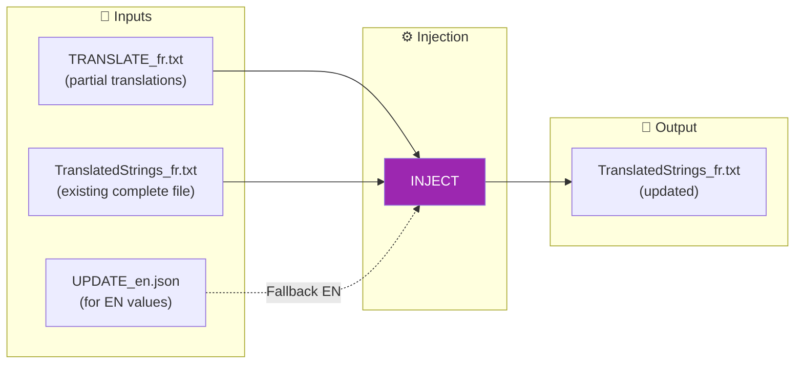
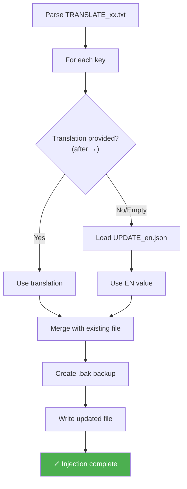

# INJECT Command

📚 **Back to main documentation**: [README.md](../README.md)

---

## 🎯 Objective

**INJECT** reinjects translations from `TRANSLATE_xx.txt` files back into complete `TranslatedStrings_xx.txt` files. It automatically handles fallback to the English value for untranslated keys.

> This command is part of the advanced workflow. It requires running **EXTRACT** beforehand.

---

## 📥 Inputs / 📤 Outputs



| Type | Files |
|------|-------|
| **Input** | `TRANSLATE_xx.txt` (translations) |
| **Input** | Existing `TranslatedStrings_xx.txt` |
| **Input** | `UPDATE_en.json` (EN values for fallback) |
| **Output** | Updated `TranslatedStrings_xx.txt` |

---

## 🔄 How It Works

### Injection Algorithm



### Fallback Mechanism

| Situation | Action |
|-----------|--------|
| `[FR] → Hello` | Uses "Hello" |
| `[FR] →` (empty) | Uses EN value from `UPDATE_en.json` |
| `[FR] → ` (spaces) | Uses EN value |

> **Important**: The EN fallback ensures that all keys have a value, even if untranslated.

---

## 💻 Usage

### Interactive Mode

```
┌──────────────────────────────────────────────────────────────────┐
│  TRANSLATION MANAGER v7.0                                        │
├──────────────────────────────────────────────────────────────────┤
│                                                                  │
│  5. INJECT (optional)                                            │  ◄── Select
│     Reinject translations (EN by default if empty)               │
│                                                                  │
└──────────────────────────────────────────────────────────────────┘
```

The menu offers two modes:
1. **Single File**: One `TRANSLATE_xx.txt` to one `TranslatedStrings_xx.txt`
2. **Batch**: All `TRANSLATE_*.txt` from a folder

### CLI Mode

```bash
# Single file
python Translator_main.py inject --translate ./TRANSLATE_fr.txt --target ./TranslatedStrings_fr.txt

# Batch (all TRANSLATE_*.txt)
python Translator_main.py inject --translate-dir ./20260201_151234 --locales ./plugin.lrplugin

# With auto-detection (plugin-path)
python Translator_main.py inject --plugin-path ./plugin.lrplugin --locales ./plugin.lrplugin

# Specify UPDATE folder for EN fallback
python Translator_main.py inject --translate-dir ./translations --locales ./plugin.lrplugin --update ./20260201_151234
```

### CLI Options

| Option | Description | Required |
|--------|-------------|----------|
| `--translate` | Single TRANSLATE_xx.txt file | File mode |
| `--target` | Target TranslatedStrings_xx.txt file | File mode |
| `--translate-dir` | Folder containing TRANSLATE_*.txt | Batch mode |
| `--locales` | Folder of language files | Batch mode |
| `--plugin-path` | Auto-detection of Translator folder | ❌ No |
| `--update` | UPDATE folder for EN values | ❌ No |

---

## 📋 Example Session

### Single File Mode

```
INJECT: Reinject translations
══════════════════════════════════════════════════════

⚠️ Untranslated keys (→ empty) will receive the EN value

Mode:
  1. Inject a specific TRANSLATE_xx.txt file
  2. Inject all TRANSLATE_*.txt files from a folder

  Choice (1-2): 1

TRANSLATE_xx.txt file:
  > ./20260201_151234/TRANSLATE_fr.txt

Target TranslatedStrings_xx.txt file:
  > ./plugin.lrplugin/TranslatedStrings_fr.txt

UPDATE folder (containing UPDATE_en.json):
  (Enter = same folder as TRANSLATE)
  >

[INFO] Injection in progress...

══════════════════════════════════════════════════════
  RESULT
══════════════════════════════════════════════════════
  Translations injected    : 12
  EN default values        : 6
  Ignored entries          : 0
  Total keys in file       : 148

✓ File updated: ./plugin.lrplugin/TranslatedStrings_fr.txt
  (.bak backup created)
```

### Batch Mode

```
INJECT: Reinject translations
══════════════════════════════════════════════════════

  Choice (1-2): 2

Folder containing TRANSLATE_*.txt files:
  > ./20260201_151234

Directory of language files (Locales):
  > ./plugin.lrplugin

[INFO] Injection in progress...

══════════════════════════════════════════════════════
  RESULT
══════════════════════════════════════════════════════
  [FR] [OK]: 12 translated + 6 EN default
  [DE] [OK]: 8 translated + 10 EN default

✓ Files updated (.bak backups created)
```

---

## 📊 Returned Statistics

| Metric | Description |
|--------|-------------|
| **Translations injected** | Keys with translation provided |
| **EN default values** | Keys without translation (fallback) |
| **Ignored entries** | Keys not processed (errors) |
| **Total keys** | Total number in final file |

---

## ⚠️ Points of Attention

### Automatic Backup

Before each modification, a `.bak` file is created:
```
TranslatedStrings_fr.txt      ← Updated file
TranslatedStrings_fr.txt.bak  ← Automatic backup
```

### Smart Merging

INJECT **merges** translations, it doesn't replace the whole file:
- Existing keys are preserved
- Only keys from the TRANSLATE file are updated
- New keys are added

---

## 🔗 Related Commands

| Command | Link | Relation |
|---------|------|----------|
| **EXTRACT** | [EXTRACT.md](EXTRACT.md) | Previous step |
| **SYNC** | [SYNC.md](SYNC.md) | Next step |
| **AUTO-SYNC** | [AUTOSYNC.md](AUTOSYNC.md) | Simple alternative |

---

## 📚 Resources

| Element | Information |
|---------|-------------|
| Source module | `TM_inject.py` |
| File parser | `parse_translate_file()` |
| Main function | `run_inject()` |
| Batch function | `run_inject_from_dir()` |
| Interactive menu | `menu_inject()` |

---

| 📜 | Traceability |  |  |
|--|--|--|--|
| **Name** | *INJECT.md* | **Version** | 1.0 |
| **Type** | User Guide - Advanced | **Language** | EN - *[FR](../../fr/commands/INJECT.md)* |
| **GitHub Project** | [Adobe Lightroom Translation Toolkit](https://github.com/Gotcha26/Adobe_Lightroom_Translation_Plugins_Kit) | **Date** | 2026-02-02 |
| **License** | Open source | | |
