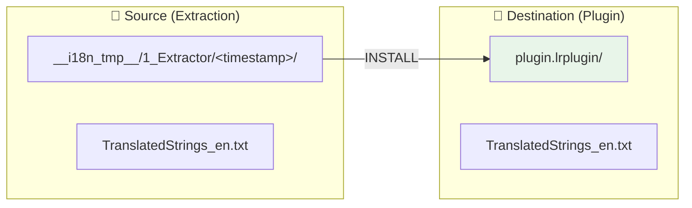
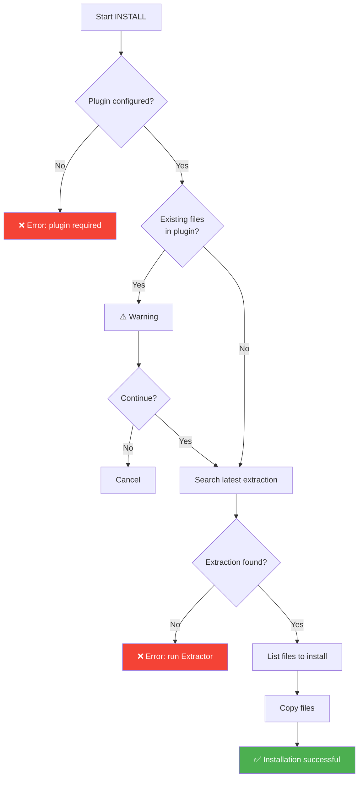

# INSTALL Command

📚 **Back to main documentation**: [README.md](../README.md)

---

## 🎯 Objective

**INSTALL** copies translation files from the latest ***Extractor*** extraction to the plugin root, making them active for Lightroom.

> This command is intended for the **first installation** of the multilingual system on a plugin.

---

## 📥 Inputs / 📤 Outputs



| Type | Files |
|------|-------|
| **Input** | `__i18n_tmp__/1_Extractor/<timestamp>/TranslatedStrings_*.txt` |
| **Output** | `plugin.lrplugin/TranslatedStrings_*.txt` |

---

## 🔄 How It Works

### Algorithm



### Technical Details

1. **Plugin Validation**: Verifies that the path is valid and accessible
2. **Existing File Detection**: If `TranslatedStrings_*.txt` files already exist, a warning is displayed
3. **Auto-detection of Extraction**: Searches for the most recent folder in `__i18n_tmp__/1_Extractor/`
4. **File Copy**: Uses `shutil.copy2()` to preserve metadata

---

## 💻 Usage

### Interactive Mode

```
┌──────────────────────────────────────────────────────────────────┐
│  TRANSLATION MANAGER v7.0                                        │
│  Multilingual Translation Manager                                │
├──────────────────────────────────────────────────────────────────┤
│                                                                  │
│  1. INSTALL (first installation)                                 │  ◄── Select
│     Copy TranslatedStrings_xx.txt from Extractor to plugin       │
│                                                                  │
└──────────────────────────────────────────────────────────────────┘
```

### CLI Mode

```bash
# Standard installation
python Translator_main.py install --plugin-path ./plugin.lrplugin

# From a specific source folder
python Translator_main.py install --plugin-path ./plugin.lrplugin --source ./custom_extraction/
```

### CLI Options

| Option | Description | Required |
|--------|-------------|----------|
| `--plugin-path` | Path to target plugin | ✅ Yes |
| `--source` | Custom source folder | ❌ No (auto-detection) |
| `--dry-run` | Simulation without copy | ❌ No |

---

## 📋 Example Session

```
  INSTALL - Installation of translation files
══════════════════════════════════════════════════════

[INFO] Latest extraction:
  20260201_143000

Files to install:
  - TranslatedStrings_en.txt

Install these files in the plugin? (Y/n): Y

✓ Installation successful!

Files installed:
  TranslatedStrings_en.txt
    → D:\plugins\myplugin.lrplugin\TranslatedStrings_en.txt

Next steps:
  1. Run Applicator to replace hardcoded strings with LOC()
  2. Test the plugin in Lightroom
  3. Create copies for other languages (TranslatedStrings_fr.txt, etc.)
```

---

## ⚠️ Special Cases

### Existing Files

If translation files already exist in the plugin:

```
⚠️ Translation files already exist:
  - TranslatedStrings_en.txt
  - TranslatedStrings_fr.txt

This command is intended for plugin initialization.
To update existing files, use SYNC or AUTO-SYNC.

Continue anyway? (y/N):
```

> **Recommendation**: Use **AUTO-SYNC** for regular maintenance.

### No Extraction Found

```
❌ No extraction found.

Run Extractor first to generate TranslatedStrings_en.txt
```

---

## 🔗 Related Commands

| Command | Link | Relation |
|---------|------|----------|
| **AUTO-SYNC** | [AUTOSYNC.md](AUTOSYNC.md) | Alternative for updates |
| **SYNC** | [SYNC.md](SYNC.md) | Manual synchronization |

---

## 📚 Resources

| Element | Information |
|---------|-------------|
| Source module | `TM_install.py` |
| Main function | `run_install()` |
| Interactive menu | `menu_install()` |

---

| 📜 | Traceability |  |  |
|--|--|--|--|
| **Name** | *INSTALL.md* | **Version** | 1.0 |
| **Type** | User Guide - Advanced | **Language** | EN - *[FR](../../fr/commands/INSTALL.md)* |
| **GitHub Project** | [Adobe Lightroom Translation Toolkit](https://github.com/Gotcha26/Adobe_Lightroom_Translation_Plugins_Kit) | **Date** | 2026-02-02 |
| **License** | Open source | | |
