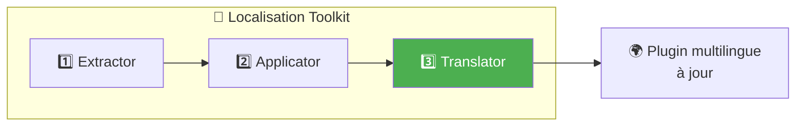
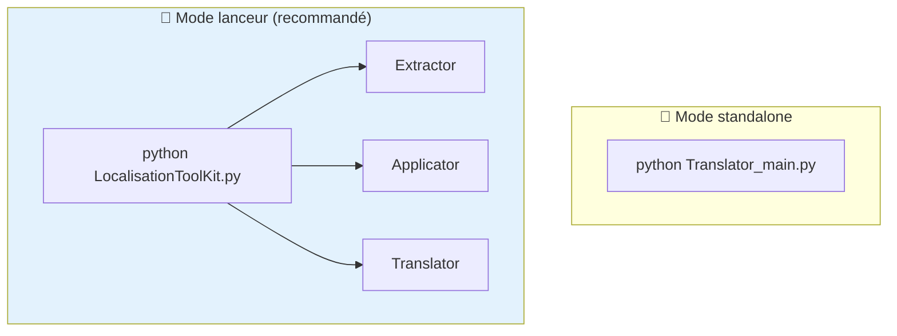
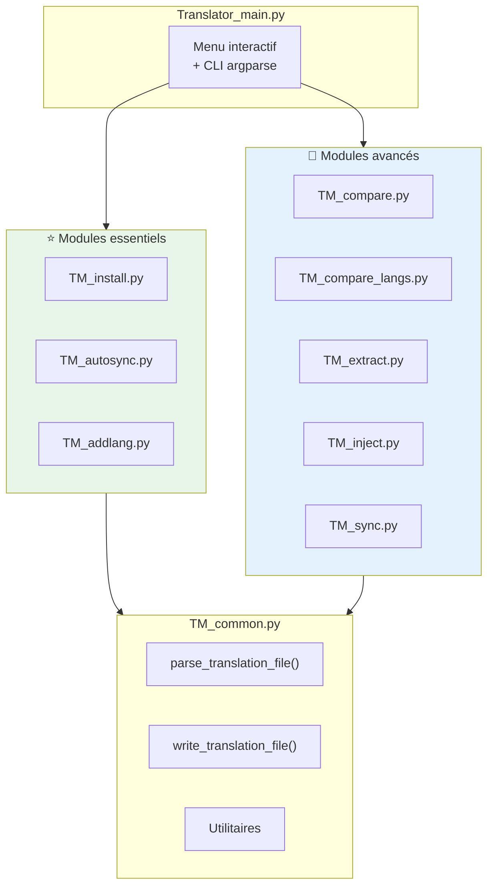
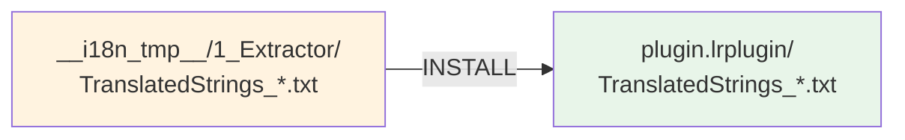
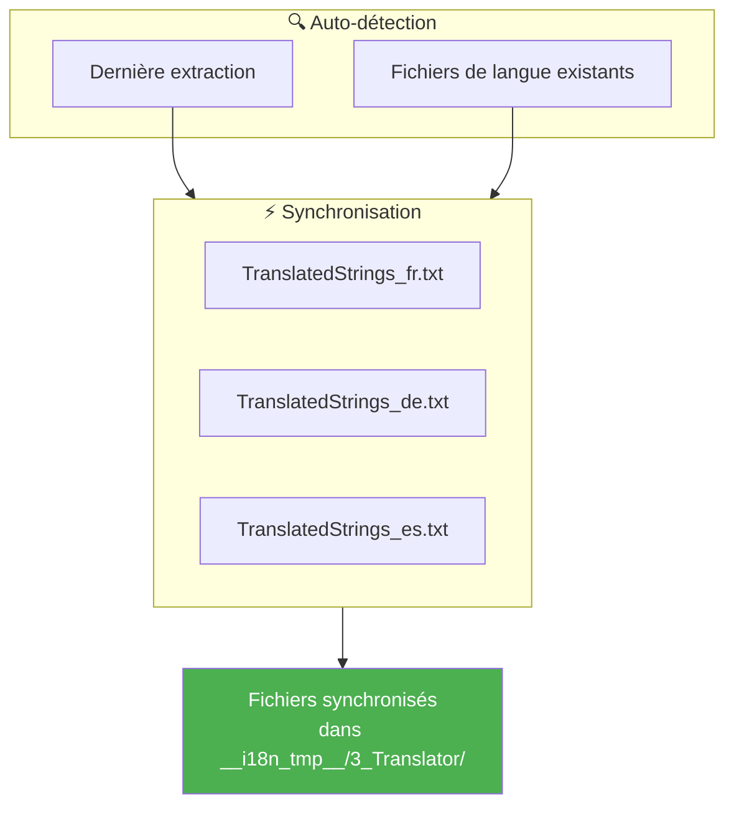
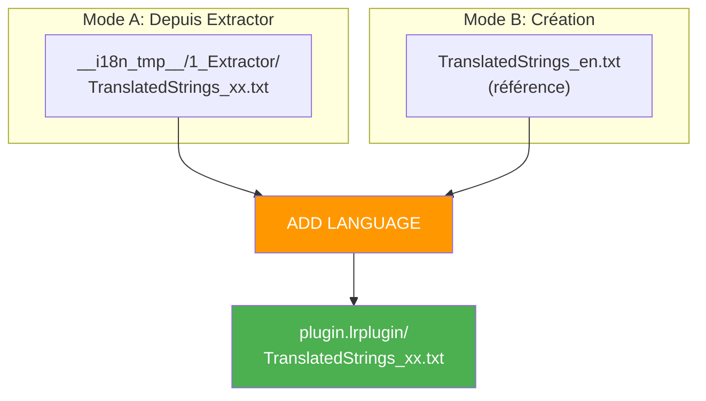
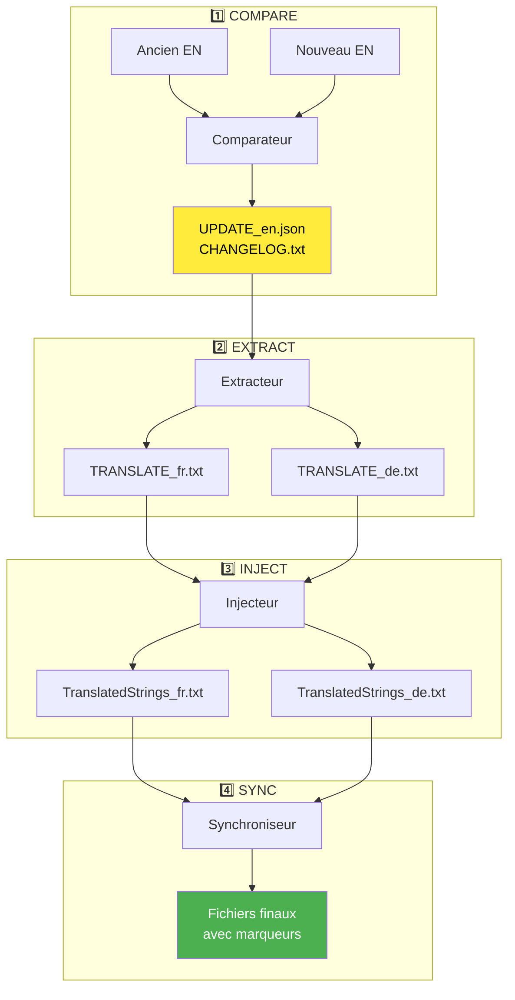
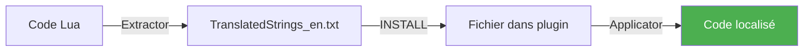
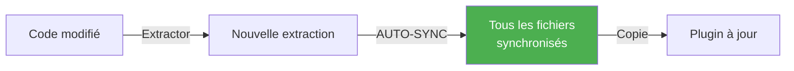
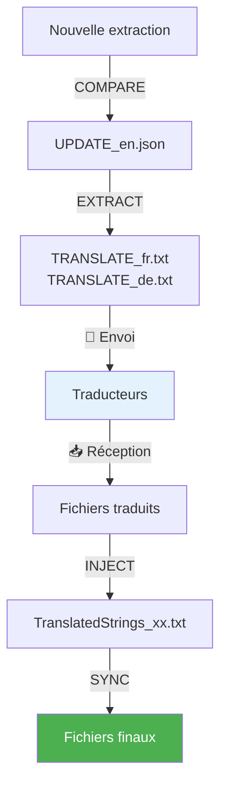

# Translator - Documentation technique

Ce document présente ***Translator***, le gestionnaire de traductions multilingues du toolkit. Il orchestre la synchronisation entre les fichiers de langue et accompagne l'évolution des traductions au fil du temps.

> **Public cible** : Développeurs de plugins Lightroom et contributeurs avancés souhaitant gérer les traductions de manière efficace.

---

### Plan du document

1. [Vue d'ensemble](#-vue-densemble) — Rôle et positionnement
2. [Installation et prérequis](#-installation-et-prérequis) — Ce qu'il faut pour démarrer
3. [Architecture](#-architecture) — Structure modulaire
4. [Commandes principales](#-commandes-principales) — INSTALL et AUTO-SYNC
5. [Commandes avancées](#-commandes-avancées) — COMPARE, COMPARE-LANGS, EXTRACT, INJECT, SYNC
6. [Workflows recommandés](#-workflows-recommandés) — Cas d'usage typiques
7. [Format des fichiers](#-format-des-fichiers) — Structure et conventions
8. [Utilisation CLI](#-utilisation-cli) — Ligne de commande
9. [Changelog](#-changelog---suivi-des-modifications)

---

## 🎯 Vue d'ensemble

***Translator*** est le **troisième maillon** de la chaîne de localisation. Après l'extraction des chaînes (***Extractor***) et leur application dans le code (***Applicator***), il gère la **maintenance continue** des fichiers de traduction.



### Problématique résolue

Lors du développement d'un plugin, les textes évoluent :
- Nouvelles fonctionnalités → **nouvelles clés**
- Reformulations → **clés modifiées**
- Fonctionnalités retirées → **clés obsolètes**

***Translator*** détecte ces changements et propage les mises à jour vers tous les fichiers de langue, tout en préservant les traductions existantes.

---

## 🛠 Installation et prérequis

### Prérequis

- **Python 3.8+** installé sur votre système
- ***Extractor*** et/ou ***Applicator*** doivent avoir été exécutés (selon le workflow)
- Aucune dépendance externe requise (bibliothèque standard uniquement)

### Structure des fichiers

```
3_Translator/
├── Translator_main.py      ← Point d'entrée (menu + CLI)
├── TM_common.py            ← Fonctions communes (parser, utils)
├── TM_install.py           ← Commande INSTALL
├── TM_autosync.py          ← Commande AUTO-SYNC ⭐
├── TM_addlang.py           ← Commande ADD LANGUAGE
├── TM_compare.py           ← Commande COMPARE (avancé)
├── TM_compare_langs.py     ← Commande COMPARE-LANGS (avancé)
├── TM_extract.py           ← Commande EXTRACT (avancé)
├── TM_inject.py            ← Commande INJECT (avancé)
├── TM_sync.py              ← Commande SYNC (avancé)
└── __doc/
    └── fr/
        ├── Lisez-moi.md    ← Ce fichier
        └── commandes/
            ├── INSTALL.md
            ├── AUTOSYNC.md
            ├── ADDLANG.md
            ├── COMPARE.md
            ├── COMPARE-LANGS.md
            ├── EXTRACT.md
            ├── INJECT.md
            └── SYNC.md
```

### Utilisation standalone vs lanceur du toolkit

***Translator*** peut fonctionner de manière **indépendante** en ligne de commande :

```bash
python Translator_main.py
```

Cependant, l'utilisation via ***LocalisationToolKit.py*** est recommandée car :
- Le chemin du plugin est conservé en mémoire
- La navigation entre outils est fluide
- Les sorties sont centralisées dans `__i18n_tmp__/`



---

## 🏗 Architecture

### Architecture modulaire

Chaque commande est implémentée dans son propre module `TM_*.py`. Cette conception permet :
- Une maintenance ciblée
- Des tests unitaires isolés
- Une utilisation indépendante via import Python



---

## ⭐ Commandes essentielles

Ces trois commandes couvrent **99% des cas d'usage**. Elles sont conçues pour être simples et rapides.

### INSTALL — Première installation

📄 **Documentation complète** : [commandes/INSTALL.md](commandes/INSTALL.md)

Copie **tous** les fichiers `TranslatedStrings_xx.txt` depuis l'extraction vers la racine du plugin.



**Quand l'utiliser** : Première mise en place du multilingue sur un plugin (installation en bloc).

---

### AUTO-SYNC — Synchronisation automatique ⭐

📄 **Documentation complète** : [commandes/AUTOSYNC.md](commandes/AUTOSYNC.md)

Synchronise automatiquement **tous** les fichiers de langue existants avec la dernière extraction.



**Quand l'utiliser** : Après chaque modification du code nécessitant une mise à jour des traductions.

> **C'est LA commande à utiliser au quotidien !** Elle remplace avantageusement le workflow COMPARE → EXTRACT → INJECT → SYNC.

---

### ADD LANGUAGE — Ajout/réinstallation d'une langue

📄 **Documentation complète** : [commandes/ADDLANG.md](commandes/ADDLANG.md)

Ajoute ou réinstalle **un seul** fichier de langue, soit depuis l'extraction, soit en créant un nouveau fichier.



**Quand l'utiliser** :
- Installation différée d'une langue non installée initialement
- Préparation de nouveaux fichiers de langue pour étendre le support multilingue
- Réinstallation d'un fichier de langue corrompu ou supprimé

---

## 🔧 Commandes avancées

Ces commandes offrent un contrôle fin pour des cas d'usage spécifiques (traducteurs externes, changelogs détaillés, etc.).

| Commande | Documentation | Rôle |
|----------|---------------|------|
| **COMPARE** | [COMPARE.md](commandes/COMPARE.md) | Compare 2 versions EN → génère `UPDATE_en.json` |
| **COMPARE-LANGS** | [COMPARE-LANGS.md](commandes/COMPARE-LANGS.md) | Compare 2 fichiers de langues (audit, cohérence) |
| **EXTRACT** | [EXTRACT.md](commandes/EXTRACT.md) | Génère fichiers partiels `TRANSLATE_xx.txt` |
| **INJECT** | [INJECT.md](commandes/INJECT.md) | Réinjecte les traductions dans les fichiers complets |
| **SYNC** | [SYNC.md](commandes/SYNC.md) | Synchronise un fichier de langue avec EN |

### Flux de données avancé



---

## 🚀 Workflows recommandés

### Workflow 1 : Initialisation (première fois)



**Étapes** :
1. Lancer ***Extractor*** pour générer les clés
2. Lancer **INSTALL** pour copier dans le plugin
3. Lancer ***Applicator*** pour remplacer les chaînes en dur
4. Créer les fichiers pour autres langues (copie de `_en.txt`)

---

### Workflow 2 : Maintenance quotidienne ⭐



**Étapes** :
1. Développer normalement
2. Lancer ***Extractor***
3. Lancer **AUTO-SYNC** — une commande, tout est fait !
4. Copier les fichiers générés dans le plugin

> C'est le workflow **recommandé pour 99% des cas**.

---

### Workflow 3 : Avec traducteurs externes



**Quand l'utiliser** : Collaboration avec des traducteurs n'ayant pas accès au dépôt Git.

---

## 📁 Format des fichiers

### TranslatedStrings_xx.txt

Format standard du SDK Lightroom :

```
-- =============================================================================
-- Plugin Localization - FR
-- Generated: 2026-02-02 10:30:00
-- Total keys: 150
-- =============================================================================

-- IMPORTANT NOTES FOR TRANSLATORS:
-- 1. DO NOT translate: %s, %d, \n, \\, ...
-- 2. PRESERVE spaces around text
-- 3. Keep punctuation style
-- =============================================================================

-- Category
"$$$/Piwigo/Dialog/Submit=Submit"
"$$$/Piwigo/Dialog/Cancel=Cancel"
-- [NEW] To translate
"$$$/Piwigo/Dialog/NewFeature=New Feature"
```

### Marqueurs de synchronisation

| Marqueur | Signification |
|----------|---------------|
| `-- [NEW] To translate` | Nouvelle clé, valeur EN par défaut |
| `-- [NEEDS_REVIEW] English text was modified` | Texte EN modifié, révision suggérée |

> **Note** : Ces marqueurs sont des **commentaires Lua** et n'affectent pas l'affichage dans Lightroom.

---

## 💻 Utilisation CLI

### Syntaxe générale

```bash
python Translator_main.py [commande] [options]
```

### Mode interactif (recommandé)

```bash
python Translator_main.py
```

Ou avec plugin pré-configuré :

```bash
python Translator_main.py --default-plugin ./plugin.lrplugin
```

### Exemples CLI

```bash
# INSTALL
python Translator_main.py install --plugin-path ./plugin.lrplugin

# AUTO-SYNC
python Translator_main.py autosync --plugin-path ./plugin.lrplugin

# COMPARE
python Translator_main.py compare --old ./old/en.txt --new ./new/en.txt

# COMPARE-LANGS (par codes langue)
python Translator_main.py compare-langs --lang1 fr --lang2 en --locales ./plugin.lrplugin

# COMPARE-LANGS (par fichiers)
python Translator_main.py compare-langs --file1 ./v1/TranslatedStrings_fr.txt --file2 ./v2/TranslatedStrings_fr.txt

# EXTRACT
python Translator_main.py extract --plugin-path ./plugin.lrplugin

# INJECT
python Translator_main.py inject --plugin-path ./plugin.lrplugin --locales ./plugin.lrplugin

# SYNC
python Translator_main.py sync --plugin-path ./plugin.lrplugin --locales ./plugin.lrplugin
```

---

## 📊 Comparaison des approches

| Critère | AUTO-SYNC ⭐ | COMPARE+EXTRACT+INJECT+SYNC |
|---------|-------------|------------------------------|
| **Commandes** | 1 | 4 |
| **Détection auto** | ✅ | ❌ |
| **Fichiers intermédiaires** | ❌ | ✅ TRANSLATE_xx.txt |
| **Marqueurs [NEW]** | ❌ | ✅ |
| **Changelog détaillé** | ❌ | ✅ |
| **Cas d'usage** | Maintenance quotidienne | Traducteurs externes |

---

## 📋 Changelog - Suivi des modifications

| Version | Date | Modifications |
|---------|------|---------------|
| 7.2 | 2026-02-03 | Ajout commande COMPARE-LANGS (audit de cohérence entre langues) |
| 7.0 | 2026-01-31 | Ajout INSTALL et AUTO-SYNC, refonte documentation |
| 6.0 | 2026-01-30 | Ajout couleurs terminal, structure `__i18n_tmp__` |
| 5.0 | 2026-01-29 | Architecture modulaire TM_*.py |
| 4.0 | 2026-01-25 | Marqueurs hors chaîne ([NEW], [NEEDS_REVIEW]) |
| 3.0 | 2026-01-20 | Commande INJECT avec fallback EN |
| 2.0 | 2026-01-15 | Commande EXTRACT pour fichiers partiels |
| 1.0 | 2026-01-10 | Version initiale (COMPARE + SYNC) |

---

## 📚 Ressources

| Élément | Information |
|---------|-------------|
| SDK Lightroom | [Adobe Developer Console](https://developer.adobe.com/console) |
| Format ZString | `"$$$/Key=Default Value"` |
| Python argparse | [Documentation](https://docs.python.org/3/library/argparse.html) |

---

| 📜 | Traçabilité |  |  |
|--|--|--|--|
| **Nom** | *Lisez-moi.md* | **Version** | 7.2 |
| **Type** | Guide utilisateur TRANSLATOR - Avancé | **Langue** | FR - *[EN](../../en/README.md)* |
| **Projet GitHub** | [Adobe Lightroom Translation Toolkit](https://github.com/Gotcha26/Adobe_Lightroom_Translation_Plugins_Kit) | **Date** | 2026-02-02 |
| **Licence** | Open source | | |
