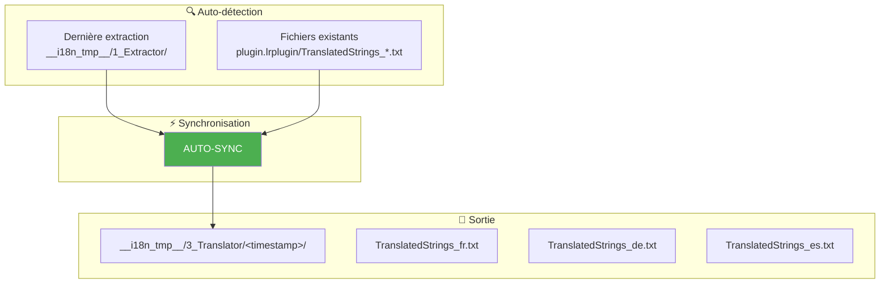
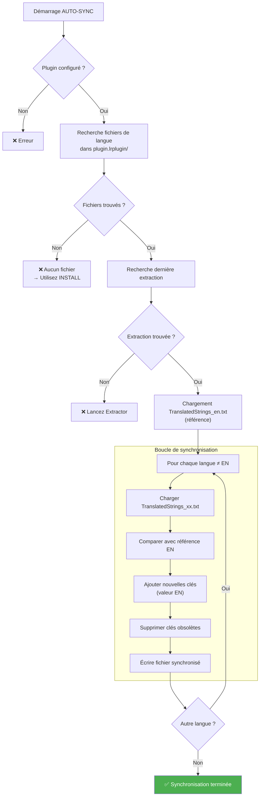

# Commande AUTO-SYNC ⭐

📚 **Retour à la documentation principale** : [Lisez-moi.md](../Lisez-moi.md)

---

## 🎯 Objectif

**AUTO-SYNC** est la commande **star** du toolkit. Elle synchronise automatiquement **tous** les fichiers de langue existants avec la dernière extraction, en une seule commande.

> C'est LA commande à utiliser pour la maintenance quotidienne — elle remplace avantageusement le workflow COMPARE → EXTRACT → INJECT → SYNC.

---

## 📥 Entrées / 📤 Sorties



| Type | Description |
|------|-------------|
| **Entrée (référence)** | `__i18n_tmp__/1_Extractor/<latest>/TranslatedStrings_en.txt` |
| **Entrée (à sync)** | `plugin.lrplugin/TranslatedStrings_*.txt` (sauf _en) |
| **Sortie** | `__i18n_tmp__/3_Translator/<timestamp>/TranslatedStrings_*.txt` |

---

## 🔄 Fonctionnement

### Algorithme complet



### Ce que fait AUTO-SYNC

Pour chaque fichier de langue (fr, de, es...) :

| Action | Description |
|--------|-------------|
| **Ajout** | Nouvelles clés → valeur EN par défaut |
| **Conservation** | Traductions existantes → préservées |
| **Suppression** | Clés obsolètes → retirées |

> **Note importante** : AUTO-SYNC ne génère **pas** de marqueurs `[NEW]` ou `[NEEDS_REVIEW]`. Ces marqueurs sont réservés au workflow avancé COMPARE → SYNC.

---

## 💻 Utilisation

### Mode interactif

```
┌──────────────────────────────────────────────────────────────────┐
│  TRANSLATION MANAGER v7.0                                        │
├──────────────────────────────────────────────────────────────────┤
│                                                                  │
│  2. AUTO-SYNC ⭐ (maintenance)                                   │  ◄── Sélectionner
│     Synchronisation automatique de tous les fichiers de langue   │
│     → Détecte la dernière extraction et synchronise tout         │
│                                                                  │
└──────────────────────────────────────────────────────────────────┘
```

### Mode CLI

```bash
python Translator_main.py autosync --plugin-path ./plugin.lrplugin
```

### Options CLI

| Option | Description | Requis |
|--------|-------------|--------|
| `--plugin-path` | Chemin du plugin | ✅ Oui |

---

## 📋 Exemple de session

```
  AUTO-SYNC - Synchronisation automatique
══════════════════════════════════════════════════════

[INFO] Fichiers de traduction détectés:
  - TranslatedStrings_en.txt
  - TranslatedStrings_fr.txt
  - TranslatedStrings_de.txt

[INFO] Dernière extraction:
  20260201_150000
  Référence: TranslatedStrings_en.txt

Synchronisation automatique:
  - Ajoute les nouvelles clés (en anglais)
  - Replace les clés modifiées (en anglais)
  - Supprime les clés obsolètes
  - Préserve les traductions existantes

Lancer la synchronisation? (O/n): O

══════════════════════════════════════════════════════
Synchronisation en cours...
══════════════════════════════════════════════════════

► Langue: fr
  ✓ 15 ajoutées, 3 modifiées, 2 supprimées

► Langue: de
  ✓ 15 ajoutées, 3 modifiées, 2 supprimées

══════════════════════════════════════════════════════

✓ 2 fichier(s) synchronisé(s):
  fr: D:\...\__i18n_tmp__\3_Translator\20260201_151000\TranslatedStrings_fr.txt
  de: D:\...\__i18n_tmp__\3_Translator\20260201_151000\TranslatedStrings_de.txt

Prochaines étapes:
  1. Copiez les fichiers synchronisés dans le plugin:
     cp __i18n_tmp__/3_Translator/20260201_151000/TranslatedStrings_*.txt plugin.lrplugin/

  2. Recherchez les clés en anglais (nouvelles ou modifiées)
  3. Traduisez les clés concernées
  4. Commitez les changements (si GitHub workflow)
```

---

## 📊 Rapport généré

AUTO-SYNC affiche un rapport synthétique pour chaque langue :

| Métrique | Description |
|----------|-------------|
| **Ajoutées** | Clés présentes dans EN mais pas dans la langue |
| **Modifiées** | Clés dont la valeur EN a changé (non marquées) |
| **Supprimées** | Clés présentes dans la langue mais plus dans EN |

---

## 🆚 AUTO-SYNC vs SYNC

| Aspect | AUTO-SYNC | SYNC |
|--------|-----------|------|
| **Fichiers traités** | Tous automatiquement | Un seul (manuel) |
| **Détection source** | Auto (dernière extraction) | Manuel |
| **Marqueurs [NEW]** | ❌ Non | ✅ Oui (si COMPARE) |
| **Cas d'usage** | Maintenance quotidienne | Workflow avancé |

---

## 🔗 Commandes liées

| Commande | Lien | Relation |
|----------|------|----------|
| **INSTALL** | [INSTALL.md](INSTALL.md) | Première installation |
| **SYNC** | [SYNC.md](SYNC.md) | Version manuelle |
| **COMPARE** | [COMPARE.md](COMPARE.md) | Pour marqueurs détaillés |

---

## 📚 Ressources

| Élément | Information |
|---------|-------------|
| Module source | `TM_autosync.py` |
| Fonction principale | `run_autosync()` |
| Menu interactif | `menu_autosync()` |
| Projet GitHub | [Adobe_Lightroom_Translation_Plugins_Kit](https://github.com/Gotcha26/Adobe_Lightroom_Translation_Plugins_Kit) |
