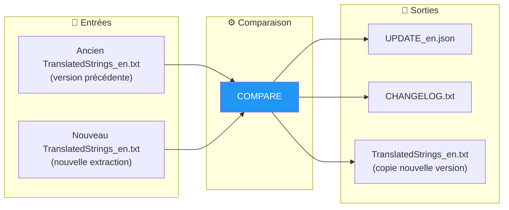
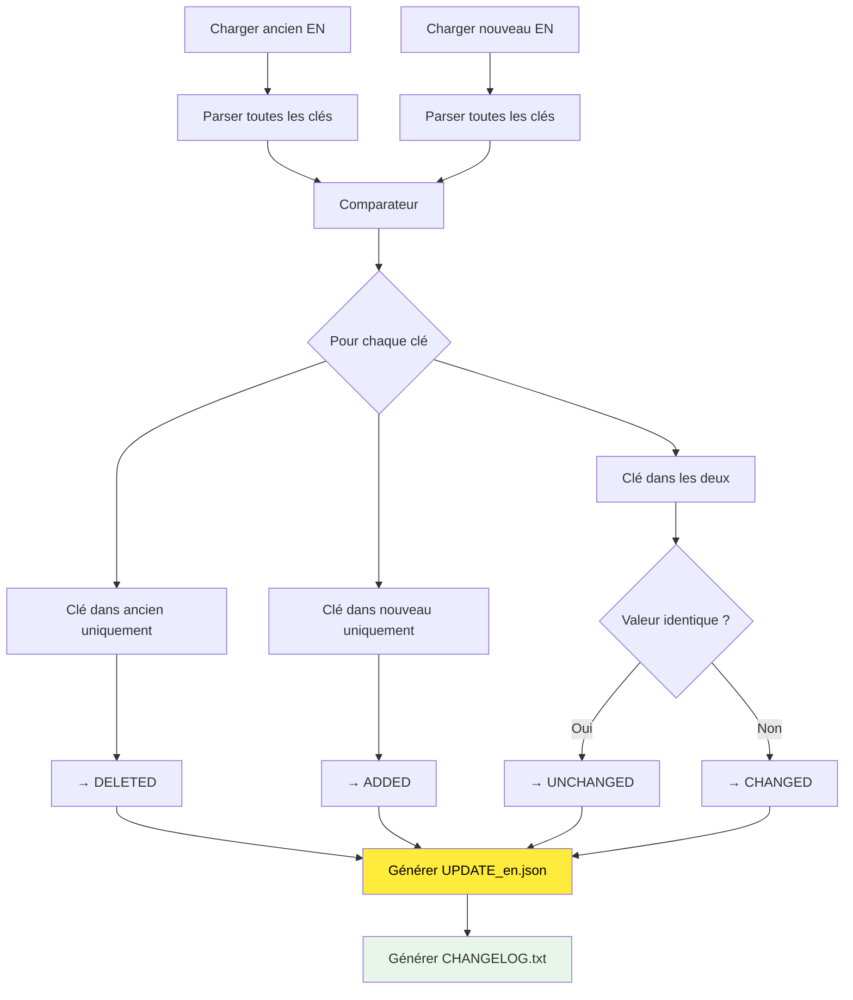

# Commande COMPARE

📚 **Retour à la documentation principale** : [Lisez-moi.md](../Lisez-moi.md)

---

## 🎯 Objectif

**COMPARE** analyse les différences entre deux versions du fichier anglais (`TranslatedStrings_en.txt`) et génère un rapport structuré des changements.

> Cette commande est la première étape du workflow avancé. Elle est optionnelle si vous utilisez **AUTO-SYNC**.

---

## 📥 Entrées / 📤 Sorties



| Type | Fichiers |
|------|----------|
| **Entrée** | Ancien `TranslatedStrings_en.txt` |
| **Entrée** | Nouveau `TranslatedStrings_en.txt` |
| **Sortie** | `UPDATE_en.json` (données structurées) |
| **Sortie** | `CHANGELOG.txt` (rapport lisible) |
| **Sortie** | `TranslatedStrings_en.txt` (copie de référence) |

---

## 🔄 Fonctionnement

### Algorithme de comparaison



### Catégories de changements

| Catégorie | Description | Impact |
|-----------|-------------|--------|
| **ADDED** | Nouvelles clés | À traduire dans toutes les langues |
| **CHANGED** | Valeur EN modifiée | Révision des traductions suggérée |
| **DELETED** | Clés supprimées | À retirer des fichiers de langue |
| **UNCHANGED** | Aucun changement | Rien à faire |

---

## 💻 Utilisation

### Mode interactif

```
┌──────────────────────────────────────────────────────────────────┐
│  TRANSLATION MANAGER v7.0                                        │
├──────────────────────────────────────────────────────────────────┤
│                                                                  │
│  3. COMPARE                                                      │  ◄── Sélectionner
│     Compare ancien EN vs nouveau EN                              │
│     → Génère UPDATE_en.json + CHANGELOG.txt                      │
│                                                                  │
└──────────────────────────────────────────────────────────────────┘
```

Le menu demande ensuite :
1. Chemin du fichier **ancien** (ou répertoire le contenant)
2. Chemin du fichier **nouveau** (ou répertoire le contenant)

### Mode CLI

```bash
# Comparer deux fichiers
python Translator_main.py compare --old ./v1/TranslatedStrings_en.txt --new ./v2/TranslatedStrings_en.txt

# Comparer deux répertoires (auto-détection du fichier EN)
python Translator_main.py compare --old ./old_extraction/ --new ./new_extraction/

# Avec sortie dans __i18n_tmp__
python Translator_main.py compare --old ./old.txt --new ./new.txt --plugin-path ./plugin.lrplugin

# Sortie personnalisée
python Translator_main.py compare --old ./old.txt --new ./new.txt --output ./my_output/
```

### Options CLI

| Option | Description | Requis |
|--------|-------------|--------|
| `--old` | Ancien fichier EN (ou répertoire) | ✅ Oui |
| `--new` | Nouveau fichier EN (ou répertoire) | ✅ Oui |
| `--plugin-path` | Sortie dans `__i18n_tmp__/3_Translator/` | ❌ Non |
| `--output` | Répertoire de sortie personnalisé | ❌ Non |

---

## 📋 Exemple de session

```
COMPARE: Comparer deux versions EN
══════════════════════════════════════════════════════

Fichier ANCIEN (TranslatedStrings_en.txt ou répertoire):
  > ./plugin.lrplugin/TranslatedStrings_en.txt

Fichier NOUVEAU (TranslatedStrings_en.txt ou répertoire):
  > ./plugin.lrplugin/__i18n_tmp__/1_Extractor/20260201_150000/

[INFO] Comparaison en cours...

══════════════════════════════════════════════════════
  RÉSUMÉ
══════════════════════════════════════════════════════
  Clés ajoutées   :   15  [NEW]
  Clés modifiées  :    3  [CHANGED]
  Clés supprimées :    2  [DELETED]
  Clés inchangées :  130

✓ Fichiers générés dans: __i18n_tmp__/3_Translator/20260201_151234/
    • UPDATE_en.json
    • CHANGELOG.txt
    • TranslatedStrings_en.txt

[INFO] PROCHAINE ÉTAPE:
  • EXTRACT pour générer les fichiers de traduction
  • ou SYNC directement pour utiliser EN par défaut
```

---

## 📁 Format des fichiers générés

### UPDATE_en.json

```json
{
  "generated": "2026-02-01T15:12:34",
  "old_file": "/path/to/old/TranslatedStrings_en.txt",
  "new_file": "/path/to/new/TranslatedStrings_en.txt",
  "summary": {
    "added": 15,
    "changed": 3,
    "deleted": 2,
    "unchanged": 130,
    "total_old": 135,
    "total_new": 148
  },
  "added": {
    "$$$/Plugin/NewFeature/Title": "New Feature",
    "$$$/Plugin/NewFeature/Description": "This is a new feature"
  },
  "changed": {
    "$$$/Plugin/Settings/Help": {
      "old": "Click here for help",
      "new": "Click here to get help"
    }
  },
  "deleted": [
    "$$$/Plugin/OldFeature/Title",
    "$$$/Plugin/OldFeature/Button"
  ],
  "unchanged_keys": ["$$$/Plugin/Dialog/OK", "..."],
  "all_new_strings": {
    "$$$/Plugin/Dialog/OK": "OK",
    "...": "..."
  }
}
```

### CHANGELOG.txt

```
================================================================================
CHANGELOG - Modifications des traductions EN
================================================================================

Date: 2026-02-01 15:12:34
Ancien: ./old/TranslatedStrings_en.txt
Nouveau: ./new/TranslatedStrings_en.txt

--------------------------------------------------------------------------------
RÉSUMÉ
--------------------------------------------------------------------------------
  Clés ajoutées    :   15  [NEW]
  Clés modifiées   :    3  [CHANGED]
  Clés supprimées  :    2  [DELETED]
  Clés inchangées  :  130

================================================================================
CLÉS AJOUTÉES (15)
Ces clés doivent être traduites dans toutes les langues.
================================================================================

  [NEW] $$$/Plugin/NewFeature/Title
        EN: New Feature

  [NEW] $$$/Plugin/NewFeature/Description
        EN: This is a new feature

================================================================================
CLÉS MODIFIÉES (3)
Le texte anglais a changé. Les traductions doivent être révisées.
================================================================================

  [CHANGED] $$$/Plugin/Settings/Help
        AVANT: Click here for help
        APRÈS: Click here to get help

================================================================================
CLÉS SUPPRIMÉES (2)
Ces clés n'existent plus et seront retirées des traductions.
================================================================================

  [DELETED] $$$/Plugin/OldFeature/Title
  [DELETED] $$$/Plugin/OldFeature/Button

================================================================================
PROCHAINE ÉTAPE
================================================================================
Lancez EXTRACT puis INJECT, ou directement SYNC:
  python Translator_main.py extract --update ./20260201_151234
  python Translator_main.py sync --update ./20260201_151234
```

---

## 🔗 Commandes liées

| Commande | Lien | Relation |
|----------|------|----------|
| **EXTRACT** | [EXTRACT.md](EXTRACT.md) | Étape suivante (fichiers partiels) |
| **SYNC** | [SYNC.md](SYNC.md) | Alternative directe |
| **AUTO-SYNC** | [AUTOSYNC.md](AUTOSYNC.md) | Remplace ce workflow |

---

## 📚 Ressources

| Élément | Information |
|---------|-------------|
| Module source | `TM_compare.py` |
| Classe principale | `VersionComparator` |
| Fonction principale | `run_compare()` |
| Menu interactif | `menu_compare()` |

---

| 📜 | Traçabilité |  |  |
|--|--|--|--|
| **Nom** | *COMPARE.md* | **Version** | 1.0 |
| **Type** | Guide utilisateur - Avancé | **Langue** | FR - *[EN](../../en/commands/COMPARE.md)* |
| **Projet GitHub** | [Adobe Lightroom Translation Toolkit](https://github.com/Gotcha26/Adobe_Lightroom_Translation_Plugins_Kit) | **Date** | 2026-02-02 |
| **Licence** | Open source | | |
