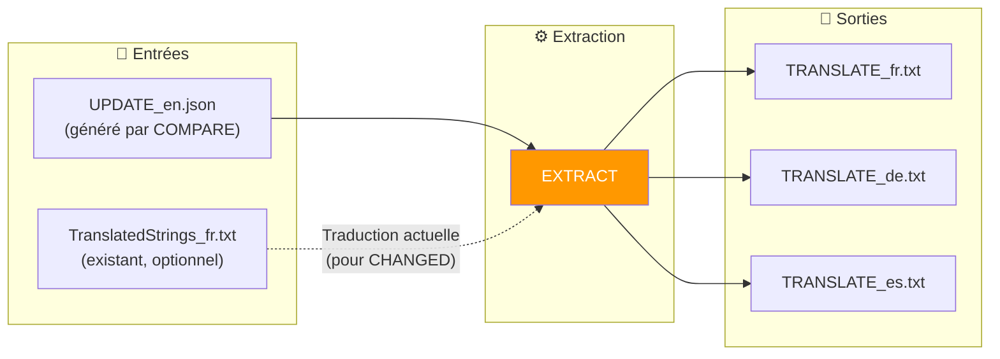
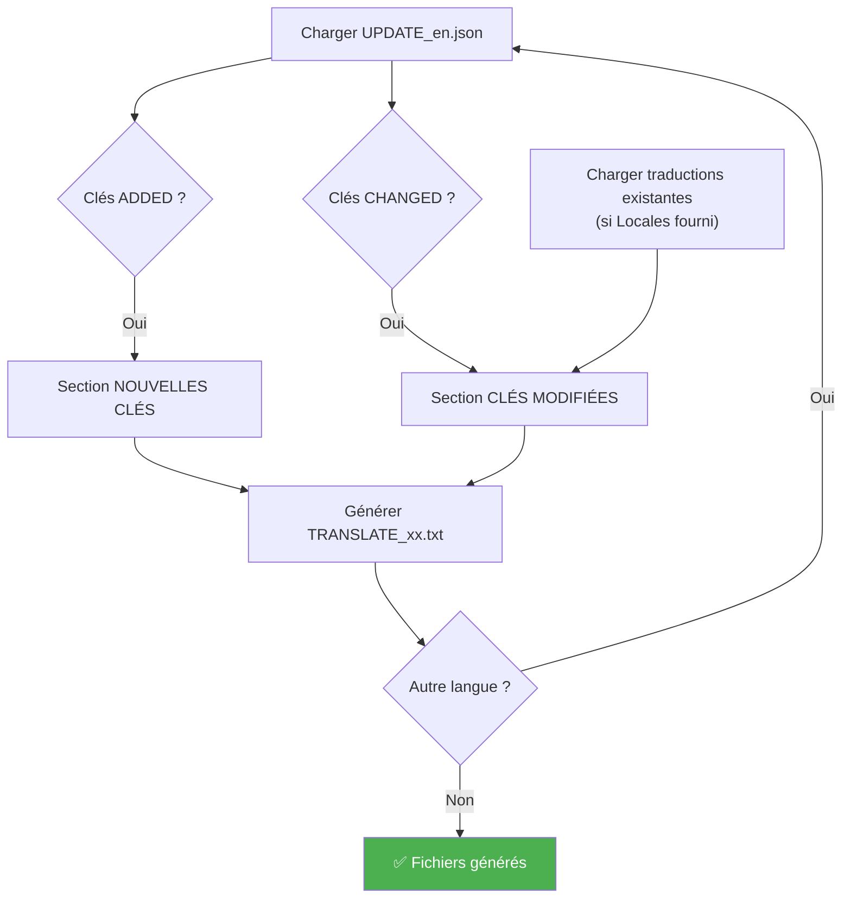

# Commande EXTRACT

📚 **Retour à la documentation principale** : [Lisez-moi.md](../Lisez-moi.md)

---

## 🎯 Objectif

**EXTRACT** génère de petits fichiers `TRANSLATE_xx.txt` contenant uniquement les clés à traduire (nouvelles ou modifiées). Ces fichiers sont idéaux pour être envoyés à des traducteurs externes.

> Cette commande fait partie du workflow avancé. Elle nécessite d'avoir exécuté **COMPARE** au préalable.

---

## 📥 Entrées / 📤 Sorties



| Type | Fichiers |
|------|----------|
| **Entrée** | `UPDATE_en.json` (obligatoire) |
| **Entrée** | `TranslatedStrings_xx.txt` existants (optionnel) |
| **Sortie** | `TRANSLATE_xx.txt` par langue |

---

## 🔄 Fonctionnement

### Algorithme



### Contenu généré

Pour chaque clé :

| Type | Format dans TRANSLATE_xx.txt |
|------|------------------------------|
| **Nouvelle** | `[KEY]`, `[EN]`, `[XX] →` |
| **Modifiée** | `[KEY]`, `[EN AVANT]`, `[EN APRÈS]`, `[XX ACTUEL]`, `[XX] →` |

---

## 💻 Utilisation

### Mode interactif

```
┌──────────────────────────────────────────────────────────────────┐
│  TRANSLATION MANAGER v7.0                                        │
├──────────────────────────────────────────────────────────────────┤
│                                                                  │
│  4. EXTRACT (optionnel)                                          │  ◄── Sélectionner
│     Génère mini fichiers TRANSLATE_xx.txt pour traduction        │
│                                                                  │
└──────────────────────────────────────────────────────────────────┘
```

Le menu demande :
1. Dossier UPDATE (contenant `UPDATE_en.json`)
2. Dossier Locales (traductions existantes, optionnel)
3. Langue(s) à générer (ou toutes)

### Mode CLI

```bash
# Toutes les langues détectées
python Translator_main.py extract --plugin-path ./plugin.lrplugin --locales ./plugin.lrplugin

# Langue spécifique
python Translator_main.py extract --update ./20260201_151234 --locales ./Locales --lang fr

# Sans plugin-path (mode legacy)
python Translator_main.py extract --update ./20260201_151234
```

### Options CLI

| Option | Description | Requis |
|--------|-------------|--------|
| `--plugin-path` | Auto-détection dossier Translator | ❌ Non |
| `--update` | Dossier UPDATE (si pas plugin-path) | Conditionnel |
| `--locales` | Répertoire des traductions existantes | ❌ Non |
| `--lang` | Langue spécifique (défaut: toutes) | ❌ Non |
| `--output` | Répertoire de sortie | ❌ Non |

---

## 📋 Exemple de session

```
EXTRACT: Générer fichiers de traduction
══════════════════════════════════════════════════════

[INFO] Dossier sélectionné: __i18n_tmp__/3_Translator/20260201_151234/

Répertoire des traductions existantes (Locales):
  (Pour récupérer les traductions actuelles des clés modifiées)
  (Entrée pour ignorer)
  > ./plugin.lrplugin

Langue(s) à générer:
  • Entrée = toutes les langues trouvées dans Locales
  • Ou spécifier: fr, de, es...
  >

[INFO] Génération en cours...

══════════════════════════════════════════════════════
  FICHIERS GÉNÉRÉS
══════════════════════════════════════════════════════
  [OK] TRANSLATE_fr.txt
  [OK] TRANSLATE_de.txt

[INFO] PROCHAINE ÉTAPE:
  1. Éditez les fichiers et remplissez après chaque →
  2. Lancez INJECT pour réinjecter les traductions
  3. Lancez SYNC pour finaliser
```

---

## 📁 Format du fichier TRANSLATE_xx.txt

```
# ======================================================================
# FICHIER DE TRADUCTION - FR
# Généré: 2026-02-01 15:30:00
# Source: __i18n_tmp__/3_Translator/20260201_151234
# ======================================================================
#
# INSTRUCTIONS:
# 1. Pour chaque entrée, écrivez la traduction après le symbole →
# 2. Laissez vide pour garder la valeur EN par défaut
# 3. Les lignes commençant par # sont ignorées
#
# ======================================================================

# ----------------------------------------------------------------------
# NOUVELLES CLÉS (15)
# ----------------------------------------------------------------------

[KEY] $$$/Plugin/NewFeature/Title
[EN]  New Feature
[FR] →

[KEY] $$$/Plugin/NewFeature/Description
[EN]  This is a new feature
[FR] →

# ----------------------------------------------------------------------
# CLÉS MODIFIÉES (3) - Le texte EN a changé
# ----------------------------------------------------------------------

[KEY] $$$/Plugin/Settings/Help
[EN AVANT]  Click here for help
[EN APRÈS]  Click here to get help
[FR ACTUEL] Cliquez ici pour obtenir de l'aide
[FR] →

# ======================================================================
# TOTAL: 15 nouvelles + 3 modifiées
# ======================================================================
```

### Comment remplir

1. **Nouvelle clé** : Écrire la traduction après `→`
   ```
   [FR] → Nouvelle fonctionnalité
   ```

2. **Clé modifiée** : Réviser et écrire après `→`
   ```
   [FR] → Cliquez ici pour obtenir de l'aide
   ```

3. **Pas de traduction** : Laisser vide → valeur EN utilisée
   ```
   [FR] →
   ```

---

## 💡 Avantages des fichiers TRANSLATE

| Avantage | Description |
|----------|-------------|
| **Légers** | Quelques Ko au lieu de plusieurs Mo |
| **Ciblés** | Uniquement les clés à traduire |
| **Portables** | Faciles à envoyer par email |
| **Clairs** | Format lisible avec contexte |

---

## 🔗 Commandes liées

| Commande | Lien | Relation |
|----------|------|----------|
| **COMPARE** | [COMPARE.md](COMPARE.md) | Étape précédente |
| **INJECT** | [INJECT.md](INJECT.md) | Étape suivante |
| **AUTO-SYNC** | [AUTOSYNC.md](AUTOSYNC.md) | Alternative simple |

---

## 📚 Ressources

| Élément | Information |
|---------|-------------|
| Module source | `TM_extract.py` |
| Fonction principale | `run_extract()` |
| Fonction batch | `run_extract_all()` |
| Menu interactif | `menu_extract()` |

---

| 📜 | Traçabilité |  |  |
|--|--|--|--|
| **Nom** | *EXTRACT.md* | **Version** | 1.0 |
| **Type** | Guide utilisateur - Avancé | **Langue** | FR - *[EN](../../en/commands/EXTRACT.md)* |
| **Projet GitHub** | [Adobe Lightroom Translation Toolkit](https://github.com/Gotcha26/Adobe_Lightroom_Translation_Plugins_Kit) | **Date** | 2026-02-02 |
| **Licence** | Open source | | |
