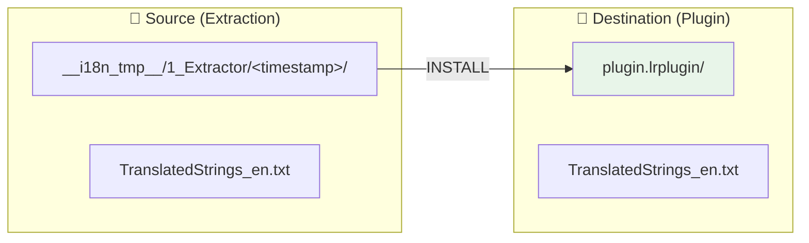
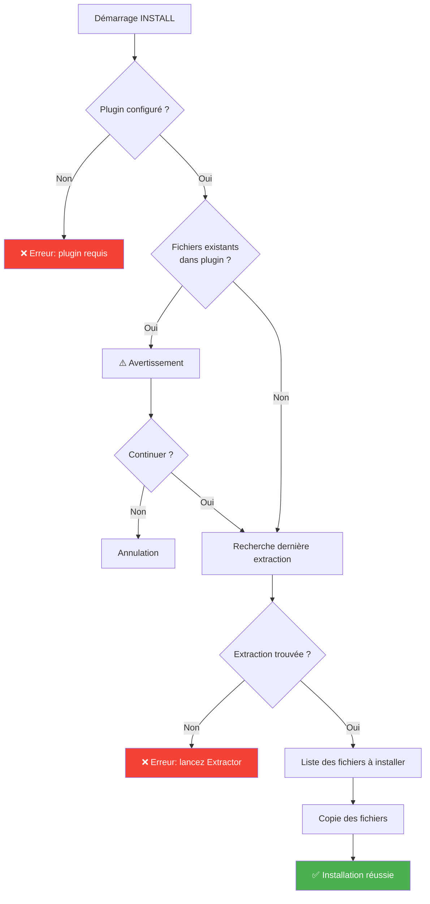

# Commande INSTALL

📚 **Retour à la documentation principale** : [Lisez-moi.md](../Lisez-moi.md)

---

## 🎯 Objectif

**INSTALL** copie les fichiers de traduction depuis la dernière extraction ***Extractor*** vers la racine du plugin, les rendant ainsi actifs pour Lightroom.

> Cette commande est destinée à la **première installation** du système multilingue sur un plugin.

---

## 📥 Entrées / 📤 Sorties



| Type | Fichiers |
|------|----------|
| **Entrée** | `__i18n_tmp__/1_Extractor/<timestamp>/TranslatedStrings_*.txt` |
| **Sortie** | `plugin.lrplugin/TranslatedStrings_*.txt` |

---

## 🔄 Fonctionnement

### Algorithme



### Détails techniques

1. **Validation du plugin** : Vérifie que le chemin est valide et accessible
2. **Détection des fichiers existants** : Si des `TranslatedStrings_*.txt` existent déjà, un avertissement est affiché
3. **Auto-détection de l'extraction** : Recherche le dossier le plus récent dans `__i18n_tmp__/1_Extractor/`
4. **Copie des fichiers** : Utilise `shutil.copy2()` pour préserver les métadonnées

---

## 💻 Utilisation

### Mode interactif

```
┌──────────────────────────────────────────────────────────────────┐
│  TRANSLATION MANAGER v7.0                                        │
│  Gestionnaire de traductions multilingues                        │
├──────────────────────────────────────────────────────────────────┤
│                                                                  │
│  1. INSTALL (première installation)                              │  ◄── Sélectionner
│     Copie TranslatedStrings_xx.txt depuis Extractor vers plugin  │
│                                                                  │
└──────────────────────────────────────────────────────────────────┘
```

### Mode CLI

```bash
# Installation standard
python Translator_main.py install --plugin-path ./plugin.lrplugin

# Depuis un dossier source spécifique
python Translator_main.py install --plugin-path ./plugin.lrplugin --source ./custom_extraction/
```

### Options CLI

| Option | Description | Requis |
|--------|-------------|--------|
| `--plugin-path` | Chemin du plugin cible | ✅ Oui |
| `--source` | Dossier source personnalisé | ❌ Non (auto-détection) |
| `--dry-run` | Simulation sans copie | ❌ Non |

---

## 📋 Exemple de session

```
  INSTALL - Installation des fichiers de traduction
══════════════════════════════════════════════════════

[INFO] Dernière extraction:
  20260201_143000

Fichiers à installer:
  - TranslatedStrings_en.txt

Installer ces fichiers dans le plugin? (O/n): O

✓ Installation réussie!

Fichiers installés:
  TranslatedStrings_en.txt
    → D:\plugins\myplugin.lrplugin\TranslatedStrings_en.txt

Prochaines étapes:
  1. Lancez l'Applicator pour remplacer les chaînes en dur par LOC()
  2. Testez le plugin dans Lightroom
  3. Créez des copies pour d'autres langues (TranslatedStrings_fr.txt, etc.)
```

---

## ⚠️ Cas particuliers

### Fichiers existants

Si des fichiers de traduction existent déjà dans le plugin :

```
⚠️ Des fichiers de traduction existent déjà:
  - TranslatedStrings_en.txt
  - TranslatedStrings_fr.txt

Cette commande est destinée à l'initialisation du plugin.
Pour mettre à jour des fichiers existants, utilisez SYNC ou AUTO-SYNC.

Continuer quand même? (o/N):
```

> **Recommandation** : Utilisez **AUTO-SYNC** pour la maintenance courante.

### Aucune extraction trouvée

```
❌ Aucune extraction trouvée.

Lancez d'abord l'Extractor pour générer TranslatedStrings_en.txt
```

---

## 🔗 Commandes liées

| Commande | Lien | Relation |
|----------|------|----------|
| **AUTO-SYNC** | [AUTOSYNC.md](AUTOSYNC.md) | Alternative pour mise à jour |
| **SYNC** | [SYNC.md](SYNC.md) | Synchronisation manuelle |

---

## 📚 Ressources

| Élément | Information |
|---------|-------------|
| Module source | `TM_install.py` |
| Fonction principale | `run_install()` |
| Menu interactif | `menu_install()` |

---

| 📜 | Traçabilité |  |  |
|--|--|--|--|
| **Nom** | *INSTALL.md* | **Version** | 1.0 |
| **Type** | Guide utilisateur - Avancé | **Langue** | FR - *[EN](../../en/commands/INSTALL.md)* |
| **Projet GitHub** | [Adobe Lightroom Translation Toolkit](https://github.com/Gotcha26/Adobe_Lightroom_Translation_Plugins_Kit) | **Date** | 2026-02-02 |
| **Licence** | Open source | | |
