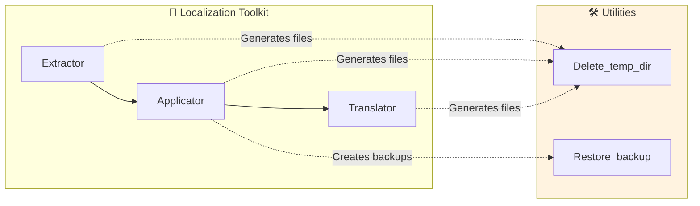
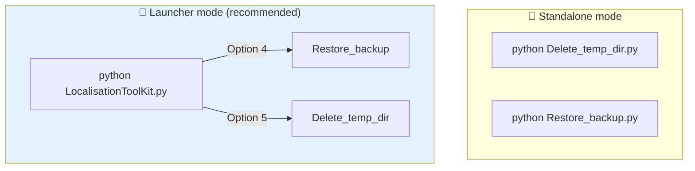
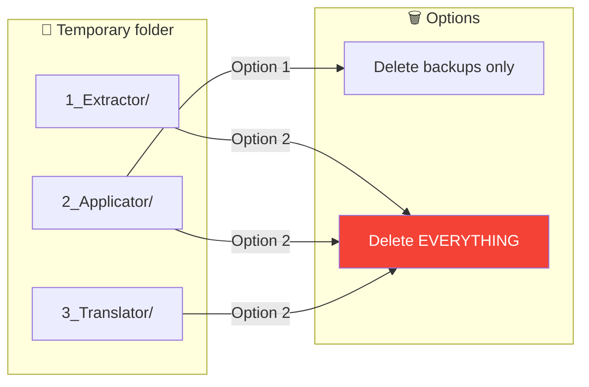
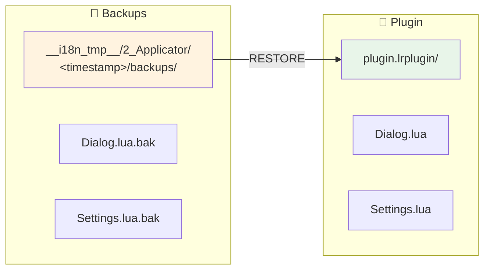
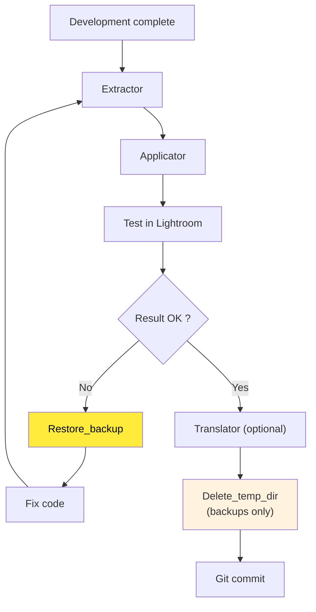

# Tools - Technical Documentation

This document presents the **utility tools** of the toolkit. These scripts allow you to manage temporary files and restore backups created by ***Applicator***.

> **Target Audience**: Developers and users who need to clean up their environment or revert after an application.

---

### Document Outline

1. [Overview](#-overview) — Role of the tools
2. [Installation and Requirements](#-installation-and-requirements) — What you need to get started
3. [Architecture](#-architecture) — File structure
4. [Available Tools](#-available-tools) — DELETE_TEMP_DIR and RESTORE_BACKUP
5. [Workflow Integration](#-workflow-integration) — Typical use cases
6. [Troubleshooting](#-troubleshooting) — Problem resolution
7. [Changelog](#-changelog---tracking-modifications)

---

## 🎯 Overview

The **Tools** are **maintenance** utilities that complement the localization workflow. They intervene after the main tools are executed (Extractor, Applicator, Translator).



### Problems Solved

| Problem | Tool | Solution |
|---------|------|----------|
| Disk space occupied by `__i18n_tmp__` | **Delete_temp_dir** | Selective or complete deletion |
| Incorrect LOC application | **Restore_backup** | Restoration of original files |
| Need to start fresh | **Delete_temp_dir** | Complete cleanup |
| Iterative testing (apply/undo) | **Restore_backup** | Quick return to previous state |

---

## 🛠 Installation and Requirements

### Prerequisites

- **Python 3.8+** installed on your system
- No external dependencies required (standard library only)

### File Structure

```
9_Tools/
├── Delete_temp_dir.py      ← Temporary folder cleanup
├── Restore_backup.py       ← Backup restoration
└── __doc/
    └── en/
        ├── README.md       ← This file
        └── tools/
            ├── DELETE_TEMP_DIR.md
            └── RESTORE_BACKUP.md
```

### Standalone vs Toolkit Launcher

Both tools can run **independently**:

```bash
python Delete_temp_dir.py
python Restore_backup.py
```

However, using ***LocalisationToolKit.py*** is recommended because the plugin path is automatically passed.



---

## 🏗 Architecture

### Temporary Folder Structure

The tools interact with the `__i18n_tmp__` folder generated by the toolkit:

```
plugin.lrplugin/
├── *.lua                       ← Plugin files
└── __i18n_tmp__/
    ├── 1_Extractor/            ← Extractor outputs
    │   └── <timestamp>/
    │       ├── TranslatedStrings_en.txt
    │       └── replacements.json
    ├── 2_Applicator/           ← Applicator outputs + BACKUPS
    │   └── <timestamp>/
    │       ├── application_report.txt
    │       └── backups/        ← .bak files
    │           ├── Dialog.lua.bak
    │           └── Settings.lua.bak
    └── 3_Translator/           ← Translator outputs
        └── <timestamp>/
            └── TranslatedStrings_*.txt
```

---

## 🛠 Available Tools

### Delete_temp_dir — Cleanup

📄 **Full Documentation**: [tools/DELETE_TEMP_DIR.md](tools/DELETE_TEMP_DIR.md)

Deletes all or part of the temporary folder `__i18n_tmp__`.



**Two deletion modes**:
1. **Backups only** — Frees space, preserves extractions
2. **Entire folder** — Complete cleanup (triple confirmation)

---

### Restore_backup — Restoration

📄 **Full Documentation**: [tools/RESTORE_BACKUP.md](tools/RESTORE_BACKUP.md)

Restores `.lua` files from their `.bak` backups.



**Features**:
- Session selection (multiple timestamped backups)
- Automatic pre-selection of most recent session
- Dry-run mode (simulation)
- Optional `.bak` deletion after restoration

---

## 🔄 Workflow Integration

### Recommended Workflow with Cleanup



### When to Use Each Tool

| Situation | Tool | Mode |
|-----------|------|------|
| Incorrect application | **Restore_backup** | Recent session |
| Free up space | **Delete_temp_dir** | Backups only |
| Before Git commit | **Delete_temp_dir** | Delete everything |
| Iterative testing | **Restore_backup** | Dry-run mode |
| Switch plugin | **Delete_temp_dir** | Backups only |

---

## 🔧 Troubleshooting

### Common Problems

| Problem | Likely Cause | Solution |
|---------|--------------|----------|
| Permission denied | File open | Close editors/Lightroom |
| No backups found | Applicator with `--no-backup` | Re-run Applicator normally |
| Invalid default plugin | Obsolete path | Reconfigure in LocalisationToolKit |

### Permission Error (Windows)

```
[ERROR] Permission denied: [WinError 32]
```

**Solutions**:
1. Close all code editors
2. Close Lightroom Classic
3. Close file explorer pointing to the folder
4. Run as administrator if necessary

### No Backups Available

```
[WARNING] No Applicator session found
```

**Causes**:
- Applicator never run
- `--no-backup` option used
- `__i18n_tmp__` folder deleted

**Alternative**: Use Git to restore
```bash
git checkout HEAD -- plugin.lrplugin/*.lua
```

---

## 📋 Changelog - Tracking Modifications

| Version | Date | Modifications |
|---------|------|---------------|
| 3.0 | 2026-02-01 | Restore_backup: recent session pre-selection, menu_generator integration |
| 2.0 | 2026-02-01 | Delete_temp_dir: selective deletion (backups/everything) |
| 1.0 | 2026-01-30 | Initial version of both tools |

---

## 📚 Resources and Credits

| Element | Information |
|---------|-------------|
| Python shutil | [Documentation](https://docs.python.org/3/library/shutil.html) |
| Python os.path | [Documentation](https://docs.python.org/3/library/os.path.html) |
| ANSI Colors | [Wikipedia](https://en.wikipedia.org/wiki/ANSI_escape_code) |

---

| 📜 | Traceability |  |  |
|--|--|--|--|
| **Name** | *README.md* | **Version** | 3.1 |
| **Type** | User Guide - RESTORE Advanced | **Language** | EN - *[FR](../fr/Lisez-moi.md)* |
| **GitHub Project** | [Adobe Lightroom Translation Toolkit](https://github.com/Gotcha26/Adobe_Lightroom_Translation_Plugins_Kit) | **Date** | 2026-02-02 |
| **License** | Open source | | |
