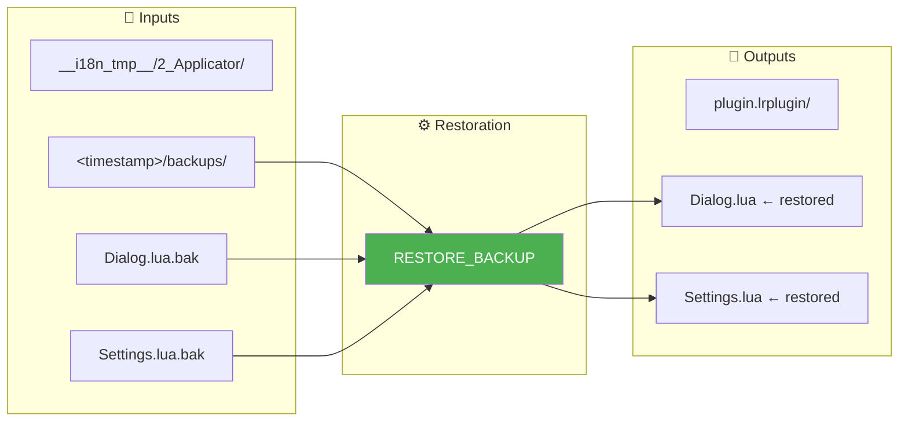
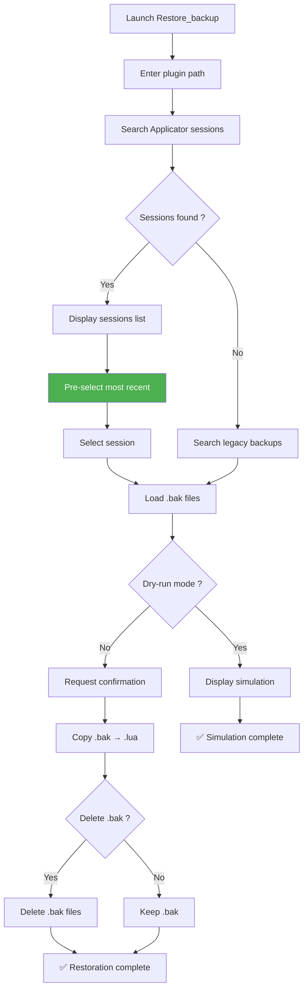
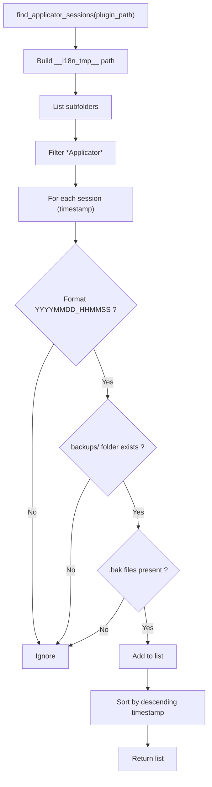
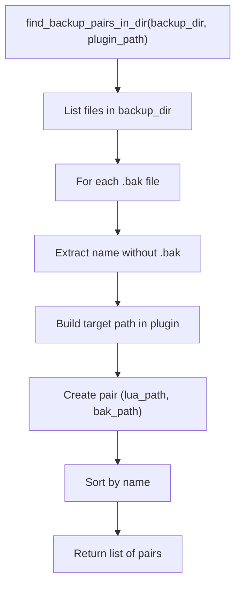
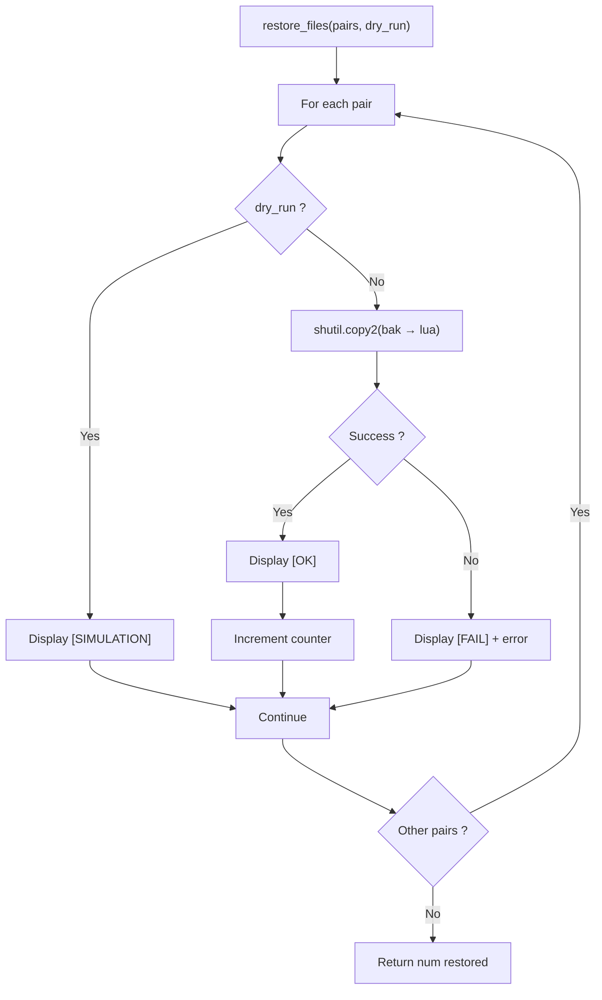
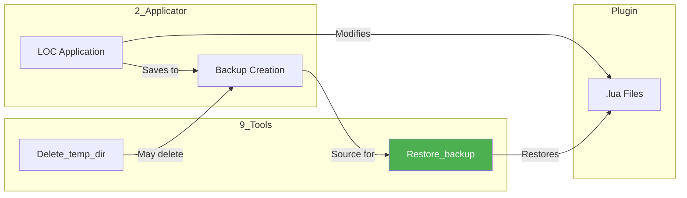

# Restore_backup — Restoration

📚 **Back to main documentation**: [README.md](../README.md)

---

## 🎯 Objective

***Restore_backup*** restores plugin `.lua` files from their `.bak` backups generated by ***Applicator***. This tool allows you to return to the previous state after an incorrect application of localizations.

> **Tip**: Use **dry-run** mode (simulation) to verify which files will be restored before performing the actual operation.

---

## 📥 Inputs / 📤 Outputs



| Type | Description |
|------|-------------|
| **Input** | `.bak` files in `__i18n_tmp__/2_Applicator/<timestamp>/backups/` |
| **Output** | `.lua` files restored in the plugin |

---

## 🔄 How It Works

### Restoration Algorithm



### Operating Modes

| Mode | Description | Files Modified |
|------|-------------|-----------------|
| **Dry-run** | Simulation without modification | None |
| **Real** | Actual restoration | `.lua` overwritten by `.bak` |
| **Real + deletion** | Restoration + cleanup | `.lua` overwritten, `.bak` deleted |

---

## 💻 Usage

### Interactive Mode (Recommended)

```bash
python Restore_backup.py
```

The interactive menu guides the user through:
1. Plugin selection
2. Choice of backup session
3. Dry-run or real mode
4. Restoration confirmation
5. Optional `.bak` deletion

### Direct CLI Mode

```bash
# Restore latest session
python Restore_backup.py /path/to/plugin.lrplugin

# Simulation mode
python Restore_backup.py --dry-run /path/to/plugin.lrplugin

# With pre-configured plugin (via LocalisationToolKit)
python Restore_backup.py --default-plugin /path/to/plugin.lrplugin
```

### CLI Options

| Option | Description |
|--------|-------------|
| `<path>` | Plugin path (direct CLI mode) |
| `--dry-run` | Simulation mode (no modification) |
| `--default-plugin <path>` | Pre-configured plugin |
| `--help`, `-h` | Display help |

---

## 📋 Example Session

### Session Selection

```
══════════════════════════════════════════════════════════════════════
  RESTORATION OF .bak FILES
══════════════════════════════════════════════════════════════════════

[OK] Plugin: piwigoPublish.lrplugin
     Path: D:\Lightroom\piwigoPublish.lrplugin

[INFO] 3 Applicator session(s) found in __i18n_tmp__/

Applicator Sessions with available backups
────────────────────────────────────────────────────────────────────

  1. [LATEST] 2026-02-01 15:30:45 (14 file(s))
  2.          2026-01-28 10:15:22 (12 file(s))
  3.          2026-01-25 09:00:00 (10 file(s))
  0. Cancel

Choose a session [1 by default]:
```

### File List

```
════════════════════════════════════════════════════════════════════
SEARCHING FOR .bak FILES
════════════════════════════════════════════════════════════════════
Plugin: D:\Lightroom\piwigoPublish.lrplugin
Source: D:\Lightroom\piwigoPublish.lrplugin\__i18n_tmp__\2_Applicator\20260201_153045\backups

[INFO] Files found: 14

  [REPLACE] Dialog.lua
  [REPLACE] ExportDialog.lua
  [REPLACE] Info.lua
  [NEW]     NewFile.lua
  ...
```

### Restoration Result

```
════════════════════════════════════════════════════════════════════
RESTORATION
════════════════════════════════════════════════════════════════════

  [OK] Dialog.lua
  [OK] ExportDialog.lua
  [OK] Info.lua
  [OK] NewFile.lua
  ...

Delete .bak files? [y/N]: y

[INFO] Deleting .bak files

  [OK] Deleted: Dialog.lua.bak
  [OK] Deleted: ExportDialog.lua.bak
  ...

[OK] 14 .bak file(s) deleted

════════════════════════════════════════════════════════════════════
SUMMARY
════════════════════════════════════════════════════════════════════
Files restored: 14

[OK] Complete!
```

---

## 🧮 Detailed Algorithm

### Session Search



### File Pair Creation



### Restoration



---

## ⚠️ Points of Attention

### Legacy Mode

If no Applicator session is found in `__i18n_tmp__/`, the tool searches for "legacy" backups:

```
[WARNING] No Applicator session found in __i18n_tmp__/
Searching for legacy backups (.lua.bak next to files)...
```

This mode searches for `.lua.bak` files placed directly next to the `.lua` files (old structure).

### [NEW] vs [REPLACE] Markers

| Marker | Meaning |
|--------|---------|
| `[REPLACE]` | The `.lua` file exists and will be overwritten |
| `[NEW]` | The `.lua` file no longer exists, will be recreated |

### Automatic Pre-selection

The most recent session is **pre-selected by default**:
- Marked `[LATEST]` in the list
- Empty entry = automatic selection

```
Choose a session [1 by default]: ↵
```

---

## 🔗 Interactions with Other Tools



---

## 📚 Resources

| Element | Information |
|---------|-------------|
| Source module | `Restore_backup.py` |
| Main function | `main()` |
| Session search | `find_applicator_sessions()` |
| File pairs | `find_backup_pairs_in_dir()` |
| Legacy pairs | `find_backup_pairs_legacy()` |
| Restoration | `restore_files()` |
| .bak deletion | `delete_backups()` |
| Interactive menu | `interactive_menu()` |
| Session selection | `select_backup_session()` |

---

| 📜 | Traceability |  |  |
|--|--|--|--|
| **Name** | *RESTORE_BACKUP.md* | **Version** | 3.0 |
| **Type** | User Guide - RESTORE Advanced | **Language** | EN - *[FR](../../fr/outils/RESTORE_BACKUP.md)* |
| **GitHub Project** | [Adobe Lightroom Translation Toolkit](https://github.com/Gotcha26/Adobe_Lightroom_Translation_Plugins_Kit) | **Date** | 2026-02-02 |
| **License** | Open source | | |
