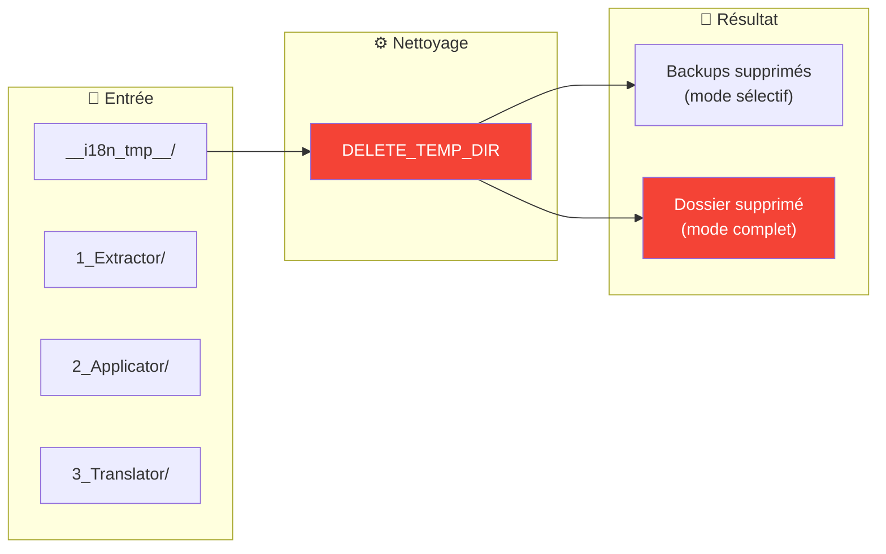
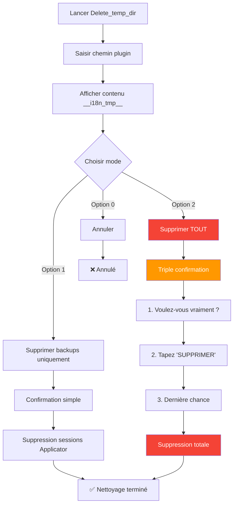
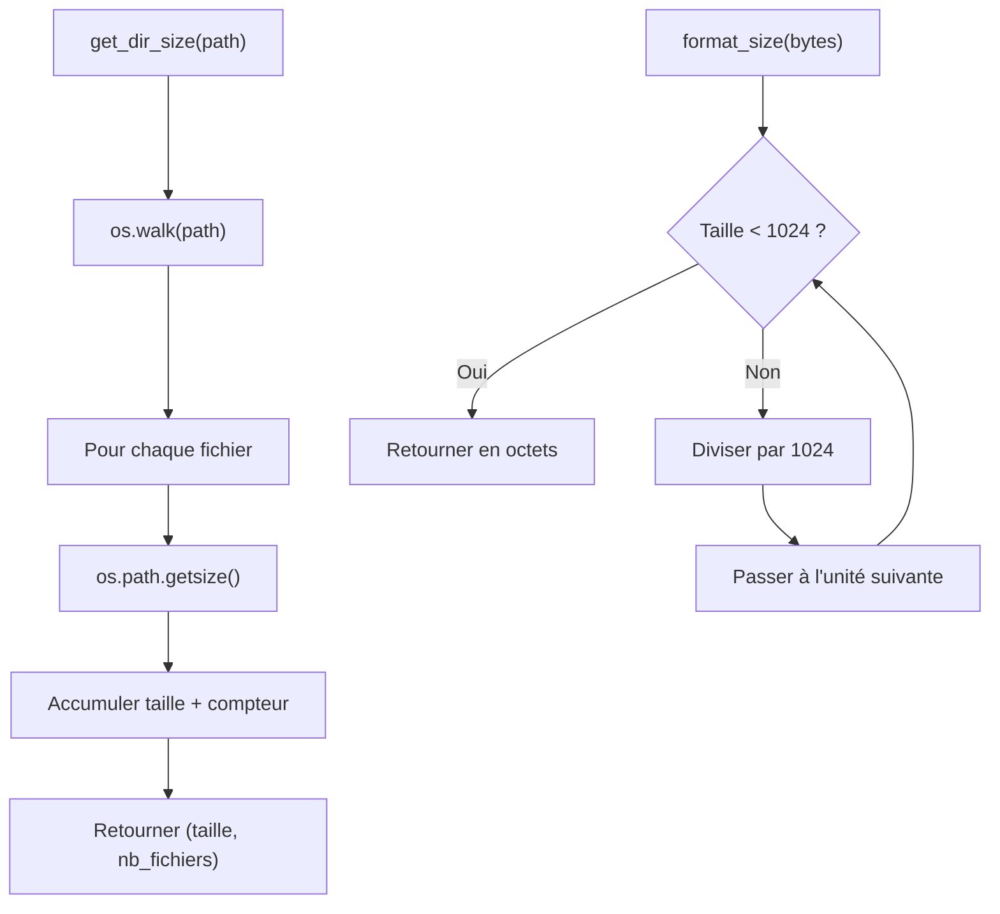
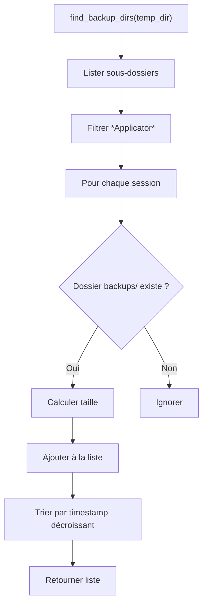

# Delete_temp_dir — Nettoyage

📚 **Retour à la documentation principale** : [Lisez-moi.md](../Lisez-moi.md)

---

## 🎯 Objectif

***Delete_temp_dir*** supprime tout ou partie du dossier temporaire `__i18n_tmp__` généré par le toolkit. Cet outil permet de libérer de l'espace disque et de repartir sur une base propre.

> **Attention** : Certaines suppressions sont **irréversibles**. L'outil demande des confirmations adaptées au niveau de risque.

---

## 📥 Entrées / 📤 Sorties



| Type | Description |
|------|-------------|
| **Entrée** | Dossier `__i18n_tmp__` du plugin |
| **Sortie (mode 1)** | Sessions Applicator supprimées (backups) |
| **Sortie (mode 2)** | Dossier `__i18n_tmp__` entièrement supprimé |

---

## 🔄 Fonctionnement

### Modes de suppression

L'outil propose deux modes de suppression avec des niveaux de confirmation différents :



### Comparatif des modes

| Aspect | Mode 1 : Backups | Mode 2 : Tout |
|--------|------------------|---------------|
| **Cible** | Sessions `2_Applicator/` | Dossier `__i18n_tmp__/` complet |
| **Risque** | Moyen | Élevé |
| **Confirmation** | Simple (O/N) | Triple (O/N + mot-clé + O/N) |
| **Récupérable** | Non | Non |
| **Conserve** | Extractions, traductions | Rien |

---

## 💻 Utilisation

### Mode interactif (recommandé)

```bash
python Delete_temp_dir.py
```

L'outil affiche un menu interactif avec les informations sur le contenu du dossier.

### Mode avec plugin pré-configuré

```bash
python Delete_temp_dir.py --default-plugin ./plugin.lrplugin
```

Utilisé automatiquement par ***LocalisationToolKit.py*** pour passer le chemin du plugin.

### Options CLI

| Option | Description |
|--------|-------------|
| `--default-plugin <path>` | Chemin du plugin pré-configuré |
| `--help`, `-h` | Afficher l'aide |

---

## 📋 Exemple de session

### Affichage initial

```
══════════════════════════════════════════════════════════════════════
  NETTOYAGE DU DOSSIER TEMPORAIRE (v2.0)
══════════════════════════════════════════════════════════════════════

[OK] Plugin: piwigoPublish.lrplugin
     Chemin: D:\Lightroom\piwigoPublish.lrplugin

Dossier temporaire    : __i18n_tmp__
Chemin complet        : D:\Lightroom\piwigoPublish.lrplugin\__i18n_tmp__

══════════════════════════════════════════════════════════════════════
  CONTENU DU DOSSIER TEMPORAIRE
══════════════════════════════════════════════════════════════════════

  1_Extractor               :   12 fichiers, 45.2 Ko
  2_Applicator              :   28 fichiers, 156.8 Ko
  3_Translator              :    8 fichiers, 23.1 Ko

────────────────────────────────────────────────────────────────────
TOTAL: 48 fichiers, 225.1 Ko
────────────────────────────────────────────────────────────────────
```

### Menu de sélection

```
Que voulez-vous supprimer?
────────────────────────────────────────────────────────────────────

  1. Supprimer UNIQUEMENT les backups
     2 session(s) de backup • 28 fichiers • 156.8 Ko

  2. Supprimer TOUT le dossier temporaire
     Tout le contenu • 48 fichiers • 225.1 Ko

  0. Annuler

Votre choix (0-2):
```

### Triple confirmation (mode 2)

```
!!!!!!!!!!!!!!!!!!!!!!!!!!!!!!!!!!!!!!!!!!!!!!!!!!!!!!!!!!!!
!!! ATTENTION - OPÉRATION IRRÉVERSIBLE !!!
!!!!!!!!!!!!!!!!!!!!!!!!!!!!!!!!!!!!!!!!!!!!!!!!!!!!!!!!!!!!

Cette opération va SUPPRIMER DÉFINITIVEMENT:
  D:\Lightroom\piwigoPublish.lrplugin\__i18n_tmp__

Vous perdrez:
  - Toutes les extractions précédentes
  - Tous les fichiers de backup (.bak)
  - Toutes les sorties des outils

Étape 1/3: Confirmation initiale
Voulez-vous vraiment supprimer ce dossier? [o/N]: o

Étape 2/3: Confirmation de sécurité
Tapez 'SUPPRIMER' pour confirmer: SUPPRIMER

Étape 3/3: Dernière chance
Dernière confirmation - Êtes-vous ABSOLUMENT sûr? [o/N]: o
```

---

## 🧮 Algorithme détaillé

### Calcul de la taille



### Recherche des backups



---

## ⚠️ Points d'attention

### Fichiers verrouillés

Si des fichiers sont ouverts par un autre programme, la suppression échouera :

```
[ERREUR] Permission refusée: [WinError 32]
```

**Solutions** :
1. Fermer Lightroom Classic
2. Fermer tous les éditeurs de code
3. Fermer l'explorateur de fichiers
4. Relancer en administrateur si nécessaire

### Backups introuvables

Si aucun backup n'est trouvé, l'option 1 est désactivée :

```
  1. Supprimer UNIQUEMENT les backups (aucun backup trouvé)
```

Cela peut arriver si :
- Applicator n'a jamais été exécuté
- L'option `--no-backup` a été utilisée
- Les backups ont déjà été supprimés

---

## 📚 Ressources

| Élément | Information |
|---------|-------------|
| Module source | `Delete_temp_dir.py` |
| Fonction principale | `main()` |
| Calcul taille | `get_dir_size()` |
| Recherche backups | `find_backup_dirs()` |
| Menu suppression | `select_deletion_mode()` |
| Confirmation | `confirm_deletion()` |
| Suppression | `delete_paths()` |
| Projet GitHub | [Adobe_Lightroom_Translation_Plugins_Kit](https://github.com/Gotcha26/Adobe_Lightroom_Translation_Plugins_Kit) |
| Version | 2.0 |
| Date | 2026-02-01 |
