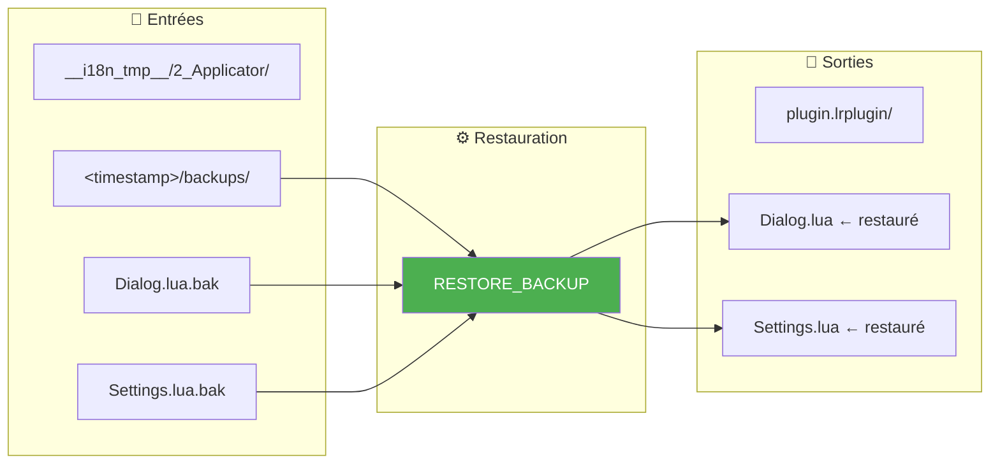
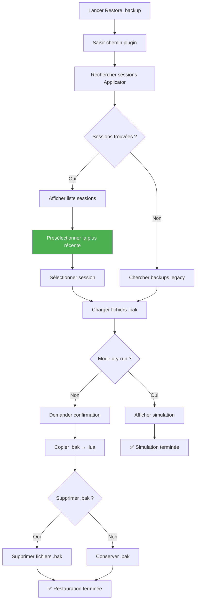
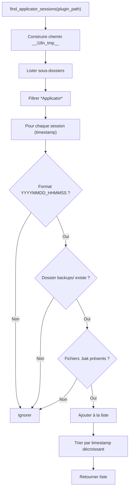
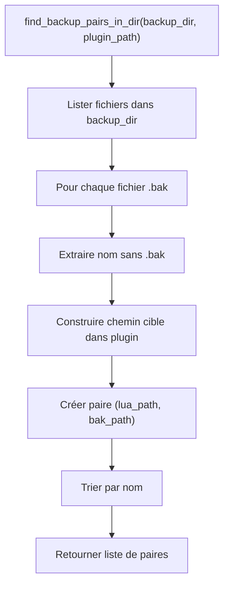
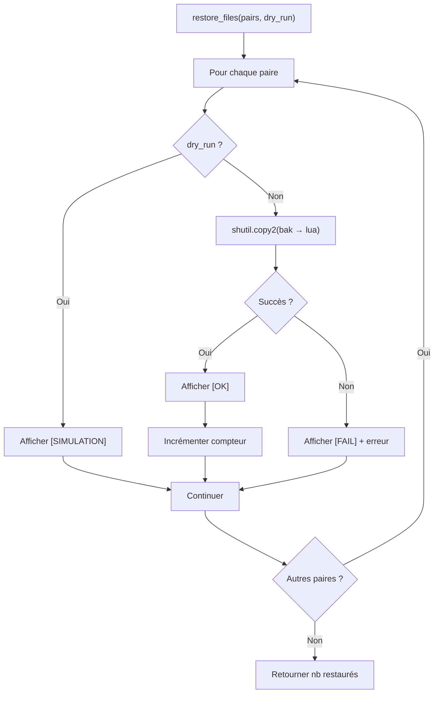
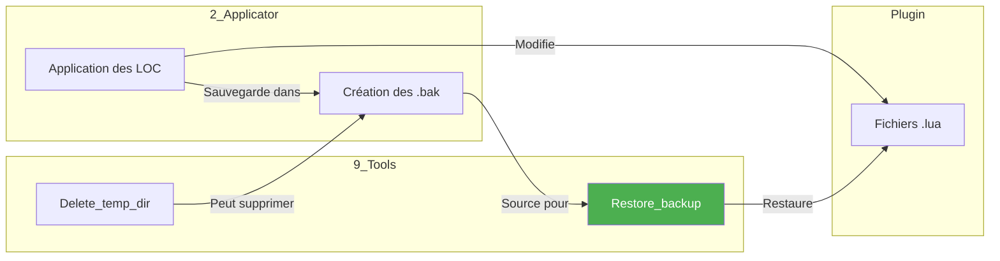

# Restore_backup — Restauration

📚 **Retour à la documentation principale** : [Lisez-moi.md](../Lisez-moi.md)

---

## 🎯 Objectif

***Restore_backup*** restaure les fichiers `.lua` du plugin depuis leurs sauvegardes `.bak` générées par ***Applicator***. Cet outil permet de revenir à l'état précédent après une application incorrecte des localisations.

> **Conseil** : Utilisez le mode **dry-run** (simulation) pour vérifier les fichiers qui seront restaurés avant d'effectuer l'opération réelle.

---

## 📥 Entrées / 📤 Sorties



| Type | Description |
|------|-------------|
| **Entrée** | Fichiers `.bak` dans `__i18n_tmp__/2_Applicator/<timestamp>/backups/` |
| **Sortie** | Fichiers `.lua` restaurés dans le plugin |

---

## 🔄 Fonctionnement

### Algorithme de restauration



### Modes de fonctionnement

| Mode | Description | Fichiers modifiés |
|------|-------------|-------------------|
| **Dry-run** | Simulation sans modification | Aucun |
| **Réel** | Restauration effective | `.lua` écrasés par `.bak` |
| **Réel + suppression** | Restauration + nettoyage | `.lua` écrasés, `.bak` supprimés |

---

## 💻 Utilisation

### Mode interactif (recommandé)

```bash
python Restore_backup.py
```

Le menu interactif guide l'utilisateur à travers :
1. Sélection du plugin
2. Choix de la session de backup
3. Mode dry-run ou réel
4. Confirmation de restauration
5. Suppression optionnelle des `.bak`

### Mode CLI direct

```bash
# Restauration de la dernière session
python Restore_backup.py /path/to/plugin.lrplugin

# Mode simulation
python Restore_backup.py --dry-run /path/to/plugin.lrplugin

# Avec plugin pré-configuré (via LocalisationToolKit)
python Restore_backup.py --default-plugin /path/to/plugin.lrplugin
```

### Options CLI

| Option | Description |
|--------|-------------|
| `<path>` | Chemin du plugin (mode CLI direct) |
| `--dry-run` | Mode simulation (aucune modification) |
| `--default-plugin <path>` | Plugin pré-configuré |
| `--help`, `-h` | Afficher l'aide |

---

## 📋 Exemple de session

### Sélection de session

```
══════════════════════════════════════════════════════════════════════
  RESTAURATION DES FICHIERS .bak (v3.0)
══════════════════════════════════════════════════════════════════════

[OK] Plugin: piwigoPublish.lrplugin
     Chemin: D:\Lightroom\piwigoPublish.lrplugin

[INFO] 3 session(s) Applicator trouvée(s) dans __i18n_tmp__/

Sessions Applicator avec backups disponibles
────────────────────────────────────────────────────────────────────

  1. [DERNIÈRE] 2026-02-01 15:30:45 (14 fichier(s))
  2.            2026-01-28 10:15:22 (12 fichier(s))
  3.            2026-01-25 09:00:00 (10 fichier(s))
  0. Annuler

Choisir une session [1 par défaut]:
```

### Liste des fichiers

```
════════════════════════════════════════════════════════════════════
RECHERCHE DES FICHIERS .bak
════════════════════════════════════════════════════════════════════
Plugin: D:\Lightroom\piwigoPublish.lrplugin
Source: D:\Lightroom\piwigoPublish.lrplugin\__i18n_tmp__\2_Applicator\20260201_153045\backups

[INFO] Fichiers trouvés: 14

  [REMPLACER] Dialog.lua
  [REMPLACER] ExportDialog.lua
  [REMPLACER] Info.lua
  [NOUVEAU]   NewFile.lua
  ...
```

### Résultat de la restauration

```
════════════════════════════════════════════════════════════════════
RESTAURATION
════════════════════════════════════════════════════════════════════

  [OK] Dialog.lua
  [OK] ExportDialog.lua
  [OK] Info.lua
  [OK] NewFile.lua
  ...

Supprimer les fichiers .bak ? [o/N]: o

[INFO] Suppression des .bak

  [OK] Supprimé: Dialog.lua.bak
  [OK] Supprimé: ExportDialog.lua.bak
  ...

[OK] 14 fichier(s) .bak supprimé(s)

════════════════════════════════════════════════════════════════════
RÉSUMÉ
════════════════════════════════════════════════════════════════════
Fichiers restaurés: 14

[OK] Terminé!
```

---

## 🧮 Algorithme détaillé

### Recherche des sessions



### Création des paires de fichiers



### Restauration



---

## ⚠️ Points d'attention

### Mode legacy

Si aucune session Applicator n'est trouvée dans `__i18n_tmp__/`, l'outil recherche les backups "legacy" :

```
[ATTENTION] Aucune session Applicator trouvée dans __i18n_tmp__/
Recherche des backups legacy (.lua.bak à côté des fichiers)...
```

Ce mode cherche les fichiers `.lua.bak` placés directement à côté des fichiers `.lua` (ancienne structure).

### Fichiers [NOUVEAU] vs [REMPLACER]

| Marqueur | Signification |
|----------|---------------|
| `[REMPLACER]` | Le fichier `.lua` existe et sera écrasé |
| `[NOUVEAU]` | Le fichier `.lua` n'existe plus, sera recréé |

### Présélection automatique

La session la plus récente est **présélectionnée par défaut** :
- Marquée `[DERNIÈRE]` dans la liste
- Entrée vide = sélection automatique

```
Choisir une session [1 par défaut]: ↵
```

---

## 🔗 Interactions avec les autres outils



---

## 📚 Ressources

| Élément | Information |
|---------|-------------|
| Module source | `Restore_backup.py` |
| Fonction principale | `main()` |
| Recherche sessions | `find_applicator_sessions()` |
| Paires fichiers | `find_backup_pairs_in_dir()` |
| Paires legacy | `find_backup_pairs_legacy()` |
| Restauration | `restore_files()` |
| Suppression .bak | `delete_backups()` |
| Menu interactif | `interactive_menu()` |
| Sélection session | `select_backup_session()` |
| Projet GitHub | [Adobe_Lightroom_Translation_Plugins_Kit](https://github.com/Gotcha26/Adobe_Lightroom_Translation_Plugins_Kit) |
| Version | 3.0 |
| Date | 2026-02-01 |
