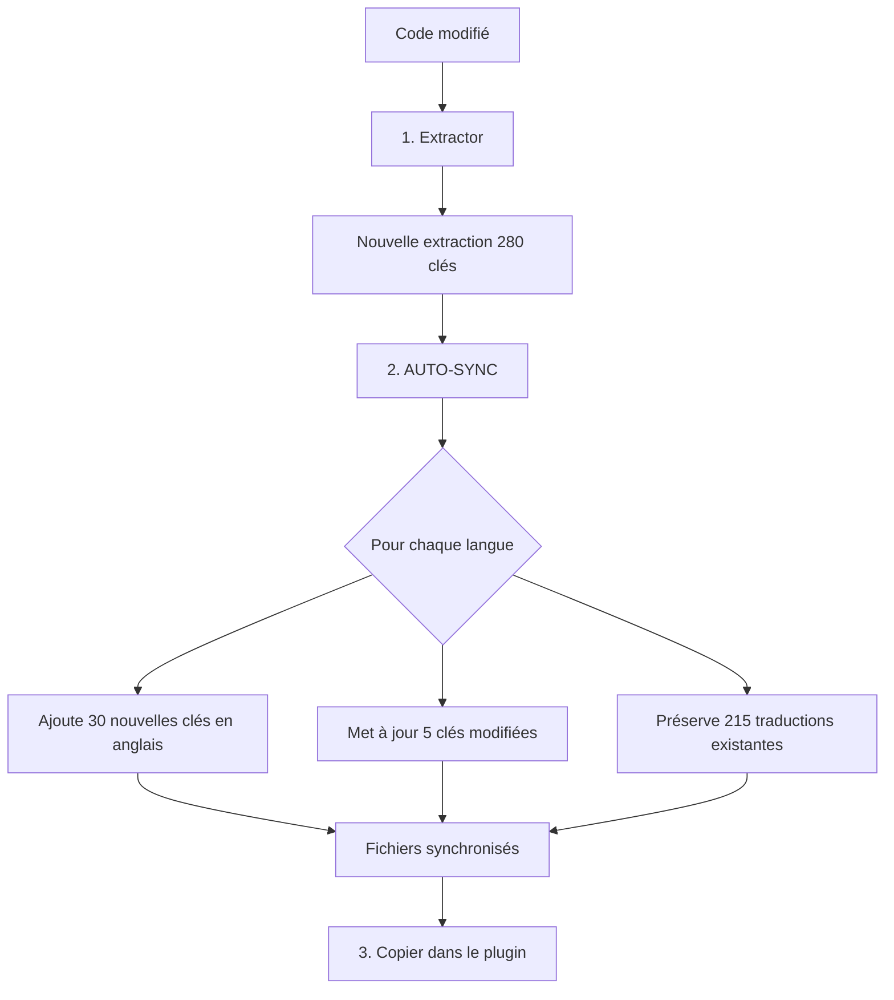

# Guide Développeur : Maintenance et mises à jour

Ce guide vous accompagne pour **maintenir les traductions à jour** après chaque modification de votre code. Votre plugin est déjà multilingue, vous ajoutez ou modifiez des fonctionnalités.

---

## 📋 Situation type

Votre plugin est déjà traduit en plusieurs langues :

```
monPlugin.lrplugin/
├── MonModule.lua                 ← Vous venez de modifier ce fichier
├── NouveauModule.lua             ← Nouveau fichier ajouté
├── TranslatedStrings_en.txt      ← 250 clés (ancienne version)
├── TranslatedStrings_fr.txt      ← 250 clés, 100% traduit
├── TranslatedStrings_de.txt      ← 250 clés, 100% traduit
└── TranslatedStrings_es.txt      ← 250 clés, 100% traduit
```

**Problème** : Vous avez ajouté 30 nouvelles chaînes et modifié 5 chaînes existantes. Les fichiers de traduction ne sont plus à jour.

---

## 🎯 Le workflow AUTO-SYNC

Pour la maintenance quotidienne, **AUTO-SYNC** est la commande à utiliser. Elle synchronise automatiquement tous les fichiers de langue.



---

## Étape 1 : Extraire la nouvelle version

Après avoir développé vos modifications, lancez ***Extractor*** :

```bash
python LocalisationToolKit.py
# Choisir [1] Extractor
```

**Résultat :**
```
__i18n_tmp__/1_Extractor/20260202_140000/
└── TranslatedStrings_en.txt     ← Nouvelle extraction (280 clés)
```

---

## Étape 2 : Synchroniser avec AUTO-SYNC

Lancez ***Translator*** en mode AUTO-SYNC :

```bash
python LocalisationToolKit.py
# Choisir [3] Translator
# Choisir AUTO-SYNC
```

**Ce qui se passe automatiquement :**

| Action | Clés concernées | Résultat |
|--------|-----------------|----------|
| Ajout | 30 nouvelles clés | Ajoutées **en anglais** dans tous les fichiers |
| Modification | 5 clés modifiées | Texte remplacé par la **nouvelle version anglaise** |
| Préservation | 215 clés inchangées | Traductions **conservées** |
| Suppression | Clés obsolètes | Retirées de tous les fichiers |

**Résultat :**
```
__i18n_tmp__/3_Translator/20260202_141000/
├── TranslatedStrings_en.txt     ← 280 clés
├── TranslatedStrings_fr.txt     ← 280 clés (215 FR + 35 EN)
├── TranslatedStrings_de.txt     ← 280 clés (215 DE + 35 EN)
├── TranslatedStrings_es.txt     ← 280 clés (215 ES + 35 EN)
└── sync_report.txt              ← Rapport détaillé
```

---

## Étape 3 : Copier dans le plugin

Copiez les fichiers synchronisés dans votre plugin :

```bash
cp __i18n_tmp__/3_Translator/20260202_141000/TranslatedStrings_*.txt ./monPlugin.lrplugin/
```

---

## Étape 4 : Faire traduire les nouvelles clés

Les 35 nouvelles/modifiées clés apparaissent **en anglais** dans les fichiers FR, DE, ES. Deux options :

### Option A : Traduire vous-même
Ouvrez chaque fichier et recherchez les clés en anglais pour les traduire.

### Option B : Envoyer aux traducteurs
Envoyez les fichiers mis à jour aux traducteurs en leur indiquant de chercher les clés en anglais.

> **Astuce** : Les traducteurs peuvent facilement repérer les clés non traduites car elles sont en anglais au milieu de textes traduits.

---

## Étape 5 : Committer les changements

```bash
git add monPlugin.lrplugin/TranslatedStrings_*.txt
git commit -m "i18n: Synchronize translation files"
git push
```

---

## 📋 Résumé du workflow quotidien

```
┌─────────────────────────────────────────────────────────────┐
│ DÉVELOPPEMENT                                               │
│ Codez normalement avec du texte en dur ou des LOC()         │
└─────────────────────────────────────────────────────────────┘
                           │
                           ▼
┌─────────────────────────────────────────────────────────────┐
│ SYNCHRONISATION (quelques minutes)                          │
├─────────────────────────────────────────────────────────────┤
│ 1. [Option 1] Extractor                                     │
│ 2. [Option 3] Translator → AUTO-SYNC                        │
│ 3. Copier les fichiers dans le plugin                       │
│ 4. Commit + Push                                            │
└─────────────────────────────────────────────────────────────┘
                           │
                           ▼
┌─────────────────────────────────────────────────────────────┐
│ TRADUCTION (asynchrone)                                     │
│ Les traducteurs complètent les clés en anglais              │
└─────────────────────────────────────────────────────────────┘
```

---

## ⚠️ Points d'attention

### Les clés modifiées perdent leur traduction

Quand vous modifiez le texte anglais d'une clé existante, AUTO-SYNC remplace la traduction par le nouveau texte anglais. C'est volontaire : la traduction existante n'est plus valide.

**Exemple :**
```
AVANT (TranslatedStrings_fr.txt) :
"$$$/Plugin/Button/Save=Enregistrer"

Code modifié : "Save changes" au lieu de "Save"

APRÈS AUTO-SYNC :
"$$$/Plugin/Button/Save=Save changes"  ← À retraduire
```

### Les clés supprimées disparaissent

Si vous supprimez une chaîne de votre code, la clé correspondante est retirée de tous les fichiers de traduction lors de l'AUTO-SYNC.

---

## 🔗 Ressources

- [Guide d'installation](01_Installation.md) — Pour un nouveau plugin
- [Workflows avancés](03_Avance.md) — COMPARE, EXTRACT, INJECT
- [Documentation technique Translator](../../../3_Translator/__doc/fr/Lisez-moi.md)
- [Comparaison des workflows](../WORKFLOWS_COMPARAISON.md)

---

| 📜 | Traçabilité |  |  |
|--|--|--|--|
| **Nom** | *02_Dev_Maintenance.md* | **Version** | 1.0 |
| **Type** | Guide développeurs - Maintenance | **Langue** | FR - *[EN](../../en/trad/03_Dev_Avanced.md)* |
| **Projet GitHub** | [Adobe Lightroom Translation Toolkit](https://github.com/Gotcha26/Adobe_Lightroom_Translation_Plugins_Kit) | **Date** | 2026-02-02 |
| **Licence** | [MIT](../../../LICENSE) | | |
