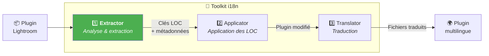
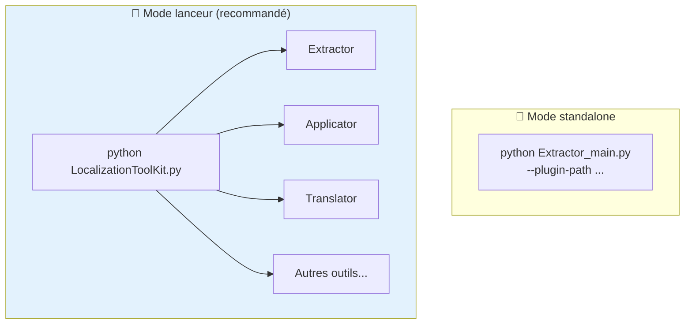
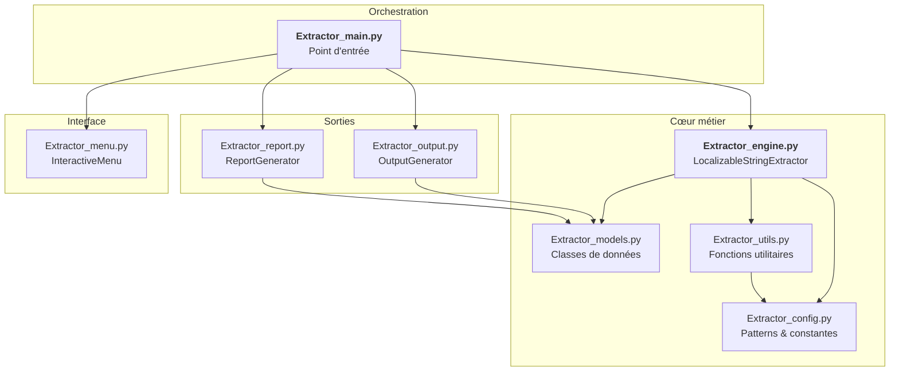
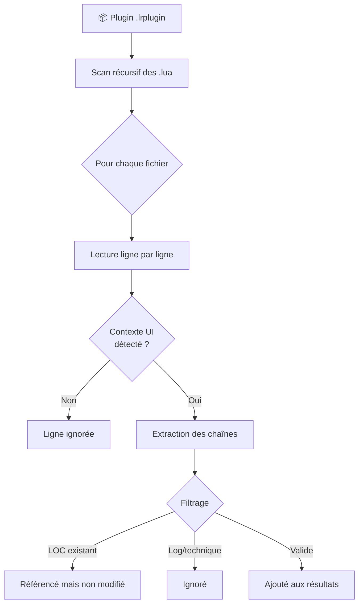
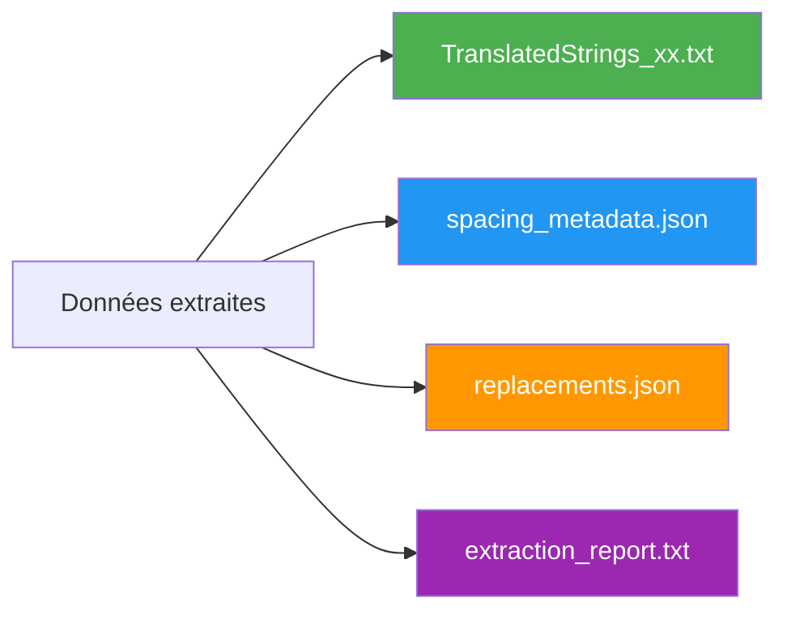
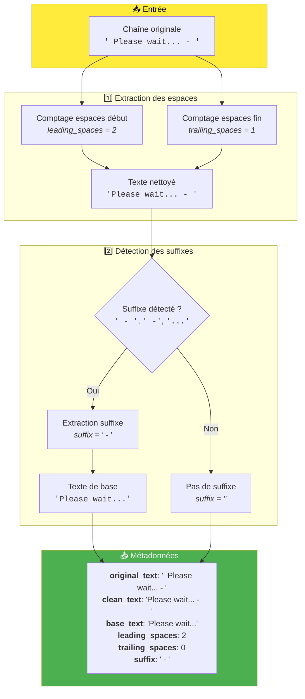
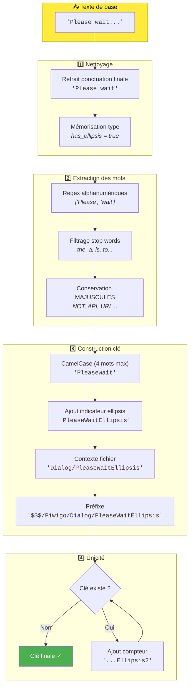

# Extractor - Documentation technique

Ce document décrit en détail le fonctionnement de l'outil ***Extractor***, premier maillon de la chaîne de localisation du toolkit. Il analyse le code Lua d'un plugin Lightroom et en extrait automatiquement toutes les chaînes de texte destinées à l'interface utilisateur, en vue de leur traduction.

**Public visé** : Développeurs de plugins Lightroom, contributeurs avancés souhaitant comprendre le processus d'extraction.

---

## 📑 Plan du document

1. [Vue d'ensemble](#-vue-densemble) — Rôle et positionnement dans le workflow
2. [Installation et prérequis](#-installation-et-prérequis) — Ce qu'il faut pour démarrer
3. [Architecture](#-architecture) — Structure des fichiers et responsabilités
4. [Utilisation](#-utilisation) — Modes interactif et CLI
5. [Fichiers générés](#-fichiers-générés) — Description des sorties
6. [Fonctionnement détaillé](#-fonctionnement-détaillé) — Les 3 phases d'extraction
7. [Patterns d'extraction](#-patterns-dextraction) — Ce qui est détecté (et ignoré)
8. [Gestion des espaces et suffixes](#-gestion-des-espaces-et-suffixes) — Préservation du formatage
9. [Génération des clés LOC](#-génération-des-clés-loc) — Algorithme et exemples
10. [Cas d'usage avancés](#-cas-dusage-avancés) — Scénarios particuliers
11. [Dépannage](#-dépannage) — Résolution des problèmes courants
12. [FAQ technique](#-faq-technique) — Questions fréquentes
13. [Changelog](#-changelog---suivi-des-modifications) — Historique des évolutions

---

## 🔭 Vue d'ensemble

***Extractor*** est le **premier outil** de la chaîne de localisation. Son rôle est d'analyser les fichiers Lua d'un plugin Lightroom et d'extraire automatiquement toutes les chaînes de texte qui devraient être localisées via le système `LOC "$$$/.../..."` du SDK Adobe.

### Positionnement dans le workflow



> ***Extractor*** travaille en **lecture seule** sur le plugin. Il ne modifie aucun fichier source — cette tâche revient à ***Applicator***.

---

## 🛠 Installation et prérequis

### Prérequis

- **Python 3.8+** installé sur votre système
- Aucune dépendance externe requise (bibliothèque standard uniquement)

### Structure des fichiers

```
1_Extractor/
├── Extractor_main.py      ← Point d'entrée, orchestration
├── Extractor_config.py    ← Patterns regex et constantes
├── Extractor_models.py    ← Classes de données
├── Extractor_utils.py     ← Fonctions utilitaires
├── Extractor_engine.py    ← Moteur d'extraction principal
├── Extractor_output.py    ← Génération des fichiers de sortie
├── Extractor_report.py    ← Génération des rapports
├── Extractor_menu.py      ← Interface interactive
└── __doc/
    └── fr/
        └── Lisez-moi.md   ← Ce fichier
```

### Utilisation standalone vs lanceur du toolkit

***Extractor*** est conçu pour être **indépendant** et facilement déployable en ligne de commande (CLI).

Cependant, l'utilisation via le lanceur central ***LocalizationToolKit.py*** est généralement préférée car il :
- Centralise tous les outils du toolkit
- Conserve en mémoire le contexte du plugin en cours de traitement
- Transmet automatiquement les variables globales aux outils (chemin du plugin, etc.)
- Offre une navigation fluide entre les différentes étapes



---

## 🚀 Utilisation

### Mode interactif (recommandé)

Lancez simplement le script sans argument :

```bash
python Extractor_main.py
```

Un menu "Ready to go" s'affiche avec la configuration actuelle :

```
══════════════════════════════════════════════════════════════
        EXTRACTOR - Extraction des chaînes localisables
══════════════════════════════════════════════════════════════

Configuration:

  1. Plugin ciblé       : D:\plugins\monPlugin.lrplugin [OK]
  2. Sortie             : <plugin>/__i18n_tmp__/Extractor/<timestamp>/ (auto)
  3. Préfixe LOC        : $$$/MonPlugin
  4. Langue extraite    : en
  5. Exclusions         : (aucun)
  6. Long. min chaînes  : 3
  7. Ignorer logs       : Oui

──────────────────────────────────────────────────────────────
  ENTRÉE  Lancer l'extraction
  1-7     Modifier une option
  0       Quitter
```

Appuyez sur **Entrée** pour lancer l'extraction, ou tapez un chiffre pour modifier une option.

### Mode CLI

Pour une utilisation scriptée ou automatisée :

```bash
python Extractor_main.py --plugin-path /chemin/vers/plugin.lrplugin [OPTIONS]
```

#### Options disponibles

| Option | Description | Défaut | Exemple |
|--------|-------------|--------|---------|
| `--plugin-path` | Chemin du plugin **(obligatoire)** | — | `./monPlugin.lrplugin` |
| `--output-dir` | Répertoire de sortie personnalisé | `<plugin>/__i18n_tmp__/Extractor/` | `./output` |
| `--prefix` | Préfixe des clés LOC | `$$$/Piwigo` | `$$$/MonApp` |
| `--lang` | Code langue de base | `en` | `fr`, `de`, `es` |
| `--exclude` | Fichiers à exclure (répétable) | — | `--exclude test.lua` |
| `--min-length` | Longueur minimale des chaînes | `3` | `5` |
| `--no-ignore-log` | Inclure les lignes de log | `false` | — |

#### Exemples

```bash
# Extraction standard
python Extractor_main.py --plugin-path ./piwigoPublish.lrplugin

# Avec préfixe personnalisé
python Extractor_main.py --plugin-path ./myPlugin.lrplugin --prefix '$$$/MyApp'

# Plugin en français avec exclusions
python Extractor_main.py \
  --plugin-path ./monPlugin.lrplugin \
  --lang fr \
  --prefix '$$$/MonApp' \
  --exclude test.lua \
  --exclude debug.lua
```

---

## 📄 Fichiers générés

Les fichiers sont créés dans : `<plugin>/__i18n_tmp__/Extractor/<timestamp>/`

### `TranslatedStrings_xx.txt`

Fichier principal au format SDK Lightroom, directement utilisable dans le plugin :

```lua
-- =============================================================================
-- Plugin Localization - EN
-- Generated: 2026-01-30 15:00:00
-- Total keys: 124
-- =============================================================================

-- -----------------------------------------------------------------------------
-- IMPORTANT NOTES FOR TRANSLATORS:
-- -----------------------------------------------------------------------------
-- 1. DO NOT translate the following patterns (keep them exactly as-is):
--    - %s, %d, %f (format specifiers)
--    - %1, %2, %3... (numbered placeholders)
--    - \n, \t (escape sequences)
--    - Technical terms in UPPERCASE (API, URL, HTTP, JSON, etc.)
--
-- 2. PRESERVE spaces around text exactly as they appear
-- -----------------------------------------------------------------------------

-- Dialog
"$$$/Piwigo/Dialog/Submit=Submit"
"$$$/Piwigo/Dialog/Cancel=Cancel"
"$$$/Piwigo/Dialog/PleaseWaitEllipsis=Please wait..."
```

### `spacing_metadata.json`

Métadonnées pour la reconstruction des espaces et suffixes :

```json
{
  "generated": "2026-01-30T15:00:00",
  "total_keys_with_spacing": 82,
  "metadata": {
    "$$$/Piwigo/Upload/Processing": {
      "original_text": "  Processing - ",
      "clean_text": "Processing - ",
      "base_text": "Processing",
      "leading_spaces": 2,
      "trailing_spaces": 0,
      "suffix": " - "
    }
  }
}
```

### `replacements.json`

Instructions détaillées pour ***Applicator*** :

```json
{
  "files": {
    "MyDialog.lua": {
      "total_replacements": 15,
      "replacements": [
        {
          "line_num": 42,
          "original_line": "title = \"Submit\",",
          "replaced_line": "title = LOC \"$$$/Piwigo/Dialog/Submit=Submit\",",
          "members": [
            {
              "original_text": "Submit",
              "loc_key": "$$$/Piwigo/Dialog/Submit",
              "leading_spaces": 0,
              "trailing_spaces": 0,
              "suffix": ""
            }
          ]
        }
      ]
    }
  }
}
```

### `extraction_report.txt`

Rapport détaillé avec statistiques complètes et légende des émojis :

```
================================================================================
RAPPORT D'EXTRACTION DES CHAÎNES LOCALISABLES
================================================================================

Date: 2026-01-30 15:00:00
Plugin: ./piwigoPublish.lrplugin
Préfixe: $$$/Piwigo

LÉGENDE:
  ⬅️   = Espace(s) en DÉBUT de chaîne
  ➡️   = Espace(s) en FIN de chaîne
  🔚  = Suffixe détecté (" - ", " -", "...")
  🔗  = Membre d'une chaîne concaténée

STATISTIQUES
--------------------------------------------------------------------------------
Fichiers analysés          : 19
Fichiers avec chaînes      : 14
Total chaînes trouvées     : 381
Clés uniques               : 272
Lignes de log ignorées     : 45
Chaînes techniques ignorées: 23
...
```

---

## 🏗 Architecture

### Diagramme des dépendances



Chaque module a une responsabilité claire :

| Module | Responsabilité |
|--------|----------------|
| `Extractor_main.py` | Orchestration, parsing des arguments CLI |
| `Extractor_engine.py` | Analyse des fichiers Lua, extraction des chaînes |
| `Extractor_config.py` | Définition des patterns regex, listes d'exclusion |
| `Extractor_models.py` | Classes de données (`ExtractedString`, `ExtractionStats`...) |
| `Extractor_utils.py` | Extraction des espaces, génération des clés LOC |
| `Extractor_output.py` | Génération de `TranslatedStrings_xx.txt`, JSON |
| `Extractor_report.py` | Génération du rapport détaillé |
| `Extractor_menu.py` | Interface menu interactif |

---

## ⚙ Fonctionnement détaillé

L'extraction se déroule en **3 phases** successives :

### Phase 1 : Analyse des fichiers



Le moteur parcourt tous les fichiers `.lua` du plugin et détecte les **contextes UI** (propriétés `title`, `label`, appels `LrDialogs`, etc.).

### Phase 2 : Extraction et métadonnées

Pour chaque chaîne détectée, ***Extractor*** extrait :

```
Chaîne originale : "  Hello World - "
                    ↓
┌─────────────────────────────────────────────┐
│  Texte de base  : "Hello World"             │
│  Espaces avant  : 2                         │
│  Espaces après  : 0 (remplacés par suffixe) │
│  Suffixe        : " - "                     │
│  Clé LOC        : $$$/Piwigo/File/HelloWorld│
└─────────────────────────────────────────────┘
```

Ces métadonnées sont **essentielles** pour que ***Applicator*** puisse reconstruire exactement la chaîne originale avec son formatage.

### Phase 3 : Génération des fichiers



---

## 🔍 Patterns d'extraction

### Guillemets doubles uniquement

> **Important** : ***Extractor*** ne traite que les chaînes entre **guillemets doubles** (`"`).

Les guillemets simples (`'`) ne sont volontairement **pas supportés**, conformément aux recommandations du SDK Adobe Lightroom. Si votre plugin utilise des guillemets simples, convertissez-les avant l'extraction.

```lua
title = "Hello World"   -- ✓ Extrait (guillemets doubles)
title = 'Hello World'   -- ✗ Ignoré (guillemets simples)
```

#### Aide pour retrouver les guillets simples

**Regex** : `LrDialogs\.(\w+)\s*\(\s*'([^']*)'`

### Contextes UI reconnus

***Extractor*** détecte automatiquement plusieurs contextes dans le code Lua :

```lua
-- 1. Propriétés UI standard
f:static_text {
    title = "Hello World",      -- ✓ Extrait
    tooltip = "Une info-bulle", -- ✓ Extrait
}

-- 2. Dialogues LrDialogs
LrDialogs.message("Titre", "Message")        -- ✓ Extrait les 2 chaînes
LrDialogs.confirm("Êtes-vous sûr ?")         -- ✓ Extrait
LrDialogs.showError("Erreur survenue")       -- ✓ Extrait

-- 3. Erreurs utilisateur
LrErrors.throwUserError("Fichier invalide")  -- ✓ Extrait

-- 4. Items de menu popup
f:popup_menu {
    items = {
        { title = "Option 1", value = "opt1" },  -- ✓ Extrait "Option 1"
        { title = "Option 2", value = "opt2" },  -- ✓ Extrait "Option 2"
    }
}

-- 5. Concaténations de chaînes
local msg = "Traitement de " .. count .. " fichiers"  -- ✓ Extrait les 2 parties

-- 6. Messages de statut
callStatus.statusMsg = "Téléchargement..."   -- ✓ Extrait
```

### Patterns ignorés

```lua
-- Logs (ignorés par défaut)
log:info("Debug info")           -- ✗ Ignoré
logError("Erreur technique")     -- ✗ Ignoré

-- Valeurs techniques
method = "POST"                  -- ✗ Ignoré (méthode HTTP)
format = "application/json"      -- ✗ Ignoré (type MIME)
url = "https://api.example.com"  -- ✗ Ignoré (URL)

-- Clés LOC existantes
title = LOC "$$$/App/Title=Title"  -- ✗ Déjà localisé

-- Chaînes trop courtes
x = "OK"                         -- ✗ Ignoré si min_length > 2

-- Identifiants techniques
color = "red"                    -- ✗ Ignoré (snake_case, minuscules)
```

### Liste complète des contextes détectés

| Contexte | Pattern | Exemple |
|----------|---------|---------|
| `title` | `title = "..."` | Titre de widget |
| `label` | `label = "..."` | Label de champ |
| `tooltip` | `tooltip = "..."` | Info-bulle |
| `placeholder` | `placeholder = "..."` | Texte indicatif |
| `message` | `message = "..."` | Message |
| `actionVerb` | `actionVerb = "..."` | Bouton d'action |
| `cancelVerb` | `cancelVerb = "..."` | Bouton annuler |
| `LrDialogs.*` | `LrDialogs.message(...)` | Dialogues système |
| `LrErrors.*` | `LrErrors.throwUserError(...)` | Erreurs utilisateur |
| `statusMsg` | `statusMsg = "..."` | Messages de statut |

---

## 📐 Gestion des espaces et suffixes

***Extractor*** préserve intelligemment le formatage pour garantir un rendu identique après application.

### Espaces de formatage

```lua
-- Avant extraction
title = "  Hello World  "

-- Métadonnées extraites
{
  "base_text": "Hello World",
  "leading_spaces": 2,
  "trailing_spaces": 2
}

-- Après application par Applicator
title = "  " .. LOC "$$$/App/HelloWorld=Hello World" .. "  "
```

### Suffixes courants

Les suffixes ` - `, ` -` et `...` sont détectés et extraits séparément :

```lua
-- Avant
label = "Chargement..."

-- Métadonnées
{
  "base_text": "Chargement",
  "suffix": "..."
}

-- Après application
label = LOC "$$$/App/Chargement=Chargement" .. "..."
```

> **Pourquoi ?** Cela évite de multiplier les clés de traduction pour des variations mineures (`"Loading"` vs `"Loading..."` vs `"Loading - "`).

### Concaténations complexes

```lua
-- Avant
message = "  Traitement de " .. count .. " fichiers en cours..."

-- Extraction : 2 membres
-- Membre 1: "  Traitement de " → base="Traitement de", leading=2, trailing=1
-- Membre 2: " fichiers en cours..." → base="fichiers en cours", leading=1, suffix="..."

-- Après application
message = "  " .. LOC "$$$/App/TraitementDe=Traitement de" .. " " .. count .. " " .. LOC "$$$/App/FichiersEnCours=fichiers en cours" .. "..."
```

---

## 🔑 Génération des clés LOC

### Algorithme complet

Le processus de traitement d'une chaîne comporte **deux étapes principales** : l'extraction des métadonnées de formatage, puis la génération de la clé LOC.

#### Étape 1 : Extraction des métadonnées



> Quand un suffixe est détecté, les `trailing_spaces` sont remis à 0 car le suffixe inclut généralement l'espace de séparation.

#### Étape 2 : Génération de la clé LOC



### Exemples de génération

| Texte original | Fichier | Clé générée |
|----------------|---------|-------------|
| `"Submit"` | `PWDialog.lua` | `$$$/Piwigo/Dialog/Submit` |
| `"Please wait..."` | `PWUpload.lua` | `$$$/Piwigo/Upload/PleaseWaitEllipsis` |
| `"API Key:"` | `PWSettings.lua` | `$$$/Piwigo/Settings/APIKey` |
| `"Connection NOT successful"` | `PWConnect.lua` | `$$$/Piwigo/Connect/ConnectionNOTSuccessful` |

> Les mots en MAJUSCULES sont conservés (ex: `NOT`) car ils représentent souvent une emphase intentionnelle.

### Gestion des collisions

Quand plusieurs chaînes génèrent la même clé, un suffixe numérique est ajouté :

```
$$$/Piwigo/Dialog/AreYouSure   → "Are you sure you want to delete?"
$$$/Piwigo/Dialog/AreYouSure2  → "Are you sure you want to continue?"
$$$/Piwigo/Dialog/AreYouSure3  → "Are you sure you want to reset?"
```

---

## 🎓 Cas d'usage avancés

### Plugin initialement en français

Si votre plugin est écrit en français et que vous souhaitez le localiser :

```bash
python Extractor_main.py \
  --plugin-path ./monPlugin.lrplugin \
  --lang fr \
  --prefix '$$$/MonApp'
```

Cela génère `TranslatedStrings_fr.txt`. Vous pourrez ensuite créer `TranslatedStrings_en.txt` en dupliquant et traduisant ce fichier.

### Réexécution sur un projet partiellement localisé

***Extractor*** détecte automatiquement les clés LOC existantes et ne les réextrait pas. Vous pouvez relancer l'extraction après avoir ajouté du nouveau code :

```bash
# Première extraction
python Extractor_main.py --plugin-path ./plugin.lrplugin

# ... développement, nouvelles fonctionnalités ...

# Nouvelle extraction (ne touche pas aux clés existantes)
python Extractor_main.py --plugin-path ./plugin.lrplugin
```

Les clés déjà localisées apparaissent dans le rapport mais ne sont pas ajoutées aux fichiers de remplacement.

### Extraction ciblée avec exclusions

```bash
python Extractor_main.py \
  --plugin-path ./plugin.lrplugin \
  --exclude test.lua \
  --exclude debug.lua \
  --exclude vendor/JSON.lua
```

> `JSON.lua` est exclu par défaut car c'est une bibliothèque technique.

### Intégration CI/CD

Exemple de script bash pour automatisation :

```bash
#!/bin/bash
PLUGIN_PATH="./monPlugin.lrplugin"

python 1_Extractor/Extractor_main.py \
  --plugin-path "$PLUGIN_PATH" \
  --prefix '$$$/MonApp'

if [ $? -eq 0 ]; then
  echo "✓ Extraction réussie"
else
  echo "✗ Échec de l'extraction"
  exit 1
fi
```

---

## 🔧 Dépannage

### Aucune chaîne extraite

**Causes possibles :**
- `--min-length` trop élevé
- Toutes les chaînes sont déjà localisées
- Chemin du plugin incorrect
- Patterns non reconnus

**Solutions :**
```bash
# Réduire la longueur minimale
python Extractor_main.py --plugin-path ./plugin.lrplugin --min-length 1

# Vérifier le chemin
ls ./plugin.lrplugin/*.lua

# Consulter le rapport pour comprendre les exclusions
```

### Trop de chaînes extraites

Si des messages de log sont extraits par erreur, vérifiez que vous n'utilisez pas `--no-ignore-log`. Les logs sont ignorés par défaut.

### Caractères mal encodés

Tous les fichiers sont traités en UTF-8. Si vous voyez des caractères incorrects :

```bash
# Vérifier l'encodage (Linux/Mac)
file --mime-encoding *.lua

# Convertir si nécessaire
iconv -f ISO-8859-1 -t UTF-8 fichier.lua > fichier_utf8.lua
```

### Clés LOC trop longues

Si les clés générées sont illisibles :
1. Raccourcissez les textes originaux dans le code
2. **Attention** : Si vous modifiez manuellement `TranslatedStrings_xx.txt`, mettez aussi à jour `replacements.json`

---

## ❓ FAQ technique

### Puis-je modifier les patterns de détection ?

Oui, éditez `Extractor_config.py`. Les patterns sont définis dans `UI_CONTEXT_PATTERNS` :

```python
UI_CONTEXT_PATTERNS: List[tuple] = [
    ('title', re.compile(r'\btitle\s*=\s*')),
    ('mon_nouveau_pattern', re.compile(r'\bmonPattern\s*=\s*')),  # Ajout
    ...
]
```

### Les métadonnées sont-elles indispensables ?

Oui. Sans elles, ***Applicator*** ne pourrait pas reconstruire exactement les chaînes originales avec leurs espaces et suffixes.

### Puis-je versionner les fichiers générés ?

| Fichier | À versionner ? | Raison |
|---------|----------------|--------|
| `TranslatedStrings_xx.txt` | ✅ Oui | Fichier de traduction final |
| `__i18n_tmp__/` | ❌ Non | Dossier temporaire de travail |

Ajoutez `__i18n_tmp__/` à votre `.gitignore`.

### Performances typiques

| Taille du plugin | Temps d'exécution |
|------------------|-------------------|
| Petit (5-10 fichiers) | < 1 seconde |
| Moyen (20-30 fichiers) | 2-3 secondes |
| Grand (50+ fichiers) | 5-10 secondes |

---

## 📋 Changelog - Suivi des modifications

| Version | Date | Modifications |
|---------|------|---------------|
| 5.2 | 2026-02-02 | Nettoyage |
| 5.1 | 2026-01-30 | Menu interactif "Ready to go", centralisation des outputs dans `__i18n_tmp__/` |
| 5.0 | 2026-01-29 | Refactoring complet en modules séparés, support multi-ligne |
| 4.x | 2025-01-21 | Gestion des concaténations, détection des suffixes |
| 3.x | 2025-12-20 | Ajout des métadonnées d'espaces |
| 2.x | 2026-01-10 | Patterns UI étendus |
| 1.0 | 2026-01-01 | Version initiale |

---

## 📚 Ressources et crédits

| Élément | Information |
|---------|-------------|
| SDK Lightroom | [Adobe Developer Console](https://developer.adobe.com/console) |
| Format LOC | `LOC "$$$/Key=Default"` (valeur par défaut obligatoire) |
| Python regex | [Documentation re](https://docs.python.org/3/library/re.html) |

---

| 📜 | Traçabilité |  |  |
|--|--|--|--|
| **Nom** | *Lisez-moi.md* | **Version** | 5.2 |
| **Type** | Guide utilisateur EXTRACTOR - Avancé | **Langue** | FR - *[EN](../en/README.md)* |
| **Projet GitHub** | [Adobe Lightroom Translation Toolkit](https://github.com/Gotcha26/Adobe_Lightroom_Translation_Plugins_Kit) | **Date** | 2026-02-02 |
| **Licence** | Open source | | |
