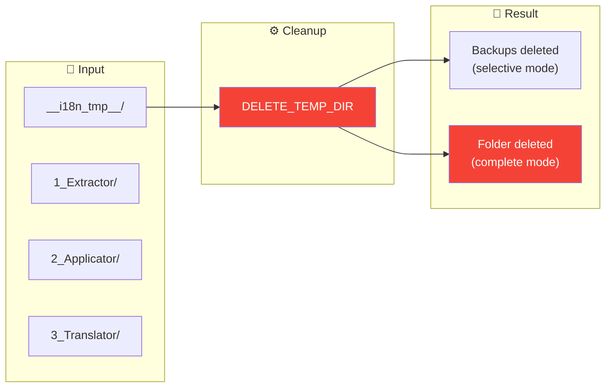
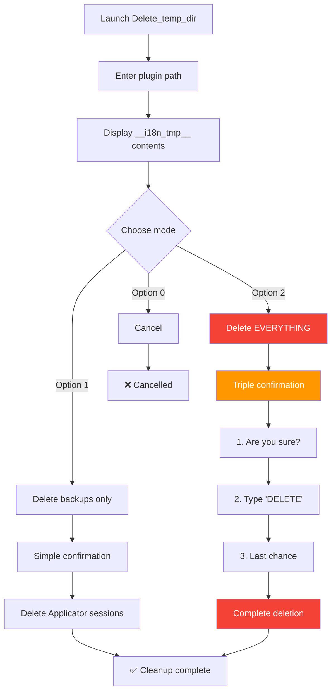
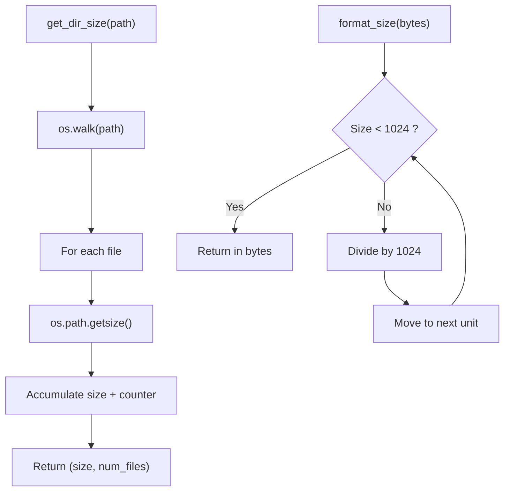
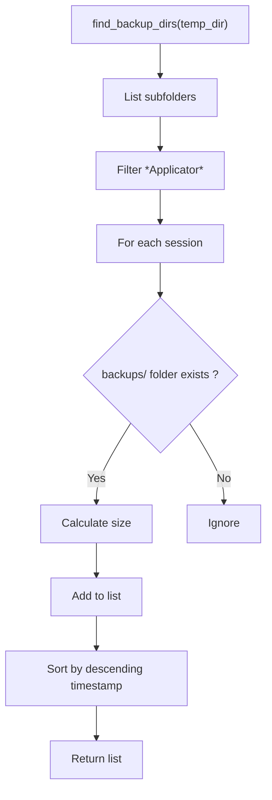

# Delete_temp_dir — Cleanup

📚 **Back to main documentation**: [README.md](../README.md)

---

## 🎯 Objective

***Delete_temp_dir*** deletes all or part of the temporary folder `__i18n_tmp__` generated by the toolkit. This tool allows you to free up disk space and start fresh.

> **Warning**: Some deletions are **irreversible**. The tool requests confirmations appropriate to the risk level.

---

## 📥 Inputs / 📤 Outputs



| Type | Description |
|------|-------------|
| **Input** | Plugin `__i18n_tmp__` folder |
| **Output (mode 1)** | Applicator sessions deleted (backups) |
| **Output (mode 2)** | `__i18n_tmp__` folder completely deleted |

---

## 🔄 How It Works

### Deletion Modes

The tool offers two deletion modes with different confirmation levels:



### Mode Comparison

| Aspect | Mode 1: Backups | Mode 2: Everything |
|--------|-----------------|-------------------|
| **Target** | `2_Applicator/` sessions | Complete `__i18n_tmp__/` folder |
| **Risk** | Medium | High |
| **Confirmation** | Simple (Y/N) | Triple (Y/N + keyword + Y/N) |
| **Recoverable** | No | No |
| **Preserves** | Extractions, translations | Nothing |

---

## 💻 Usage

### Interactive Mode (Recommended)

```bash
python Delete_temp_dir.py
```

The tool displays an interactive menu with information about the folder contents.

### Pre-configured Plugin Mode

```bash
python Delete_temp_dir.py --default-plugin ./plugin.lrplugin
```

Automatically used by ***LocalizationToolKit.py*** to pass the plugin path.

### CLI Options

| Option | Description |
|--------|-------------|
| `--default-plugin <path>` | Pre-configured plugin path |
| `--help`, `-h` | Display help |

---

## 📋 Example Session

### Initial Display

```
══════════════════════════════════════════════════════════════════════
  TEMPORARY FOLDER CLEANUP (v2.0)
══════════════════════════════════════════════════════════════════════

[OK] Plugin: piwigoPublish.lrplugin
     Path: D:\Lightroom\piwigoPublish.lrplugin

Temporary folder      : __i18n_tmp__
Full path             : D:\Lightroom\piwigoPublish.lrplugin\__i18n_tmp__

══════════════════════════════════════════════════════════════════════
  TEMPORARY FOLDER CONTENTS
══════════════════════════════════════════════════════════════════════

  1_Extractor               :   12 files, 45.2 KB
  2_Applicator              :   28 files, 156.8 KB
  3_Translator              :    8 files, 23.1 KB

────────────────────────────────────────────────────────────────────
TOTAL: 48 files, 225.1 KB
────────────────────────────────────────────────────────────────────
```

### Selection Menu

```
What do you want to delete?
────────────────────────────────────────────────────────────────────

  1. Delete ONLY backups
     2 backup session(s) • 28 files • 156.8 KB

  2. Delete ENTIRE temporary folder
     All contents • 48 files • 225.1 KB

  0. Cancel

Your choice (0-2):
```

### Triple Confirmation (Mode 2)

```
!!!!!!!!!!!!!!!!!!!!!!!!!!!!!!!!!!!!!!!!!!!!!!!!!!!!!!!!!!!!
!!! WARNING - IRREVERSIBLE OPERATION !!!
!!!!!!!!!!!!!!!!!!!!!!!!!!!!!!!!!!!!!!!!!!!!!!!!!!!!!!!!!!!!

This operation will PERMANENTLY DELETE:
  D:\Lightroom\piwigoPublish.lrplugin\__i18n_tmp__

You will lose:
  - All previous extractions
  - All backup files (.bak)
  - All tool outputs

Step 1/3: Initial confirmation
Do you really want to delete this folder? [y/N]: y

Step 2/3: Safety confirmation
Type 'DELETE' to confirm: DELETE

Step 3/3: Last chance
Final confirmation - Are you ABSOLUTELY sure? [y/N]: y
```

---

## 🧮 Detailed Algorithm

### Size Calculation



### Backup Search



---

## ⚠️ Points of Attention

### Locked Files

If files are open by another program, deletion will fail:

```
[ERROR] Permission denied: [WinError 32]
```

**Solutions**:
1. Close Lightroom Classic
2. Close all code editors
3. Close file explorer
4. Run as administrator if necessary

### Backups Not Found

If no backups are found, option 1 is disabled:

```
  1. Delete ONLY backups (no backups found)
```

This can happen if:
- Applicator has never been run
- The `--no-backup` option was used
- Backups have already been deleted

---

## 📚 Resources

| Element | Information |
|---------|-------------|
| Source module | `Delete_temp_dir.py` |
| Main function | `main()` |
| Size calculation | `get_dir_size()` |
| Backup search | `find_backup_dirs()` |
| Deletion menu | `select_deletion_mode()` |
| Confirmation | `confirm_deletion()` |
| Deletion | `delete_paths()` |

---

| 📜 | Traceability |  |  |
|--|--|--|--|
| **Name** | *DELETE_TEMP_DIR.md* | **Version** | 2.0 |
| **Type** | User Guide - DELETE Advanced | **Language** | EN - *[FR](../../fr/outils/DELETE_TEMP_DIR.md)* |
| **GitHub Project** | [Adobe Lightroom Translation Toolkit](https://github.com/Gotcha26/Adobe_Lightroom_Translation_Plugins_Kit) | **Date** | 2026-02-02 |
| **License** | Open source | | |
