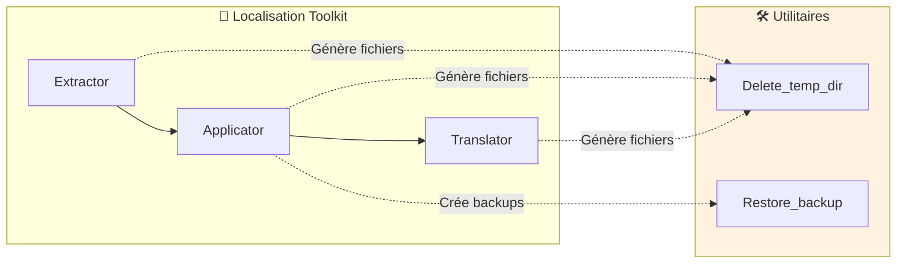
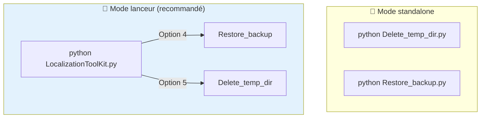
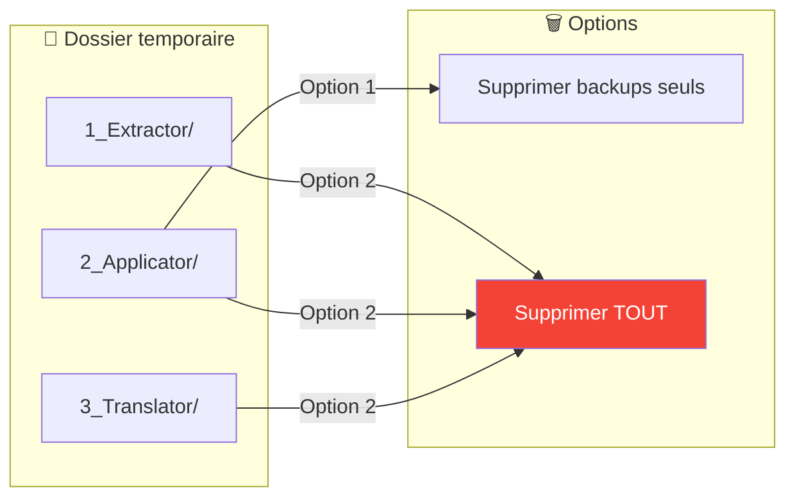
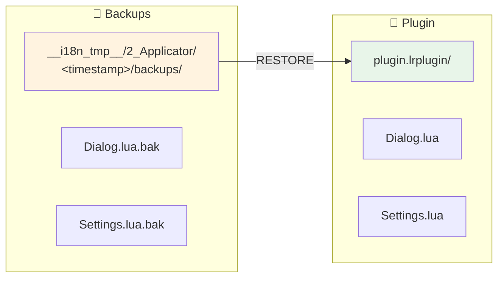
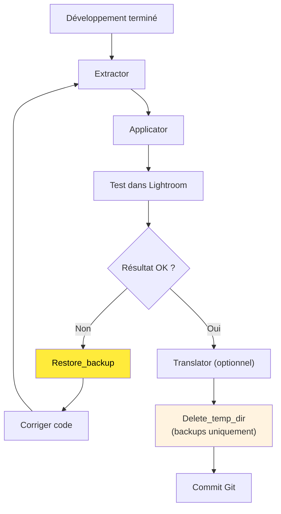

# Tools - Documentation technique

Ce document présente les **outils utilitaires** du toolkit. Ces scripts permettent de gérer les fichiers temporaires et de restaurer les backups créés par ***Applicator***.

> **Public cible** : Développeurs et utilisateurs ayant besoin de nettoyer leur environnement ou de revenir en arrière après une application.

---

### Plan du document

1. [Vue d'ensemble](#-vue-densemble) — Rôle des outils
2. [Installation et prérequis](#-installation-et-prérequis) — Ce qu'il faut pour démarrer
3. [Architecture](#-architecture) — Structure des fichiers
4. [Outils disponibles](#-outils-disponibles) — DELETE_TEMP_DIR et RESTORE_BACKUP
5. [Intégration workflow](#-intégration-workflow) — Cas d'usage typiques
6. [Dépannage](#-dépannage) — Résolution de problèmes
7. [Changelog](#-changelog---suivi-des-modifications)

---

## 🎯 Vue d'ensemble

Les **Tools** sont des utilitaires de **maintenance** qui complètent le workflow de localisation. Ils interviennent après l'exécution des outils principaux (Extractor, Applicator, Translator).



### Problématiques résolues

| Problème | Outil | Solution |
|----------|-------|----------|
| Espace disque occupé par `__i18n_tmp__` | **Delete_temp_dir** | Suppression sélective ou totale |
| Application incorrecte des LOC | **Restore_backup** | Restauration des fichiers originaux |
| Besoin de repartir de zéro | **Delete_temp_dir** | Nettoyage complet |
| Tests itératifs (appliquer/annuler) | **Restore_backup** | Retour rapide à l'état précédent |

---

## 🛠 Installation et prérequis

### Prérequis

- **Python 3.8+** installé sur votre système
- Aucune dépendance externe requise (bibliothèque standard uniquement)

### Structure des fichiers

```
9_Tools/
├── Delete_temp_dir.py      ← Nettoyage du dossier temporaire
├── Restore_backup.py       ← Restauration des backups
└── __doc/
    └── fr/
        ├── Lisez-moi.md    ← Ce fichier
        └── outils/
            ├── DELETE_TEMP_DIR.md
            └── RESTORE_BACKUP.md
```

### Utilisation standalone vs lanceur du toolkit

Les deux outils peuvent fonctionner de manière **indépendante** :

```bash
python Delete_temp_dir.py
python Restore_backup.py
```

Cependant, l'utilisation via ***LocalizationToolKit.py*** est recommandée car le chemin du plugin est automatiquement transmis.



---

## 🏗 Architecture

### Structure du dossier temporaire

Les outils interagissent avec le dossier `__i18n_tmp__` généré par le toolkit :

```
plugin.lrplugin/
├── *.lua                       ← Fichiers du plugin
└── __i18n_tmp__/
    ├── 1_Extractor/            ← Sorties Extractor
    │   └── <timestamp>/
    │       ├── TranslatedStrings_en.txt
    │       └── replacements.json
    ├── 2_Applicator/           ← Sorties Applicator + BACKUPS
    │   └── <timestamp>/
    │       ├── application_report.txt
    │       └── backups/        ← Fichiers .bak
    │           ├── Dialog.lua.bak
    │           └── Settings.lua.bak
    └── 3_Translator/           ← Sorties Translator
        └── <timestamp>/
            └── TranslatedStrings_*.txt
```

---

## 🛠 Outils disponibles

### Delete_temp_dir — Nettoyage

📄 **Documentation complète** : [outils/DELETE_TEMP_DIR.md](outils/DELETE_TEMP_DIR.md)

Supprime tout ou partie du dossier temporaire `__i18n_tmp__`.



**Deux modes de suppression** :
1. **Backups uniquement** — Libère de l'espace, conserve extractions
2. **Tout le dossier** — Nettoyage complet (triple confirmation)

---

### Restore_backup — Restauration

📄 **Documentation complète** : [outils/RESTORE_BACKUP.md](outils/RESTORE_BACKUP.md)

Restaure les fichiers `.lua` depuis leurs sauvegardes `.bak`.



**Fonctionnalités** :
- Sélection de session (plusieurs backups horodatés)
- Présélection automatique de la session la plus récente
- Mode dry-run (simulation)
- Suppression optionnelle des `.bak` après restauration

---

## 🔄 Intégration workflow

### Workflow recommandé avec nettoyage



### Quand utiliser chaque outil

| Situation | Outil | Mode |
|-----------|-------|------|
| Application incorrecte | **Restore_backup** | Session récente |
| Libérer de l'espace | **Delete_temp_dir** | Backups uniquement |
| Avant commit Git | **Delete_temp_dir** | Tout supprimer |
| Tests itératifs | **Restore_backup** | Mode dry-run |
| Changer de plugin | **Delete_temp_dir** | Backups uniquement |

---

## 🔧 Dépannage

### Problèmes courants

| Problème | Cause probable | Solution |
|----------|----------------|----------|
| Permission refusée | Fichier ouvert | Fermer éditeurs/Lightroom |
| Aucun backup trouvé | Applicator avec `--no-backup` | Relancer Applicator normalement |
| Plugin par défaut invalide | Chemin obsolète | Reconfigurer dans LocalisationToolKit |

### Erreur de permission (Windows)

```
[ERREUR] Permission refusée: [WinError 32]
```

**Solutions** :
1. Fermer tous les éditeurs de code
2. Fermer Lightroom Classic
3. Fermer l'explorateur de fichiers pointant vers le dossier
4. Relancer en administrateur si nécessaire

### Aucun backup disponible

```
[ATTENTION] Aucune session Applicator trouvée
```

**Causes** :
- Applicator jamais exécuté
- Option `--no-backup` utilisée
- Dossier `__i18n_tmp__` supprimé

**Alternative** : Utiliser Git pour restaurer
```bash
git checkout HEAD -- plugin.lrplugin/*.lua
```

---

## 📋 Changelog - Suivi des modifications

| Version | Date | Modifications |
|---------|------|---------------|
| 3.0 | 2026-02-01 | Restore_backup : présélection session récente, intégration menu_generator |
| 2.0 | 2026-02-01 | Delete_temp_dir : suppression sélective (backups/tout) |
| 1.0 | 2026-01-30 | Version initiale des deux outils |

---

## 📚 Ressources et crédits

| Élément | Information |
|---------|-------------|
| Python shutil | [Documentation](https://docs.python.org/3/library/shutil.html) |
| Python os.path | [Documentation](https://docs.python.org/3/library/os.path.html) |
| ANSI Colors | [Wikipedia](https://en.wikipedia.org/wiki/ANSI_escape_code) |

---

| 📜 | Traçabilité |  |  |
|--|--|--|--|
| **Nom** | *Lisez-moi.md* | **Version** | 3.1 |
| **Type** | Guide utilisateur RESTORE - Avancé | **Langue** | FR - *[EN](../en/README.md)* |
| **Projet GitHub** | [Adobe Lightroom Translation Toolkit](https://github.com/Gotcha26/Adobe_Lightroom_Translation_Plugins_Kit) | **Date** | 2026-02-02 |
| **Licence** | Open source | | |
