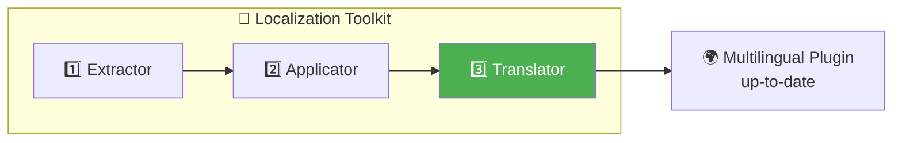
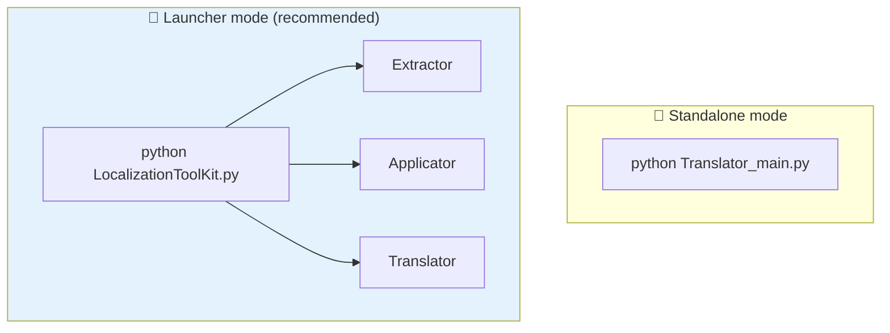
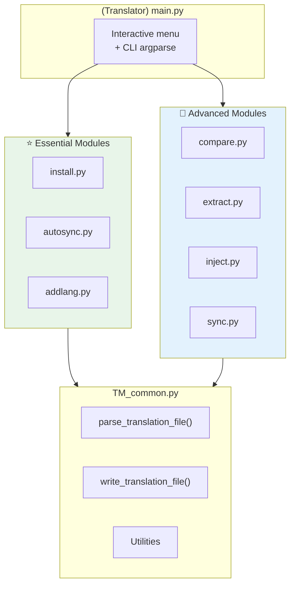
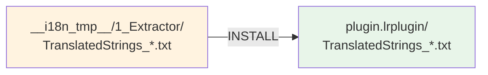
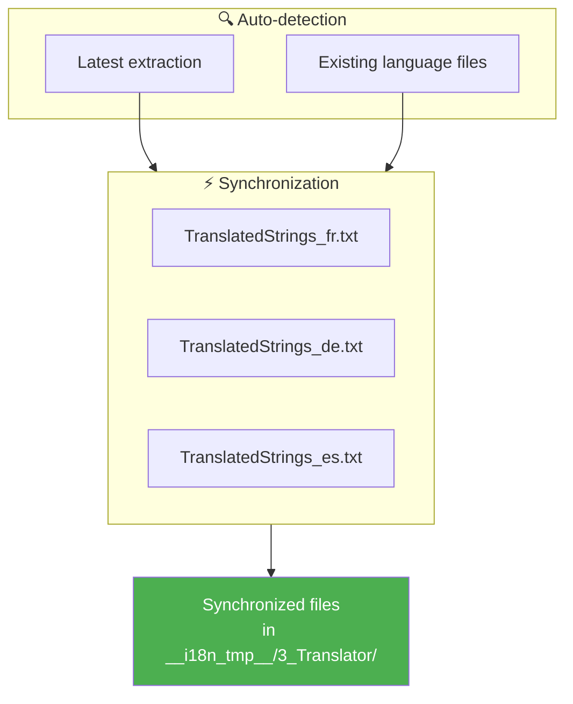
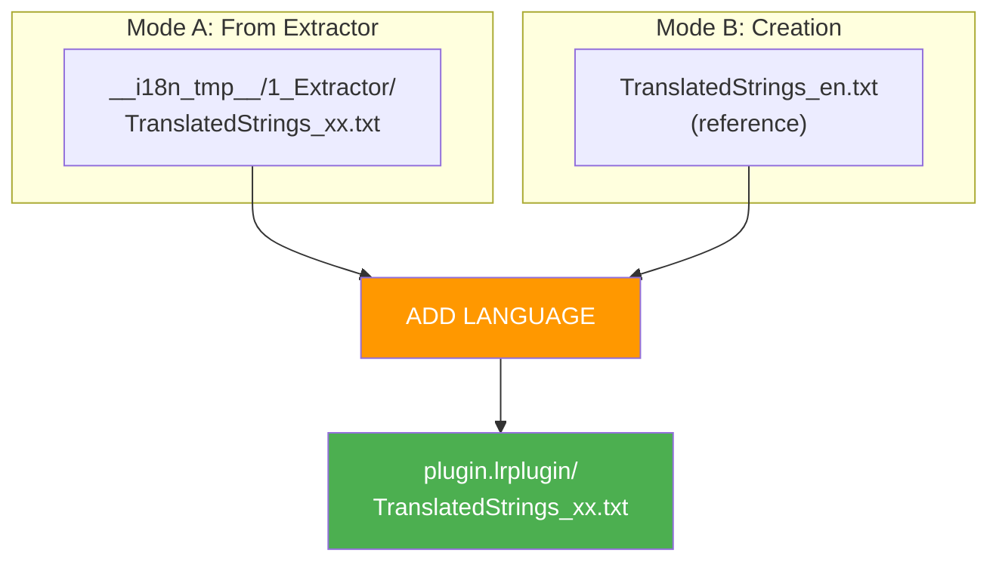
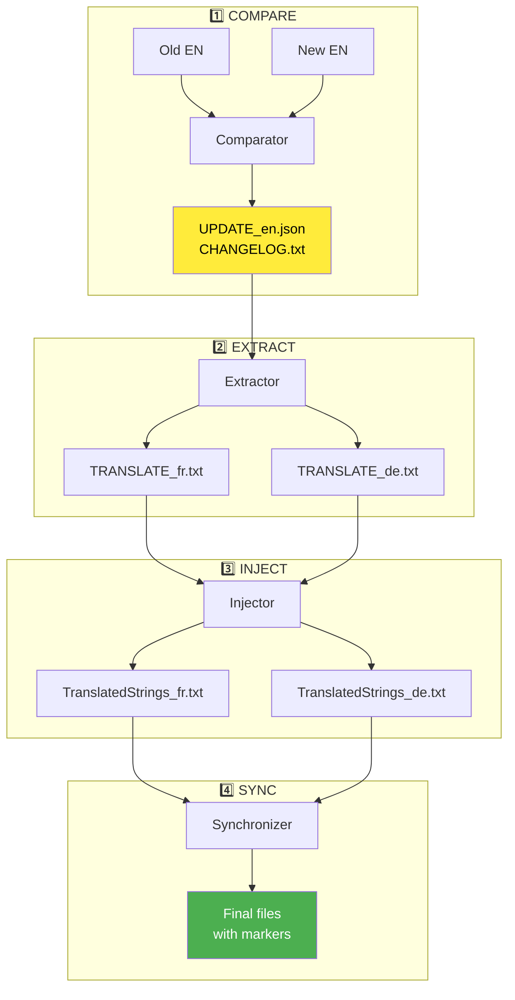
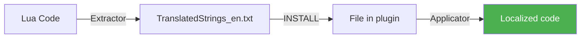
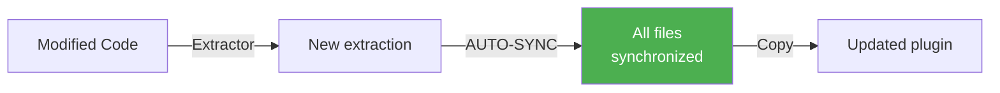
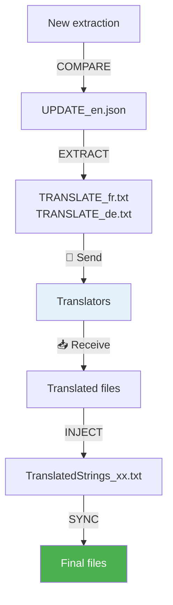

# Translator - Technical Documentation

This document presents ***Translator***, the multilingual translation manager of the toolkit. It orchestrates synchronization between language files and supports translation evolution over time.

> **Target Audience**: Lightroom plugin developers and advanced contributors who want to manage translations efficiently.

---

### Document Outline

1. [Overview](#-overview) — Role and positioning
2. [Installation and Requirements](#-installation-and-requirements) — What you need to get started
3. [Architecture](#-architecture) — Modular structure
4. [Main Commands](#-main-commands) — INSTALL and AUTO-SYNC
5. [Advanced Commands](#-advanced-commands) — COMPARE, EXTRACT, INJECT, SYNC
6. [Recommended Workflows](#-recommended-workflows) — Typical use cases
7. [File Format](#-file-format) — Structure and conventions
8. [CLI Usage](#-cli-usage) — Command line
9. [Changelog](#-changelog---tracking-modifications)

---

## 🎯 Overview

***Translator*** is the **third link** in the localization chain. After extracting strings (***Extractor***) and applying them in the code (***Applicator***), it manages the **continuous maintenance** of translation files.



### Problem Solved

During plugin development, text evolves:
- New features → **new keys**
- Reformulations → **modified keys**
- Removed features → **obsolete keys**

***Translator*** detects these changes and propagates updates to all language files while preserving existing translations.

---

## 🛠 Installation and Requirements

### Prerequisites

- **Python 3.8+** installed on your system
- ***Extractor*** and/or ***Applicator*** must have been run (depending on the workflow)
- No external dependencies required (standard library only)

### File Structure

```
3_Translator/
├── main.py                 ← Entry point (menu + CLI)
├── common.py               ← Common functions (parser, utils)
├── install.py              ← INSTALL command
├── autosync.py             ← AUTO-SYNC command ⭐
├── addlang.py              ← ADD LANGUAGE command
├── compare.py              ← COMPARE command (advanced)
├── extract.py              ← EXTRACT command (advanced)
├── inject.py               ← INJECT command (advanced)
├── sync.py                 ← SYNC command (advanced)
└── __doc/
    └── en/
        ├── README.md       ← This file
        └── commands/
            ├── INSTALL.md
            ├── AUTOSYNC.md
            ├── ADDLANG.md
            ├── COMPARE.md
            ├── EXTRACT.md
            ├── INJECT.md
            └── SYNC.md
```

### Standalone vs Toolkit Launcher

***Translator*** can run **independently** from the command line:

```bash
python Translator_main.py
```

However, using ***LocalizationToolKit.py*** is recommended because:
- The plugin path is preserved in memory
- Navigation between tools is fluid
- Outputs are centralized in `__i18n_tmp__/`



---

## 🏗 Architecture

### Modular Architecture

Each command is implemented in its own python module. This design enables:
- Targeted maintenance
- Isolated unit tests
- Independent usage via Python import



---

## ⭐ Essential Commands

These three commands cover **99% of use cases**. They are designed to be simple and fast.

### INSTALL — Initial Installation

📄 **Full Documentation**: [commands/INSTALL.md](commands/INSTALL.md)

Copies **all** `TranslatedStrings_xx.txt` files from the extraction to the plugin root.



**When to use**: Initial setup of multilingual support on a plugin (bulk installation).

---

### AUTO-SYNC — Automatic Synchronization ⭐

📄 **Full Documentation**: [commands/AUTOSYNC.md](commands/AUTOSYNC.md)

Automatically synchronizes **all** existing language files with the latest extraction.



**When to use**: After each code modification requiring translation updates.

> **This is THE command to use daily!** It advantageously replaces the COMPARE → EXTRACT → INJECT → SYNC workflow.

---

### ADD LANGUAGE — Add/Reinstall a Language

📄 **Full Documentation**: [commands/ADDLANG.md](commands/ADDLANG.md)

Adds or reinstalls **a single** language file, either from the extraction or by creating a new file.



**When to use**:
- Deferred installation of a language not installed initially
- Preparation of new language files to extend multilingual support
- Reinstallation of a corrupted or deleted language file

---

## 🔧 Advanced Commands

These commands provide fine control for specific use cases (external translators, detailed changelogs, etc.).

| Command | Documentation | Role |
|---------|---------------|------|
| **COMPARE** | [COMPARE.md](commands/COMPARE.md) | Compare 2 EN versions → generates `UPDATE_en.json` |
| **EXTRACT** | [EXTRACT.md](commands/EXTRACT.md) | Generates partial `TRANSLATE_xx.txt` files |
| **INJECT** | [INJECT.md](commands/INJECT.md) | Reinjests translations into complete files |
| **SYNC** | [SYNC.md](commands/SYNC.md) | Synchronizes a language file with EN |

### Advanced Data Flow



---

## 🚀 Recommended Workflows

### Workflow 1: Initialization (First Time)



**Steps**:
1. Run ***Extractor*** to generate keys
2. Run **INSTALL** to copy to plugin
3. Run ***Applicator*** to replace hardcoded strings
4. Create files for other languages (copy of `_en.txt`)

---

### Workflow 2: Daily Maintenance ⭐



**Steps**:
1. Develop normally
2. Run ***Extractor***
3. Run **AUTO-SYNC** — one command, everything is done!
4. Copy the generated files to the plugin

> This is the **recommended workflow for 99% of cases**.

---

### Workflow 3: With External Translators



**When to use**: Collaboration with translators who don't have access to the Git repository.

---

## 📁 File Format

### TranslatedStrings_xx.txt

Standard Lightroom SDK format:

```
-- =============================================================================
-- Plugin Localization - FR
-- Generated: 2026-02-02 10:30:00
-- Total keys: 150
-- =============================================================================

-- IMPORTANT NOTES FOR TRANSLATORS:
-- 1. DO NOT translate: %s, %d, \n, \\, ...
-- 2. PRESERVE spaces around text
-- 3. Keep punctuation style
-- =============================================================================

-- Category
"$$$/Piwigo/Dialog/Submit=Submit"
"$$$/Piwigo/Dialog/Cancel=Cancel"
-- [NEW] To translate
"$$$/Piwigo/Dialog/NewFeature=New Feature"
```

### Synchronization Markers

| Marker | Meaning |
|--------|---------|
| `-- [NEW] To translate` | New key, EN value by default |
| `-- [NEEDS_REVIEW] English text was modified` | EN text modified, review suggested |

> **Note**: These markers are **Lua comments** and do not affect display in Lightroom.

---

## 💻 CLI Usage

### General Syntax

```bash
python Translator_main.py [command] [options]
```

### Interactive Mode (Recommended)

```bash
python Translator_main.py
```

Or with pre-configured plugin:

```bash
python Translator_main.py --default-plugin ./plugin.lrplugin
```

### CLI Examples

```bash
# INSTALL
python Translator_main.py install --plugin-path ./plugin.lrplugin

# AUTO-SYNC
python Translator_main.py autosync --plugin-path ./plugin.lrplugin

# COMPARE
python Translator_main.py compare --old ./old/en.txt --new ./new/en.txt

# EXTRACT
python Translator_main.py extract --plugin-path ./plugin.lrplugin

# INJECT
python Translator_main.py inject --plugin-path ./plugin.lrplugin --locales ./plugin.lrplugin

# SYNC
python Translator_main.py sync --plugin-path ./plugin.lrplugin --locales ./plugin.lrplugin
```

---

## 📊 Comparison of Approaches

| Criterion | AUTO-SYNC ⭐ | COMPARE+EXTRACT+INJECT+SYNC |
|-----------|-------------|------------------------------|
| **Commands** | 1 | 4 |
| **Auto Detection** | ✅ | ❌ |
| **Intermediate Files** | ❌ | ✅ TRANSLATE_xx.txt |
| **[NEW] Markers** | ❌ | ✅ |
| **Detailed Changelog** | ❌ | ✅ |
| **Use Case** | Daily maintenance | External translators |

---

## 📋 Changelog - Tracking Modifications

| Version | Date | Modifications |
|---------|------|---------------|
| 7.0 | 2026-01-31 | Added INSTALL and AUTO-SYNC, documentation overhaul |
| 6.0 | 2026-01-30 | Added terminal colors, `__i18n_tmp__` structure |
| 5.0 | 2026-01-29 | Modular architecture TM_*.py |
| 4.0 | 2026-01-25 | Out-of-string markers ([NEW], [NEEDS_REVIEW]) |
| 3.0 | 2026-01-20 | INJECT command with EN fallback |
| 2.0 | 2026-01-15 | EXTRACT command for partial files |
| 1.0 | 2026-01-10 | Initial version (COMPARE + SYNC) |

---

## 📚 Resources

| Element | Information |
|---------|-------------|
| Lightroom SDK | [Adobe Developer Console](https://developer.adobe.com/console) |
| ZString Format | `"$$$/Key=Default Value"` |
| Python argparse | [Documentation](https://docs.python.org/3/library/argparse.html) |

---

| 📜 | Traceability |  |  |
|--|--|--|--|
| **Name** | *README.md* | **Version** | 7.1 |
| **Type** | User Guide - TRANSLATOR Advanced | **Language** | EN - *[FR](../fr/Lisez-moi.md)* |
| **GitHub Project** | [Adobe Lightroom Translation Toolkit](https://github.com/Gotcha26/Adobe_Lightroom_Translation_Plugins_Kit) | **Date** | 2026-02-02 |
| **License** | Open source | | |
