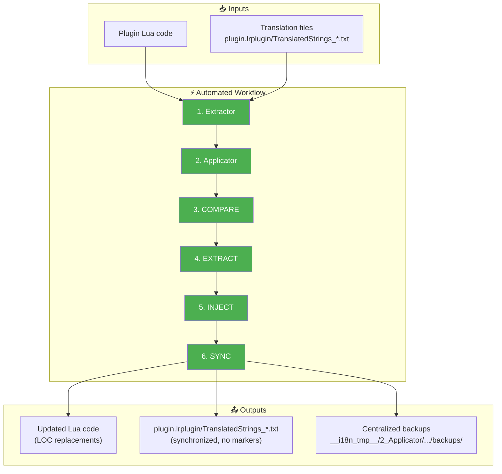
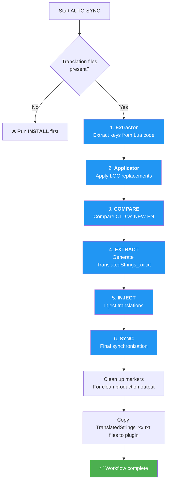

# AUTO-SYNC Command ⭐

📚 **Back to main documentation**: [README.md](../README.md)

---

## 🎯 Objective

**AUTO-SYNC** is the **star** command of the toolkit. It automatically orchestrates the entire synchronization workflow: **Extractor → Applicator → COMPARE → EXTRACT → INJECT → SYNC**, in a single command.

> This is THE command to use for daily maintenance — it automates the entire process of updating the plugin and its translations.

---

## 📥 Inputs / 📤 Outputs



| Type | Description |
|------|-------------|
| **Input (code)** | Plugin `.lua` files |
| **Input (translations)** | `plugin.lrplugin/TranslatedStrings_*.txt` |
| **Output (code)** | `.lua` files with LOC replacements applied |
| **Output (translations)** | `plugin.lrplugin/TranslatedStrings_*.txt` (synchronized) |
| **Output (backups)** | `__i18n_tmp__/2_Applicator/<timestamp>/backups/` |
| **Output (reports)** | `__i18n_tmp__/3_Translator/<timestamp>/` (CHANGELOG, UPDATE_en.json) |

---

## 🔄 How It Works

### 6-Step Workflow



### Step Details

| Step | Tool | Action | Output |
|------|------|--------|--------|
| **1** | Extractor | Extract LOC keys from Lua code | Freshly generated `TranslatedStrings_en.txt` |
| **2** | Applicator | Apply replacements in Lua code | `.lua` files modified with backups |
| **3** | COMPARE | Compare old EN vs new EN | `UPDATE_en.json` + `CHANGELOG.txt` |
| **4** | EXTRACT | Generate translation files | `TRANSLATE_xx.txt` (changed keys only) |
| **5** | INJECT | Inject translations into plugin | Updated `TranslatedStrings_*.txt` files |
| **6** | SYNC | Synchronize with EN reference | Final files aligned, no markers |

### Translation Actions

For each language file (fr, de, es...):

| Action | Description | Example |
|--------|-------------|---------|
| **Addition** | New keys → EN value by default | `"newKey" = "New text"` |
| **Preservation** | Existing translations → preserved | `"oldKey" = "Ancien texte"` ✅ |
| **Modification** | EN value changed → translation preserved | `"changedKey" = "Existing translation"` |
| **Deletion** | Obsolete keys → removed | Key disappeared from code |

> **Important Note**: `[NEW]` and `[NEEDS_REVIEW]` markers are generated during the process but **automatically removed** from final files to keep only clean translations. These markers are reserved for a specific workflow.

---

## 💻 Usage

### Interactive Mode

```
┌──────────────────────────────────────────────────────────────────┐
│  TRANSLATION MANAGER v7.0                                        │
├──────────────────────────────────────────────────────────────────┤
│                                                                  │
│  2. AUTO-SYNC ⭐ (maintenance)                                   │  ◄── Select
│     Automatic synchronization of all language files              │
│     → Simple and fast command, all-in-one                        │
│                                                                  │
└──────────────────────────────────────────────────────────────────┘
```

### CLI Mode

```bash
python Translator_main.py autosync --plugin-path ./plugin.lrplugin
```

### CLI Options

| Option | Description | Required |
|--------|-------------|----------|
| `--plugin-path` | Path to plugin | ✅ Yes |

---

## 📋 Example Session

```
  AUTO-SYNC - Complete Orchestration
══════════════════════════════════════════════════════

[INFO] Translation files detected:
  - TranslatedStrings_en.txt
  - TranslatedStrings_fr.txt

Workflow:
  1. Extractor  → extract keys from Lua code
  2. Applicator → apply replacements in code
  3. COMPARE    → generate UPDATE_en.json
  4. EXTRACT    → generate TRANSLATE_xx.txt files
  5. INJECT     → apply completed translations
  6. SYNC       → synchronize with EN reference

Run complete workflow? (Y/n): Y

══════════════════════════════════════════════════════
Workflow execution...
══════════════════════════════════════════════════════

[Step 1/6 | Extractor] Extract keys from Lua code
  → Fresh extraction to compare BEFORE vs NOW
  Details  : piwigoPublish.lrplugin/__i18n_tmp__/1_Extractor/20260206_111533

[Step 2/6 | Applicator] Apply LOC replacements
  → Replace hardcoded strings with LOC keys
  Replacements applied to source code

[Step 3/6 | COMPARE] Compare OLD vs NEW
  Old         : TranslatedStrings_en.txt
  New         : piwigoPublish.lrplugin/__i18n_tmp__/1_Extractor/20260206_111533/TranslatedStrings_en.txt
  Changes     : 2 added, 1 modified, 5 deleted
  Details     : piwigoPublish.lrplugin/__i18n_tmp__/3_Translator/20260206_111533/compare

[Step 4/6 | EXTRACT] Extract changed keys
  → Select only detected changes
  Details     : piwigoPublish.lrplugin/__i18n_tmp__/3_Translator/20260206_111533/extract

[Step 5/6 | INJECT] Inject translations
  → Update translation files
  8 translation(s) injected

[Step 6/6 | SYNC] Final synchronization
  → Align with EN reference (no markers)
  fr: 2 added, 1 modified, 5 deleted
  Details     : piwigoPublish.lrplugin/__i18n_tmp__/3_Translator/20260206_111533/compare/CHANGELOG.txt

[Finalization] Update EN file
  Backup      : piwigoPublish.lrplugin/__i18n_tmp__/2_Applicator/20260206_111533/backups/TranslatedStrings_en.txt.bak
  TranslatedStrings_en.txt → updated

══════════════════════════════════════════════════════
[OK] Workflow complete without errors

All TranslatedStrings_xx.txt files at plugin root are up to date.
```

---

## 📊 Generated Reports

AUTO-SYNC generates multiple report files:

| File | Location | Content |
|------|----------|---------|
| **UPDATE_en.json** | `__i18n_tmp__/3_Translator/<timestamp>/compare/` | Complete changes details (JSON) |
| **CHANGELOG.txt** | `__i18n_tmp__/3_Translator/<timestamp>/compare/` | Readable modification list |
| **Backups** | `__i18n_tmp__/2_Applicator/<timestamp>/backups/` | Backup copies (`.bak`) |

### Displayed Statistics

For each language, the report shows:

| Metric | Description |
|--------|-------------|
| **Added** | Keys present in EN but not in language |
| **Modified** | Keys where EN value has changed |
| **Deleted** | Keys in language but no longer in EN |

---

## 🆚 AUTO-SYNC vs Manual Workflow

| Aspect | AUTO-SYNC | Manual Workflow |
|--------|-----------|-----------------|
| **Commands** | 1 single command | 6 separate commands |
| **Code extraction** | ✅ Automatic | ❌ Manual (Extractor) |
| **LOC application** | ✅ Automatic | ❌ Manual (Applicator) |
| **Comparison** | ✅ Automatic | ❌ Manual (COMPARE) |
| **Files processed** | All automatically | One by one |
| **Final markers** | ❌ Removed | ✅ Present (if desired) |
| **Backups** | ✅ Centralized | Variables |
| **Use case** | Daily maintenance | Fine-grained control step by step |

---

## 🔗 Related Commands

| Command | Link | Relation |
|---------|------|----------|
| **INSTALL** | [INSTALL.md](INSTALL.md) | First installation (before AUTO-SYNC) |
| **Extractor** | [Extractor.md](../../extractor/Extractor.md) | Step 1 of workflow |
| **Applicator** | [Applicator.md](../../applicator/Applicator.md) | Step 2 of workflow |
| **COMPARE** | [COMPARE.md](COMPARE.md) | Step 3 of workflow |
| **EXTRACT** | [EXTRACT.md](EXTRACT.md) | Step 4 of workflow |
| **INJECT** | [INJECT.md](INJECT.md) | Step 5 of workflow |
| **SYNC** | [SYNC.md](SYNC.md) | Step 6 of workflow |

---

## 📚 Resources

| Element | Information |
|---------|-------------|
| Source module | `autosync.py` |
| Main function | `autosync()` |
| Interactive menu | `autosync()` |

---

| 📜 | Traceability |  |  |
|--|--|--|--|
| **Name** | *AUTOSYNC.md* | **Version** | 2.0 |
| **Type** | User Guide - Advanced | **Language** | EN - *[FR](../../fr/commands/AUTOSYNC.md)* |
| **GitHub Project** | [Adobe Lightroom Translation Toolkit](https://github.com/Gotcha26/Adobe_Lightroom_Translation_Plugins_Kit) | **Date** | 2026-02-06 |
| **License** | [MIT](../../../../../LICENSE) | | |
