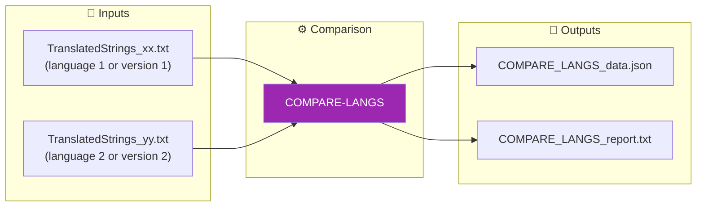
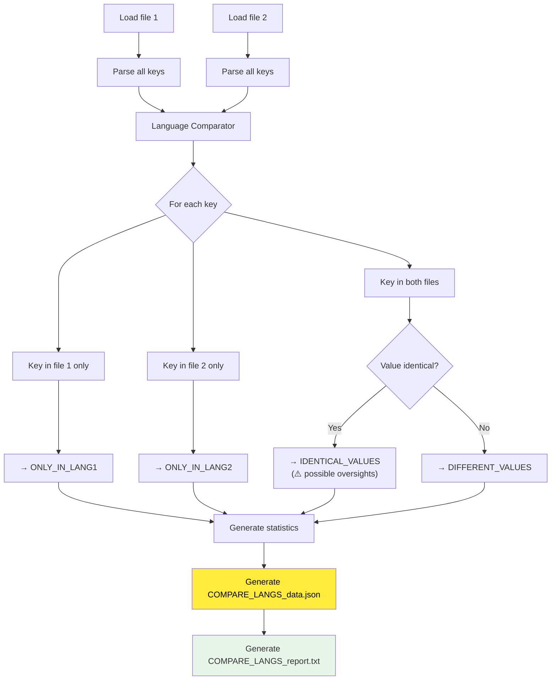

# COMPARE-LANGS Command

📚 **Back to main documentation**: [Translator_en.md](../Translator_en.md)

---

## 🎯 Purpose

**COMPARE-LANGS** analyzes the differences between two translation files (`TranslatedStrings_xx.txt`), whether they are from different languages or different versions of the same language.

> This command offers two comparison modes: **KEYS** (structure) and **VALUES** (translations).

### Comparison Modes

| Mode | Objective | Use Case |
|------|-----------|----------|
| **KEYS** (default) | Identify structural differences | Synchronization, missing/added keys |
| **VALUES** | Analyze translation quality | Quality audit, forgotten translations |

---

## 📥 Inputs / 📤 Outputs



| Type | Files |
|------|-------|
| **Input** | `TranslatedStrings_xx.txt` (language 1 or version 1) |
| **Input** | `TranslatedStrings_yy.txt` (language 2 or version 2) |
| **Output** | `COMPARE_LANGS_data.json` (structured data) |
| **Output** | `COMPARE_LANGS_report.txt` (detailed readable report) |

---

## 🔄 How It Works

### Comparison Algorithm



### Analysis Categories

| Category | Description | Utility |
|----------|-------------|---------|
| **ONLY_IN_LANG1** | Keys present only in file 1 | Identify missing keys in file 2 |
| **ONLY_IN_LANG2** | Keys present only in file 2 | Identify missing keys in file 1 |
| **IDENTICAL_VALUES** | Same key with same value in both | Detect possible forgotten translations |
| **DIFFERENT_VALUES** | Same key with different values | Check translations performed |

---

## 💡 Use Cases

### 1. Verify translation completeness

```bash
# Compare FR vs EN to see what's missing in French
python Translator_main.py compare-langs --lang1 fr --lang2 en --locales ./plugin.lrplugin
```

**Utility**: Identify missing keys and untranslated strings (values identical to English).

### 2. Harmonize two translations

```bash
# Compare FR vs DE to see differences
python Translator_main.py compare-langs --lang1 fr --lang2 de --locales ./plugin.lrplugin
```

**Utility**: Ensure two languages have the same keys.

### 3. Track translation evolution

```bash
# Compare old FR version vs new FR version
python Translator_main.py compare-langs --file1 ./v1/TranslatedStrings_fr.txt --file2 ./v2/TranslatedStrings_fr.txt
```

**Utility**: See changes made to a language between two versions.

### 4. Overall quality audit

```bash
# Compare each language vs EN to generate completeness report
python Translator_main.py compare-langs --lang1 de --lang2 en --locales ./plugin.lrplugin
python Translator_main.py compare-langs --lang1 es --lang2 en --locales ./plugin.lrplugin
python Translator_main.py compare-langs --lang1 it --lang2 en --locales ./plugin.lrplugin
```

**Utility**: Complete quality audit of translations for all languages.

---

## 💻 Usage

### Interactive Mode

```
┌──────────────────────────────────────────────────────────────────┐
│  TRANSLATION MANAGER v7.0                                        │
├──────────────────────────────────────────────────────────────────┤
│                                                                  │
│  2. COMPARE-LANGS                                                │  ◄── Select
│     Compare 2 language files                                     │
│     → FR vs DE, FR vs EN, old FR vs new FR...                    │
│                                                                  │
└──────────────────────────────────────────────────────────────────┘
```

The menu first offers the choice of comparison mode:

#### Choice of comparison mode
1. **By keys** (default) - Identifies missing/added keys (synchronization)
2. **By values** - Identifies identical translations (quality audit)

#### Choice of selection mode
1. **By language codes** (default) - Search in a directory
2. **By full paths** - Specify exact files

##### Mode 1: By language codes
1. Directory containing language files
2. Code of first language (ex: `fr`, `de`, `en`)
3. Code of second language (ex: `de`, `en`, `es`)

##### Mode 2: By full paths
1. Full path of first file
2. Full path of second file

### CLI Mode

#### With language codes (searches in --locales)

```bash
# Compare FR vs DE
python Translator_main.py compare-langs --lang1 fr --lang2 de --locales ./plugin.lrplugin

# Compare FR vs EN to see what's not translated
python Translator_main.py compare-langs --lang1 fr --lang2 en --locales ./plugin.lrplugin

# With output in __i18n_tmp__
python Translator_main.py compare-langs --lang1 fr --lang2 de --locales ./plugin.lrplugin --plugin-path ./plugin.lrplugin
```

#### With full file paths

```bash
# Compare two versions of the same file
python Translator_main.py compare-langs --file1 ./v1/TranslatedStrings_fr.txt --file2 ./v2/TranslatedStrings_fr.txt

# Compare two files from different languages
python Translator_main.py compare-langs --file1 ./Locales/TranslatedStrings_fr.txt --file2 ./Locales/TranslatedStrings_de.txt

# Custom output
python Translator_main.py compare-langs --file1 ./fr.txt --file2 ./de.txt --output ./my_output/
```

### CLI Options

| Option | Description | Required |
|--------|-------------|----------|
| `--lang1` | Language code 1 (ex: fr) - searches in --locales | Conditional |
| `--lang2` | Language code 2 (ex: de) - searches in --locales | Conditional |
| `--locales` | Translation directory | Required with --lang1/--lang2 |
| `--file1` | First file (or directory) | Conditional |
| `--file2` | Second file (or directory) | Conditional |
| `--mode` | Mode: `keys` (keys) or `values` (values) | ❌ Default: `keys` |
| `--plugin-path` | Output in `__i18n_tmp__/3_Translator/` | ❌ No |
| `--output` | Custom output directory | ❌ No |

> **Note**: Specify either `--lang1` + `--lang2` + `--locales`, or `--file1` + `--file2`.
> **New**: `--mode keys` focuses on structural differences, `--mode values` on translations.

---

## 📋 Example Session

### Interactive Mode - Compare FR vs EN (KEYS mode)

```
COMPARE-LANGS: Compare two translation files
══════════════════════════════════════════════════════════════════

You can compare:
  • Two different languages (ex: FR vs DE)
  • Two versions of the same language (ex: old FR vs new FR)
  • A language vs EN (to see what's not translated)

Comparison mode:
  1. By keys - Identifies missing/added keys (recommended for synchronization)
  2. By values - Identifies identical translations (recommended for quality audit)
Comparison mode (1-2, default=1):

Selection mode:
  1. By language codes (ex: fr, de) - searches in a directory
  2. By full file paths
Your choice (1-2, default=1):

Directory containing language files:
  (default: ./plugin.lrplugin)
  >

Available languages: de, en, es, fr, it

Code of first language (ex: fr, en, de):
  > fr

Code of second language (ex: fr, en, de):
  > en

[INFO] Comparison in progress...

══════════════════════════════════════════════════════════════════
  COMPARISON SUMMARY (KEYS)
══════════════════════════════════════════════════════════════════
  Language 1: FR  (142 keys)
  Language 2: EN  (148 keys)

  Total unique keys           :  148
  Keys in both languages      :  140
  Only in FR                  :    2
  Only in EN                  :    8

  ⚠️  Files out of sync: missing keys detected

Files generated in: __i18n_tmp__/3_Translator/20260206_150125/
  • COMPARE_LANGS_report.txt
  • COMPARE_LANGS_data.json

Press Enter to continue...
```

### Interactive Mode - Compare FR vs EN (VALUES mode)

```
Comparison mode (1-2, default=1): 2

[...language selection...]

[INFO] Comparison in progress...

══════════════════════════════════════════════════════════════════
  COMPARISON SUMMARY (VALUES)
══════════════════════════════════════════════════════════════════
  Language 1: FR  (142 keys)
  Language 2: EN  (148 keys)

  Common keys analyzed        :  140
  Identical values            :   12
  Different values            :  128

  Info: Total unique keys     :  148
  Info: Only in FR            :    2
  Info: Only in EN            :    8

  ⚠️  12 identical translation(s) detected!
     Possible forgotten translations (identical to EN)

Files generated in: __i18n_tmp__/3_Translator/20260206_150230/
  • COMPARE_LANGS_report.txt
  • COMPARE_LANGS_data.json
```

### CLI Mode - Compare two versions

```bash
$ python Translator_main.py compare-langs --file1 ./v1/TranslatedStrings_fr.txt --file2 ./v2/TranslatedStrings_fr.txt

[INFO] Comparing languages...

============================================================
LANGUAGE COMPARISON SUMMARY
============================================================
Language 1: FR (135 keys)
Language 2: FR (142 keys)

Total unique keys    :  145
Keys in both         :  132
Only in FR           :    3
Only in FR           :    7

Identical values     :  120
Different values     :   12

✓ Files generated in: compare_langs_20260202_153045/
```

---

## 📁 Generated Files Format

### COMPARE_LANGS_data.json

The JSON content varies depending on the chosen mode.

#### KEYS mode (keys)

```json
{
  "generated": "2026-02-06T15:01:25",
  "file1": "/path/to/TranslatedStrings_fr.txt",
  "file2": "/path/to/TranslatedStrings_en.txt",
  "lang1_name": "FR",
  "lang2_name": "EN",
  "comparison_mode": "keys",
  "statistics": {
    "total_unique_keys": 148,
    "keys_in_lang1": 142,
    "keys_in_lang2": 148,
    "keys_in_both": 140,
    "only_lang1": 2,
    "only_lang2": 8,
    "identical_values_count": 12,
    "different_values_count": 128,
    "coverage_lang1_pct": 95.95,
    "coverage_lang2_pct": 100.0
  },
  "only_in_lang1": [
    "$$$/Plugin/OldFeature/Title"
  ],
  "only_in_lang2": [
    "$$$/Plugin/NewFeature/Title",
    "$$$/Plugin/NewFeature/Description"
  ],
  "in_both": [
    "$$$/Plugin/Dialog/OK",
    "$$$/Plugin/Dialog/Cancel",
    "..."
  ]
}
```

#### VALUES mode (values)

```json
{
  "generated": "2026-02-06T15:02:30",
  "file1": "/path/to/TranslatedStrings_fr.txt",
  "file2": "/path/to/TranslatedStrings_en.txt",
  "lang1_name": "FR",
  "lang2_name": "EN",
  "comparison_mode": "values",
  "statistics": { "..." },
  "identical_values": {
    "$$$/Plugin/Dialog/OK": "OK",
    "$$$/Plugin/Settings/API": "API"
  },
  "different_values": [
    "$$$/Plugin/Dialog/Cancel",
    "$$$/Plugin/Settings/Help"
  ],
  "info_missing_keys": {
    "only_in_lang1": ["..."],
    "only_in_lang2": ["..."]
  }
}
```

### COMPARE_LANGS_report.txt

The TXT report varies depending on the chosen mode.

#### KEYS mode (keys)

```
================================================================================
LANGUAGE COMPARISON REPORT (MODE: KEYS)
================================================================================

Date: 2026-02-06 15:01:25
Comparison mode: KEYS
Language 1: FR
Language 2: EN
File 1: /path/to/TranslatedStrings_fr.txt
File 2: /path/to/TranslatedStrings_en.txt

--------------------------------------------------------------------------------
GLOBAL STATISTICS
--------------------------------------------------------------------------------
  Total unique keys                :  148
  Keys in FR                       :  142  ( 95.95%)
  Keys in EN                       :  148  (100.00%)
  Keys in both                     :  140
  Keys only in FR                  :    2
  Keys only in EN                  :    8

--------------------------------------------------------------------------------
STRUCTURE ANALYSIS (KEYS MODE)
--------------------------------------------------------------------------------
  ⚠ DESYNCHRONIZATION DETECTED
  Missing keys in EN               :    2
  Missing keys in FR               :    8

================================================================================
KEYS PRESENT ONLY IN EN (8)
These keys exist in EN but are absent from FR.
================================================================================

  [ONLY-EN] $$$/Plugin/NewFeature/Title
        EN: New Feature

  [ONLY-EN] $$$/Plugin/NewFeature/Description
        EN: This is a new feature

================================================================================
RECOMMENDATIONS
================================================================================
• 8 missing key(s) in FR
  → Add these translations in FR

• 2 missing key(s) in EN
  → Add these translations in EN
```

#### VALUES mode (values)

```
================================================================================
LANGUAGE COMPARISON REPORT (MODE: VALUES)
================================================================================

Date: 2026-02-06 15:02:30
Comparison mode: VALUES
Language 1: FR
Language 2: EN
[...]

--------------------------------------------------------------------------------
TRANSLATION ANALYSIS (VALUES MODE)
--------------------------------------------------------------------------------
  Common keys analyzed                  :  140
  Identical values (possible oversights):   12
  Different values (translated)         :  128

  Info: Missing keys in EN              :    2
  Info: Missing keys in FR              :    8

================================================================================
KEYS WITH IDENTICAL VALUES (12)
These keys exist in both languages with the same value.
⚠️  ATTENTION: Values identical to English = possible forgotten translations!
================================================================================

  [IDENTICAL] $$$/Plugin/Dialog/OK
        Common value: OK

  [IDENTICAL] $$$/Plugin/Settings/API
        Common value: API

================================================================================
KEYS WITH DIFFERENT VALUES (128)
These keys exist in both languages with different values.
(Display of first 20 differences)
================================================================================

  [DIFFERENT] $$$/Plugin/Dialog/Cancel
        FR: Annuler
        EN: Cancel

  ... and 108 other differences

================================================================================
RECOMMENDATIONS
================================================================================
⚠️  12 identical translation(s) to English detected!
  → Check if these keys were properly translated

✓ 128 different translation(s) detected
  This indicates translations performed correctly.

Info: Some keys are missing in one of the files.
  To analyze the structure, run again in KEYS mode.
```

---

## 🎯 Interpreting Results

### Identical Values with EN

If you compare a language with English and find **identical values**, they are probably:

| Type | Example | Action |
|------|---------|--------|
| **Not translated** | `"$$$/Menu/File=File"` in FR | ❌ To translate |
| **Proper noun** | `"$$$/Plugin/Name=Adobe Lightroom"` | ✅ Normal |
| **Technical term** | `"$$$/Settings/API=API"` | ✅ Normal |
| **Acronym** | `"$$$/Format/JPG=JPG"` | ✅ Normal |

> **Advice**: Manually verify each identical value to confirm it's not an oversight.

### Missing Keys

| Situation | Probable Cause | Action |
|-----------|----------------|--------|
| Keys in EN but not in FR | New untranslated keys | Add translations |
| Keys in FR but not in EN | Obsolete keys | Delete if confirmed obsolete |
| Keys in v1 but not v2 | Code refactoring | Check source code |

### Coverage Statistics

```
coverage_lang1_pct: 95.95%  → FR has 95.95% of total keys
coverage_lang2_pct: 100.0%  → EN has 100% of total keys (reference)
```

**Interpretation**: French is missing ~4% of keys compared to English.

---

## 🔗 Related Commands

| Command | Link | Relation |
|---------|------|----------|
| **COMPARE** | [COMPARE.md](COMPARE.md) | Compares EN versions only |
| **SYNC** | [SYNC.md](SYNC.md) | Synchronizes after identifying gaps |
| **AUTO-SYNC** | [AUTOSYNC.md](AUTOSYNC.md) | Automatic alternative |

---

## 📚 Resources

| Element | Information |
|---------|-------------|
| Source module | `compare_langs.py` |
| Main class | `LanguageComparator` |
| Main function | `run_compare_langs()` |
| Interactive menu | `menu_compare_langs()` |

---

## 💡 Tips

### Batch script for complete audit

Create a script to compare all languages vs EN:

```bash
#!/bin/bash
# audit_all_langs.sh

LOCALES="./plugin.lrplugin"

for lang in de es fr it; do
    echo "Comparing $lang vs EN..."
    python Translator_main.py compare-langs \
        --lang1 $lang \
        --lang2 en \
        --locales $LOCALES \
        --plugin-path $LOCALES
done

echo "✓ Audit complete. Check __i18n_tmp__/3_Translator/"
```

### Find missing translations

In `COMPARE_LANGS_report.txt`, search for:
- Section **"KEYS PRESENT ONLY IN EN"** → to translate
- Section **"KEYS WITH IDENTICAL VALUES"** (if compared with EN) → possible oversights

---

| 📜 | Traceability |  |  |
|--|--|--|--|
| **Name** | *COMPARE-LANGS.md* | **Version** | 1.1 |
| **Type** | User Guide - Advanced | **Language** | EN - *[FR](../../fr/commandes/COMPARE-LANGS.md)* |
| **GitHub Project** | [Adobe Lightroom Translation Toolkit](https://github.com/Gotcha26/Adobe_Lightroom_Translation_Plugins_Kit) | **Date** | 2026-02-06 |
| **License** | [MIT](../../../../../LICENSE) | **Changelog** | Added KEYS/VALUES modes |
