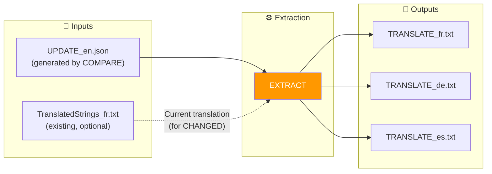
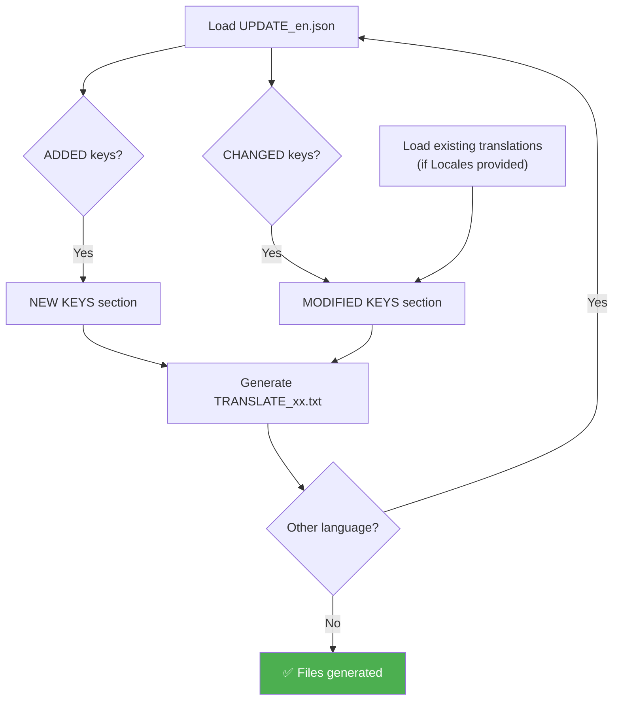

# EXTRACT Command

📚 **Back to main documentation**: [README.md](../README.md)

---

## 🎯 Objective

**EXTRACT** generates small `TRANSLATE_xx.txt` files containing only the keys to translate (new or modified). These files are ideal for sending to external translators.

> This command is part of the advanced workflow. It requires running **COMPARE** beforehand.

---

## 📥 Inputs / 📤 Outputs



| Type | Files |
|------|-------|
| **Input** | `UPDATE_en.json` (required) |
| **Input** | Existing `TranslatedStrings_xx.txt` (optional) |
| **Output** | `TRANSLATE_xx.txt` per language |

---

## 🔄 How It Works

### Algorithm



### Generated Content

For each key:

| Type | Format in TRANSLATE_xx.txt |
|------|------------------------------|
| **New** | `[KEY]`, `[EN]`, `[XX] →` |
| **Modified** | `[KEY]`, `[EN BEFORE]`, `[EN AFTER]`, `[XX CURRENT]`, `[XX] →` |

---

## 💻 Usage

### Interactive Mode

```
┌──────────────────────────────────────────────────────────────────┐
│  TRANSLATION MANAGER v7.0                                        │
├──────────────────────────────────────────────────────────────────┤
│                                                                  │
│  4. EXTRACT (optional)                                           │  ◄── Select
│     Generate mini TRANSLATE_xx.txt files for translation         │
│                                                                  │
└──────────────────────────────────────────────────────────────────┘
```

The menu asks:
1. UPDATE folder (containing `UPDATE_en.json`)
2. Locales folder (existing translations, optional)
3. Language(s) to generate (or all)

### CLI Mode

```bash
# All detected languages
python Translator_main.py extract --plugin-path ./plugin.lrplugin --locales ./plugin.lrplugin

# Specific language
python Translator_main.py extract --update ./20260201_151234 --locales ./Locales --lang fr

# Without plugin-path (legacy mode)
python Translator_main.py extract --update ./20260201_151234
```

### CLI Options

| Option | Description | Required |
|--------|-------------|----------|
| `--plugin-path` | Auto-detection of Translator folder | ❌ No |
| `--update` | UPDATE folder (if no plugin-path) | Conditional |
| `--locales` | Directory of existing translations | ❌ No |
| `--lang` | Specific language (default: all) | ❌ No |
| `--output` | Output directory | ❌ No |

---

## 📋 Example Session

```
EXTRACT: Generate translation files
══════════════════════════════════════════════════════

[INFO] Selected folder: __i18n_tmp__/3_Translator/20260201_151234/

Directory of existing translations (Locales):
  (To get current translations of modified keys)
  (Enter to skip)
  > ./plugin.lrplugin

Language(s) to generate:
  • Enter = all languages found in Locales
  • Or specify: fr, de, es...
  >

[INFO] Generation in progress...

══════════════════════════════════════════════════════
  GENERATED FILES
══════════════════════════════════════════════════════
  [OK] TRANSLATE_fr.txt
  [OK] TRANSLATE_de.txt

[INFO] NEXT STEP:
  1. Edit the files and fill in after each →
  2. Run INJECT to reinject translations
  3. Run SYNC to finalize
```

---

## 📁 Format of TRANSLATE_xx.txt File

```
# ======================================================================
# TRANSLATION FILE - FR
# Generated: 2026-02-01 15:30:00
# Source: __i18n_tmp__/3_Translator/20260201_151234
# ======================================================================
#
# INSTRUCTIONS:
# 1. For each entry, write the translation after the → symbol
# 2. Leave empty to keep the EN value by default
# 3. Lines starting with # are ignored
#
# ======================================================================

# ----------------------------------------------------------------------
# NEW KEYS (15)
# ----------------------------------------------------------------------

[KEY] $$$/Plugin/NewFeature/Title
[EN]  New Feature
[FR] →

[KEY] $$$/Plugin/NewFeature/Description
[EN]  This is a new feature
[FR] →

# ----------------------------------------------------------------------
# MODIFIED KEYS (3) - The EN text has changed
# ----------------------------------------------------------------------

[KEY] $$$/Plugin/Settings/Help
[EN BEFORE]  Click here for help
[EN AFTER]  Click here to get help
[FR CURRENT] Cliquez ici pour obtenir de l'aide
[FR] →

# ======================================================================
# TOTAL: 15 new + 3 modified
# ======================================================================
```

### How to Fill In

1. **New key**: Write translation after `→`
   ```
   [FR] → New Feature
   ```

2. **Modified key**: Review and write after `→`
   ```
   [FR] → Click here to get help
   ```

3. **No translation**: Leave empty → EN value used
   ```
   [FR] →
   ```

---

## 💡 Advantages of TRANSLATE Files

| Advantage | Description |
|----------|-------------|
| **Lightweight** | A few KB instead of several MB |
| **Targeted** | Only keys to translate |
| **Portable** | Easy to send by email |
| **Clear** | Readable format with context |

---

## 🔗 Related Commands

| Command | Link | Relation |
|---------|------|----------|
| **COMPARE** | [COMPARE.md](COMPARE.md) | Previous step |
| **INJECT** | [INJECT.md](INJECT.md) | Next step |
| **AUTO-SYNC** | [AUTOSYNC.md](AUTOSYNC.md) | Simple alternative |

---

## 📚 Resources

| Element | Information |
|---------|-------------|
| Source module | `extract.py` |
| Main function | `run_extract()` |
| Batch function | `run_extract_all()` |
| Interactive menu | `menu_extract()` |

---

| 📜 | Traceability |  |  |
|--|--|--|--|
| **Name** | *EXTRACT.md* | **Version** | 1.0 |
| **Type** | User Guide - Advanced | **Language** | EN - *[FR](../../fr/commands/EXTRACT.md)* |
| **GitHub Project** | [Adobe Lightroom Translation Toolkit](https://github.com/Gotcha26/Adobe_Lightroom_Translation_Plugins_Kit) | **Date** | 2026-02-02 |
| **License** | Open source | | |
