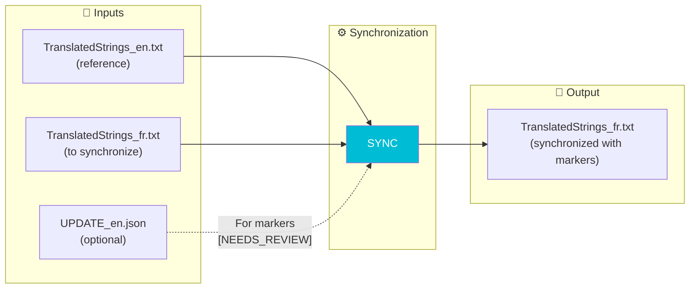
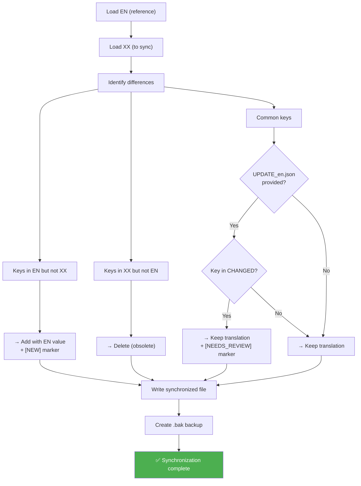

# SYNC Command

📚 **Back to main documentation**: [README.md](../README.md)

---

## 🎯 Objective

**SYNC** synchronizes a language file with the reference English file. It adds `[NEW]` and `[NEEDS_REVIEW]` markers to guide translators.

> This is the **manual** version of synchronization. To synchronize all files automatically, use **AUTO-SYNC**.

---

## 📥 Inputs / 📤 Outputs



| Type | Files |
|------|-------|
| **Input** | `TranslatedStrings_en.txt` (reference) |
| **Input** | `TranslatedStrings_xx.txt` (to synchronize) |
| **Input** | `UPDATE_en.json` (optional, for detailed markers) |
| **Output** | `TranslatedStrings_xx.txt` synchronized |

---

## 🔄 How It Works

### Synchronization Algorithm



### Actions by Category

| Situation | Action | Marker |
|-----------|--------|--------|
| New key (not in XX) | Add with EN value | `[NEW]` |
| Modified key (EN changed) | Keep translation | `[NEEDS_REVIEW]` |
| Existing key | Keep translation | None |
| Obsolete key (not in EN) | Delete | - |

---

## 💻 Usage

### Interactive Mode

```
┌──────────────────────────────────────────────────────────────────┐
│  TRANSLATION MANAGER v7.0                                        │
├──────────────────────────────────────────────────────────────────┤
│                                                                  │
│  6. SYNC                                                         │  ◄── Select
│     Update languages with EN                                     │
│     → Adds [NEW], marks [NEEDS_REVIEW], removes obsolete         │
│                                                                  │
└──────────────────────────────────────────────────────────────────┘
```

The menu asks:
1. If you have an UPDATE folder (from COMPARE)
2. The reference EN file (or UPDATE folder)
3. The directory of language files

### CLI Mode

```bash
# With UPDATE folder ([NEEDS_REVIEW] markers)
python Translator_main.py sync --update ./20260201_151234 --locales ./plugin.lrplugin

# With direct EN file (no [NEEDS_REVIEW])
python Translator_main.py sync --ref ./TranslatedStrings_en.txt --locales ./plugin.lrplugin

# With plugin-path (auto-detection)
python Translator_main.py sync --plugin-path ./plugin.lrplugin --locales ./plugin.lrplugin
```

### CLI Options

| Option | Description | Required |
|--------|-------------|----------|
| `--ref` | Reference EN file | Conditional |
| `--update` | UPDATE folder (with UPDATE_en.json) | Conditional |
| `--plugin-path` | Auto-detection of Translator folder | ❌ No |
| `--locales` | Directory of language files | ✅ Yes |

> **Note**: `--ref` OR `--update` OR `--plugin-path` required.

---

## 📋 Example Session

```
SYNC: Synchronize foreign languages
══════════════════════════════════════════════════════

Do you have an UPDATE folder (generated by COMPARE)?
  (Allows marking keys [NEEDS_REVIEW])
  [Y/n]: Y

[INFO] Selected folder: __i18n_tmp__/3_Translator/20260201_151234/

Directory of language files (Locales):
  (Enter = same directory as reference)
  > ./plugin.lrplugin

[INFO] Synchronization in progress...

══════════════════════════════════════════════════════════════════════
SYNCHRONIZATION REPORT
══════════════════════════════════════════════════════════════════════

[FR]
  Keys preserved   : 130
  Keys added       : 15  [NEW] to translate
  Keys to review   : 3   [NEEDS_REVIEW]
  Keys deleted     : 2
  Total            : 145
  New keys:
    + $$$/Plugin/NewFeature/Title
    + $$$/Plugin/NewFeature/Description
    ... and 13 others
  Keys to review:
    ? $$$/Plugin/Settings/Help

[DE]
  Keys preserved   : 130
  Keys added       : 15  [NEW] to translate
  Keys to review   : 3   [NEEDS_REVIEW]
  Keys deleted     : 2
  Total            : 145

──────────────────────────────────────────────────────────────────────
TOTAL
──────────────────────────────────────────────────────────────────────
  Languages processed : 2
  Keys added          : 30
  Keys to review      : 6
  Keys deleted        : 4

✓ Files updated (.bak backups created)

[INFO] NEXT STEP:
  Search for [NEW] and [NEEDS_REVIEW] in files
  to complete translations.
```

---

## 📁 Format of Synchronized File

```
-- =============================================================================
-- Plugin Localization - FR
-- Generated: 2026-02-01 16:00:00
-- Total keys: 145
-- New keys: 15
-- Changed keys: 3
-- Source: SYNC
-- =============================================================================

-- IMPORTANT NOTES FOR TRANSLATORS:
-- 1. DO NOT translate: %s, %d, \n, \\, ...
-- 2. PRESERVE spaces around text
-- 3. Keep punctuation style
-- =============================================================================

-- Dialog
"$$$/Plugin/Dialog/OK=OK"
"$$$/Plugin/Dialog/Cancel=Annuler"
-- [NEW] To translate
"$$$/Plugin/Dialog/NewButton=New Button"
-- [NEEDS_REVIEW] English text was modified
"$$$/Plugin/Settings/Help=Cliquez ici pour obtenir de l'aide"
```

### Marker Meaning

| Marker | Appearance | Action Required |
|--------|-----------|-----------------|
| `-- [NEW] To translate` | Before the key | Translate the value (currently in EN) |
| `-- [NEEDS_REVIEW] English text was modified` | Before the key | Check if translation is still correct |

> **Note**: Markers are **Lua comments** (`--`), they don't affect display in Lightroom.

---

## 🆚 SYNC vs AUTO-SYNC

| Aspect | SYNC | AUTO-SYNC |
|--------|------|-----------|
| **Files processed** | All in `--locales` | All automatically |
| **Source detection** | Manual (`--ref` or `--update`) | Auto (latest extraction) |
| **[NEW] markers** | ✅ Yes (if `--update`) | ❌ No |
| **[NEEDS_REVIEW]** | ✅ Yes (if `--update`) | ❌ No |
| **Detailed report** | ✅ Yes | Simplified |

---

## 🔗 Related Commands

| Command | Link | Relation |
|---------|------|----------|
| **COMPARE** | [COMPARE.md](COMPARE.md) | Generates UPDATE_en.json |
| **INJECT** | [INJECT.md](INJECT.md) | Previous step (optional) |
| **AUTO-SYNC** | [AUTOSYNC.md](AUTOSYNC.md) | Automatic alternative |

---

## 📚 Resources

| Element | Information |
|---------|-------------|
| Source module | `sync.py` |
| Main function | `run_sync()` |
| Internal function | `_sync_language()` |
| Report generator | `generate_sync_report()` |
| Interactive menu | `menu_sync()` |

---

| 📜 | Traceability |  |  |
|--|--|--|--|
| **Name** | *SYNC.md* | **Version** | 1.0 |
| **Type** | User Guide - Advanced | **Language** | EN - *[FR](../../fr/commandes/SYNC.md)* |
| **GitHub Project** | [Adobe Lightroom Translation Toolkit](https://github.com/Gotcha26/Adobe_Lightroom_Translation_Plugins_Kit) | **Date** | 2026-02-02 |
| **License** | Open source | | |
