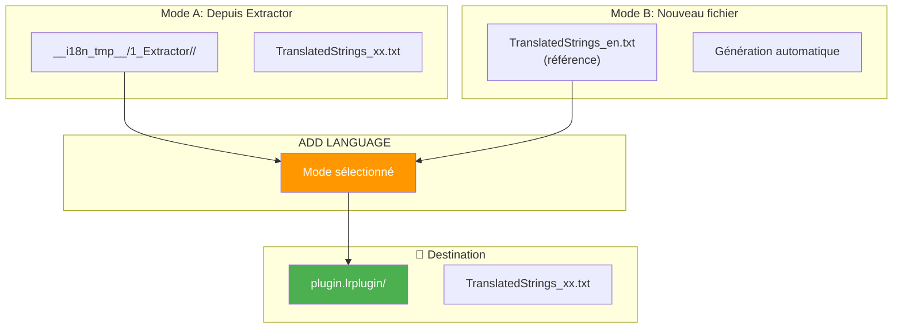
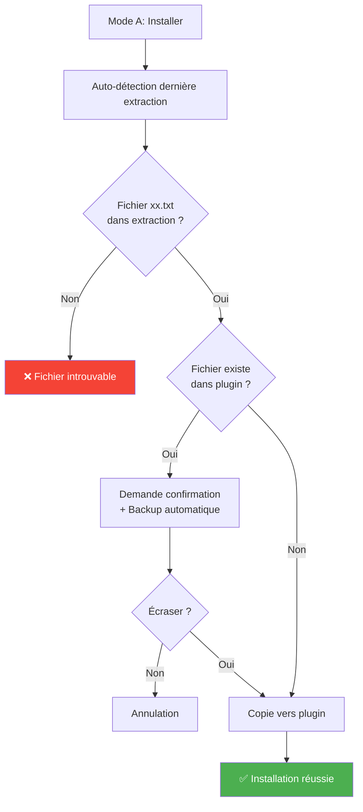
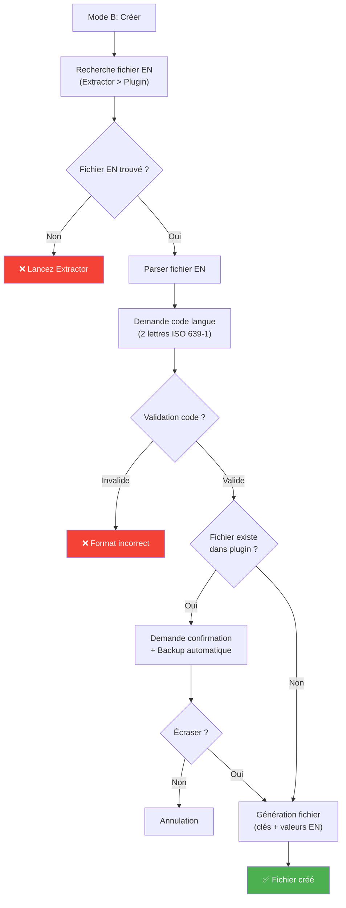
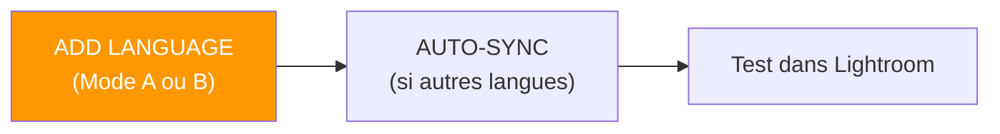
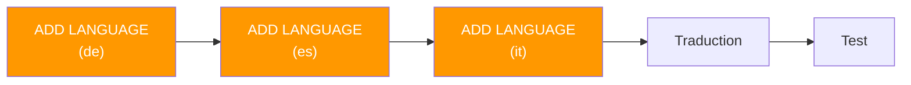

# Commande ADD LANGUAGE

📚 **Retour à la documentation principale** : [Lisez-moi.md](../Lisez-moi.md)

---

## 🎯 Objectif

**ADD LANGUAGE** permet d'ajouter ou de réinstaller un fichier de langue **spécifique** dans le plugin, soit depuis une extraction existante, soit en créant un nouveau fichier basé sur le fichier EN de référence.

> Cette commande résout deux problèmes courants :
> 1. **Installation différée** : installer une langue non ajoutée lors de l'installation initiale
> 2. **Préparation de nouvelles langues** : créer des fichiers prêts à traduire pour étendre le support multilingue

---

## 📥 Entrées / 📤 Sorties



| Mode | Entrée | Sortie |
|------|--------|--------|
| **Mode A (Installer)** | `__i18n_tmp__/1_Extractor/<timestamp>/TranslatedStrings_xx.txt` | `plugin.lrplugin/TranslatedStrings_xx.txt` |
| **Mode B (Créer)** | `TranslatedStrings_en.txt` (référence) | `plugin.lrplugin/TranslatedStrings_xx.txt` (nouveau) |

---

## 🔄 Fonctionnement

### Mode A : Installer depuis Extractor



### Mode B : Créer nouveau fichier



### Détails techniques

| Aspect | Comportement |
|--------|-------------|
| **Validation code langue** | Accepte uniquement 2 lettres minuscules (ISO 639-1) : `fr`, `de`, `es`... |
| **Backup automatique** | Créé dans `__i18n_tmp__/3_Translator/<timestamp>/backups/` si écrasement |
| **Valeurs par défaut** | Mode B utilise les valeurs EN (pas de marqueurs ajoutés) |
| **Préservation métadonnées** | Utilise `shutil.copy2()` pour conserver dates de modification |

---

## 💻 Utilisation

### Mode interactif

**Étape 1 : Menu principal**

```
┌──────────────────────────────────────────────────────────────────┐
│  TRANSLATION MANAGER v6.1                                        │
│  Gestionnaire de traductions multilingues                        │
├──────────────────────────────────────────────────────────────────┤
│                                                                  │
│  Options essentielles:                                           │
│  ──────────────────────────────────────────────────────────────  │
│  1. INSTALL          - Première installation                     │
│  2. AUTO-SYNC ⭐     - Maintenance automatique                   │
│  3. ADD LANGUAGE      - Ajouter/réinstaller une langue           │  ◄── Sélectionner
│                                                                  │
└──────────────────────────────────────────────────────────────────┘
```

**Étape 2 : Sous-menus ADD LANGUAGE**

Voir exemples de session ci-dessous pour les détails des menus Mode A et Mode B.

### Mode CLI

```bash
# Mode auto (essaie Extractor puis création)
python Translator_main.py addlang --plugin-path ./plugin.lrplugin --lang de

# Mode A explicite : installer depuis Extractor
python Translator_main.py addlang --plugin-path ./plugin.lrplugin --lang de --mode extraction

# Mode B explicite : créer nouveau fichier
python Translator_main.py addlang --plugin-path ./plugin.lrplugin --lang de --mode create

# Forcer l'écrasement sans confirmation
python Translator_main.py addlang --plugin-path ./plugin.lrplugin --lang de --force
```

### Options CLI

| Option | Description | Requis |
|--------|-------------|--------|
| `--plugin-path` | Chemin du plugin cible | ✅ Oui |
| `--lang` | Code langue (2 lettres, ex: `fr`, `de`, `es`) | ✅ Oui |
| `--mode` | Mode : `auto`, `extraction`, `create` | ❌ Non (défaut: `auto`) |
| `--force` | Écraser sans demander | ❌ Non |

---

## 📋 Exemples de session

### Exemple 1 : Mode A (Installer depuis Extractor)

```
  ADD LANGUAGE - Ajouter une langue au plugin
══════════════════════════════════════════════════════

[INFO] Plugin: piwigoPublish.lrplugin

Langues actuellement installées:
  ✓ en (TranslatedStrings_en.txt)
  ✓ fr (TranslatedStrings_fr.txt)

──────────────────────────────────────────────────────
Sélectionnez le mode d'ajout:
──────────────────────────────────────────────────────

  1. Installer depuis Extractor
     Copie un fichier TranslatedStrings_xx.txt existant
     → Utile si le fichier existe déjà dans l'extraction

  2. Créer un nouveau fichier de langue
     Génère un nouveau TranslatedStrings_xx.txt basé sur EN
     → Utile pour préparer une nouvelle langue à traduire

  0. Retour

  Votre choix (0-2): 1

══════════════════════════════════════════════════════

  MODE : Installer depuis Extractor
══════════════════════════════════════════════════════

[INFO] Dernière extraction détectée:
  → 20260202_143000

Langues disponibles dans l'extraction:
  1. en (TranslatedStrings_en.txt) [DÉJÀ INSTALLÉ]
  2. fr (TranslatedStrings_fr.txt) [DÉJÀ INSTALLÉ]
  3. de (TranslatedStrings_de.txt)
  4. es (TranslatedStrings_es.txt)

Sélectionnez la langue à installer (numéro ou code langue): de

✓ Fichier installé: TranslatedStrings_de.txt
  → D:\plugins\piwigoPublish.lrplugin\TranslatedStrings_de.txt

✓ Langue de ajoutée au plugin
```

### Exemple 2 : Mode B (Créer nouveau fichier)

```
  MODE : Créer un nouveau fichier de langue
══════════════════════════════════════════════════════

[INFO] Fichier EN de référence:
  → Dernière extraction: 20260202_143000
  → Total: 145 clés

Code de la nouvelle langue (ex: de, es, it, pt, ja...): it

──────────────────────────────────────────────────────
Fichier qui sera créé:
  → piwigoPublish.lrplugin/TranslatedStrings_it.txt

Contenu:
  • 145 clés depuis le fichier EN de référence
  • Valeurs EN par défaut (à traduire)

Créer ce fichier? (O/n): O

✓ Fichier créé: TranslatedStrings_it.txt
  → D:\plugins\piwigoPublish.lrplugin\TranslatedStrings_it.txt

[INFO] Le fichier contient:
  • 145 clés
  • Valeurs EN par défaut (à traduire)

Prochaines étapes:
  1. Ouvrez TranslatedStrings_it.txt dans un éditeur
  2. Traduisez les valeurs dans la langue cible
  3. Testez le plugin dans Lightroom

✓ Nouvelle langue it ajoutée au plugin
```

### Exemple 3 : Écrasement avec backup

```
[ATTENTION] Le fichier TranslatedStrings_de.txt existe déjà dans le plugin.

Écraser? (o/N): o

✓ Backup créé: __i18n_tmp__/3_Translator/20260202_151000/backups/TranslatedStrings_de.txt.20260202_151000.bak

✓ Fichier installé: TranslatedStrings_de.txt
  → D:\plugins\piwigoPublish.lrplugin\TranslatedStrings_de.txt
```

---

## ⚠️ Cas particuliers

### Erreur : Code langue invalide

```
❌ Code langue invalide (doit être 2 lettres, ex: fr, de, es)
```

**Cause** : Le code langue ne respecte pas ISO 639-1 (2 lettres minuscules)

**Solution** : Utilisez un code valide parmi : `fr`, `de`, `es`, `it`, `pt`, `ja`, `ko`, `zh`, `ru`, etc.

### Erreur : Fichier EN introuvable

```
❌ Aucun fichier EN de référence trouvé

Vérifiez que:
  - L'Extractor a été lancé
  - TranslatedStrings_en.txt existe dans le plugin
```

**Cause** : Pas de fichier EN disponible pour générer le nouveau fichier

**Solution** : Lancez **Extractor** puis **INSTALL** avant d'utiliser ADD LANGUAGE

### Erreur : Fichier introuvable dans l'extraction

```
❌ Fichier TranslatedStrings_de.txt introuvable dans l'extraction
  → __i18n_tmp__/1_Extractor/20260202_143000/
```

**Cause** : La langue demandée n'existe pas dans l'extraction

**Solution** : Utilisez le **Mode B** pour créer un nouveau fichier basé sur EN

---

## 🆚 Comparaison des modes

| Aspect | Mode A (Installer) | Mode B (Créer) |
|--------|-------------------|----------------|
| **Source** | Extraction Extractor | Fichier EN de référence |
| **Condition** | Fichier existe dans extraction | Fichier EN disponible |
| **Résultat** | Copie à l'identique | Génération avec valeurs EN |
| **Cas d'usage** | Récupérer fichier existant | Préparer nouvelle langue |
| **Traductions** | Déjà présentes | À faire (valeurs EN) |

---

## 🆚 ADD LANGUAGE vs INSTALL

| Aspect | ADD LANGUAGE | INSTALL |
|--------|--------------|---------|
| **Fichiers traités** | Un seul (sélection) | Tous automatiquement |
| **Granularité** | ✅ Choix précis | ❌ Installation en bloc |
| **Création nouveau** | ✅ Oui (Mode B) | ❌ Non |
| **Cas d'usage** | Ajout/réinstallation ciblée | Première installation globale |

---

## 🔗 Commandes liées

| Commande | Lien | Relation |
|----------|------|----------|
| **INSTALL** | [INSTALL.md](INSTALL.md) | Installation initiale (tous les fichiers) |
| **AUTO-SYNC** | [AUTOSYNC.md](AUTOSYNC.md) | Mise à jour après ajout |
| **SYNC** | [SYNC.md](SYNC.md) | Synchronisation manuelle |

---

## 💡 Workflow recommandé

### Scénario 1 : Ajouter une langue manquante



### Scénario 2 : Préparer plusieurs nouvelles langues



---

## 📚 Ressources

| Élément | Information |
|---------|-------------|
| Module source | `TM_addlang.py` |
| Fonction principale (CLI) | `run_addlang_cli()` |
| Menu interactif | `menu_addlang()` |
| Fonction Mode A | `install_language_from_extraction()` |
| Fonction Mode B | `create_language_from_reference()` |
| Validation | `validate_language_code()` (ISO 639-1) |

---

| 📜 | Traçabilité |  |  |
|--|--|--|--|
| **Nom** | *ADDLANG.md* | **Version** | 1.0 |
| **Type** | Guide utilisateur - Avancé | **Langue** | FR - *[EN](../../en/commands/ADDLANG.md)* |
| **Projet GitHub** | [Adobe Lightroom Translation Toolkit](https://github.com/Gotcha26/Adobe_Lightroom_Translation_Plugins_Kit) | **Date** | 2026-02-02 |
| **Licence** | [MIT](../../../../../LICENSE) | | |
