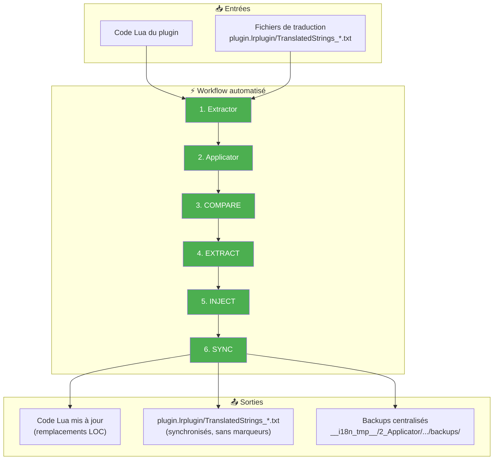
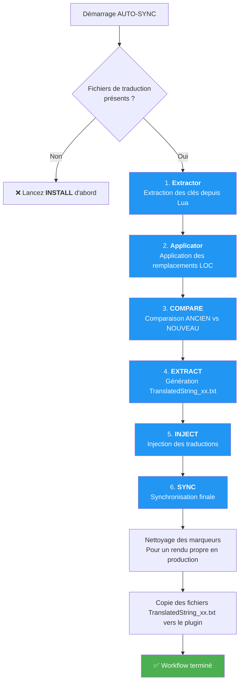

# Commande AUTO-SYNC ⭐

📚 **Retour à la documentation principale** : [Lisez-moi.md](../Lisez-moi.md)

---

## 🎯 Objectif

**AUTO-SYNC** est la commande **star** du toolkit. Elle orchestre automatiquement l'ensemble du workflow de synchronisation : **Extractor → Applicator → COMPARE → EXTRACT → INJECT → SYNC**, en une seule commande.

> C'est LA commande à utiliser pour la maintenance quotidienne — elle automatise tout le processus de mise à jour du plugin et de ses traductions.

---

## 📥 Entrées / 📤 Sorties



| Type | Description |
|------|-------------|
| **Entrée (code)** | Fichiers `.lua` du plugin |
| **Entrée (traductions)** | `plugin.lrplugin/TranslatedStrings_*.txt` |
| **Sortie (code)** | Fichiers `.lua` avec remplacements LOC appliqués |
| **Sortie (traductions)** | `plugin.lrplugin/TranslatedStrings_*.txt` (synchronisés) |
| **Sortie (backups)** | `__i18n_tmp__/2_Applicator/<timestamp>/backups/` |
| **Sortie (rapports)** | `__i18n_tmp__/3_Translator/<timestamp>/` (CHANGELOG, UPDATE_en.json) |

---

## 🔄 Fonctionnement

### Workflow en 6 étapes



### Détail des étapes

| Étape | Outil | Action | Sortie |
|-------|-------|--------|--------|
| **1** | Extractor | Extrait les clés LOC du code Lua | `TranslatedStrings_en.txt` fraîchement généré |
| **2** | Applicator | Applique les remplacements dans le code Lua | Fichiers `.lua` modifiés avec backups |
| **3** | COMPARE | Compare ancien EN vs nouveau EN | `UPDATE_en.json` + `CHANGELOG.txt` |
| **4** | EXTRACT | Génère fichiers de traduction | `TRANSLATE_xx.txt` (clés modifiées uniquement) |
| **5** | INJECT | Injecte traductions dans plugin | Fichiers `TranslatedStrings_*.txt` mis à jour |
| **6** | SYNC | Synchronise avec référence EN | Fichiers finaux alignés, sans marqueurs |

### Actions sur les traductions

Pour chaque fichier de langue (fr, de, es...) :

| Action | Description | Exemple |
|--------|-------------|---------|
| **Ajout** | Nouvelles clés → valeur EN par défaut | `"newKey" = "New text"` |
| **Conservation** | Traductions existantes → préservées | `"oldKey" = "Ancien texte"` ✅ |
| **Modification** | Valeur EN changée → traduction conservée | `"changedKey" = "Traduction existante"` |
| **Suppression** | Clés obsolètes → retirées | Clé disparue du code |

> **Note importante** : Les marqueurs `[NEW]` et `[NEEDS_REVIEW]` sont générés pendant le processus mais **automatiquement supprimés** des fichiers finaux pour garder uniquement les traductions propres. Ces marqueurs sont réservés à un flux de travail spécifique.

---

## 💻 Utilisation

### Mode interactif

```
┌──────────────────────────────────────────────────────────────────┐
│  TRANSLATION MANAGER v7.0                                        │
├──────────────────────────────────────────────────────────────────┤
│                                                                  │
│  2. AUTO-SYNC ⭐ (maintenance)                                   │  ◄── Sélectionner
│     Synchronisation automatique de tous les fichiers de langue   │
│     → Commande simple et rapide, tout en un                      │
│                                                                  │
└──────────────────────────────────────────────────────────────────┘
```

### Mode CLI

```bash
python Translator_main.py autosync --plugin-path ./plugin.lrplugin
```

### Options CLI

| Option | Description | Requis |
|--------|-------------|--------|
| `--plugin-path` | Chemin du plugin | ✅ Oui |

---

## 📋 Exemple de session

```
  AUTO-SYNC - Orchestration complète
══════════════════════════════════════════════════════

[INFO] Fichiers de traduction détectés:
  - TranslatedStrings_en.txt
  - TranslatedStrings_fr.txt

Workflow:
  1. Extractor  → extrait clés depuis code Lua
  2. Applicator → applique les remplacements dans le code
  3. COMPARE    → génère UPDATE_en.json
  4. EXTRACT    → génère fichiers TRANSLATE_xx.txt
  5. INJECT     → applique les traductions complétées
  6. SYNC       → synchronise FR avec la référence EN

Lancer le workflow complet? (O/n): O

══════════════════════════════════════════════════════
Exécution du workflow...
══════════════════════════════════════════════════════

[Étape 1/6 | Extractor] Extraction des clés depuis le code Lua
  → Extraction fraîche pour comparer AVANT vs MAINTENANT
  Détails  : piwigoPublish.lrplugin/__i18n_tmp__/1_Extractor/20260206_111533

[Étape 2/6 | Applicator] Application des remplacements LOC
  → Remplacement des chaînes hardcodées par les clés LOC
  Remplacements appliqués au code source

[Étape 3/6 | COMPARE] Comparaison ANCIEN vs NOUVEAU
  Ancien      : TranslatedStrings_en.txt
  Nouveau     : piwigoPublish.lrplugin/__i18n_tmp__/1_Extractor/20260206_111533/TranslatedStrings_en.txt
  Changements : 2 ajoutées, 1 modifiées, 5 supprimées
  Détails     : piwigoPublish.lrplugin/__i18n_tmp__/3_Translator/20260206_111533/compare

[Étape 4/6 | EXTRACT] Extraction des clés modifiées
  → Sélection uniquement des changements détectés
  Détails     : piwigoPublish.lrplugin/__i18n_tmp__/3_Translator/20260206_111533/extract

[Étape 5/6 | INJECT] Injection des traductions
  → Mise à jour des fichiers de traduction
  8 traduction(s) injectée(s)

[Étape 6/6 | SYNC] Synchronisation finale
  → Alignement avec la référence EN (sans marqueurs)
  fr: 2 ajoutées, 1 modifiées, 5 supprimées
  Détails     : piwigoPublish.lrplugin/__i18n_tmp__/3_Translator/20260206_111533/compare/CHANGELOG.txt

[Finalisation] Mise à jour du fichier EN
  Backup      : piwigoPublish.lrplugin/__i18n_tmp__/2_Applicator/20260206_111533/backups/TranslatedStrings_en.txt.bak
  TranslatedStrings_en.txt → mis à jour

══════════════════════════════════════════════════════
[OK] Workflow complet sans erreur

Tous les fichiers TranslatedStrings_xx.txt à la racine plugin sont à jour.
```

---

## 📊 Rapports générés

AUTO-SYNC génère plusieurs fichiers de rapport :

| Fichier | Emplacement | Contenu |
|---------|-------------|---------|
| **UPDATE_en.json** | `__i18n_tmp__/3_Translator/<timestamp>/compare/` | Détail complet des changements (JSON) |
| **CHANGELOG.txt** | `__i18n_tmp__/3_Translator/<timestamp>/compare/` | Liste lisible des modifications |
| **Backups** | `__i18n_tmp__/2_Applicator/<timestamp>/backups/` | Copies de sauvegarde (`.bak`) |

### Statistiques affichées

Pour chaque langue, le rapport indique :

| Métrique | Description |
|----------|-------------|
| **Ajoutées** | Clés présentes dans EN mais pas dans la langue |
| **Modifiées** | Clés dont la valeur EN a changé |
| **Supprimées** | Clés présentes dans la langue mais plus dans EN |

---

## 🆚 AUTO-SYNC vs Workflow manuel

| Aspect | AUTO-SYNC | Workflow manuel |
|--------|-----------|-----------------|
| **Commandes** | 1 seule commande | 6 commandes séparées |
| **Extraction code** | ✅ Automatique | ❌ Manuel (Extractor) |
| **Application LOC** | ✅ Automatique | ❌ Manuel (Applicator) |
| **Comparaison** | ✅ Automatique | ❌ Manuel (COMPARE) |
| **Fichiers traités** | Tous automatiquement | Un par un |
| **Marqueurs finaux** | ❌ Supprimés | ✅ Présents (si voulu) |
| **Backups** | ✅ Centralisés | Variables |
| **Cas d'usage** | Maintenance quotidienne | Contrôle fin étape par étape |

---

## 🔗 Commandes liées

| Commande | Lien | Relation |
|----------|------|----------|
| **INSTALL** | [INSTALL.md](INSTALL.md) | Première installation (avant AUTO-SYNC) |
| **Extractor** | [Extractor.md](../../extractor/Extractor.md) | Étape 1 du workflow |
| **Applicator** | [Applicator.md](../../applicator/Applicator.md) | Étape 2 du workflow |
| **COMPARE** | [COMPARE.md](COMPARE.md) | Étape 3 du workflow |
| **EXTRACT** | [EXTRACT.md](EXTRACT.md) | Étape 4 du workflow |
| **INJECT** | [INJECT.md](INJECT.md) | Étape 5 du workflow |
| **SYNC** | [SYNC.md](SYNC.md) | Étape 6 du workflow |

---

## 📚 Ressources

| Élément | Information |
|---------|-------------|
| Module source | `autosync.py` |
| Fonction principale | `autosync()` |
| Menu interactif | `autosync()` |

---

| 📜 | Traçabilité |  |  |
|--|--|--|--|
| **Nom** | *AUTOSYNC.md* | **Version** | 2.0 |
| **Type** | Guide utilisateur - Avancé | **Langue** | FR - *[EN](../../en/commands/AUTOSYNC.md)* |
| **Projet GitHub** | [Adobe Lightroom Translation Toolkit](https://github.com/Gotcha26/Adobe_Lightroom_Translation_Plugins_Kit) | **Date** | 2026-02-06 |
| **Licence** | [MIT](../../../../../LICENSE) | | |
