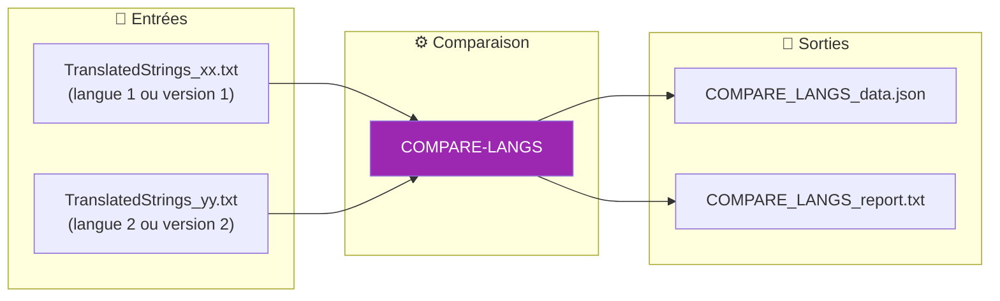
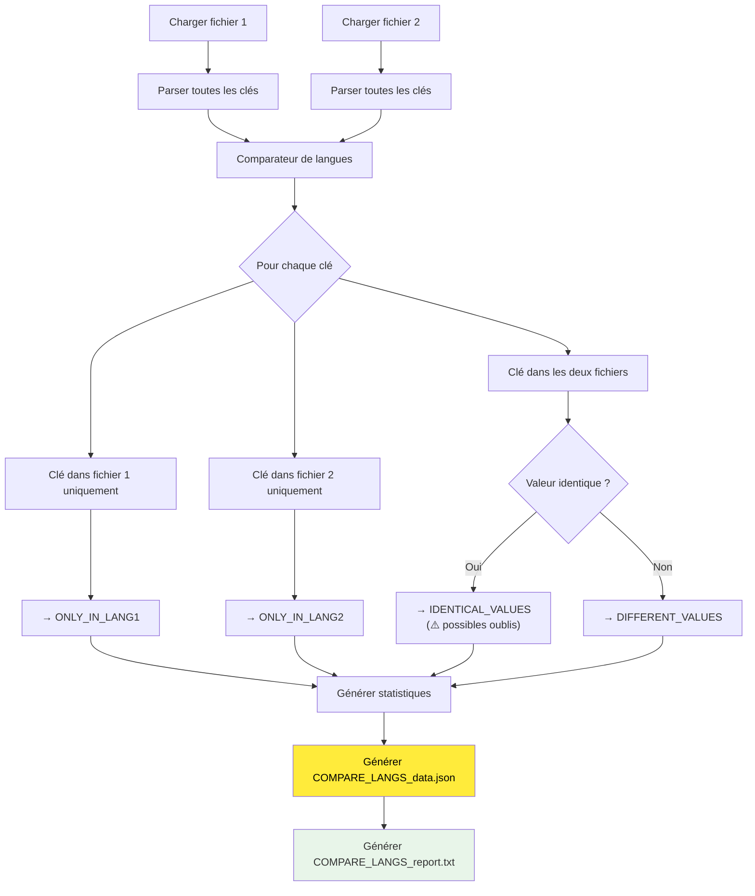

# Commande COMPARE-LANGS

📚 **Retour à la documentation principale** : [Translator_fr.md](../Translator_fr.md)

---

## 🎯 Objectif

**COMPARE-LANGS** analyse les différences entre deux fichiers de traduction (`TranslatedStrings_xx.txt`), qu'ils soient de langues différentes ou de versions différentes d'une même langue.

> Cette commande propose deux modes de comparaison : **CLÉS** (structure) et **VALEURS** (traductions).

### Modes de comparaison

| Mode | Objectif | Cas d'usage |
|------|----------|-------------|
| **CLÉS** (par défaut) | Identifier les différences structurelles | Synchronisation, clés manquantes/ajoutées |
| **VALEURS** | Analyser la qualité des traductions | Audit qualité, traductions oubliées |

---

## 📥 Entrées / 📤 Sorties



| Type | Fichiers |
|------|----------|
| **Entrée** | `TranslatedStrings_xx.txt` (langue 1 ou version 1) |
| **Entrée** | `TranslatedStrings_yy.txt` (langue 2 ou version 2) |
| **Sortie** | `COMPARE_LANGS_data.json` (données structurées) |
| **Sortie** | `COMPARE_LANGS_report.txt` (rapport détaillé lisible) |

---

## 🔄 Fonctionnement

### Algorithme de comparaison



### Catégories d'analyse

| Catégorie | Description | Utilité |
|-----------|-------------|---------|
| **ONLY_IN_LANG1** | Clés présentes seulement dans le fichier 1 | Identifier clés manquantes dans fichier 2 |
| **ONLY_IN_LANG2** | Clés présentes seulement dans le fichier 2 | Identifier clés manquantes dans fichier 1 |
| **IDENTICAL_VALUES** | Même clé avec même valeur dans les deux | Détecter possibles oublis de traduction |
| **DIFFERENT_VALUES** | Même clé avec valeurs différentes | Vérifier les traductions effectuées |

---

## 💡 Cas d'usage

### 1. Vérifier la complétude d'une traduction

```bash
# Comparer FR vs EN pour voir ce qui manque en français
python Translator_main.py compare-langs --lang1 fr --lang2 en --locales ./plugin.lrplugin
```

**Utilité** : Identifier les clés manquantes et les traductions non faites (valeurs identiques à l'anglais).

### 2. Harmoniser deux traductions

```bash
# Comparer FR vs DE pour voir les différences
python Translator_main.py compare-langs --lang1 fr --lang2 de --locales ./plugin.lrplugin
```

**Utilité** : S'assurer que deux langues ont les mêmes clés.

### 3. Suivre l'évolution d'une traduction

```bash
# Comparer ancienne version FR vs nouvelle version FR
python Translator_main.py compare-langs --file1 ./v1/TranslatedStrings_fr.txt --file2 ./v2/TranslatedStrings_fr.txt
```

**Utilité** : Voir les changements apportés à une langue entre deux versions.

### 4. Audit qualité global

```bash
# Comparer chaque langue vs EN pour générer un rapport de complétude
python Translator_main.py compare-langs --lang1 de --lang2 en --locales ./plugin.lrplugin
python Translator_main.py compare-langs --lang1 es --lang2 en --locales ./plugin.lrplugin
python Translator_main.py compare-langs --lang1 it --lang2 en --locales ./plugin.lrplugin
```

**Utilité** : Audit complet de la qualité des traductions de toutes les langues.

---

## 💻 Utilisation

### Mode interactif

```
┌──────────────────────────────────────────────────────────────────┐
│  TRANSLATION MANAGER v7.0                                        │
├──────────────────────────────────────────────────────────────────┤
│                                                                  │
│  2. COMPARE-LANGS                                                │  ◄── Sélectionner
│     Comparer 2 fichiers de langues                               │
│     → FR vs DE, FR vs EN, ancien FR vs nouveau FR...             │
│                                                                  │
└──────────────────────────────────────────────────────────────────┘
```

Le menu propose d'abord le choix du mode de comparaison :

#### Choix du mode de comparaison
1. **Par clés** (défaut) - Identifie les clés manquantes/ajoutées (synchronisation)
2. **Par valeurs** - Identifie les traductions identiques (audit qualité)

#### Choix du mode de sélection
1. **Par codes langue** (défaut) - Cherche dans un répertoire
2. **Par chemins complets** - Spécifie les fichiers exacts

##### Mode 1 : Par codes langue
1. Répertoire contenant les fichiers de langue
2. Code de la première langue (ex: `fr`, `de`, `en`)
3. Code de la seconde langue (ex: `de`, `en`, `es`)

##### Mode 2 : Par chemins complets
1. Chemin complet du premier fichier
2. Chemin complet du second fichier

### Mode CLI

#### Avec codes langue (cherche dans --locales)

```bash
# Comparer FR vs DE
python Translator_main.py compare-langs --lang1 fr --lang2 de --locales ./plugin.lrplugin

# Comparer FR vs EN pour voir ce qui n'est pas traduit
python Translator_main.py compare-langs --lang1 fr --lang2 en --locales ./plugin.lrplugin

# Avec sortie dans __i18n_tmp__
python Translator_main.py compare-langs --lang1 fr --lang2 de --locales ./plugin.lrplugin --plugin-path ./plugin.lrplugin
```

#### Avec chemins de fichiers complets

```bash
# Comparer deux versions d'un même fichier
python Translator_main.py compare-langs --file1 ./v1/TranslatedStrings_fr.txt --file2 ./v2/TranslatedStrings_fr.txt

# Comparer deux fichiers de langues différentes
python Translator_main.py compare-langs --file1 ./Locales/TranslatedStrings_fr.txt --file2 ./Locales/TranslatedStrings_de.txt

# Sortie personnalisée
python Translator_main.py compare-langs --file1 ./fr.txt --file2 ./de.txt --output ./my_output/
```

### Options CLI

| Option | Description | Requis |
|--------|-------------|--------|
| `--lang1` | Code langue 1 (ex: fr) - cherche dans --locales | Conditionnel |
| `--lang2` | Code langue 2 (ex: de) - cherche dans --locales | Conditionnel |
| `--locales` | Répertoire des traductions | Requis avec --lang1/--lang2 |
| `--file1` | Premier fichier (ou répertoire) | Conditionnel |
| `--file2` | Second fichier (ou répertoire) | Conditionnel |
| `--mode` | Mode : `keys` (clés) ou `values` (valeurs) | ❌ Défaut: `keys` |
| `--plugin-path` | Sortie dans `__i18n_tmp__/3_Translator/` | ❌ Non |
| `--output` | Répertoire de sortie personnalisé | ❌ Non |

> **Note** : Spécifiez soit `--lang1` + `--lang2` + `--locales`, soit `--file1` + `--file2`.
> **Nouveau** : `--mode keys` se concentre sur les différences structurelles, `--mode values` sur les traductions.

---

## 📋 Exemple de session

### Mode interactif - Comparer FR vs EN (mode CLÉS)

```
COMPARE-LANGS: Comparer deux fichiers de traduction
══════════════════════════════════════════════════════════════════

Vous pouvez comparer:
  • Deux langues différentes (ex: FR vs DE)
  • Deux versions d'une même langue (ex: ancien FR vs nouveau FR)
  • Une langue vs EN (pour voir ce qui n'est pas traduit)

Mode de comparaison:
  1. Par clés - Identifie les clés manquantes/ajoutées (recommandé pour synchronisation)
  2. Par valeurs - Identifie les traductions identiques (recommandé pour audit qualité)
Mode de comparaison (1-2, défaut=1):

Mode de sélection:
  1. Par codes langue (ex: fr, de) - cherche dans un répertoire
  2. Par chemins de fichiers complets
Votre choix (1-2, défaut=1):

Répertoire contenant les fichiers de langue:
  (par défaut: ./plugin.lrplugin)
  >

Langues disponibles: de, en, es, fr, it

Code de la première langue (ex: fr, en, de):
  > fr

Code de la seconde langue (ex: fr, en, de):
  > en

[INFO] Comparaison en cours...

══════════════════════════════════════════════════════════════════
  RÉSUMÉ DE LA COMPARAISON (CLÉS)
══════════════════════════════════════════════════════════════════
  Langue 1: FR  (142 clés)
  Langue 2: EN  (148 clés)

  Total de clés uniques       :  148
  Clés dans les deux langues  :  140
  Seulement dans FR           :    2
  Seulement dans EN           :    8

  ⚠️  Fichiers désynchronisés : clés manquantes détectées

Fichiers générés dans: __i18n_tmp__/3_Translator/20260206_150125/
  • COMPARE_LANGS_report.txt
  • COMPARE_LANGS_data.json

Appuyez sur Entrée pour continuer...
```

### Mode interactif - Comparer FR vs EN (mode VALEURS)

```
Mode de comparaison (1-2, défaut=1): 2

[...sélection des langues...]

[INFO] Comparaison en cours...

══════════════════════════════════════════════════════════════════
  RÉSUMÉ DE LA COMPARAISON (VALEURS)
══════════════════════════════════════════════════════════════════
  Langue 1: FR  (142 clés)
  Langue 2: EN  (148 clés)

  Clés communes analysées     :  140
  Valeurs identiques          :   12
  Valeurs différentes         :  128

  Info: Total de clés uniques :  148
  Info: Seulement dans FR     :    2
  Info: Seulement dans EN     :    8

  ⚠️  12 traduction(s) identique(s) détectée(s)!
     Possibles traductions oubliées (identiques à EN)

Fichiers générés dans: __i18n_tmp__/3_Translator/20260206_150230/
  • COMPARE_LANGS_report.txt
  • COMPARE_LANGS_data.json
```

### Mode CLI - Comparer deux versions

```bash
$ python Translator_main.py compare-langs --file1 ./v1/TranslatedStrings_fr.txt --file2 ./v2/TranslatedStrings_fr.txt

[INFO] Comparaison de langues...

============================================================
RÉSUMÉ - COMPARAISON DE LANGUES
============================================================
Langue 1: FR (135 clés)
Langue 2: FR (142 clés)

Clés totales uniques    :  145
Clés dans les deux      :  132
Seulement dans FR       :    3
Seulement dans FR       :    7

Valeurs identiques      :  120
Valeurs différentes     :   12

✓ Fichiers générés dans: compare_langs_20260202_153045/
```

---

## 📁 Format des fichiers générés

### COMPARE_LANGS_data.json

Le contenu du JSON varie selon le mode choisi.

#### Mode CLÉS (keys)

```json
{
  "generated": "2026-02-06T15:01:25",
  "file1": "/path/to/TranslatedStrings_fr.txt",
  "file2": "/path/to/TranslatedStrings_en.txt",
  "lang1_name": "FR",
  "lang2_name": "EN",
  "comparison_mode": "keys",
  "statistics": {
    "total_unique_keys": 148,
    "keys_in_lang1": 142,
    "keys_in_lang2": 148,
    "keys_in_both": 140,
    "only_lang1": 2,
    "only_lang2": 8,
    "identical_values_count": 12,
    "different_values_count": 128,
    "coverage_lang1_pct": 95.95,
    "coverage_lang2_pct": 100.0
  },
  "only_in_lang1": [
    "$$$/Plugin/OldFeature/Title"
  ],
  "only_in_lang2": [
    "$$$/Plugin/NewFeature/Title",
    "$$$/Plugin/NewFeature/Description"
  ],
  "in_both": [
    "$$$/Plugin/Dialog/OK",
    "$$$/Plugin/Dialog/Cancel",
    "..."
  ]
}
```

#### Mode VALEURS (values)

```json
{
  "generated": "2026-02-06T15:02:30",
  "file1": "/path/to/TranslatedStrings_fr.txt",
  "file2": "/path/to/TranslatedStrings_en.txt",
  "lang1_name": "FR",
  "lang2_name": "EN",
  "comparison_mode": "values",
  "statistics": { "..." },
  "identical_values": {
    "$$$/Plugin/Dialog/OK": "OK",
    "$$$/Plugin/Settings/API": "API"
  },
  "different_values": [
    "$$$/Plugin/Dialog/Cancel",
    "$$$/Plugin/Settings/Help"
  ],
  "info_missing_keys": {
    "only_in_lang1": ["..."],
    "only_in_lang2": ["..."]
  }
}
```

### COMPARE_LANGS_report.txt

Le rapport TXT varie selon le mode choisi.

#### Mode CLÉS (keys)

```
================================================================================
RAPPORT DE COMPARAISON DE LANGUES (MODE: CLÉS)
================================================================================

Date: 2026-02-06 15:01:25
Mode de comparaison: CLÉS
Langue 1: FR
Langue 2: EN
Fichier 1: /path/to/TranslatedStrings_fr.txt
Fichier 2: /path/to/TranslatedStrings_en.txt

--------------------------------------------------------------------------------
STATISTIQUES GLOBALES
--------------------------------------------------------------------------------
  Total de clés uniques            :  148
  Clés dans FR                     :  142  ( 95.95%)
  Clés dans EN                     :  148  (100.00%)
  Clés présentes dans les deux     :  140
  Clés seulement dans FR           :    2
  Clés seulement dans EN           :    8

--------------------------------------------------------------------------------
ANALYSE DE LA STRUCTURE (MODE CLÉS)
--------------------------------------------------------------------------------
  ⚠ DÉSYNCHRONISATION DÉTECTÉE
  Clés manquantes dans EN           :    2
  Clés manquantes dans FR           :    8

================================================================================
CLÉS PRÉSENTES SEULEMENT DANS EN (8)
Ces clés existent dans EN mais sont absentes de FR.
================================================================================

  [ONLY-EN] $$$/Plugin/NewFeature/Title
        EN: New Feature

  [ONLY-EN] $$$/Plugin/NewFeature/Description
        EN: This is a new feature

================================================================================
RECOMMANDATIONS
================================================================================
• 8 clé(s) manquante(s) dans FR
  → Ajouter ces traductions dans FR

• 2 clé(s) manquante(s) dans EN
  → Ajouter ces traductions dans EN
```

#### Mode VALEURS (values)

```
================================================================================
RAPPORT DE COMPARAISON DE LANGUES (MODE: VALEURS)
================================================================================

Date: 2026-02-06 15:02:30
Mode de comparaison: VALEURS
Langue 1: FR
Langue 2: EN
[...]

--------------------------------------------------------------------------------
ANALYSE DES TRADUCTIONS (MODE VALEURS)
--------------------------------------------------------------------------------
  Clés communes analysées               :  140
  Valeurs identiques (possibles oublis) :   12
  Valeurs différentes (traduites)       :  128

  Info: Clés manquantes dans EN       :    2
  Info: Clés manquantes dans FR       :    8

================================================================================
CLÉS AVEC VALEURS IDENTIQUES (12)
Ces clés existent dans les deux langues avec la même valeur.
⚠️  ATTENTION: Valeurs identiques à l'anglais = possibles oublis de traduction!
================================================================================

  [IDENTICAL] $$$/Plugin/Dialog/OK
        Valeur commune: OK

  [IDENTICAL] $$$/Plugin/Settings/API
        Valeur commune: API

================================================================================
CLÉS AVEC VALEURS DIFFÉRENTES (128)
Ces clés existent dans les deux langues avec des valeurs différentes.
(Affichage des 20 premières différences)
================================================================================

  [DIFFERENT] $$$/Plugin/Dialog/Cancel
        FR: Annuler
        EN: Cancel

  ... et 108 autres différences

================================================================================
RECOMMANDATIONS
================================================================================
⚠️  12 traduction(s) identique(s) à l'anglais détectée(s)!
  → Vérifier si ces clés ont bien été traduites

✓ 128 traduction(s) différente(s) détectée(s)
  Cela indique des traductions effectuées correctement.

Info: Des clés sont manquantes dans l'un des fichiers.
  Pour analyser la structure, relancez en mode CLÉS.
```

---

## 🎯 Interprétation des résultats

### Valeurs identiques avec EN

Si vous comparez une langue avec l'anglais et trouvez des **valeurs identiques**, ce sont probablement :

| Type | Exemple | Action |
|------|---------|--------|
| **Non traduit** | `"$$$/Menu/File=File"` en FR | ❌ À traduire |
| **Nom propre** | `"$$$/Plugin/Name=Adobe Lightroom"` | ✅ Normal |
| **Terme technique** | `"$$$/Settings/API=API"` | ✅ Normal |
| **Acronyme** | `"$$$/Format/JPG=JPG"` | ✅ Normal |

> **Conseil** : Vérifiez manuellement chaque valeur identique pour confirmer qu'il ne s'agit pas d'un oubli.

### Clés manquantes

| Situation | Cause probable | Action |
|-----------|----------------|--------|
| Clés dans EN mais pas dans FR | Nouvelles clés non traduites | Ajouter les traductions |
| Clés dans FR mais pas dans EN | Clés obsolètes | Supprimer si confirmé obsolète |
| Clés dans v1 mais pas v2 | Refactoring du code | Vérifier le code source |

### Statistiques de couverture

```
coverage_lang1_pct: 95.95%  → FR a 95.95% des clés totales
coverage_lang2_pct: 100.0%  → EN a 100% des clés totales (référence)
```

**Interprétation** : Le français manque ~4% de clés par rapport à l'anglais.

---

## 🔗 Commandes liées

| Commande | Lien | Relation |
|----------|------|----------|
| **COMPARE** | [COMPARE.md](COMPARE.md) | Compare versions EN uniquement |
| **SYNC** | [SYNC.md](SYNC.md) | Synchronise après avoir identifié les manques |
| **AUTO-SYNC** | [AUTOSYNC.md](AUTOSYNC.md) | Alternative automatique |

---

## 📚 Ressources

| Élément | Information |
|---------|-------------|
| Module source | `compare_langs.py` |
| Classe principale | `LanguageComparator` |
| Fonction principale | `run_compare_langs()` |
| Menu interactif | `menu_compare_langs()` |

---

## 💡 Astuces

### Script batch pour audit complet

Créez un script pour comparer toutes les langues vs EN :

```bash
#!/bin/bash
# audit_all_langs.sh

LOCALES="./plugin.lrplugin"

for lang in de es fr it; do
    echo "Comparaison de $lang vs EN..."
    python Translator_main.py compare-langs \
        --lang1 $lang \
        --lang2 en \
        --locales $LOCALES \
        --plugin-path $LOCALES
done

echo "✓ Audit terminé. Vérifiez __i18n_tmp__/3_Translator/"
```

### Rechercher les traductions manquantes

Dans `COMPARE_LANGS_report.txt`, cherchez :
- Section **"CLÉS PRÉSENTES SEULEMENT DANS EN"** → à traduire
- Section **"CLÉS AVEC VALEURS IDENTIQUES"** (si comparé avec EN) → possibles oublis

---

| 📜 | Traçabilité |  |  |
|--|--|--|--|
| **Nom** | *COMPARE-LANGS.md* | **Version** | 1.1 |
| **Type** | Guide utilisateur - Avancé | **Langue** | FR - *[EN](../../en/commands/COMPARE-LANGS.md)* |
| **Projet GitHub** | [Adobe Lightroom Translation Toolkit](https://github.com/Gotcha26/Adobe_Lightroom_Translation_Plugins_Kit) | **Date** | 2026-02-06 |
| **Licence** | [MIT](../../../../../LICENSE) | **Changelog** | Ajout modes CLÉS/VALEURS |
