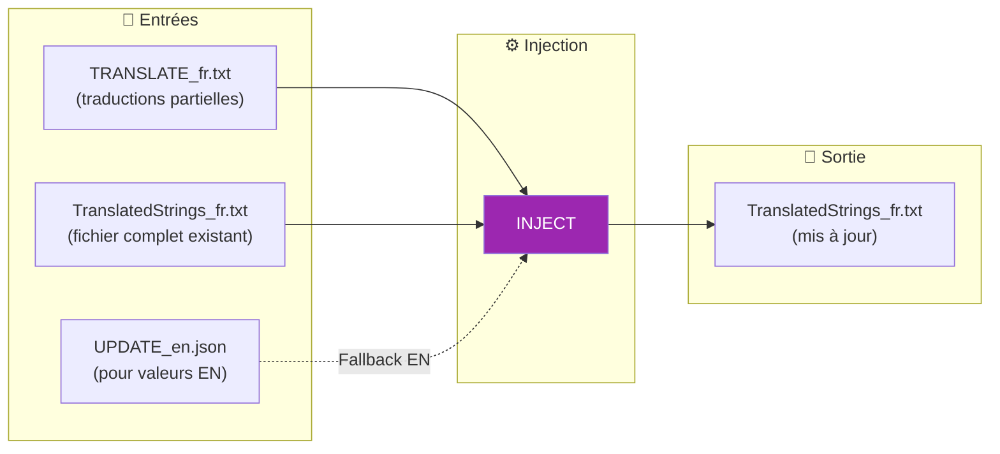
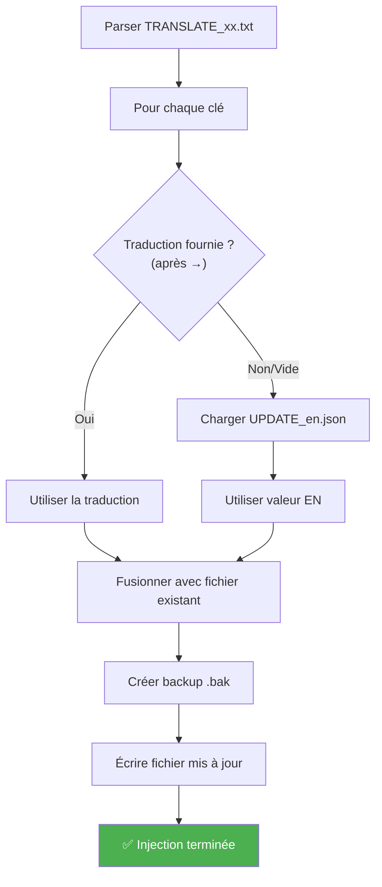

# Commande INJECT

📚 **Retour à la documentation principale** : [Lisez-moi.md](../Lisez-moi.md)

---

## 🎯 Objectif

**INJECT** réinjecte les traductions depuis les fichiers `TRANSLATE_xx.txt` dans les fichiers complets `TranslatedStrings_xx.txt`. Elle gère automatiquement le fallback vers la valeur anglaise pour les clés non traduites.

> Cette commande fait partie du workflow avancé. Elle nécessite d'avoir exécuté **EXTRACT** au préalable.

---

## 📥 Entrées / 📤 Sorties



| Type | Fichiers |
|------|----------|
| **Entrée** | `TRANSLATE_xx.txt` (traductions) |
| **Entrée** | `TranslatedStrings_xx.txt` existant |
| **Entrée** | `UPDATE_en.json` (valeurs EN pour fallback) |
| **Sortie** | `TranslatedStrings_xx.txt` mis à jour |

---

## 🔄 Fonctionnement

### Algorithme d'injection



### Mécanisme de fallback

| Situation | Action |
|-----------|--------|
| `[FR] → Bonjour` | Utilise "Bonjour" |
| `[FR] →` (vide) | Utilise valeur EN depuis `UPDATE_en.json` |
| `[FR] → ` (espaces) | Utilise valeur EN |

> **Important** : Le fallback EN garantit que toutes les clés ont une valeur, même non traduite.

---

## 💻 Utilisation

### Mode interactif

```
┌──────────────────────────────────────────────────────────────────┐
│  TRANSLATION MANAGER v7.0                                        │
├──────────────────────────────────────────────────────────────────┤
│                                                                  │
│  5. INJECT (optionnel)                                           │  ◄── Sélectionner
│     Réinjecte les traductions (EN par défaut si vide)            │
│                                                                  │
└──────────────────────────────────────────────────────────────────┘
```

Le menu propose deux modes :
1. **Fichier unique** : Un `TRANSLATE_xx.txt` vers un `TranslatedStrings_xx.txt`
2. **Batch** : Tous les `TRANSLATE_*.txt` d'un dossier

### Mode CLI

```bash
# Fichier unique
python Translator_main.py inject --translate ./TRANSLATE_fr.txt --target ./TranslatedStrings_fr.txt

# Batch (tous les TRANSLATE_*.txt)
python Translator_main.py inject --translate-dir ./20260201_151234 --locales ./plugin.lrplugin

# Avec auto-détection (plugin-path)
python Translator_main.py inject --plugin-path ./plugin.lrplugin --locales ./plugin.lrplugin

# Spécifier le dossier UPDATE pour fallback EN
python Translator_main.py inject --translate-dir ./translations --locales ./plugin.lrplugin --update ./20260201_151234
```

### Options CLI

| Option | Description | Requis |
|--------|-------------|--------|
| `--translate` | Fichier TRANSLATE_xx.txt unique | Mode fichier |
| `--target` | Fichier cible TranslatedStrings_xx.txt | Mode fichier |
| `--translate-dir` | Dossier contenant TRANSLATE_*.txt | Mode batch |
| `--locales` | Dossier des fichiers de langue | Mode batch |
| `--plugin-path` | Auto-détection dossier Translator | ❌ Non |
| `--update` | Dossier UPDATE pour valeurs EN | ❌ Non |

---

## 📋 Exemple de session

### Mode fichier unique

```
INJECT: Réinjecter les traductions
══════════════════════════════════════════════════════

⚠️ Les clés non traduites (→ vide) recevront la valeur EN

Mode:
  1. Injecter un fichier TRANSLATE_xx.txt spécifique
  2. Injecter tous les fichiers TRANSLATE_*.txt d'un dossier

  Choix (1-2): 1

Fichier TRANSLATE_xx.txt:
  > ./20260201_151234/TRANSLATE_fr.txt

Fichier cible TranslatedStrings_xx.txt:
  > ./plugin.lrplugin/TranslatedStrings_fr.txt

Dossier UPDATE (contenant UPDATE_en.json):
  (Entrée = même dossier que TRANSLATE)
  >

[INFO] Injection en cours...

══════════════════════════════════════════════════════
  RÉSULTAT
══════════════════════════════════════════════════════
  Traductions injectées  : 12
  Valeurs EN par défaut  : 6
  Entrées ignorées       : 0
  Total clés dans fichier: 148

✓ Fichier mis à jour: ./plugin.lrplugin/TranslatedStrings_fr.txt
  (Backup .bak créé)
```

### Mode batch

```
INJECT: Réinjecter les traductions
══════════════════════════════════════════════════════

  Choix (1-2): 2

Dossier contenant les fichiers TRANSLATE_*.txt:
  > ./20260201_151234

Répertoire des fichiers de langue (Locales):
  > ./plugin.lrplugin

[INFO] Injection en cours...

══════════════════════════════════════════════════════
  RÉSULTAT
══════════════════════════════════════════════════════
  [FR] [OK]: 12 traduites + 6 EN par défaut
  [DE] [OK]: 8 traduites + 10 EN par défaut

✓ Fichiers mis à jour (backups .bak créés)
```

---

## 📊 Statistiques retournées

| Métrique | Description |
|----------|-------------|
| **Traductions injectées** | Clés avec traduction fournie |
| **Valeurs EN par défaut** | Clés sans traduction (fallback) |
| **Entrées ignorées** | Clés non traitées (erreurs) |
| **Total clés** | Nombre total dans le fichier final |

---

## ⚠️ Points d'attention

### Backup automatique

Avant chaque modification, un fichier `.bak` est créé :
```
TranslatedStrings_fr.txt      ← Fichier mis à jour
TranslatedStrings_fr.txt.bak  ← Sauvegarde automatique
```

### Fusion intelligente

INJECT **fusionne** les traductions, elle ne remplace pas tout le fichier :
- Les clés existantes sont conservées
- Seules les clés du fichier TRANSLATE sont mises à jour
- Les nouvelles clés sont ajoutées

---

## 🔗 Commandes liées

| Commande | Lien | Relation |
|----------|------|----------|
| **EXTRACT** | [EXTRACT.md](EXTRACT.md) | Étape précédente |
| **SYNC** | [SYNC.md](SYNC.md) | Étape suivante |
| **AUTO-SYNC** | [AUTOSYNC.md](AUTOSYNC.md) | Alternative simple |

---

## 📚 Ressources

| Élément | Information |
|---------|-------------|
| Module source | `TM_inject.py` |
| Parser fichier | `parse_translate_file()` |
| Fonction principale | `run_inject()` |
| Fonction batch | `run_inject_from_dir()` |
| Menu interactif | `menu_inject()` |

---

| 📜 | Traçabilité |  |  |
|--|--|--|--|
| **Nom** | *INJECT.md* | **Version** | 1.0 |
| **Type** | Guide utilisateur - Avancé | **Langue** | FR - *[EN](../../en/commands/INJECT.md)* |
| **Projet GitHub** | [Adobe Lightroom Translation Toolkit](https://github.com/Gotcha26/Adobe_Lightroom_Translation_Plugins_Kit) | **Date** | 2026-02-02 |
| **Licence** | [MIT](../../../../../LICENSE) | | |
