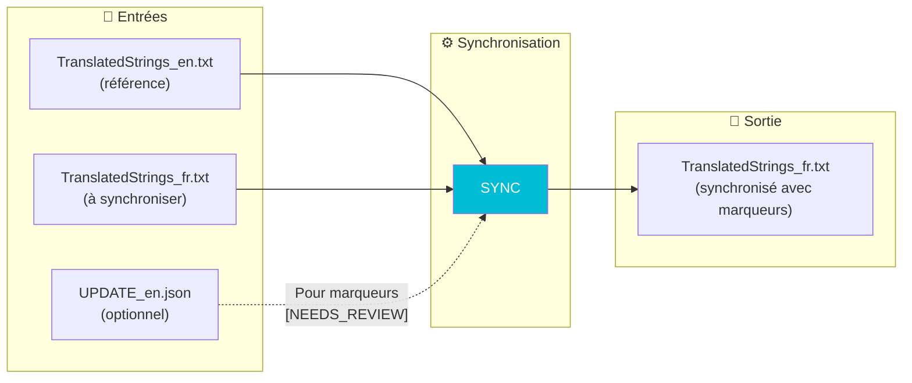
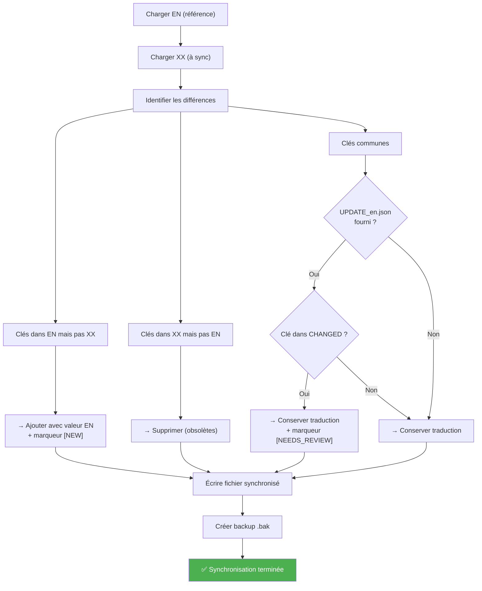

# Commande SYNC

📚 **Retour à la documentation principale** : [Lisez-moi.md](../Lisez-moi.md)

---

## 🎯 Objectif

**SYNC** synchronise un fichier de langue avec le fichier anglais de référence. Elle ajoute les marqueurs `[NEW]` et `[NEEDS_REVIEW]` pour guider les traducteurs.

> C'est la version **manuelle** de la synchronisation. Pour synchroniser tous les fichiers automatiquement, utilisez **AUTO-SYNC**.

---

## 📥 Entrées / 📤 Sorties



| Type | Fichiers |
|------|----------|
| **Entrée** | `TranslatedStrings_en.txt` (référence) |
| **Entrée** | `TranslatedStrings_xx.txt` (à synchroniser) |
| **Entrée** | `UPDATE_en.json` (optionnel, pour marqueurs détaillés) |
| **Sortie** | `TranslatedStrings_xx.txt` synchronisé |

---

## 🔄 Fonctionnement

### Algorithme de synchronisation



### Actions par catégorie

| Situation | Action | Marqueur |
|-----------|--------|----------|
| Clé nouvelle (pas dans XX) | Ajouter avec valeur EN | `[NEW]` |
| Clé modifiée (EN changé) | Conserver traduction | `[NEEDS_REVIEW]` |
| Clé existante | Conserver traduction | Aucun |
| Clé obsolète (pas dans EN) | Supprimer | - |

---

## 💻 Utilisation

### Mode interactif

```
┌──────────────────────────────────────────────────────────────────┐
│  TRANSLATION MANAGER v7.0                                        │
├──────────────────────────────────────────────────────────────────┤
│                                                                  │
│  6. SYNC                                                         │  ◄── Sélectionner
│     Met à jour les langues avec EN                               │
│     → Ajoute [NEW], marque [NEEDS_REVIEW], supprime obsolètes    │
│                                                                  │
└──────────────────────────────────────────────────────────────────┘
```

Le menu demande :
1. Si vous avez un dossier UPDATE (de COMPARE)
2. Le fichier EN de référence (ou dossier UPDATE)
3. Le répertoire des fichiers de langue

### Mode CLI

```bash
# Avec dossier UPDATE (marqueurs [NEEDS_REVIEW])
python Translator_main.py sync --update ./20260201_151234 --locales ./plugin.lrplugin

# Avec fichier EN direct (pas de [NEEDS_REVIEW])
python Translator_main.py sync --ref ./TranslatedStrings_en.txt --locales ./plugin.lrplugin

# Avec plugin-path (auto-détection)
python Translator_main.py sync --plugin-path ./plugin.lrplugin --locales ./plugin.lrplugin
```

### Options CLI

| Option | Description | Requis |
|--------|-------------|--------|
| `--ref` | Fichier EN de référence | Conditionnel |
| `--update` | Dossier UPDATE (avec UPDATE_en.json) | Conditionnel |
| `--plugin-path` | Auto-détection dossier Translator | ❌ Non |
| `--locales` | Répertoire des fichiers de langue | ✅ Oui |

> **Note** : `--ref` OU `--update` OU `--plugin-path` requis.

---

## 📋 Exemple de session

```
SYNC: Synchroniser les langues étrangères
══════════════════════════════════════════════════════

Avez-vous un dossier UPDATE (généré par COMPARE) ?
  (Permet de marquer les clés [NEEDS_REVIEW])
  [O/n]: O

[INFO] Dossier sélectionné: __i18n_tmp__/3_Translator/20260201_151234/

Répertoire des fichiers de langues (Locales):
  (Entrée = même répertoire que la référence)
  > ./plugin.lrplugin

[INFO] Synchronisation en cours...

══════════════════════════════════════════════════════════════════════
RAPPORT DE SYNCHRONISATION
══════════════════════════════════════════════════════════════════════

[FR]
  Clés conservées  : 130
  Clés ajoutées    : 15  [NEW] à traduire
  Clés à réviser   : 3   [NEEDS_REVIEW]
  Clés supprimées  : 2
  Total            : 145
  Nouvelles clés:
    + $$$/Plugin/NewFeature/Title
    + $$$/Plugin/NewFeature/Description
    ... et 13 autres
  Clés à réviser:
    ? $$$/Plugin/Settings/Help

[DE]
  Clés conservées  : 130
  Clés ajoutées    : 15  [NEW] à traduire
  Clés à réviser   : 3   [NEEDS_REVIEW]
  Clés supprimées  : 2
  Total            : 145

──────────────────────────────────────────────────────────────────────
TOTAL
──────────────────────────────────────────────────────────────────────
  Langues traitées : 2
  Clés ajoutées    : 30
  Clés à réviser   : 6
  Clés supprimées  : 4

✓ Fichiers mis à jour (backups .bak créés)

[INFO] PROCHAINE ÉTAPE:
  Recherchez [NEW] et [NEEDS_REVIEW] dans les fichiers
  pour compléter les traductions.
```

---

## 📁 Format du fichier synchronisé

```
-- =============================================================================
-- Plugin Localization - FR
-- Generated: 2026-02-01 16:00:00
-- Total keys: 145
-- New keys: 15
-- Changed keys: 3
-- Source: SYNC
-- =============================================================================

-- IMPORTANT NOTES FOR TRANSLATORS:
-- 1. DO NOT translate: %s, %d, \n, \\, ...
-- 2. PRESERVE spaces around text
-- 3. Keep punctuation style
-- =============================================================================

-- Dialog
"$$$/Plugin/Dialog/OK=OK"
"$$$/Plugin/Dialog/Cancel=Annuler"
-- [NEW] To translate
"$$$/Plugin/Dialog/NewButton=New Button"
-- [NEEDS_REVIEW] English text was modified
"$$$/Plugin/Settings/Help=Cliquez ici pour obtenir de l'aide"
```

### Signification des marqueurs

| Marqueur | Apparence | Action requise |
|----------|-----------|----------------|
| `-- [NEW] To translate` | Avant la clé | Traduire la valeur (actuellement en EN) |
| `-- [NEEDS_REVIEW] English text was modified` | Avant la clé | Vérifier si la traduction est toujours correcte |

> **Note** : Les marqueurs sont des **commentaires Lua** (`--`), ils n'affectent pas l'affichage dans Lightroom.

---

## 🆚 SYNC vs AUTO-SYNC

| Aspect | SYNC | AUTO-SYNC |
|--------|------|-----------|
| **Fichiers traités** | Tous dans `--locales` | Tous automatiquement |
| **Détection source** | Manuel (`--ref` ou `--update`) | Auto (dernière extraction) |
| **Marqueurs [NEW]** | ✅ Oui (si `--update`) | ❌ Non |
| **[NEEDS_REVIEW]** | ✅ Oui (si `--update`) | ❌ Non |
| **Rapport détaillé** | ✅ Oui | Simplifié |

---

## 🔗 Commandes liées

| Commande | Lien | Relation |
|----------|------|----------|
| **COMPARE** | [COMPARE.md](COMPARE.md) | Génère UPDATE_en.json |
| **INJECT** | [INJECT.md](INJECT.md) | Étape précédente (optionnel) |
| **AUTO-SYNC** | [AUTOSYNC.md](AUTOSYNC.md) | Alternative automatique |

---

## 📚 Ressources

| Élément | Information |
|---------|-------------|
| Module source | `TM_sync.py` |
| Fonction principale | `run_sync()` |
| Fonction interne | `_sync_language()` |
| Générateur rapport | `generate_sync_report()` |
| Menu interactif | `menu_sync()` |

---

| 📜 | Traçabilité |  |  |
|--|--|--|--|
| **Nom** | *SYNC.md* | **Version** | 1.0 |
| **Type** | Guide utilisateur - Avancé | **Langue** | FR - *[EN](../../en/commands/SYNC.md)* |
| **Projet GitHub** | [Adobe Lightroom Translation Toolkit](https://github.com/Gotcha26/Adobe_Lightroom_Translation_Plugins_Kit) | **Date** | 2026-02-02 |
| **Licence** | [MIT](../../../../../LICENSE) | | |
